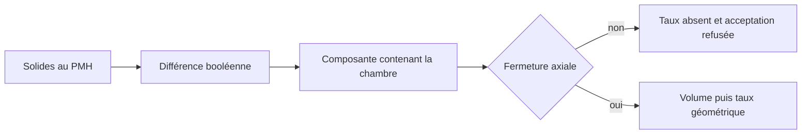

# M64 G2 — correction du calcul de volume mort

Reprise de `main` à `139200b41d01ec0c594a30b3446d0ea395d88f4e` (PR #71).
**Aucune géométrie modifiée, aucune dépense Vast. Le taux de compression reste non déterminé.**

## Résultat vérifié

Le calcul publié le 16 septembre ne mesurait pas seulement le gaz enfermé dans la chambre.
Il soustrayait la somme des intersections des pièces avec un cylindre artificiel. Il comptait
ainsi des vides de conduits séparés de la chambre et soustrayait deux fois les recouvrements
siège/soupape. De plus, les bougies ne sont pas présentes parmi les pièces de fermeture.

Sur **les mêmes paramètres et les mêmes solides**, seule la hauteur du cylindre de mesure varie :

| Marge au-dessus du toit | Ancien volume mort annoncé | Ancien taux annoncé |
|---|---:|---:|
| 2 mm | 133,068 cm³ | 5,509 |
| 5 mm | 147,004 cm³ | 5,082 |
| 10 mm | 168,677 cm³ | 4,557 |

Ces taux sont des résultats du calcul erroné, pas des performances. Une fenêtre arbitraire ne
peut pas déterminer le taux du moteur. La conclusion précédente « 8–9 hors d'atteinte » doit être
réévaluée après fermeture et nouvelle mesure. Un échec de recherche locale n'est pas non plus une
preuve d'impossibilité sur tout le domaine de conception.

## Correction

`assembly.chamber_volume` soustrait les solides par opération booléenne, puis sélectionne uniquement
la composante contenant un point de chambre au-dessus de la calotte. Elle vérifie la validité BRep,
l'unicité de cette composante et l'absence de contact avec les limites axiales artificielles.
La sonde descend sous la plus profonde des poches ou du bol, au lieu de tronquer les poches profondes.
La crevasse radiale piston/chemise sous la calotte est explicitement exclue, sa géométrie n'étant
pas définie. Ce choix devra être remplacé par les segments et volumes réels lors de leur conception.

Résultat sur la G2 publiée :

- culasse toujours valide, **1 solide, 399 faces** ;
- **38,085 cm³** de vides déconnectés exclus ;
- composante contenant la chambre : **95,715 cm³**, volume diagnostique **encore ouvert**, donc
  inutilisable pour annoncer un taux ;
- `status = blocked_unsealed_chamber`, contact avec la limite supérieure ;
- `clearance_volume_cc = null`, `compression_ratio = null` et acceptation refusée.

Le contrôle d'acceptation traite désormais ce résultat sans planter ni accepter la pièce.
Une exécution G2 `--no-cad` ne peut pas contourner la mesure de compression.
La calibration du proxy historique reste une heuristique de classement ; elle doit être recalée
uniquement après obtention d'une chambre fermée. Les bornes 8–9 restent des hypothèses de conception.



## Preuves et reproduction

[Mesures et empreintes SHA-256](../../twins/m64-cylinder-head/evidence/g2-compression-audit-20260924/audit.json).
La coupe suivante provient du noyau CAO de la G2, sans modification de la pièce :


```sh
uv run --python 3.12 --no-project --with cadquery==2.6.1 python \
  twins/m64-cylinder-head/source/fourvalve/audit_compression.py \
  twins/m64-cylinder-head/evidence/g2-head-features-20260916/parameters-resolved.json \
  work/m64-g2-compression-audit-replay
uv run --python 3.12 --no-project --with cadquery==2.6.1 python \
  tests/test_m64_g2_head_features.py -v
make check
```

Le script refuse un répertoire de sortie existant. L'audit publie aussi la validité booléenne
de chaque essai ; aucune valeur historique dépendant de la fenêtre n'est acceptée.
Les tests confrontent le calcul à une cavité fermée de 16 mm³, un vide séparé de 1 mm³, des solides
occupants recouvrants et une fuite artificielle, puis à la G2 réelle du dépôt.
API utilisée : [opérations booléennes et classification de solides CadQuery](https://cadquery.readthedocs.io/en/latest/classreference.html).

Vérifications exécutées : **13 tests G2 et 21 tests G1 réussis avec CadQuery 2.6.1**, empreintes du
rapport vérifiées. `make check` a été exécuté et s'arrête sur le rapport de préparation F46 périmé
(`917-f46-vast-controller-check`). Cet échec est déjà présent sur `main` avant cette modification :
[CI du commit de départ](https://github.com/cluster2600/porscheparts/actions/runs/35085578047).
La présente correction ne modifie ni ce rapport historique ni son contrat.

## Suite technique

1. Modéliser les bougies et leurs portées, puis vérifier la fermeture des sièges avec les soupapes
   fermées. Ne pas ajouter des bouchons numériques pour faire passer le contrôle.
2. Définir le volume sous les segments et vérifier l'indépendance du volume connecté vis-à-vis de
   la fenêtre de mesure ; recalculer ensuite le taux et recaler le proxy.
3. Reprendre l'optimisation de chambre et les calculs de débit/thermique sur cette géométrie.

Ce contrôle de fermeture axiale est un prérequis local : il ne valide ni les interfaces M64,
ni l'étanchéité physique, ni la thermique, ni les 700 hp, ni l'impression métal.
