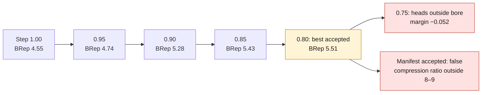

# M64 G2 — ports, cooling, gallery and compression ratio

> **Correction of September 24:** the BRep ratio of 5.51 and the calibrations of this study
> counted separate cavities and an unclosed chamber. They do not support the conclusion
> that the 8–9 target is unreachable. See the [reproducible audit](M64_G2_COMPRESSION_AUDIT_20260924.md).
> The geometric results below remain historical; the evidence files of September 16
> are kept unmodified.

**Status: design twin, not reviewed. Manufacturing and engine start-up not authorized.**
No dimension on this page is measured on an M64 cylinder head: the shapes added here are
design assumptions, declared `unsourced` in `params-g2/head_features.json`.



*Historical angle-continuation ladder of September 16, as reported below; the September 24 audit withdraws the conclusion drawn from the 5.51 ratio.*

## Why a G2

The G1 milestone (`docs/reports/M64_G1_FOUR_VALVE_SKELETON_20260914.md`) delivered a skeleton: pent-roof
chamber, seats, guides, spring pockets, spark-plug wells, studs — but **straight
ports**, **no fins**, **no oil gallery**, and **no combustion criterion**. The G1 batch
defined in `docs/reports/M64_RESEARCH_EXECUTION_20260912.md` did ask for ports, oil and
drawings. G2 fills the part that is achievable without new measurements.

G2 is enabled with `--extra-params`: without this file, `layout.cylinders`, the CAD and the checks are
identical to G1, whose evidence remains byte-for-byte reproducible.

## What G2 adds

| Item | Shape | Checks |
|---|---|---|
| Ports | Cubic Bézier from the throat (tangent to the valve axis) to the flange (perpendicular), in segments shared between numpy and CAD; the two ports on one side join at the center of the flange | port/stud, port/spark-plug well, port/spring pocket walls |
| Oil gallery | through drilling along y, below the cam-carrier face | walls toward pockets, guides, spark plugs, studs, ports; distance to the cam-carrier face |
| Fins | horizontal plates on the ±y faces, between the flanges | height below the cam-carrier face; interference with the neighboring cylinder head **not computable** (cylinder spacing unsourced) |
| Compression ratio | BRep dead volume at firing TDC: bore cylinder minus cylinder head, seats, closed valves and piston | target range as an assumption, **blocking** for acceptance; calibrated numpy proxy non-blocking, used as a search filter |


*XY section of the G2 CAD at the ports (evidence of September 16); a design-twin drawing, not a measured M64 part and not a flow or thermal result.*

## Main finding: the G1 chamber is too large

Measured in BRep on the accepted G1 configuration (bore 100, stroke 76.4):

| Quantity | Value |
|---|---|
| Valve angles adopted in G1 | 33.4° intake, 24.6° exhaust (58° included) |
| Roof ridge height | 27.5 mm |
| Dead volume | 171.8 cm³ |
| Swept volume | 600.0 cm³ |
| **Compression ratio** | **4.49** |

A turbo engine usually sits around 8:1; no M64 value is sourced in the repository, so the
8 to 9 range adopted here is an assumption. The cause is clear: **the G1 iteration had no
combustion criterion** and maximized clearances, which pushes the angles toward the top of their bound.

## Two dead-volume computations, one judge

The numpy proxy integrates the roof over the bore disk, minus the piston crown. Two distinct
defects separated it from the BRep; they are not handled the same way.

**An omission, corrected.** It counted neither the valve pockets nor the bowl other than as a
cylinder: it added the bowl and ignored the pockets. It now reuses `crown_depression`, the
same function as the kinematics, overlaps and bore overflows included. On the
G1 configuration (pockets of 3.92 mm) this is worth **16.8 cm³**: 116.7 cm³ before, 133.5 after.

**A residual bias, accepted and bounded.** What remains are the seat pockets, throats and ports
opening into the chamber. Measured in BRep on four configurations, this bias is neither a
constant factor nor a constant offset: it grows with the roof ridge.

| Angles | Ridge | Raw proxy | BRep | Factor |
|---|---:|---:|---:|---:|
| 16° / 16° | 14.67 | 77.15 cm³ | 82.94 cm³ | 1.075 |
| 22° / 22° | 18.80 | 89.79 | 108.52 | 1.209 |
| 28° / 28° | 22.79 | 99.70 | 132.13 | 1.325 |
| 33.4° / 24.6° (G1) | 27.47 | 133.50 | 171.81 | 1.287 |

`chamber_proxy_calibration` keeps **1.075**, the value measured *near the targeted range* —
that is where the filter has to be right, and it is: at 16° the calibrated proxy gives 8.24 against 8.23
in BRep. Elsewhere it drifts, and the drift is published: on the configuration adopted here,
`observed_calibration` is 1.409 against 1.075 assumed, i.e. a proxy announcing 6.91 for an actual BRep
ratio of 5.51. This is accepted: the proxy is only a search filter.
**The BRep ratio is the judge**: `run.py` refuses acceptance if the BRep ratio falls outside the range, and
`compression_proxy_band_tolerance` (0.6 point) widens the range on the proxy side so that it does not discard
a candidate that the measurement would have kept.

## BRep validity of the ports: three trials

Cutting a curved port is the fragile part. Measurements on the G1 configuration:

| Construction | Valid BRep | Solids | Remark |
|---|---|---|---|
| Capsules cut one by one | no | 10 | the cylinder head fragments |
| Loft of circles normal to the curve | no | 14 | negative volume: inverted orientation |
| Fused capsules, spheres at the junctions | yes | 3 | two spurious slivers (129 mm³ and 0) |
| **Segments extended by one radius, fused into one tool, a single cut** | **yes** | **1** | adopted |

The fins alone and the gallery alone remain valid and a single solid.

## Tuning the angles: three trials, three distinct causes

**Trial 1 — sweep of the two angles only: 0 candidates.** The fifteen other G1 variables
(spark plugs, piston pockets, timing, valve length) had been optimized *for* the G1
angles; moving the angles alone breaks the bridges toward the spark-plug wells. The combustion criterion was therefore
moved into the search itself (`iterate.compression_record`), which repositions all
variables together.

**Trial 2 — full search: 1,070 trials, 0 accepted.** Two faults, not one. First, the warm
start removed the valve-head positions so that they would be re-derived, which threw away from the
first trial the only known admissible point — yet the G1 configuration does pass
the G2 checks, ports and gallery included, with a margin of 0.188 mm. Second, the ranking let
"within the range" take precedence over **refused** trials: the local search chased
compression while abandoning the geometry and stopped on a trial within the range but with six
failed checks and a margin of −4.11 mm. The criterion now only breaks ties between trials already
accepted, and the start keeps the whole G1 configuration.

**Trial 3 — corrected full search: accepted, but stuck at 6.17 on the proxy side.** Starting from G1
(4.5), coordinate descent raises the ratio and then finds no better neighbor: moving
toward the range first costs geometric margin before giving any back. Hence the method adopted, a
**continuation**: the two angles are frozen at each step, the fifteen other variables
reposition freely, and each step warm-starts from the previous one — exactly what
`bore_sweep.py` does for the bore.

## Result: the 8–9 range is out of reach, and we know why

2,249 trials, 360 accepted, 5 BRep measurements along the ladder of steps (one candidate per step):

| Step | Int./exh. angles | Accepted | Margin | Calibrated proxy | **BRep** | Limiting constraint |
|---|---|---|---:|---:|---:|---|
| 1.00 | 33.4 / 24.6 | yes | 0.188 | 5.79 | 4.55 | int/int bridge |
| 0.95 | 31.7 / 23.4 | yes | 0.315 | 6.00 | 4.74 | valve–piston |
| 0.90 | 30.0 / 22.2 | yes | 0.306 | 6.81 | 5.28 | head beyond ridge |
| 0.85 | 28.4 / 20.9 | yes | 0.313 | 6.92 | 5.43 | valve–piston |
| **0.80** | **26.7 / 19.7** | **yes** | **0.080** | 6.91 | **5.51** | stud/pocket wall |
| 0.75 | 25.0 / 18.5 | no | **−0.052** | 6.94 | — | **heads outside bore** |
| 0.70 | 23.4 / 17.2 | no | −0.560 | 7.13 | — | heads outside bore |
| 0.60 | 20.0 / 14.8 | no | −1.605 | 7.65 | — | heads outside bore |
| 0.55 | 18.4 / 14.0 | no | −2.138 | 8.03 | — | heads outside bore |

The descent **runs into `valve_heads_within_bore`**, and the mechanism is geometric: the projected
footprint of a head has an x semi-axis equal to the product `d/2 · cos θ`. Flattening the valves therefore widens
their footprint, and two 40 mm heads plus two 33 mm heads eventually overflow a 100 bore.
The wall falls between 26.7° and 25.0°: step 0.75 fails by **0.052 mm** on a required margin of
1.0 mm.

Consequence: within the bounds of step 1 — M64 bore sourced at 100, Swindon heads sourced at
40 and 33 — **the 8:1 ratio is not achievable**. The best accepted BRep ratio is **5.51**
(dead volume 133.07 cm³), against 4.49 for G1: +23 %, and still outside the range. The only remaining
levers leave step 1 and touch sourced values: reduce the head diameters
(step 3, penalized), enlarge the bore (step 2), or revise unsourced assumptions that are
not variables — deck clearance (1.0 mm), valve–piston clearances (1.5 / 2.0 mm).
This choice calls for a decision, not a computation: it is not made here.

The evidence of `g2-head-features-20260916` is therefore produced on the configuration of step 0.80,
selected by `--select-best-accepted`: the CAD is complete and valid, but the manifest carries
`accepted: false`, refused **on the compression ratio alone**. The 44 geometric checks pass
(minimum margin 0.080 mm), the cylinder head is a single valid solid of 399 faces, and the nine
BRep distance cross-checks pass.

Operational consequence: **only one heavy computation at a time**. A killed `docker` client leaves the
container alive: two runs thus wrote into the same output file, and the code 137
observed came from the client, not from the container (`OOMKilled=false`).

## Reproduce

```sh
FV=twins/m64-cylinder-head/source/fourvalve
# step-by-step angle descent, then BRep measurement of one candidate per step
python3 $FV/tune_compression.py work/m64-g2/compression-tuning.json \
  --method continuation --select-best-accepted --top 12
# redo the selection and the BRep measurements without rerunning the search
python3 $FV/tune_compression.py work/m64-g2/compression-tuning.json \
  --reselect work/m64-g2/compression-tuning-ladder.json --select-best-accepted
# full run with the adopted configuration
python3 $FV/run.py twins/m64-cylinder-head/evidence/g2-head-features-20260916 \
  --extra-params $FV/params-g2/head_features.json \
  --fixed-design work/m64-g2/compression-tuning.json --external-dir work/m64-g2-external
```

`tune_compression.py` and `run.py` return 2 as long as the BRep ratio stays outside the range: that is
the case today.

Tests: `tests/test_m64_g2_head_features.py` (ports, gallery, fins, CAD and ratio) and the
non-regression `tests/test_m64_g1_four_valve_twins.py`.

## What G2 does not do

- **Missing contract interfaces** (centering, oil passage) and **cylinder spacing**:
  no M64 data in the repository, hence neither a bridge between cylinders nor fin interference.
- **Flow**: the port shape is not validated by a flow bench; no section and no
  throat ratio is justified by a flow computation.
- **Cooling**: fins and gallery are shapes, not a thermal balance. Neither pump
  flow, nor fan flow, nor hot material properties are sourced.
- **Open contradictions** between reports (valve actuation, exhaust timing, piston
  clearance, springs): they remain to be settled with sources.
