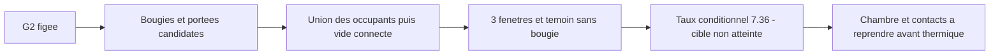

# M64 G2 — bougies candidates et chambre fermée numériquement

**Deux enveloppes de bougie et leurs puits étagés sont ajoutés en option à la G2.**
La forme extérieure, les positions de soupapes et les interfaces de la G2 ne changent pas.
Ce modèle reste synthétique : **ni culasse M64 ajustée, ni pièce autorisée à imprimer**.
Aucune location Vast n'a été nécessaire.

## Résultats

| Contrôle | Résultat sur cette configuration |
|---|---:|
| Culasse | 1 solide BRep valide, 403 faces |
| Bougies candidates | 2 solides valides ; intersection volumique avec la culasse nulle |
| Volume connecté au PMH | 94,384567 cm³ |
| Taux géométrique conditionnel | 7,35744:1, sous l'hypothèse cible 8–9 |
| Variation du volume sur trois fenêtres | 0 à la précision rapportée |
| Borne conservative bougies / soupapes, toute course froide | 4,118 mm pour un seuil de conception de 1 mm |
| Borne conservative bougies / calotte au PMH | 12,005 mm pour ce même seuil |
| Une bougie retirée : témoin négatif | chambre ouverte, volume exploitable et taux absents |

Le calcul indépendant par intégration du toit et du piston donne **94,463376 cm³**,
soit environ **+0,0835 %**. Ce proxy ignore les détails des sièges et des bougies : sa proximité
sur un seul point n'est ni une validation physique ni une calibration transférable.
La calibration historique ×1,075 n'a pas été modifiée ni utilisée pour annoncer le taux ci-dessus.

Les contrôles géométriques rapportent 44 réussites, deux échecs indicatifs non bloquants et
un entraxe inter-cylindres non calculable. Leur `accepted` ne concerne que ces critères :
la compression demeure hors cible et aucune qualification moteur n'en découle.
La marge géométrique existante goujon/logement de ressort reste très faible : **0,08 mm au-delà
du seuil choisi**, sans tolérances de fabrication ni dilatation. Elle n'est pas une marge industrielle.

## Géométrie et hypothèses

La famille candidate [NGK BKR EIX-P](https://ngk-sparkplugs.jp/ngk/sparkplugs/products/max/)
publie un diamètre de filetage de 14 mm, une longueur filetée de 19 mm et un hexagone de 16 mm
(table « 品番ラインアップ », consultée le 24 septembre 2026). Cela ne sélectionne **aucun indice
thermique pour 700 hp**, ni une application Porsche approuvée.

Le diamètre de portée de 20 mm, sa hauteur de 1,5 mm, le puits de clé de 22 mm et les dimensions
du nez et de l'isolant sont des **hypothèses explicites** dans
[le jeu de paramètres optionnel](../../twins/m64-cylinder-head/source/fourvalve/params-plugs/spark_plug_envelope.json).
Le puits élargi commence à la portée, 19 mm au-dessus de l'intersection axe/toit ; il crée
l'épaulement plan sans agrandir le trou côté chambre. Les filetages restent des cylindres lisses.
Le contrôle des puits utilise les mêmes primitives que la CAO ; les collisions soupapes/bougies
utilisent des capsules majorant les solides et toute leur course, sans supposer un seul angle moteur.

La bougie est une enveloppe pleine d'assemblage, **pas une CAO fournisseur** : crevasses du nez,
filets, jeu des segments, compression du joint et contacts thermiques manquent. Les soupapes et
sièges restent des solides simplifiés recouvrants, pas un contact mécanique qualifié.
L'absence de fuite topologique du modèle ne prouve pas l'étanchéité physique.

## Mesure et reproductibilité

La sonde englobe désormais la hauteur entière de la culasse, puis ajoute 2, 5 ou 10 mm.
Limiter la sonde au toit +2 mm tronquait certains logements de sièges : ce n'était pas une
fenêtre suffisante, même avec les bougies. Les trois nouvelles bornes supérieures sont
88,461, 91,461 et 96,461 mm.

Une différence multi-outils a aussi produit une BRep invalide lors d'un essai. La mesure fusionne
d'abord les occupants, puis soustrait cette union, avec des opérations sérielles non destructives
pour ne pas modifier les entrées partagées. Tout résultat invalide reste refusé ; aucune réparation
automatique ni tolérance élargie n'est utilisée pour accepter un volume.



[Audit, contrôles et empreintes](../../twins/m64-cylinder-head/evidence/g2-spark-plug-packaging-20260924/audit.json)
et [STEP des deux enveloppes](../../twins/m64-cylinder-head/evidence/g2-spark-plug-packaging-20260924/spark-plug-envelopes.step).
Coupe CAO dans le plan des axes de bougie, piston à gauche et bougies à droite ; ce n'est pas une photo :


```sh
uv run --python 3.12 --no-project --with cadquery==2.6.1 python \
  twins/m64-cylinder-head/source/fourvalve/audit_spark_plugs.py \
  twins/m64-cylinder-head/evidence/g2-head-features-20260916/parameters-resolved.json \
  work/m64-g2-plug-replay
uv run --python 3.12 --no-project --with cadquery==2.6.1 python tests/test_m64_g2_head_features.py -v
uv run --python 3.12 --no-project --with cadquery==2.6.1 python tests/test_m64_g1_four_valve_twins.py -v
make check
```

Le script refuse d'écraser une preuve existante. Les preuves G1/G2 précédentes restent inchangées.
La modification de fenêtre rend les anciens volumes **diagnostiques ouverts** non comparables
directement ; l'ancien audit est reproductible avec son code au commit `f4cfddb`.

Vérifications : **15 tests G2 et 21 tests G1 réussis sous CadQuery 2.6.1**, sans tests CAO ignorés.
Les SHA-256 du code, des paramètres et des exports de cet audit ont été revérifiés.
`make check` exécute 3 032 tests avec succès (120 ignorés dans son environnement par défaut),
puis échoue sur le rapport F46 périmé, déjà en échec sur
[le `main` de départ](https://github.com/cluster2600/porscheparts/actions/runs/35085578047).
Le rapport F46 et son contrat ne sont pas modifiés ; la PR reste en brouillon.

## Suite

Suite exécutée le 25 septembre : [portées concordantes et test de fuite par conduit](M64_G3_SEAT_CONTACT_20260925.md).
Cette reprise corrige aussi la troncature latérale de la sonde ; les chiffres ci-dessus restent
ceux de la preuve historique du 24 septembre, non réécrite.

Reprendre le profil de chambre pour la plage de compression choisie, sans toucher arbitrairement
à l'extérieur, et remplacer les sièges/soupapes simplifiés par des portées cohérentes. Ensuite seulement,
recaler le proxy sur plusieurs géométries fermées et préparer les maillages thermiques/conjugués.
Plan fournisseur des bougies, contacts à chaud, matériaux, interfaces M64 et qualification LPBF restent
des exigences distinctes : ce travail ne les remplace pas.
