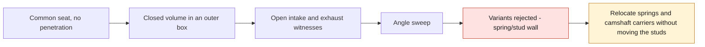

# M64 G3 — concordant seats and detection of lateral leaks

Follow-up: [G4 — spring pockets and outlets corrected](M64_G4_SPRING_LAYOUT_20260925.md).
The G4 check of the full pocket-floor disk invalidates the center-only check used here;
the G3 results remain historical observations, not a current manufacturability verdict.

[PR #72](https://github.com/cluster2600/porscheparts/pull/72) was merged on September 25,
commit `7fe668b`. This follow-up optionally replaces the seat/valve contacts with concordant conical
faces. **G2 fixture and cylinder head body unchanged; no manufacturing authorization.**

## What was corrected

The old solids interpenetrated by 210.595 mm³ per intake and 155.878 mm³ per exhaust.
They closed the chamber numerically, but did not define a mechanical seat.
The new valves have a peripheral margin, a conical seat face and a fillet to the neck.
The seat takes the same seat face, with a chamber-side relief and a fillet to the throat.

| Check | Intake, per valve | Exhaust, per valve |
|---|---:|---:|
| Valve/seat penetration | 0 mm³ | 0 mm³ |
| Common area measured on the CAD faces | 173.272435 mm² | 183.091206 mm² |
| Area from the conical frustum formula | 173.272435 mm² | 183.091206 mm² |
| Overall minimum distance at 0.1 mm lift | 0.019612 mm | 0.019612 mm |
| Overall minimum distance at 1 mm lift | 0.196116 mm | 0.196116 mm |

The independent formula is `A = π (r0 + r1) √((r0 − r1)² + (z1 − z0)²)`.
The four pairs are valid, with no penetration into the cylinder head body; the two area
methods agree to 10⁻⁶ mm². The runs include 0.1 mm, 1 mm and the respective full lift.
The small passage at low lift results from the entry relief: **this is not a validated flow**,
and this profile is not presented as optimal. This relief will have to be studied in CFD.

The [optional parameters](../../twins/m64-cylinder-head/source/fourvalve/params-seats/seat_contact.json)
remain assumptions: face angle 45°, margin 1 mm, **radial** seat width
1 mm at intake and 1.3 mm at exhaust, radial relief 0.2 mm.
These are not Porsche dimensions nor a selected commercial seat reference.

## The test that found another measurement defect

With an intake deliberately opened by 1 mm, the old cylindrical probe still reported
a ratio of 4.903. It cut the ports at the bore boundary: this lateral limit
acted as an artificial plug. The non-regression test first failed on this case.

The probe now follows the bore only **inside the liner**, then encloses the whole body
and its flanges with an outer margin. A leak through a port thus reaches the outside,
then the upper limit: it is rejected. Open intake and open exhaust are
tested separately; both give `blocked_unsealed_chamber`, with no usable ratio.

On the closed configuration with the new seats:

- connected volume **94.437926 cm³** and conditional geometric ratio **7.353848:1**;
- same results for 2, 5 and 10 mm of outer margin;
- the old model with spark plugs, but without the new seats, now gives 7.356946:1
  instead of 7.357440:1: the box includes small cavities previously truncated laterally.

This is the **geometric ratio with valves closed at TDC**, not a dynamic compression,
a combustion simulation or a demonstrated capability to produce 700 hp.
The volume under the rings, the spark plug crevices and the real clearances remain excluded.

## Chamber reduction: variants rejected

Six configurations were examined. Both angles are multiplied by the indicated factor,
and the roof is recomputed to keep the minimum height at the edge of the heads. The lateral
positions, studs, diameters and other parameters stay fixed. Kinematic sweep: 0.5°.

| Angle factor | Uncalibrated proxy ratio, not a BRep result | Conservative stud/spring-pocket wall |
|---:|---:|---:|
| 1.00 | 7.352 | 3.080 mm |
| 0.95 | 7.620 | 2.367 mm |
| 0.90 | 7.911 | 1.740 mm |
| 0.85 | 8.229 | 1.210 mm |
| 0.80 | 8.578 | 0.787 mm |
| 0.75 | 8.962 | 0.482 mm |

The design threshold is **3 mm**, without tolerances or hot calculation. All variants
lowering the angles fail this criterion; none is retained, nor announced with a BRep ratio
of 8–9. This does not prove that another layout is impossible. The baseline itself keeps
only 0.08 mm of margin over this threshold: this is not a demonstrated acceptable manufacturing reserve.



## Evidence and reproduction

[Full audit and digests](../../twins/m64-cylinder-head/evidence/g3-seat-contact-20260925/audit.json) ·
[STEP of the four valves and seats](../../twins/m64-cylinder-head/evidence/g3-seat-contact-20260925/four-valves-and-seats.step).
The section below is a **local CAD zoom of the intake seat**, not a view of the whole cylinder head.


*Local CAD section of the candidate intake seat; it does not prove sealing, contact pressure or manufacturability.*

```sh
uv run --python 3.12 --no-project --with cadquery==2.6.1 python \
  twins/m64-cylinder-head/source/fourvalve/audit_seat_contact.py \
  twins/m64-cylinder-head/evidence/g2-head-features-20260916/parameters-resolved.json \
  work/m64-g3-seat-replay
uv run --python 3.12 --no-project --with cadquery==2.6.1 python tests/test_m64_g3_seat_contact.py -v
make check
```

Earlier evidence is not rewritten. The opening witnesses prevent a future
regression of the computation; CAD validity does not replace physical sealing.

Verification: **39 targeted tests pass under CadQuery 2.6.1**, with no CAD tests skipped
(21 G1, 15 G2, 3 G3). The digests, the four contacts, the three windows, the two opening
witnesses and the five rejected variants were checked. `make check` passes 3,035 tests
(122 skipped in its default environment), then fails on the same stale F46 report
as before the merge. This defect is kept visible and the F46 evidence is not modified.

Still missing: seat/cylinder head interference fit, tolerances, fillets, contact pressure,
hot materials, heat transfer, fatigue and print qualification.
**Priority next step: coupled layout of springs/camshaft carriers and chamber, keeping the
studs and respecting the walls; only then contact qualification and CFD/CHT.**
