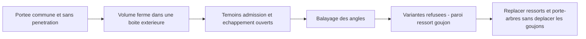

# M64 G3 — portées concordantes et détection des fuites latérales

Suite : [G4 — fonds de ressorts et débouchés corrigés](M64_G4_SPRING_LAYOUT_20260925.md).
Le contrôle G4 du disque de fond complet invalide le seul contrôle de centre utilisé ici ;
les résultats G3 restent des observations historiques, pas un verdict actuel de fabricabilité.

La [PR #72](https://github.com/cluster2600/porscheparts/pull/72) a été fusionnée le 25 septembre,
commit `7fe668b`. Cette suite remplace, en option, les contacts siège/soupape par des faces coniques
concordantes. **Gabarit et corps de culasse G2 inchangés ; aucune autorisation de fabrication.**

## Ce qui a été corrigé

Les anciens solides se pénétraient de 210,595 mm³ par admission et 155,878 mm³ par échappement.
Ils fermaient numériquement la chambre, mais ne définissaient pas une portée mécanique.
Les nouvelles soupapes ont une tranche périphérique, une portée conique et un raccord au col.
Le siège reprend la même portée, avec un dégagement côté chambre et un raccord à la gorge.

| Contrôle | Admission, par soupape | Échappement, par soupape |
|---|---:|---:|
| Pénétration soupape/siège | 0 mm³ | 0 mm³ |
| Aire commune mesurée sur les faces CAO | 173,272435 mm² | 183,091206 mm² |
| Aire par formule de tronc de cône | 173,272435 mm² | 183,091206 mm² |
| Distance minimale globale à 0,1 mm de levée | 0,019612 mm | 0,019612 mm |
| Distance minimale globale à 1 mm de levée | 0,196116 mm | 0,196116 mm |

La formule indépendante est `A = π (r0 + r1) √((r0 − r1)² + (z1 − z0)²)`.
Les quatre couples sont valides, sans pénétration avec le corps de culasse ; les deux méthodes
d'aire concordent à 10⁻⁶ mm². Les essais incluent 0,1 mm, 1 mm et la pleine levée respective.
Le petit passage à faible levée résulte du dégagement d'entrée : **ce n'est pas un débit validé**,
et ce profil n'est pas présenté comme optimal. Il faudra étudier ce dégagement en CFD.

Les [paramètres optionnels](../../twins/m64-cylinder-head/source/fourvalve/params-seats/seat_contact.json)
restent des hypothèses : angle de face 45°, tranche 1 mm, largeur **radiale** de portée
1 mm à l'admission et 1,3 mm à l'échappement, dégagement radial 0,2 mm.
Ce ne sont pas des cotes Porsche ni une référence de siège commercial sélectionnée.

## Le test qui a trouvé un autre défaut de mesure

Avec une admission volontairement ouverte de 1 mm, l'ancienne sonde cylindrique annonçait encore
un taux de 4,903. Elle coupait les conduits à la frontière de l'alésage : cette limite latérale
agissait comme un bouchon artificiel. Le test de non-régression a d'abord échoué sur ce cas.

La sonde suit désormais l'alésage seulement **dans la chemise**, puis englobe le corps entier
et ses brides avec une marge extérieure. Une fuite par un conduit rejoint ainsi l'extérieur,
puis la limite supérieure : elle est rejetée. Admission ouverte et échappement ouvert sont
testés séparément ; les deux donnent `blocked_unsealed_chamber`, sans taux utilisable.

Sur la configuration fermée avec les nouvelles portées :

- volume connecté **94,437926 cm³** et taux géométrique conditionnel **7,353848:1** ;
- mêmes résultats pour 2, 5 et 10 mm de marge extérieure ;
- l'ancien modèle avec bougies, mais sans les nouvelles portées, donne désormais 7,356946:1
  au lieu de 7,357440:1 : la boîte inclut de petites cavités auparavant tronquées latéralement.

Il s'agit du taux **géométrique avec soupapes fermées au PMH**, pas d'une compression dynamique,
d'une simulation de combustion ou d'une capacité démontrée à produire 700 hp.
Le volume sous les segments, les crevasses de bougie et les jeux réels restent exclus.

## Réduction de chambre : variantes refusées

Six configurations ont été examinées. Les deux angles sont multipliés par le facteur indiqué,
et le toit est recalculé pour conserver la hauteur minimale au bord des têtes. Les positions
latérales, goujons, diamètres et autres paramètres restent fixes. Balayage cinématique : 0,5°.

| Facteur d'angles | Taux proxy non calibré, pas un résultat BRep | Paroi conservative goujon/logement de ressort |
|---:|---:|---:|
| 1,00 | 7,352 | 3,080 mm |
| 0,95 | 7,620 | 2,367 mm |
| 0,90 | 7,911 | 1,740 mm |
| 0,85 | 8,229 | 1,210 mm |
| 0,80 | 8,578 | 0,787 mm |
| 0,75 | 8,962 | 0,482 mm |

Le seuil de conception est **3 mm**, sans tolérances ni calcul à chaud. Toutes les variantes
abaissant les angles échouent à ce critère ; aucune n'est retenue, ni annoncée avec un taux BRep
de 8–9. Cela ne prouve pas l'impossibilité d'une autre implantation. La base elle-même ne garde
que 0,08 mm de marge sur ce seuil : ce n'est pas une réserve de fabrication acceptable démontrée.



## Preuves et reproduction

[Audit complet et empreintes](../../twins/m64-cylinder-head/evidence/g3-seat-contact-20260925/audit.json) ·
[STEP des quatre soupapes et sièges](../../twins/m64-cylinder-head/evidence/g3-seat-contact-20260925/four-valves-and-seats.step).
La coupe ci-dessous est un **zoom CAO local de la portée d'admission**, pas une vue de toute la culasse.


```sh
uv run --python 3.12 --no-project --with cadquery==2.6.1 python \
  twins/m64-cylinder-head/source/fourvalve/audit_seat_contact.py \
  twins/m64-cylinder-head/evidence/g2-head-features-20260916/parameters-resolved.json \
  work/m64-g3-seat-replay
uv run --python 3.12 --no-project --with cadquery==2.6.1 python tests/test_m64_g3_seat_contact.py -v
make check
```

Les preuves antérieures ne sont pas réécrites. Les témoins d'ouverture empêchent une future
régression du calcul ; la validité CAO ne remplace pas l'étanchéité physique.

Vérification : **39 tests ciblés passent sous CadQuery 2.6.1**, sans tests CAO ignorés
(21 G1, 15 G2, 3 G3). Les empreintes, les quatre contacts, les trois fenêtres, les deux témoins
d'ouverture et les cinq variantes refusées ont été contrôlés. `make check` passe 3 035 tests
(122 ignorés dans son environnement par défaut), puis échoue sur le même rapport F46 périmé
qu'avant la fusion. Ce défaut est conservé visible et les preuves F46 ne sont pas modifiées.

Il manque encore le serrage siège/culasse, les tolérances, les arrondis, la pression de contact,
les matériaux à chaud, les échanges thermiques, la fatigue et la qualification d'impression.
**Suite prioritaire : implantation couplée ressorts/porte-arbres et chambre, en conservant les
goujons et en respectant les parois ; puis seulement qualification du contact et CFD/CHT.**
