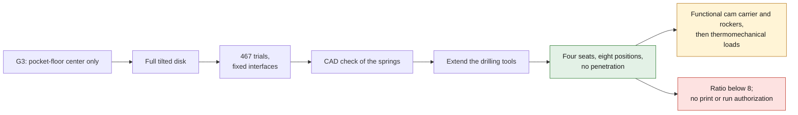

# M64 G4 — spring pockets and outlets corrected

Follow-up: [G5 — articulated rockers and verified cam profiles](M64_G5_ARTICULATED_ROCKERS_20260925.md).
G5 keeps the G4 observations and optionally replaces the simplified axial actuation.

[PR #73](https://github.com/cluster2600/porscheparts/pull/73) was merged on
September 25, 2026, commit `522cf32224bcca8f98d32112dc5332a3eb897744`.
G4 corrects two geometric defects and retains a new candidate internal layout.
**The body is still the synthetic G2 model, not a faithful reconstruction of the M64 scan.
No authorization to print or to run.**



## Two defects corrected at the source

1. The pocket-floor check compared only its **center** with the cam-carrier face.
   Yet the tilted edge protruded past that face by 2.194 mm on the intake and 3.088 mm on
   the exhaust in G3. The shared check now accounts for the whole disk:
   `z_max = z_centre + rayon × sin(angle)`. The CAD of the disk confirms this formula.
2. The cylindrical drilling tool stopped with its center 5 mm above the face.
   At the angles considered, its lower edge stayed inside the material, leaving an obstacle
   within the spring envelope. The tool is extended so that **its entire end disk**
   clears the face by 5 mm. Geometry and checks use the same corrected tool.

This extension applies to a cutting tool, not an enlargement of the cylinder-head body.
The old evidence stays intact; its old verdict does not replace these new checks.

## Bounded search and result

Reuse of `iterate.Search`, seed 935: **467 trials, of which 187 were accepted by the fast
geometric checks**. Only five variables: two angles, two valve x positions and the valve
length offset. Studs, 100 mm bore, 40/33 mm diameters, assumed Ø30 mm springs, cam-carrier
face, flanges and envelope stay fixed.
The slight 0.00005 mm deviation in y comes from recomputing derived values that were previously rounded.

Ranking uses the proxy **without calibration** and without widening the 8–9 range.
The historical 1.075 factor is not a valid physical calibration; it is not rewritten
in the historical evidence. Trial 452 is retained for this study, not as a global optimum.

| Measure | G3 | G4 candidate |
|---|---:|---:|
| Intake / exhaust angles | 26.700° / 19.697° | 29.376° / 27.554° |
| Intake / exhaust x position | −19.495 / 27.403 mm | −18.042 / 22.775 mm |
| Length offset vs 993 2V reference valves | +17.437 mm | +14.430 mm |
| Vertical margin of the intake / exhaust pocket-floor edge | −2.194 / −3.088 mm | +0.645 / +2.665 mm |
| Conservative stud / pocket wall | 3.080 mm | 3.206 mm |
| Minimum across the 16 CAD stud / pocket cylinder pairs | — | 3.706 mm |
| CAD closed dead volume | 94.437926 cm³ | 86.519086 cm³ |
| CAD geometric ratio, valves closed at TDC | 7.353848:1 | 7.935397:1 |

The required minimum wall remains **3 mm**. It is neither a hot-qualified thickness nor a
validated manufacturing margin. The ratio remains **below the exploratory 8–9 target**: no
700 hp turbo performance is demonstrated. The raw proxy gives 7.929; the CAD measurement is
identical with 2 and 10 mm of outer margin around the part.

## Native cross-checks

- 33 valid BRep components; single-solid cylinder-head body.
- On the four spring envelopes, the 291.382719 mm² annular base area is entirely
  in geometric contact with the cylinder head. No spring/body penetration, at zero lift
  and at the respective full lift. This is not a contact-pressure calculation under load.
- Analytical kinematic sweep over 720° in 0.5° steps; nine CAD cross-checks at the angles
  selected by the existing 1° sweep. CAD valve/piston minimum: 1.814 mm on the
  intake (threshold 1.5), 2.248 mm on the exhaust (threshold 2).
- No blocking geometric check fails. Two non-blocking indicators stay red:
  ratio below 8 and the packaging of a bucket tappet. The functional rocker is
  still not defined; the indicator is not a validation of the valve actuation.


*CAD section of the synthetic geometry test bench, not a cylinder head ready to manufacture.*

The section passes through the axis of the positive-y intake. The exhaust sits at another y and
therefore appears in projection behind the plane. Springs, tappets and shafts are simplified
envelopes; this image does not represent a complete functional valvetrain.

## Evidence and reproduction

[Audit and digests](../../twins/m64-cylinder-head/evidence/g4-spring-layout-20260925/audit.json) ·
[Values and changes](../../twins/m64-cylinder-head/evidence/g4-spring-layout-20260925/candidate.json) ·
[Log of the 467 trials](../../twins/m64-cylinder-head/evidence/g4-spring-layout-20260925/search-history.json).
The Python/CadQuery sources and parameters make the geometry editable and reproducible.
Local CPU run, **$0 of Vast rental for this iteration**.

The **42 targeted tests** pass under CadQuery 2.6.1, with no CAD test skipped
(21 G1, 15 G2, 3 G3 and 3 G4). Digests of sources/parameters/artifacts, solid
validity, nine CAD clearances and four seating surfaces are checked separately.
`make check` passes 3,038 tests (124 skipped in its default environment), then
fails on the stale F46 preparation report, already failing before #73 was merged.
This defect stays visible; no F46 evidence is modified to turn the check green.

```sh
uv run --python 3.12 --no-project --with cadquery==2.6.1 python \
  twins/m64-cylinder-head/source/fourvalve/audit_spring_layout.py \
  twins/m64-cylinder-head/evidence/g2-head-features-20260916/parameters-resolved.json \
  work/m64-g4-replay
uv run --python 3.12 --no-project --with cadquery==2.6.1 python tests/test_m64_g4_spring_layout.py -v
make check
```

Next: actually define the cam carrier, rockers, fastening and lubrication; verify the
load-bearing thickness under the springs, the tolerances and the assembled packaging. Then
CFD/CHT, strength/fatigue, hot material data and print qualification.
The exact cylinder-to-cylinder spacing remains impossible to compute with the sources at hand.
**Correcting these two defects is not a physical validation of the engine.**
