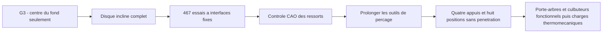

# M64 G4 — fonds de ressorts et débouchés corrigés

La [PR #73](https://github.com/cluster2600/porscheparts/pull/73) est fusionnée depuis le
25 septembre 2026, commit `522cf32224bcca8f98d32112dc5332a3eb897744`.
G4 corrige deux défauts géométriques et retient une nouvelle implantation interne candidate.
**Le corps reste le modèle synthétique G2, pas une reconstruction fidèle du scan M64.
Aucune autorisation d'impression ni de fonctionnement.**

## Deux défauts corrigés à la source

1. Le contrôle du fond de logement comparait seulement son **centre** à la face du porte-arbres.
   Le bord incliné dépassait pourtant cette face de 2,194 mm à l'admission et 3,088 mm à
   l'échappement dans G3. Le contrôle partagé prend désormais tout le disque en compte :
   `z_max = z_centre + rayon × sin(angle)`. La CAO du disque confirme cette formule.
2. L'outil cylindrique de perçage s'arrêtait avec son centre 5 mm au-dessus de la face.
   Son bord inférieur restait dans la matière aux angles considérés, laissant un obstacle
   dans l'enveloppe du ressort. L'outil est prolongé pour que **tout son disque terminal**
   dépasse la face de 5 mm. Géométrie et contrôles utilisent le même outil corrigé.

Ce prolongement est celui d'un outil de découpe, pas un agrandissement du corps de culasse.
Les anciennes preuves restent intactes ; leur ancien verdict ne remplace pas ces nouveaux contrôles.

## Recherche bornée et résultat

Réutilisation de `iterate.Search`, graine 935 : **467 essais, dont 187 acceptés par les
contrôles géométriques rapides**. Cinq variables seulement : deux angles, deux positions x
de soupapes et l'écart de longueur de soupape. Goujons, alésage 100 mm, diamètres 40/33 mm,
ressorts Ø30 mm supposés, face du porte-arbres, brides et gabarit restent fixes.
Le léger écart de 0,00005 mm sur y vient du recalcul des dérivés auparavant arrondis.

Le classement emploie le proxy **sans calibration** et sans élargissement de la plage 8–9.
Le facteur historique 1,075 n'est pas une calibration physique valide ; il n'est pas réécrit
dans les preuves historiques. L'essai 452 est retenu pour cette étude, pas comme optimum global.

| Mesure | G3 | G4 candidate |
|---|---:|---:|
| Angles admission / échappement | 26,700° / 19,697° | 29,376° / 27,554° |
| Position x admission / échappement | −19,495 / 27,403 mm | −18,042 / 22,775 mm |
| Écart de longueur vs témoins 993 2V | +17,437 mm | +14,430 mm |
| Marge verticale du bord de fond admission / échappement | −2,194 / −3,088 mm | +0,645 / +2,665 mm |
| Paroi conservative goujon / logement | 3,080 mm | 3,206 mm |
| Minimum entre les 16 paires de cylindres CAO goujon / logement | — | 3,706 mm |
| Volume mort fermé CAO | 94,437926 cm³ | 86,519086 cm³ |
| Taux géométrique CAO, soupapes fermées au PMH | 7,353848:1 | 7,935397:1 |

La paroi minimale exigée reste **3 mm**. Ce n'est ni une épaisseur qualifiée à chaud ni une
marge de fabrication validée. Le taux reste **sous la cible exploratoire 8–9** : aucune
performance turbo à 700 hp n'est démontrée. Le proxy brut donne 7,929 ; la mesure CAO est
identique avec 2 et 10 mm de marge extérieure autour de la pièce.

## Contre-contrôles natifs

- 33 composants BRep valides ; corps de culasse à un seul solide.
- Sur les quatre ressorts-enveloppes, l'aire annulaire de base de 291,382719 mm² est entièrement
  en contact géométrique avec la culasse. Aucune pénétration ressort/corps, à levée nulle
  et à pleine levée respective. Ce n'est pas un calcul de pression de contact sous charge.
- Balayage cinématique analytique sur 720°, pas 0,5° ; neuf contre-contrôles CAO aux angles
  sélectionnés par le balayage à 1° existant. Minimum soupape/piston CAO : 1,814 mm à
  l'admission (seuil 1,5), 2,248 mm à l'échappement (seuil 2).
- Aucun contrôle géométrique bloquant en échec. Deux indicateurs non bloquants restent rouges :
  taux inférieur à 8 et encombrement d'un poussoir à coupelle. Le culbuteur fonctionnel n'est
  toujours pas défini ; l'indicateur ne vaut pas validation de la commande des soupapes.




La coupe passe par l'axe de l'admission positive en y. L'échappement est à un autre y et
apparaît donc en projection derrière le plan. Ressorts, poussoirs et arbres sont des enveloppes
simplifiées ; cette image ne représente pas une distribution fonctionnelle complète.

## Preuves et reproduction

[Audit et empreintes](../../twins/m64-cylinder-head/evidence/g4-spring-layout-20260925/audit.json) ·
[Valeurs et modifications](../../twins/m64-cylinder-head/evidence/g4-spring-layout-20260925/candidate.json) ·
[Journal des 467 essais](../../twins/m64-cylinder-head/evidence/g4-spring-layout-20260925/search-history.json).
Les sources Python/CadQuery et les paramètres rendent la géométrie modifiable et reproductible.
Exécution CPU locale, **0 $ de location Vast pour cette itération**.

Les **42 tests ciblés** passent sous CadQuery 2.6.1, sans test CAO ignoré
(21 G1, 15 G2, 3 G3 et 3 G4). Empreintes des sources/paramètres/artéfacts, validité
des solides, neuf jeux CAO et quatre surfaces d'appui contrôlés séparément.
`make check` passe 3 038 tests (124 ignorés dans son environnement par défaut), puis
échoue sur le rapport de préparation F46 périmé, déjà en échec avant la fusion de #73.
Ce défaut reste visible ; aucune preuve F46 n'est modifiée pour rendre le contrôle vert.

```sh
uv run --python 3.12 --no-project --with cadquery==2.6.1 python \
  twins/m64-cylinder-head/source/fourvalve/audit_spring_layout.py \
  twins/m64-cylinder-head/evidence/g2-head-features-20260916/parameters-resolved.json \
  work/m64-g4-replay
uv run --python 3.12 --no-project --with cadquery==2.6.1 python tests/test_m64_g4_spring_layout.py -v
make check
```

Suite : définir réellement porte-arbres, culbuteurs, fixation et lubrification ; vérifier
l'épaisseur portante sous les ressorts, les tolérances et l'encombrement assemblé. Puis
CFD/CHT, résistance/fatigue, données matériau à chaud et qualification d'impression.
L'entraxe inter-cylindres exact reste non calculable avec les sources présentes.
**La correction de ces deux défauts n'est pas une validation physique du moteur.**
