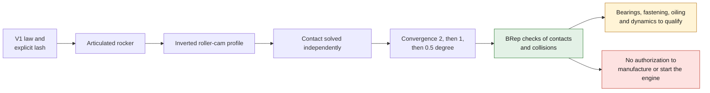

# M64 G5 — articulated rockers and cams conjugate to their motion

G5 optionally replaces G4's fictitious axial tappets with four rockers on two shafts,
four rollers, their pins and two camshafts computed for this mechanism.
**This completes this kinematic model, not the cylinder-head project: cam carrier/bearings,
drive, lubrication, loads and manufacturing remain unqualified.**
The synthetic G4 body is not turned into certified M64 geometry.



## A cam that drives the mechanism

The inversion method and the normal offset of the profile by the roller radius follow
[CMU, *Introduction to Mechanisms*, §6.5.2–6.5.3](https://www.cs.cmu.edu/~rapidproto/mechanisms/chpt6.html).
The equations below are those of our implementation; the dimensions do not come from Porsche.

Let `a` be the valve-side arm, `b` the roller-side arm, `s(phi)` the raw displacement of the
V1 law, `j` its mechanical lash and `theta = phi / 2` the cam angle. In the rocker frame:

```text
beta = asin(s / a)
levee_soupape = max(a sin(beta) - j, 0)
centre_galet = pivot + b [cos(beta), -sin(beta)]
q(theta) = rotation(-theta) [centre_galet - centre_came]
profil_came = q - rayon_galet × normale_exterieure(q)
```

(`levee_soupape` = valve lift, `centre_galet` = roller center, `centre_came` = cam center,
`profil_came` = cam profile, `rayon_galet` = roller radius, `normale_exterieure` = outward normal;
the identifiers are kept as in the code.)

The contact of a spherical pad against the flat stem tip allows the lateral displacement
`a × (1 - cos(beta))`. The margin to the edge of the stem is checked. The cam no longer
results from directly adding the valve lift to the base radius.

The cross-calculation **is not given the requested lift at the tested angle**: it rotates the
cam polygon and solves the roller/cam contact by bisection to recover the rocker angle,
then the lift. It uses angles offset from the vertices that built the profile.
The assembly was also corrected so it no longer rounds the lift to the whole crank degree.

## Layouts rejected and retained

The first 35/21 mm arm pair passed the full-lift test but struck the cam
elsewhere in the cycle. A 16 mm fork with 3 mm cheeks likewise left
only 10 mm for a 14 mm wide cam. These defects are corrected, not tolerated.

Six arm pairs were compared. The **45/24 mm** pair, a **24 mm** fork
with 18 mm between cheeks and a **16 mm** roller are retained for this candidate model.
The cam keeps its 14 mm width and its 15 mm base radius. A crossbar joins
the two cheeks to the pad: each rocker forms a single CAD solid.

| Check on the candidate model | Intake | Exhaust |
|---|---:|---:|
| Maximum oscillation | 14.938° | 12.513° |
| Maximum lateral displacement on the stem | 1.521 mm | 1.069 mm |
| Maximum pressure angle | 29.224° | 25.741° |
| Cam/pivot boss clearance, planar calculation | 2.042 mm | 3.035 mm |
| Cam/pad and crossbar clearance, conservative planar calculation | 2.228 mm | 3.170 mm |
| Cam/cheek axial clearance | 2.000 mm | 2.000 mm |
| Maximum recovered-lift error, profile at 0.5° crank steps | 0.0001051 mm | 0.0000927 mm |

The three resolutions 2°, 1° and 0.5° give decreasing lift errors.
The fine resolution has 1,440 vertices per cam. **These numerical errors are neither
machining tolerances nor an achievable accuracy of the valvetrain when hot.**
The 35° pressure threshold and the 1 mm minimum clearances remain pre-screening
assumptions, not qualified service-life criteria. The log keeps all six pairs,
including the failing ones; this is not a global optimum.

## Deliverables and verification

The native audit passes **44 contact/collision cases**, spread over 11 angles and the four
valves. The **43 components** of the assembly have a valid BRep. The full export
is run separately: one-piece body, nine valve/piston or valve/valve clearances
meeting the candidate thresholds, dead volume of 86.519086 cm³ and ratio of 7.935397:1
unchanged from G4. The full STEP weighs 29,835,029 bytes; it stays in
`work/m64-g5-complete-export/`, outside Git, like the other STEP files over 1 MB.
The small STEP below contains the rockers, rollers and pins; the complete cams
can be rebuilt from the sources and their CSV profiles.

The **47 targeted G1 to G5 tests pass with CadQuery 2.6.1**, with no test skipped
(21 G1, 15 G2, 3 G3, 3 G4, 5 G5). The digests of the audit, the V1 law,
the parameters and the deliverables were re-verified after the export.

[Full audit and digests](../../twins/m64-cylinder-head/evidence/g5-rocker-train-20260925/audit.json) ·
[Reproducible parameters](../../twins/m64-cylinder-head/evidence/g5-rocker-train-20260925/candidate.json) ·
[STEP of rockers, rollers and pins](../../twins/m64-cylinder-head/evidence/g5-rocker-train-20260925/rockers-rollers-and-shafts.step).
The [intake](../../twins/m64-cylinder-head/evidence/g5-rocker-train-20260925/cam-profile-intake.csv)
and [exhaust](../../twins/m64-cylinder-head/evidence/g5-rocker-train-20260925/cam-profile-exhaust.csv)
profiles are in local x/z coordinates, millimeters and cam degrees.


*Section of the candidate mechanism, with cam carrier and bearings absent; not a part ready to assemble or print.*

The section plane passes through the positive-y intake; the exhaust is projected behind it.
The image shows the computed mechanism, not a part ready to assemble or to print.

```sh
uv run --python 3.12 --no-project --with cadquery==2.6.1 python \
  twins/m64-cylinder-head/source/fourvalve/audit_rocker_train.py \
  twins/m64-cylinder-head/evidence/g4-spring-layout-20260925/candidate.json \
  work/m64-g5-replay
uv run --python 3.12 --no-project --with cadquery==2.6.1 python tests/test_m64_g5_rocker_train.py -v
make check
```

## Repairing the global check

The historical F46 report expected the old digest of `deploy/openbao/openbao-vastai`.
The wrapper had evolved, notably for the Qwen Flash Next role. An offline comparison
shows that **only this entry** differs; budgets, classification and locks are identical.
A [new attestation](../../twins/reference-917-engine/evidence/f46-vast-controller-20260925/preparation-report.json)
is generated and the active Makefile target checks it. The old report stays intact.
No secret access, Vast call, purchase or launch was performed by this preparation.
Two existing targets missing from `.PHONY` are also declared; no check is removed.

## Delivery limit

Rigid kinematics does not demonstrate that contact is maintained under inertia, nor Hertz
pressure, fatigue, wear or thermal expansion. The V1 mechanical lash is not a validated M64
hydraulic adjuster. The drive and physical direction of the two shafts, the bearings,
their supports, the accessible fasteners and the oil supply still have to be designed.
The CAD collisions are samples of the cycle, not certified continuous detection.

The G4 ratio remains below 8 and the 700 hp output is not validated. Also missing are the
exact M64 interfaces, hot material data, a correlated CFD/CHT chain,
strength/fatigue and qualification of the printing process. **Neither a green CI nor these
geometric contacts authorize manufacturing or starting the engine.**
