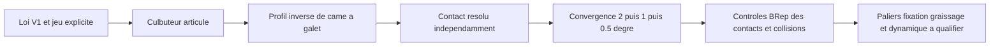

# M64 G5 — culbuteurs articulés et cames conjuguées à leur mouvement

G5 remplace en option les poussoirs axiaux fictifs de G4 par quatre culbuteurs sur deux axes,
quatre galets, leurs axes et deux arbres à cames calculés pour ce mécanisme.
**Cela termine ce modèle cinématique, pas le projet de culasse : porte-arbres/paliers,
transmission, lubrification, charges et fabrication restent non qualifiés.**
Le corps synthétique G4 n'est pas transformé en géométrie M64 certifiée.

## Une came qui commande le mécanisme

La méthode d'inversion et le décalage normal du profil par le rayon du galet suivent
[CMU, *Introduction to Mechanisms*, §6.5.2–6.5.3](https://www.cs.cmu.edu/~rapidproto/mechanisms/chpt6.html).
Les équations ci-dessous sont celles de notre implantation ; les dimensions ne viennent pas de Porsche.

Soient `a` le bras côté soupape, `b` le bras côté galet, `s(phi)` le déplacement brut de la loi
V1, `j` son jeu mécanique et `theta = phi / 2` l'angle de came. Dans le repère du culbuteur :

```text
beta = asin(s / a)
levee_soupape = max(a sin(beta) - j, 0)
centre_galet = pivot + b [cos(beta), -sin(beta)]
q(theta) = rotation(-theta) [centre_galet - centre_came]
profil_came = q - rayon_galet × normale_exterieure(q)
```

Le contact d'un patin sphérique avec le bout plan de tige permet le déplacement latéral
`a × (1 - cos(beta))`. La marge au bord de la tige est contrôlée. La came ne résulte plus
de l'addition directe de la levée soupape au rayon de base.

Le contre-calcul **ne reçoit pas la levée demandée à l'angle testé** : il tourne le polygone
de came et résout le contact galet/came par bissection pour retrouver l'angle du culbuteur,
puis la levée. Il utilise des angles décalés des sommets ayant construit le profil.
L'assemblage a aussi été corrigé pour ne plus arrondir la levée au degré de vilebrequin entier.

## Implantations rejetées et retenue

Le premier couple de bras 35/21 mm passait le test à pleine levée mais rencontrait la came
ailleurs dans le cycle. Une fourche de 16 mm avec des joues de 3 mm laissait également
seulement 10 mm pour une came large de 14 mm. Ces défauts sont corrigés, pas tolérés.

Six couples de bras ont été comparés. Le couple **45/24 mm**, une fourche de **24 mm**
avec 18 mm entre joues et un galet de **16 mm** sont retenus pour ce modèle candidat.
La came conserve sa largeur de 14 mm et son rayon de base de 15 mm. Une traverse relie
les deux joues au patin : chaque culbuteur forme un seul solide CAO.

| Contrôle sur le modèle candidat | Admission | Échappement |
|---|---:|---:|
| Oscillation maximale | 14,938° | 12,513° |
| Déplacement latéral maximal sur la tige | 1,521 mm | 1,069 mm |
| Angle de pression maximal | 29,224° | 25,741° |
| Dégagement came/bossage de pivot, calcul plan | 2,042 mm | 3,035 mm |
| Dégagement came/patin et traverse, calcul plan majorant | 2,228 mm | 3,170 mm |
| Dégagement axial came/joues | 2,000 mm | 2,000 mm |
| Erreur maximale de levée retrouvée, profil au pas 0,5° vilebrequin | 0,0001051 mm | 0,0000927 mm |

Les trois résolutions 2°, 1° et 0,5° donnent des erreurs de levée décroissantes.
La résolution fine contient 1 440 sommets par came. **Ces erreurs numériques ne sont ni
des tolérances d'usinage, ni une précision réalisable de la distribution à chaud.**
Le seuil de pression de 35° et les dégagements minimaux de 1 mm restent des hypothèses de
présélection, pas des critères de durée de vie qualifiés. Le journal conserve les six couples,
dont ceux qui échouent ; il ne s'agit pas d'un optimum global.



## Livrables et vérification

L'audit natif passe **44 cas de contact/collision**, répartis sur 11 angles et les quatre
soupapes. Les **43 composants** de l'assemblage ont une BRep valide. L'export complet
est exécuté séparément : corps monobloc, neuf jeux soupape/piston ou soupape/soupape
conformes aux seuils candidats, volume mort de 86,519086 cm³ et taux de 7,935397:1
inchangés par rapport à G4. Le STEP complet pèse 29 835 029 octets ; il reste dans
`work/m64-g5-complete-export/`, hors Git, comme les autres STEP dépassant 1 Mo.
Le petit STEP ci-dessous contient les culbuteurs, galets et axes ; les cames complètes
sont reconstructibles depuis les sources et leurs profils CSV.

Les **47 tests ciblés G1 à G5 passent avec CadQuery 2.6.1**, sans test ignoré
(21 G1, 15 G2, 3 G3, 3 G4, 5 G5). Les empreintes de l'audit, de la loi V1,
des paramètres et des livrables ont été revérifiées après l'export.

[Audit complet et empreintes](../../twins/m64-cylinder-head/evidence/g5-rocker-train-20260925/audit.json) ·
[Paramètres reproductibles](../../twins/m64-cylinder-head/evidence/g5-rocker-train-20260925/candidate.json) ·
[STEP culbuteurs, galets et axes](../../twins/m64-cylinder-head/evidence/g5-rocker-train-20260925/rockers-rollers-and-shafts.step).
Les [profils admission](../../twins/m64-cylinder-head/evidence/g5-rocker-train-20260925/cam-profile-intake.csv)
et [échappement](../../twins/m64-cylinder-head/evidence/g5-rocker-train-20260925/cam-profile-exhaust.csv)
sont en coordonnées locales x/z, millimètres et degrés de came.


Le plan de coupe passe par l'admission positive en y ; l'échappement est projeté derrière.
L'image montre le mécanisme calculé, pas une pièce prête à monter ou à imprimer.

```sh
uv run --python 3.12 --no-project --with cadquery==2.6.1 python \
  twins/m64-cylinder-head/source/fourvalve/audit_rocker_train.py \
  twins/m64-cylinder-head/evidence/g4-spring-layout-20260925/candidate.json \
  work/m64-g5-replay
uv run --python 3.12 --no-project --with cadquery==2.6.1 python tests/test_m64_g5_rocker_train.py -v
make check
```

## Réparation de la vérification globale

Le rapport F46 historique attendait l'ancienne empreinte de `deploy/openbao/openbao-vastai`.
Le wrapper avait évolué, notamment pour le rôle Qwen Flash Next. Une comparaison hors ligne
montre que **seule cette entrée** diffère ; budgets, classification et verrous sont identiques.
Une [nouvelle attestation](../../twins/reference-917-engine/evidence/f46-vast-controller-20260925/preparation-report.json)
est générée et la cible active du Makefile la contrôle. L'ancien rapport reste intact.
Aucun accès secret, appel Vast, achat ou lancement n'a été effectué par cette préparation.
Deux cibles existantes manquantes dans `.PHONY` sont également déclarées ; aucun contrôle n'est supprimé.

## Limite de livraison

La cinématique rigide ne démontre pas le maintien du contact sous inertie, la pression de
Hertz, la fatigue, l'usure ou les dilatations. Le jeu mécanique V1 n'est pas un rattrapage
hydraulique M64 validé. La commande et le sens physique des deux arbres, les paliers,
leurs appuis, les fixations accessibles et l'alimentation d'huile doivent encore être conçus.
Les collisions CAO sont des échantillons du cycle, pas une détection continue certifiée.

Le taux G4 reste sous 8 et la puissance de 700 hp n'est pas validée. Il manque aussi les
interfaces M64 exactes, les données matériau à chaud, une chaîne CFD/CHT corrélée, la
résistance/fatigue et la qualification du procédé d'impression. **Ni une CI verte ni ces
contacts géométriques n'autorisent la fabrication ou le démarrage du moteur.**
