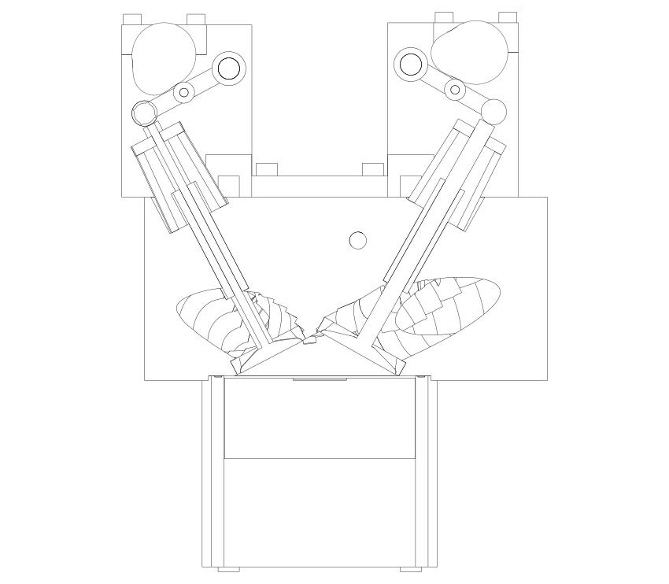
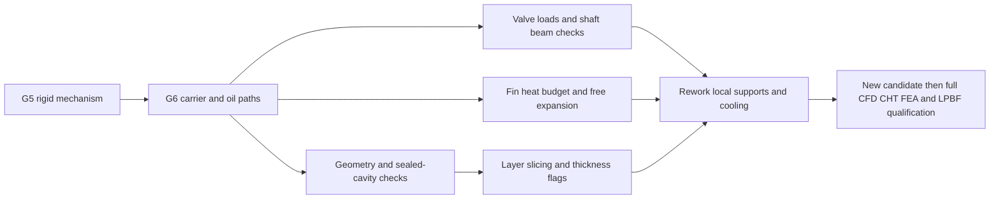

# M64 G6 — supported CAD, hot-load screens and virtual build preparation

**All three workstreams have executable results, but the candidate is rejected for
engine use and manufacturing.** Geometry checks are not structural or thermal
qualification. The 700 hp target is not demonstrated.

| Workstream | Actual result | Decision |
|---|---|---|
| Assembly CAD | 61 BRep-valid components; no detected carrier/component penetration; new oil drillings and returns | Geometric candidate only; no qualified drive, bearings or fasteners |
| Heat and mechanics | Heat budget fails; long rocker shafts fail the assumed deflection budget; several valve-contact scenarios fail | Rework cooling and shaft supports before expensive full-head CAE |
| Additive preparation | Real 60 µm layer slicing of four distinct geometries; closed-void checks; sampled thickness and support projection | No build file, process simulation or print authorization |

[Native audit and source fingerprints](../../twins/m64-cylinder-head/evidence/g6-carrier-thermal-am-20260925/native-audit.json)
· [AM audit](../../twins/m64-cylinder-head/evidence/g6-carrier-thermal-am-20260925/am-report.json)
· [Inputs](../../twins/m64-cylinder-head/source/fourvalve/g6-inputs.json).

## 1. Assembly and oil routing

G6 reuses the G5 mechanism without modifying its frozen source or evidence. It adds
two end frames, four removable cam-bearing caps and twelve bolt envelopes. Cam
caps split at the shaft centres; rocker shafts fit unsplit bores. The carrier
base bores are deliberately separate from the existing head-stud pattern.

The two frames have four accessible Ø4 mm pressure-feed drillings, each branched
to a cam journal and a rocker-shaft journal. Two oblique Ø8 mm returns connect to
the existing transverse head gallery. Native Boolean checks find no residual
solid in these returns and positive intersections with the gallery. A connected
drilling does **not** establish flow, lubrication, sealing or drainage performance.

The modified head stays one solid and retains the previous outer bounding box.
Its closed chamber volume remains 86.519086 cm³, giving 7.935397:1. This is still
below the prior 8–9 target. The head remains a synthetic candidate with unverified
M64 mounting interfaces, not a dimensionally certified reconstruction.

The moving valve/rocker envelopes remain at least 3.40625 mm away from the end
frames in the y direction throughout the rigid mechanism cycle. Cam lobes also
stay between the frames; the cylindrical journal volume is rotation-invariant.
This axial separation is distinct from a flexible multibody collision analysis.



The section passes through the positive-y intake valve. The rear carrier is
projected behind it; the drawing is not a photo, stress map or released product.
Full STEP assembly and individual native solids are generated under
`work/m64-g6-delivery/`, outside Git. No raw scan is redistributed.

Missing assembly details remain explicit: chain/gearing and rotation directions,
axial shaft retention, selected bearings, thread engagement/preload, cover,
seals and external oil lines. Bolt cylinders are packaging envelopes, not threads.

## 2. Calculated failures and material direction

### Heat budget

The target is interpreted as **700 mechanical hp total**, or 522.0 kW brake power.
Nine hypothetical combinations use brake efficiency 0.28/0.34/0.40 and a fuel-heat
fraction reaching the heads of 0.08/0.12/0.16. They imply **17.4–49.7 kW per head**.
These are independent sensitivity cases, not measured engine heat rejection.

The current ten fins and their two supporting side walls are screened at a
250 °C head-temperature ceiling, 40 °C inlet air, h = 80/160/300 W/m²K, and
constant k = 100/150/187 W/mK. That ceiling is not a material allowable.
The [MIT fin equation](https://web.mit.edu/16.unified/www/SPRING/propulsion/notes/node128.html)
is checked independently with cell-centred finite volumes at 8/16/32 cells,
including an energy-balance check. Both methods solve the same reduced model,
not the actual 3D head temperature field.

At the most favourable listed conditions, air plus an optimistic fully flooded
oil-gallery calculation rejects about **5.04 kW**, leaving **12.36 kW short** even
against the lowest hypothetical duty. The gallery contributes only 0.41–0.44 kW
for assumed oil flows of 0.5–2 L/min. A gravity return is not a flooded cooling
channel: those oil calculations are not credited as demonstrated cooling.

A comparison with **34 fins, 2 mm thick, 3.8 mm pitch**, inside the same head
bounding box, raises calculated air rejection to 12.27 kW at unchanged h and k.
It still misses the lowest duty even with the gallery contribution. This variant
is not applied to the CAD: unchanged h is particularly optimistic as fin spacing
shrinks, and no fan/duct pressure-loss calculation supports it.

### Valve contact and shafts

The existing GSC5092 catalogue curve is reused, not a new qualified spring choice.
The [supplier reference](https://www.power-division.com/gsc-power-division-conical-spring-set-with-titanium-retainer-and-chromoly-seat-for-the-porsche-991-992-gt3-and-gt3-cup.html)
is not evidence of M64 fitment. Spring dimensions, hot properties and masses
remain unqualified; the previously recorded curve is retained with its provenance.

72 cases combine intake/exhaust, 6,000/7,000/8,000 rpm, effective valve masses
0.09/0.13/0.18 kg, spring-force factors 1.0/0.8 and adverse opening gas forces
0/200 N. **26 cases require negative forced-lift contact force**, flagging contact
loss. The weakened-spring, 0.18 kg, 8,000 rpm 1-DOF model gives approximately
6.61 mm intake and 5.20 mm exhaust separation. Three time steps are retained;
these are assumed-system results, not measured valve float or a hot engine test.

A triangle-inequality rocker-reaction bound loads the Ø10 mm shafts between
supports 110 mm apart. Closed-form beam and independent beam-element stiffness
solutions agree, but their linear-elastic centre-deflection bounds are
**1.05–3.53 mm**, above the explicit **0.04 mm design-screen budget**. That budget
is not a Porsche tolerance. These are not actual deflections after yielding.
Meeting it by diameter alone would require roughly Ø22.6–30.6 mm under those
bounds, which cannot fit the existing Ø16 mm rocker bosses. Intermediate/local
supports and the mechanism loading must be redesigned; enlarging the shaft alone
is not a buildable fix. No yield, Hertz, fatigue or carrier-stiffness pass is claimed.

### Material and expansion

CP1 is retained as a **study candidate**, not a selected production alloy.
The [Constellium sheet](https://assets.foleon.com/eu-central-1/de-uploads-7e3kk3/41170/product_sheet_aheadd_cp1_nov_2021docx.e81a7d073ebf.pdf)
reports conductivity of 182–189 W/mK across heat-treatment durations; it does not
provide a qualified k(T) law for this head. The [EOS CP1 process sheet](https://www.eos.info/metal-solutions/data-sheets/aluminium/pds-eos-aluminium-constellium-cp1-eos-m-290-60um)
lists interval expansion coefficients and room-temperature tensile properties,
not a complete hot-fatigue/creep card. AlSi10Mg remains a comparison route;
[EOS data](https://www.eos.info/metal-solutions/data-sheets/all-processes-and-materials?id=eos-aluminium-alsi10mg)
must not be mixed across heat treatments or treated as hot allowables.

The existing free-expansion helper is applied to the actual candidate insert
diameters. Separate EOS temperature endpoints and assumed insert coefficients
are retained without interpolation or cross-source merging. The candidate
0.060 mm cold guide interference can fall to **0.004205 mm** in the listed cases.
Positive free interference does not prove retention. Seat interference remains
unselected; no material is qualified through these calculations.

## 3. Virtual build preparation

The machine envelope is [EOS M 290](https://www.eos.info/metal-solutions/metal-printers/eos-m-290),
250 × 250 × 325 mm, with 60 µm layers as a geometric CP1 study assumption. Bare-part
fit excludes real support, platform and recoater margins. Six orientations are
compared; minimum downward projected area selects a candidate, not an optimum build.

| Distinct geometry | Layers actually sliced | Support-column proxy | Samples flagged below 1.5 mm |
|---|---:|---:|---:|
| Head | 3,163 | 195.17 cm³ | 2.05% |
| One end frame | 3,007 | 5.20 cm³ | 0.90% |
| Intake cap | 637 | 5.94 cm³ | 1.55% |
| Exhaust cap | 637 | 5.94 cm³ | 1.55% |

Each thickness screen uses 2,000 deterministic area-weighted face-centre probes.
These percentages are **sample flags, not certified thin-wall area fractions**.
Sharp bore/end-face edges can affect the maximum-sphere metric; flagged regions
must be localized and checked in native geometry before changing walls blindly.
The caps' nominal bolt-edge ligament is 2.25 mm, illustrating why a reported
submillimetre sphere sample is not itself a complete wall definition.

Closed cavities are checked by connected components of the **native BRep exterior
complement**, not by filling voxels first. A unit counterexample retains a sealed
64 mm³ cavity and then confirms its removal when drilled open. No closed void is
found in the four tested geometries. That does not validate powder transport,
cleanliness or removal of supports inside channels.

The STEP is nominal, with **no machining stock embodied**. Preparation must still
specify datum faces, stock on the deck/cap joints, line-bored journals after cap
assembly, drilled/tapped fasteners, reamed insert housings, surface finish and
pressure/leak inspection. Supplier allowances, support topology and tool access
must be incorporated before a build. AdditiveFOAM, residual stress and build
distortion were **not** run for G6; their material/process inputs are not qualified.

## Replay and acceptance boundaries

```sh
uv run --python 3.12 --no-project --with cadquery==2.6.1 python \
  twins/m64-cylinder-head/source/fourvalve/audit_g6.py work/m64-g6-replay
uv run --python 3.12 --no-project --with trimesh==5.1.0 --with scipy==1.18.1 \
  --with rtree==1.4.1 --with shapely==2.1.2 --with networkx==3.7 \
  --with pillow==12.3.0 --with matplotlib==3.11.2 --with numpy==2.5.3 python \
  twins/m64-cylinder-head/source/fourvalve/screen_g6_am.py \
  work/m64-g6-replay work/m64-g6-am-replay
uv run --python 3.12 --no-project --with cadquery==2.6.1 python \
  tests/test_m64_g6_carrier_screens.py -v
make check
```

The native run used CadQuery 2.6.1. Six targeted tests pass without skips in that
environment. CAD output hashes identify this run; STEP timestamps need not be
byte-identical on replay. Large native files stay outside Git; aggregates, layer
metrics, the candidate section and source fingerprints are published.



No Vast instance was rented. No OpenFOAM, Omniverse, AdditiveFOAM or full-head FEA
result is claimed by this G6 receipt. **Printing and engine start remain blocked.**
