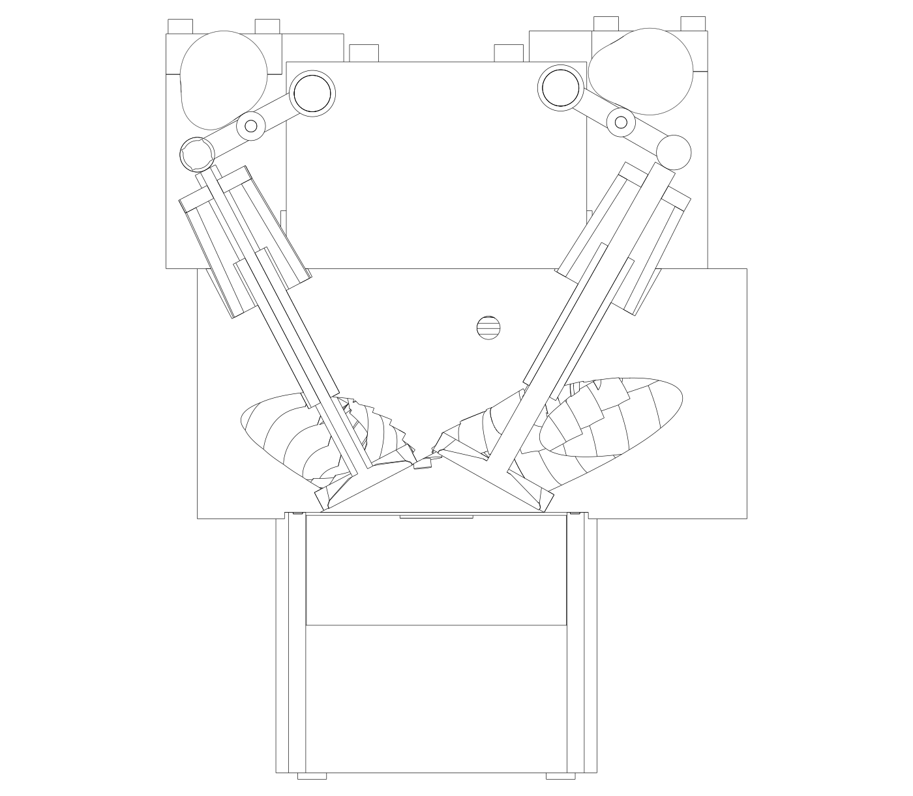
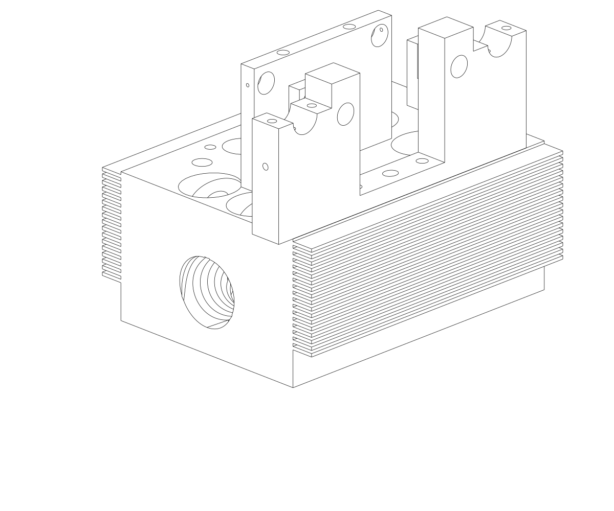
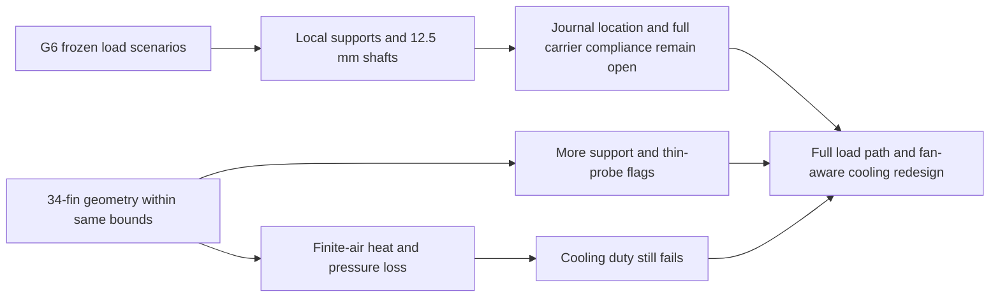

# M64 G7 — local supports and finite-air cooling

**G7 improves the shaft-only bending screen, but does not pass assembly motion,
cooling or manufacturing gates.** This is a separate executable candidate, not
an engine-ready head. [G6](M64_G6_CARRIER_THERMAL_AM_20260925.md) remains unchanged.

## Changes and checks

- A central diaphragm fixed to the head by two bolt envelopes and four local
  journal ribs joined to the end carriers replace the long unsupported shaft
  bays. The outer support centres are 38.59375 mm (intake) and 35.09375 mm
  (exhaust) from the centre plane, instead of relying solely on the ±55 mm ends.
- Rocker shafts increase from Ø10 to Ø12.5 mm. The unchanged Ø16 mm rocker bosses
  retain a **1.7 mm nominal radial ligament** after the model's bore clearance.
  This is not a strength or bearing-fit qualification.
- Accessible pressure-feed drillings reach the additional journals. Pumps,
  restrictors, connections, seals, thread engagement and hot lubrication remain
  undefined. The central mounting bolts pass through the diaphragm; they are
  envelopes without a specified grade, preload or head-thread qualification.
- The head has 34 fins, 2 mm thick at 3.8 mm pitch, rather than ten 3 mm fins.
  The **head's external bounding box is unchanged from G6**, measured on exact
  BRep geometry independently of cached display/STL tessellation. These are
  still synthetic dimensions, not certified M64 interfaces or OEM dimensions.

The native audit has **64 valid component shapes**, no new-component solid
penetrations, and no support/rocker penetration at 24 crank samples spaced
30° apart. Sampling is not a continuous or flexible mechanism qualification.
The head stays one solid. Its volume increases from 1,680,783 to 1,796,171 mm³
(about 6.9%); this is not a weight reduction. The connected chamber and
compression estimate remain 86.519086 cm³ and 7.935397:1, below the prior 8–9 target.



The section cuts at the positive-y intake valve and projects components behind
it. Full native geometry is generated locally, not redistributed as a print file.



This second view hides the valvetrain, fasteners and opposite end carrier to show
the new support geometry and fin spacing. It is not the complete assembly.

## Mechanical result: shaft bending is only one term

The same 72 G6 spring, gas-force, effective-mass and speed scenarios are reused,
with their source fingerprints checked before execution. Effective mass is still
assumed, not re-derived from this modified rocker CAD. Each local shaft bay is
idealized as simply supported with released end rotations. This is not the
continuous multi-bearing shaft or a compliant carrier model.
Shaft modulus remains the G6 assumption of 200 GPa, not a qualified hot material law.

Closed-form bending and an independently assembled beam stiffness matrix agree
at the load position. Calculated shaft-only displacement is **0.00814–0.03793 mm**,
below the assumed 0.04 mm screen in all 72 cases. G6's centre-deflection bound was
1.05–3.53 mm; the locations and support model differ, so these are not measured
engine deflections or a direct stiffness certification.

**The assembly gate still fails.** The unselected radial journal clearance is
itself 0.04 mm. A clearance-plus-shaft displacement screen reaches **0.07793 mm**,
before carrier/head compliance, temperature or wear. Clamping or otherwise
locating the stationary rocker shafts, choosing fits and calculating the complete
load path are required. The 26 G6 forced-lift contact-loss cases also remain;
support changes do not fix spring/valve dynamics. No yield or fatigue allowable
has been assigned.

## Cooling result: air heating and pressure loss cannot be ignored

The existing F39 Gnielinski/Darcy implementation is reused, **not** its old
provisional material law or scan-based area scaling. Channel area and length
come from this fin layout. Correlation context: [COMSOL pipe heat-transfer
theory](https://doc.comsol.com/6.3/doc/com.comsol.help.pipe/pipe_ug_heattransfer.06.17.html)
and [F-Chart turbulent pipe-flow documentation](https://fchartsoftware.com/ees/heat_transfer_library/internal_flow/hs1022.htm).
This hydraulic-diameter analogy assumes smooth straight rectangular channels
with a sealed outer shroud. The shroud/plenum is **not** present or verified in CAD.

Constant air properties, minor-loss coefficient 2, fan efficiency 50% and
material conductivity 100/150/187 W/mK are declared hypotheses. Prandtl number
is derived consistently from viscosity, conductivity and heat capacity.
The sweep rejects Re outside 3,000–5,000,000, inlet Mach ≥0.3, or length/Dh <10.
This is not a compressible-flow validation: air heating changes density, and
the higher pressure-drop cases need a coupled variable-property flow solution.

Only internal channel walls receive heat-transfer credit. An isothermal fin
root at the **assumed 250 °C ceiling** heats 40 °C inlet air according to
`Q = m_dot cp (T_root - T_in) [1 - exp(-UA/(m_dot cp))]`.
An independent implicit-upwind air balance at 8/32/128 cells converges to this
solution. The two methods verify the reduced equation, not physical correlation.

At the same hypothetical **0.05 kg/s per head** and **k = 187 W/mK**:

| Same reduced channel model | G6 fins | G7 fins |
|---|---:|---:|
| Heat rejection | 1.46 kW | 6.17 kW |
| Pressure drop required | 2.55 kPa | 6.57 kPa |
| Fan shaft power allocated per head, assumed 50% efficiency | 226 W | 583 W |
| Outlet air temperature | 69.0 °C | 162.6 °C |

These are imposed-flow comparisons, **not operating points of a selected fan**.
They are not directly comparable to the previous G6 constant-inlet, all-sidewall
capacity figure. G7's highest retained case reaches 8.61 kW at 0.075 kg/s/head,
but requires 14.04 kPa; the 0.1 kg/s case is excluded by the inlet-Mach gate.
All retained cases miss even the lowest G6 hypothetical duty, **17.4 kW/head**.

At 0.05 kg/s, filling the 11.23 kW deficit with oil warming by 30 K would require
at least **13.2 L/min/head**, or about **79 L/min for six heads**, using assumed
850 kg/m³ and 2,000 J/kgK. This is an energy-only lower bound, not a feasible
channel, pump or cooler specification. No extra cooling oil circuit is selected
on the strength of this calculation. CP1 remains a study material, unqualified
at temperature; see the source-separated material limits in the G6 report.

## Additive preparation: a thermal change has manufacturing costs

The unchanged geometric slicing code is rerun on the actual G7 head, central
diaphragm and positive-y end carrier. The negative carrier and modified rocker
bores are **not** covered by this three-geometry AM receipt. EOS M 290 envelope,
60 µm layers and the same six-orientation selector are retained.

| Geometry | Layers sliced | Vertical-column support proxy | Probes flagged below 1.5 mm |
|---|---:|---:|---:|
| Head | 3,256 | 325.37 cm³ | 5.15% |
| Central diaphragm | 2,065 | 2.01 cm³ | 1.65% |
| Positive end carrier | 3,007 | 9.17 cm³ | 1.00% |

The head's support proxy worsens from 195.17 cm³ in G6. Its thin-probe fraction
also increases; these are 2,000 deterministic sphere probes per mesh, **not
certified wall area fractions or a proven minimum thickness**. Fin edges require
local native checks. No closed native cavity is found in the three checked
solids, which does not prove powder evacuation or support removability.
No melt-pool, residual-stress, distortion or supplier build simulation was run.
Machining stock is still absent. G7 therefore does not select a production fin
layout or authorize printing.

## Replay, evidence and next gate

[Native audit](../../twins/m64-cylinder-head/evidence/g7-local-supports-cooling-20260925/native-audit.json)
· [AM audit](../../twins/m64-cylinder-head/evidence/g7-local-supports-cooling-20260925/am-report.json)
· [Executable study](../../twins/m64-cylinder-head/source/fourvalve/g7.py).

```sh
uv run --python 3.12 --no-project --with cadquery==2.6.1 python \
  twins/m64-cylinder-head/source/fourvalve/g7.py work/m64-g7-replay
uv run --python 3.12 --no-project --with cadquery==2.6.1 python \
  tests/test_m64_g7_local_supports_cooling.py -v
```

For layer replay, use the pinned environment and `screen_g6_am.py` command in
the [G6 report](M64_G6_CARRIER_THERMAL_AM_20260925.md), substituting the G7 native
output and a fresh AM output directory. Four focused tests cover beam agreement,
air energy/convergence, explicit failed gates, native collisions and bounds
independent of tessellation. Receipts include source/artifact hashes.



The next useful work is a **located/clamped shaft and complete carrier/head
stiffness calculation**, plus a **fan/plenum/fin trade study at common available
pressure**, followed by local AM defect checks. No Vast machine was rented for
this iteration. Manufacturing and engine start remain blocked.
