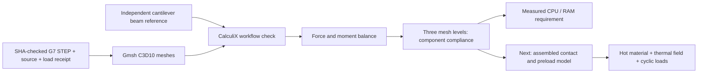

# M64 G8 — isolated carrier compliance and resource pilot

## Scope

This is a native x86 Gmsh/CalculiX calculation of the **unchanged G7 central
diaphragm and positive-side carrier base**, not a new head shape. It tests the
numerical workflow and sizes the next computation. It does not qualify a
material, assembled journal motion, fatigue, cooling, printing or engine use.

The [G7 report](M64_G7_LOCAL_SUPPORTS_COOLING_20260925.md) remains the design
baseline. Its unresolved journal clearance, forced valve contact losses and
cooling deficit are not cleared by this run.

**Outcome: a useful partial benchmark, not a completed G8 campaign.** Nine
direct static solves completed (one witness, six central-diaphragm cases,
two coarse carrier cases). The carrier's 2 mm direct solve hit the imposed
6 GiB memory limit. A lower-memory iterative retry was rejected by numerical
checks. **Vast expenditure for this iteration: USD 0.**

Evidence: [direct partial receipt](../../twins/m64-cylinder-head/evidence/g8-carrier-pilot-20260925/direct.partial.json),
[iterative rejection](../../twins/m64-cylinder-head/evidence/g8-carrier-pilot-20260925/iterative-retry.json),
[iterative solver log](../../twins/m64-cylinder-head/evidence/g8-carrier-pilot-20260925/iterative-x.log),
[observed Docker OOM events](../../twins/m64-cylinder-head/evidence/g8-carrier-pilot-20260925/docker-events.txt).



## Model and deliberate limits

- Units: mm, N, MPa. Generic isotropic **E = 70,000 MPa, Poisson ratio 0.33**;
  no selected alloy, temperature, yield allowable or safety factor.
- Every node on each component's actual bottom mounting face is fixed. This
  omits head, bolt and joint compliance and separation. It is an optimistic
  mounting idealization, not a representation of a selected bolted connection.
- Loads use maxima of the G7 released-shaft-bay reactions, independently per
  intake/exhaust side. The centre receives two bay reactions per side; each
  outer local rib receives one. These are hypothetical load envelopes, **not
  phase-resolved concurrent engine forces or a proven worst-case combination**.
- Both side maxima are applied simultaneously in two separate directions,
  global +x and -z. Full cylindrical bearing surfaces receive constant vector
  traction, with consistent quadratic-triangle nodal loading. This is a linear
  compliance probe, **not bearing pressure/contact or a rotating oil film**.
- The carrier base run loads its two new local ribs only. The separate end-frame
  rocker journals and cam journals are not loaded; caps, shafts, head and bolts
  are not assembled into this pilot. The negative-side carrier is not solved.
- Straight-sided quadratic tetrahedra use the existing repository convention
  swapping Gmsh's last two tetra10 nodes for CalculiX. Faceted cylindrical
  geometry is refined with the mesh; no curved-element accuracy is claimed.
- Requested sizes are 3, 2 and 1.5 mm, not a guarantee that all local edges have
  that length. All integration-point Jacobians must be finite and positive.
- Surface selection checks cylinder radius, local-rib extent and area, and
  rejects missing loads or overlap with fixed nodes. Applied force and moment
  must balance support reactions within 1e-4 (moment normalized by F × 100 mm).
- Reported stress p95 is an **unweighted integration-point percentile**. It is
  mesh-density-dependent, not a volume percentile, allowable or fatigue metric.
  Maximum stresses at sharp edges and clamps may not converge.

The witness is a 10 × 10 × 40 mm cantilever with a 1,000 N transverse end
traction. Its average tip displacement is compared against
`F L³/(3 E I) + F L/(κ G A)`, with `I = 10⁴/12 mm⁴`, `κ = 5/6` and
`G = E/[2(1+ν)]`. The 5% witness tolerance checks the workflow, not the head.
Three-dimensional clamp/end effects prevent treating this beam formula as an
exact solution of the solid problem.

## Results and decision

The witness gives **0.375264 mm**, 2.263% below the beam-plus-shear reference.
All completed direct solves satisfy force balance with relative errors at most
1.13e-7 and normalized moment errors at most 1.46e-8.

| Component / nominal mesh | Nodes / C3D10 elements | Largest journal mean displacement, +x | Largest journal mean displacement, -z |
|---|---:|---:|---:|
| Central diaphragm / 3 mm | 24,246 / 13,504 | 0.075554 mm | 0.028763 mm |
| Central diaphragm / 2 mm | 65,054 / 39,058 | 0.076657 mm | 0.029113 mm |
| Central diaphragm / 1.5 mm | 137,975 / 86,486 | 0.077120 mm | 0.029325 mm |
| Carrier base / 3 mm only | 59,333 / 34,657 | 0.160022 mm | 0.097644 mm |

The table uses the norm of each surface-traction-weighted mean displacement,
then the larger of the two journal values. It is not a qualified shaft-axis
motion or a maximum nodal displacement. Central loads are 6,881 N intake and
6,702 N exhaust; outer-rib loads are 4,370 N and 3,567 N respectively.

Between the central 2 and 1.5 mm meshes, the largest relative **vector** change
`norm(u_fine-u_medium)/norm(u_fine)` is 0.602% for +x and 0.762% for -z.
Stress p95 changes by 1.91% and 2.53%, respectively. This is useful mesh
stability evidence for these observables, not a full discretization-error bound.
The fine central maximum nodal displacement is 0.09758 mm under +x.

The central lateral journal motion already exceeds G7's **0.04 mm working
screen** under these assumptions, before adding shaft, joint or head
compliance and clearance. The coarse outer carrier is more flexible still,
but lacks a mesh-convergence result. Its coarse +x peak stress is 518 MPa,
versus an integration-point p95 of 48.8 MPa: neither the sharp-edge peak nor
the validity of linear elasticity is qualified, and the percentile must not
be used to conceal the peak. **Do not add these isolated maxima into
a claimed engine result, or select an alloy from the stress numbers.** Review
load paths and assembled stiffness next. The head's external shape is unchanged.

### Resource failure and rejected alternative

Kali has 12 logical CPUs and about 15 GiB host RAM. Other services were left
running; this job was limited to four CPUs and 6 GiB with no extra swap. The
fine central direct solves took about **113 seconds each**. The carrier's
2 mm mesh reached **162,415 nodes** before its first solve was killed. Docker
recorded `oom`, followed by `die` and `destroy`; this is not a convergence
failure, nor proof that the whole engine calculation needs a particular GPU.

The [retry adapter](../../twins/m64-cylinder-head/source/fourvalve/g8_iterative_retry.py)
changes **only** `*STATIC` to `*STATIC,SOLVER=ITERATIVE CHOLESKY` in the existing
x-load deck. On the already-solved 3 mm mesh it took 14.91 seconds and peaked
at 304.43 MiB child RSS / 347.50 MiB container memory. However:

- its force-balance relative error is **0.001483**, above the unchanged 1e-4
  gate;
- its maximum nodal displacement-vector difference from the direct solution,
  normalized by the direct maximum displacement, is **4.291%**, above 1e-4;
- the native solver says it converged, but these independent checks reject it.
  The adapter exits 1, records `retry_accepted: false`, and does **not** attempt
  the larger deck. The acceptance tolerances were not relaxed.

This is an algebraic-solver comparison on the **same** discretization, not an
independent physical model. The initial exploratory retry gave the same
rejection; the published rerun records it explicitly. No 2 mm or 1.5 mm carrier
result is accepted, and no full campaign completion marker exists.

**Next resource trial:** a CPU machine with **16 logical CPUs and 32 GiB RAM**
is a reasonable initial allocation to resume the direct carrier refinement,
not a proven requirement or completion guarantee. No GPU is needed for this
tested solver path. The full assembled contact model and CHT need their own
memory pilot; do not extrapolate their cost from an isolated component.
The two concrete next actions are completing the direct carrier refinement
and replacing fixed feet with the head/bolts/preload/contact assembly.

## Reproduction and resource bounds

Run [g8_pilot.py](../../twins/m64-cylinder-head/source/fourvalve/g8_pilot.py) in
the already cached local image with ID
`sha256:22e5ea95954ede922b9666b74e0db1c7fdc34667abc2254ab37002ed4d90996b`.
This is a **local image identity**, not a verified registry publication.
It supplies Gmsh 4.12.1, NumPy 1.26.4 and CalculiX 2.21. The package returns
201 for `ccx -v` despite printing its version; real solver runs must exit zero.

Use a dedicated job directory on a native Linux filesystem. Include the G7
receipt, every source it fingerprints, the referenced valvetrain module, the
F37 parser helper, G8 source, and the two private STEP exports. Do not upload
raw scans or secret files. The output directory must not exist yet.

```sh
docker run --rm --network none --cpus 4 --memory 6g --memory-swap 6g \
  --pids-limit 256 --user 1000:1000 --entrypoint /usr/bin/timeout \
  -v "$PWD:/repo" -w /repo \
  sha256:22e5ea95954ede922b9666b74e0db1c7fdc34667abc2254ab37002ed4d90996b \
  --signal=TERM --kill-after=30s 2400s /usr/bin/python3 \
  twins/m64-cylinder-head/source/fourvalve/g8_pilot.py \
  --cad work/m64-g7-final --output work/g8-pilot
```

Each CalculiX subprocess also has a 600-second timeout. There is no GPU,
network access or additional swap allowance in this container. Existing host
services are left running. `report.partial.json` is explicitly incomplete;
only a completed `report.json` records all meshes and resource measurements.
This run intentionally publishes `direct.partial.json`, because that completion
file was never reached. The rejected iterative retry is a separate receipt,
not a replacement for the missing direct results.
Large private meshes/decks/solver outputs stay in the job directories; their
hashes are recorded rather than committing derived geometry.

To reproduce the bounded alternative on a clean copy of the direct job output:

```sh
python3 twins/m64-cylinder-head/source/fourvalve/g8_iterative_retry.py work/g8-pilot
```

Use the same capped offline container as above. The adapter preserves original
decks/results, refuses to overwrite retry files, and only advances to the
2 mm deck if the coarse direct/iterative comparison and equilibrium pass.
The additional valvetrain dependency used on host and container was identical:
`twins/m64-cylinder-head/source/valvetrain/valvetrain.py`, SHA-256
`793d4d7b33ccbe1bac31f9ebb6c99ed4f4ebc201b4e4f91f7df0584933730a90`.

## Numerical references

Repository verification: `make check` passed (3,056 discovered tests, 129
skipped), including documentation/index checks. The two focused G8 tests pass
with the published receipts present. They verify source/log fingerprints,
the completed direct results and the explicit iterative rejection; they are
software/data-integrity checks, not physical qualification.

- [Gmsh manual](https://gmsh.info/doc/texinfo/): quadratic tetrahedra, node
  ordering, integration points and Jacobian API. Actual runtime: 4.12.1.
- [CalculiX 2.21 manual](https://www.dhondt.de/ccx_2.21.pdf): C3D10, static
  linear elasticity and nodal RF output. RF is requested only on fixed nodes
  without applied nodal loads, avoiding confusion between reactions and
  applied-plus-reaction output.

No numerical verification in this report replaces hot coupons, dimensional
inspection, joint characterization or professionally reviewed physical tests.
