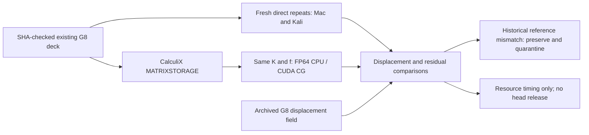

# M64 G8 — CPU/GPU matrix benchmark and reference audit

**Result:** RTX 4090 resolves this same sparse linear system **19.70× faster**
than single-thread CPU CG, or **15.72× including solver setup**, with the
equation residual and fresh direct-comparison gates satisfied. This does not
clear the failed historical G8 reference or validate the cylinder head.

## Scope and decision

The user's resource-trial limit is **USD 5 total**. This is a linear-solver
benchmark on the unchanged **coarse G7 positive carrier, +x load** from G8,
not a GPU implementation of the full CalculiX pipeline, new CAD, assembled
head analysis, thermal simulation, fatigue test or manufacturing release.

The first check revealed a non-reproducible historical reference. Its input
and output fingerprints match the original G8 receipt, but four fresh
CalculiX solves disagree with that archived displacement field. The archived
result is quarantined as a numerical reference; its provenance is preserved.
The cause of the historical field discrepancy has **not** been established.
It must not be attributed to thread count, ARM/x86 or SPOOLES without evidence.

The GPU resource experiment uses the freshly repeated solutions only as
additional comparisons. It does **not** clear the original G8 gate:
`accepted: false` is intentionally retained wherever the historical reference
fails. A hardware-timing observation is not acceptance of the head model.



## What actually ran locally

- The original deck is unchanged: 59,333 nodes, 34,657 C3D10 elements;
  2,126 fixed nodes, **171,621 free translations**, 12,744,767 entries in
  the reconstructed symmetric stiffness matrix.
- `*FREQUENCY,SOLVER=MATRIXSTORAGE` exports stiffness and its explicit
  `node.direction` mapping. The original fixed support is retained. Density
  2.7e-9 tonne/mm3 is added only because this exporter also builds a mass
  matrix; the mass matrix is unused. No preload or perturbation is included.
- Matrix exports on ARM64 and x86 have identical DOF maps. Their relative
  Frobenius difference is **3.35e-14**: their differing file hashes do not
  indicate a practically different stiffness system.
- A separate SciPy FP64 conjugate-gradient solve, with Jacobi
  preconditioning, took **45.58 s** on the M1 Max. It used 4,674 iterations;
  the recomputed relative residual `norm(Ku-f)/norm(f)` is **9.86e-11**.
  This time excludes CalculiX assembly and matrix parsing; it is not a
  full-analysis runtime or a GPU speedup.
- Fresh direct repeats: ARM64/four threads; native x86/one thread;
  native x86/four threads; native x86/four threads launched through Python
  with the same subprocess/environment pattern as G8. The printed
  displacement vectors agree exactly across those four runs. Different DAT
  hashes include small differences in stress output.
- The independent CG solution differs from those repeats by **1.93e-7**
  relative maximum nodal displacement, versus **0.0428931** against the
  archived G8 DAT. The unchanged gate is 1e-4.

The seven-significant-digit DAT format must not be treated as a full-precision
solution vector. Its fresh-run matrix residual is 0.00142, below a conservative
0.0332 rounding-propagation bound. The archived DAT residual is **30.69**,
far above its 0.0331 rounding bound. Output rounding does not explain the
archived discrepancy. The full-precision CG residual is checked independently.

| Observation | Archived carrier +x | Four fresh direct runs |
|---|---:|---:|
| Maximum displacement, mm | 0.259648 | 0.260482 |
| Unweighted integration-point stress p95, MPa | 48.775 | 46.561 |
| Maximum von Mises stress, MPa | 518.083 | 359.214 |
| Relative total-force imbalance | 9.29e-9 | 9.29e-9 |

The stress difference is a reason to quarantine, **not** a demonstrated design
improvement. Both models still use generic linear elasticity and fixed feet.
Global force/moment balance can pass while a local displacement field fails
the assembled equations. Do not use either stress maximum for material
selection or fatigue qualification. Other historical G8 cases remain unaudited.

## Reproduction

The [adapter](../../twins/m64-cylinder-head/source/fourvalve/g8_matrix_benchmark.py)
reuses G8 deck/vector parsers and the F37 hashing helper. It verifies original
deck/DAT hashes before export, rejects missing/duplicate DOFs, invalid matrix
triangles and nonfinite values, and never changes the frozen G8 sources.

```sh
python g8_matrix_benchmark.py PRIVATE_CASE NEW_MATRIX_DIRECTORY
# Inside the existing qualified CAE image, in NEW_MATRIX_DIRECTORY:
OMP_NUM_THREADS=4 CCX_NPROC_STIFFNESS=4 timeout 180 ccx matrix
python g8_matrix_benchmark.py PRIVATE_CASE MATRIX_DIRECTORY \
  --backend cpu --output NEW_CPU_RECEIPT.json --comparison-dat FRESH_DIRECT.dat
```

CPU packages tested here: NumPy 2.2.6 / SciPy 1.14.1. SciPy 1.15.3's local
macOS/Python 3.10 wheel failed to load a compiled extension; this is recorded
as an environment failure, not a numerical result. CUDA uses pinned CuPy
13.6.0 and its `tol` API, not SciPy's `rtol` keyword. The bounded
[remote job](../../twins/m64-cylinder-head/source/fourvalve/g8_gpu_job.sh)
performs three CPU and three CUDA trials on the same host, with GPU telemetry.
Its bootstrap/runtime needs the approved rental lifecycle guard; this script
alone does **not** stop provider billing.

Only same-host CPU/CUDA trials are used for any speed ratio. The Mac figure
is contextual, not a substitute CPU baseline. CPU CG is single-threaded;
this is not a comparison against an optimized multithreaded direct solver.
Solver timing excludes file parsing, stiffness assembly, postprocessing,
network transfer and bootstrap. Cold CUDA setup and cached-kernel trials
must be distinguished; no full-CAD/FEA-pipeline speedup is inferred.

The [CPU audit receipt](../../twins/m64-cylinder-head/evidence/g8-matrix-benchmark-20260925/cpu-reference-audit.json)
contains the source, deck, matrices and output fingerprints. Private decks,
matrices and DAT outputs remain outside Git.

## Vast results and cleanup

All six [trial receipts](../../twins/m64-cylinder-head/evidence/g8-matrix-benchmark-20260925/vast-trials.json)
use the exact same matrix, DOF map, RHS derivation, FP64 precision, Jacobi
preconditioner, relative tolerance 1e-10 and 20,000-iteration cap. The CPU
is an AMD Ryzen 9 7945HX, with BLAS limited to one thread. GPU activity was
observed, not inferred from GPU availability: sampled utilization reached
90%, device memory 578 MiB and board power 252 W.

| Same-host trial | CPU solve, s | CUDA solve, s | CUDA setup + solve, s |
|---|---:|---:|---:|
| 1, cold CUDA process/cache | 28.630 | 1.779 | 2.747 |
| 2, cached kernels/new process | 28.691 | 1.454 | 1.823 |
| 3, cached kernels/new process | 28.639 | 1.447 | 1.815 |
| Median | **28.639** | **1.454** | **1.823** |

The CPU median including setup is 28.659 s. Iteration counts are 4,664 on
CPU and 4,661–4,666 on CUDA; floating-point reduction order is not identical.
All residuals are below 1.04e-10 and fresh-reference displacement errors
below 1.93e-7. Every trial still retains `accepted: false` against the
historical DAT. No new stress/reaction field is recovered by CG.

[Lifecycle evidence](../../twins/m64-cylinder-head/evidence/g8-matrix-benchmark-20260925/execution.json):
one successful rental, approved OpenBao wrapper, independent destroy guard
armed before creation, USD 3 internal cap within USD 5 authorized, 90-minute
maximum lifetime, 0.573 USD/h, planned ceiling including cleanup reserve
**USD 1.88**. An earlier offer was unavailable and rejected before a paid
creation. Input and collected result archive hashes match across hosts.
The instance was **destroyed**, provider and independent guard verified its
absence, and the inventory is empty. Outputs were collected before deletion.
The observed credit decrease is **USD 0.0513**, not a finalized itemized invoice.

The image's Python environment was isolated in a new venv. Pinned CUDA wheels
are from the 12.8 family, but the process reports CUDA runtime **12.9** with
driver 595.71.05; no fully locked CUDA runtime claim is made. Installation,
file transfer and parsing are not included in the solver speed ratios.

## Next engineering action

Use this tested GPU path for **linear-system acceleration experiments**.
Before refining the carrier or optimizing its dimensions, regenerate the G8
reference campaign in fresh directories and apply matrix residual checks,
cross-solver displacement comparison and existing force/moment gates. Preserve
the quarantined outputs and investigate their generation chain. Do not silently
substitute the new coarse result for the whole historical campaign. Only then
resume the finer meshes and assembled contact/preload model; heat, fatigue
and LPBF qualification remain separate unfinished work.

## Repository verification

`make check` passed: 3,059 discovered tests, 130 optional skips, all repository
checks and documentation links passing. Three focused benchmark/integrity
tests passed in the working numerical venv. The default Mac sparse SciPy
runtime is unavailable, so its optional numerical smoke is skipped there;
the stdlib evidence checks still run. Two then-present checks also passed
inside the rented host before the six trials.

## Primary technical sources

- [CalculiX matrix export implementation](https://github.com/Dhondtguido/CalculiX/blob/master/src/matrixstorage.c)
  — triangular sparse entries and explicit DOF map.
- [CalculiX frequency parser](https://github.com/Dhondtguido/CalculiX/blob/master/src/frequencys.f)
  — `MATRIXSTORAGE` procedure.
- [CuPy 13.6 CG implementation](https://github.com/cupy/cupy/blob/v13.6.0/cupyx/scipy/sparse/linalg/_iterative.py)
  — GPU sparse CG and stopping criterion.
- [PaStiX4CalculiX](https://github.com/Dhondtguido/PaStiX4CalculiX)
  — a possible later integrated GPU backend; not compiled or benchmarked here.
