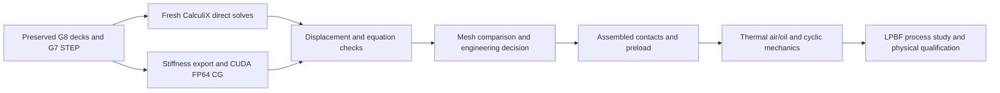

# M64 G9 — reference replay and finer carrier meshes

This report concerns **isolated, cold, linearly elastic components**, not a
complete cylinder head or an authorization to print or operate one. G7 CAD
and the original head envelope are unchanged. The G8 historical evidence is
preserved, including the quarantined carrier reference.

## Result and engineering decision

**All 13 algebraic cross-checks pass. The head is not qualified.** The finest
carrier has 351,392 nodes, 1,031,364 free translations and 82,037,014 sparse
stiffness entries. Across the campaign, CG equation residuals are at most
**1.76e-10**, and direct/CG nodal-vector differences at most **3.79e-7** of
maximum displacement. The previously memory-limited carrier cases now ran.

The [campaign receipt](../../twins/m64-cylinder-head/evidence/g9-reference-requalification-20260925/campaign.json)
and [mesh comparison](../../twins/m64-cylinder-head/evidence/g9-reference-requalification-20260925/mesh-summary.json)
separate numerical solution agreement, mesh stabilization and working motion:

| Fine-mesh component / load | Largest journal mean motion, mm | Medium-to-fine vector change | Stress p95 change | Selected observables stabilized | 0.04 mm working screen |
|---|---:|---:|---:|---|---|
| Central diaphragm / +x | 0.077120 | 0.602% | 1.905% | Pass | Fail |
| Central diaphragm / -z | 0.029325 | 0.762% | 2.534% | Pass | Pass |
| Outer carrier / +x | **0.168073** | **1.441%** | 2.585% | **Fail** | **Fail** |
| Outer carrier / -z | 0.099118 | 0.603% | 0.829% | Pass | Fail |

The carrier's lateral journal motion is **4.20 times** the unchanged G7
working allowance under this isolated fixed-foot model. Its maximum nodal
displacement is 0.273948 mm; this is a different observable, not the journal
motion used for that allowance. Lateral stress p95 is 40.107 MPa, while the
peak is **400.237 MPa**, up from 357.980 MPa on the medium mesh (10.56%
difference normalized by the fine value). Peak stress is not qualified;
the lower percentile must not hide it or serve as a material allowable.

**Do not treat these isolated results as assembled stiffness qualification or
a manufacturing release.** Next, model the complete load path, stationary-shaft
location, caps, fasteners and contacts; assess reinforcement inside the
retained envelope, then rerun mesh and hot-load checks. More GPU time alone
does not resolve the failed stiffness screen. No safety factor, yield reserve,
fatigue life, hot-material strength or 700 hp engine performance is established.

## Historical reference audit

All nine historical cases were replayed and checked against the matrix
solution. **Eight historical displacement fields agree**. Only the coarse
carrier's +x field still fails, by **4.2893%** of maximum displacement.
The -z field on the same carrier mesh agrees. This narrows the observed
anomaly to one archived field; it does not establish its generating cause.
No archived evidence or failed gate has been overwritten or relabelled.

## Method

The [campaign](../../twins/m64-cylinder-head/source/fourvalve/g9_reference_campaign.py)
replays all nine SHA-checked G8 input decks in new directories, then extends
the carrier to 2 and 1.5 mm meshes in both load directions: **13 cases**,
including the beam witness. The existing 2 mm carrier +x deck is reused; its
-z companion changes only the load direction. The 1.5 mm carrier is newly
meshed from the SHA-checked G7 STEP with Gmsh 4.12.1. This last mesh is not
asserted to be identical to an earlier mesh.

CalculiX 2.21 direct solves are checked against FP64 conjugate gradient on
the exported stiffness matrix using CUDA/CuPy 13.6.0. This is a second
**algebraic solution method on the same discretization and assembly**, not
an independently formulated FE model or physical validation. GPU CG does
not independently recover stresses or reactions; those remain CalculiX outputs.

Checks, fixed before running:

- complete node/support coverage and exact historical deck/DAT fingerprints;
- relative CG equation residual at most 1e-8;
- maximum nodal-vector difference divided by maximum reference displacement
  at most 1e-4;
- printed direct DAT residual below its seven-significant-digit rounding bound;
- force imbalance at most 1e-4 and moment imbalance divided by force times
  100 mm at most 1e-4;
- beam witness against bending-plus-shear displacement, within 5%.

Passing these gates does not imply mesh independence, correct boundary
conditions, material strength, fatigue life or manufacturing qualification.
The generic E = 70 GPa and Poisson ratio 0.33 remain sensitivity assumptions.
Fixed feet exclude the head, bolts, caps, contacts and preload.
Journal forces retain G7's hypothetical maximum-reaction envelope, not a
measured, phase-resolved engine cycle at 700 hp. No turbo combustion-pressure
field or cylinder-head thermal load is applied by this campaign.

The [mesh comparison](../../twins/m64-cylinder-head/source/fourvalve/g9_mesh_summary.py)
uses predeclared screening thresholds of 1% for medium-to-fine journal
displacement-vector change and 5% for integration-point stress p95 change.
It reports maximum stress changes separately and does not qualify a
sharp-edge peak or estimate a discretization-error bound. The original
G7 0.04 mm working motion screen is kept distinct from mesh stabilization.

## Computing and reproducibility

The paid instance is an NVIDIA A100-SXM4-40GB with 32 allocated logical CPUs
and 128,803 MB host RAM, at USD 0.668888889/hour including 100 GB disk.
The approved OpenBao wrapper created it only after the existing independent
destruction guard was armed. The run has a USD 4 cap, no requested recharge,
a three-hour maximum lifetime, and a planned ceiling of USD 3.03011 including
the guard's USD 1 cleanup reserve and declared transfer allocations.

The qualified PicoGK image is unchanged. CalculiX and its dynamic loader and
libraries were copied from the already-tested native x86 CAE image into a
private runtime bundle; a beam solve passed in the target image on Kali
before rental. Its archive SHA-256 is
`2052b67d2497ed65ef19243d27f126c4ffe9f8fad96eec0fad8f284630a17fab`.
The same binary is used, not a different distribution's solver package.

The first run stopped after eleven passing cases because the pip Gmsh wheel
needed `libXft.so.2`. This was an environment failure, not a failed FE result.
Debian `libxft2` was installed in the rented container, and Gmsh 4.12.1's
import was checked. Fresh setup needs both `libglu1-mesa` and `libxft2`.
The [bounded continuation](../../twins/m64-cylinder-head/source/fourvalve/g9_finish_carrier.py)
checks all eleven checkpoint artifact hashes and the unchanged G7 source/STEP
before creating a separate fine-mesh output directory. The original failure
log and partial receipt are retained; the original campaign source is unchanged.

The [job](../../twins/m64-cylinder-head/source/fourvalve/g9_gpu_job.sh) records
the Python packages and GPU activity. It has process timeouts but **does not
stop billing by itself**. Always arm the external guard before paid creation.
Raw geometry, matrices, full displacement fields and solver logs stay private.

The observed CPU is an Intel Xeon E5-2640 v3. Fine-carrier direct solves took
340.84 and 343.87 seconds; CUDA CG took 9.43 and 10.05 seconds **after assembly,
matrix export and parsing**. These are different solution methods/stages,
not an end-to-end hardware speedup. CuPy reports CUDA runtime 12.9 although
the separately installed CUDA-family wheel versions are 12.8-era pins; the
resolved environment and reported runtime are retained, not called fully locked.

[Execution and lifecycle evidence](../../twins/m64-cylinder-head/evidence/g9-reference-requalification-20260925/execution.json):
707 GPU samples reached 88% utilization and 2,443 MiB device memory. Both
private result archives (1.495 GB combined) were collected and their hashes
verified before deletion. They retain the numerical evidence and logs; unused
mass matrices, FRD and internal 12d files were excluded. The instance was
**destroyed**, the provider and independent guard verified absence, and the
inventory is empty. Observed credit decrease: **USD 0.3975**;
this is not a finalized itemized invoice. No machine is left billing for G9.

## Repository checks

`make check` passed: **3,063 discovered tests, 132 optional skips** and all
repository checks. Four focused G9 checks pass in the working SciPy 1.14.1
environment; three then-present checks also passed on the rental before the
continuation. The default Mac SciPy binary remains unavailable, so its two
optional numerical G9 tests skip; the stdlib receipt/mesh checks still run.
Focused checks and the documentation-link/index checks were rerun after the
final lifecycle metadata was added. All 511 Markdown files have valid local links.

## NVIDIA tools: actual scope

- **CUDA:** used for the cross-solver calculation, with observed GPU telemetry.
- **PhysicsNeMo:** not trained or claimed as a verifier here. A surrogate must
  first have a qualified simulation corpus and held-out error measurements.
  Repeating two component geometries on three meshes is not such a corpus.
- **Omniverse/SimReady:** separate scene/assembly inspection work, not performed
  by this mechanical campaign and not a substitute for thermal or fatigue CAE.
  An A100 calculation host is not being represented as an RTX rendering host.
- **PicoGK:** present in the qualified image; no new geometry is generated by
  PicoGK in this reference replay.

The NVIDIA catalog was checked. No new agent skill was installed. Existing
solver adapters were reused instead of adding a surrogate model before its
reference data are qualified. CuPy's pinned API is documented in its
[CG reference](https://docs.cupy.dev/en/v13.6.0/reference/generated/cupyx.scipy.sparse.linalg.cg.html).

## Remaining engineering gates

1. Use the fresh reference and mesh comparison to decide what can enter an
   assembled head/carrier/shaft/cap model. Resolve stationary-shaft location,
   bearing fits, bolt preload and contact, not just component thickness.
2. Couple actual air/oil flow and thermal fields to mechanical loads. G7's
   reduced cooling model still misses the hypothetical duty; buying a GPU
   does not correct that geometry or supply a measured fan operating point.
3. Study hot material properties, load cycles, valve dynamics and fatigue;
   then LPBF orientation, supports, powder removal, distortion and machining.
4. Manufacturing/operation release still requires reviewed interfaces,
   qualified material/process, inspection and physical test correlation.
   The original external scan does not observe hidden internal geometry.
