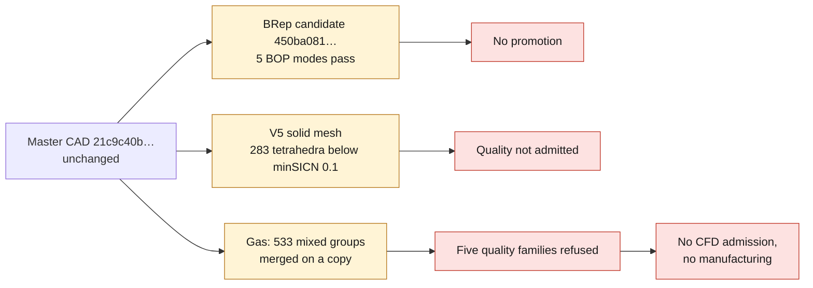

# M64 — guide contacts and geometric preparation

**Latest gas trial: 533 mixed groups merged on a copy, including the 34
earlier ones preserved and 499 additional ones. Compared with batch 34: low
determinants 1,955 → 1,886, non-orthogonal faces 3,411 → 2,910. The
independent comparison of September 12 confirms zero new defects in
the nine checked sets. Five quality families remain refused;
no CFD admission and no manufacturing. See the
[results, checks and limits](M64_MIXED_CELL_CORRECTION_20260909.md#extension-533-groups-cross-checked-on-september-12).**

Script-driven continuation: [token-efficient campaign, Vast budget of
38 USD and review points](M64_LOW_TOKEN_CAMPAIGN_20260912.md).

Previous trial: the global dual conversion is executed, then rejected.
Ten quality checks fail against five on the source, with one cell
of negative volume and 120,190 concave cells. The source and the master CAD
are kept, with no CFD admission and no manufacturing. See the
[documented rejection and its evidence](M64_GLOBAL_DUAL_REJECTION_20260909.md).

Previous result: one very short edge collapsed on a copy,
after native witnesses and cross-check. Maximum aspect ratio:
54,610 → 15,882; five quality families still refused. The master CAD
remains intact, but the discrete boundary is slightly modified within a
controlled bound, with no CAD conformity established. See the
[local correction and its limits](M64_SHORT_EDGE_CORRECTION_20260909.md).

Previous trial: 57 additional groups of three/four tetrahedra
merged natively. Low determinant: 2,021 → 1,963; low weight:
1,235 → 1,230; non-orthogonality > 70°: 3,450 → 3,448.
No new defect in the nine compared sets, points and boundary
preserved. The five families remain refused, with no CFD admission.
See the [controlled supplement](M64_HYBRID_PAIR_CORRECTION_20260909.md#complément--57-groupes-de-troisquatre-tétraèdres).

Previous trial: 252 tetrahedron pairs merged natively,
259 fewer low-determinant cells, 67 fewer weight defects and 29 fewer
excessively non-orthogonal faces. No new defect in the compared sets
after identifier matching; all points and the boundary are
preserved exactly. Five families remain refused, with no CFD admission.
See the [controlled merge summary](M64_HYBRID_PAIR_CORRECTION_20260909.md).

Previous trial: 189 transitions corrected, 25 fewer low-determinant
cells and 66 fewer excessively non-orthogonal faces, with no new defective
IDs in the compared sets. Correction of interior points only,
boundary and CAD unchanged; five families remain refused. See the
[correction as actually checked](M64_APEX_TRANSITIONS_20260909.md).

Previous trial: the OpenFOAM defects are exported and attributed to the source
cells; see the [actual localization](M64_DEFECT_LOCALISATION_20260909.md).

Previous trial: the hybrid domain of 785,883 cells is assembled and
cross-checked. OpenFOAM finds a connected domain and three patches, but
refuses five quality checks. No solver run and no gain credited; see the
[OpenFOAM diagnosis](M64_HYBRID_OPENFOAM_20260909.md).

Previous trial: the native size fields reach 2D generation,
but face 37 triggers repeated retries. Stop with code 137 after
250.146 s, with no candidate; inputs unchanged and cleanup verified.
No gain and no CFD admission. See the [native trial](M64_NATIVE_SIZE_TRIAL_20260909.md).

Previous trial: the local size field stops with code 152,
consistent with the CPU limit, with no candidate mesh and no final report.
Exact reinjection and cleanup verified; no gain and no CFD admission.
See the [incomplete local trial](M64_LOCAL_SIZE_TRIAL_20260909.md).

Previous trial: the redistribution of edge 82 and the joint remeshing
of faces 30/37 are executed on Kali. The defect at corner 93
disappears with no new non-conforming contact with face 36, but quality degrades
elsewhere: candidate refused, boundary and master unchanged. See
the [native trial and its counter-calculation](M64_EDGE82_JOINT_REMESH_20260909.md).

Previous trial: the proposed flip introduces two intersections
with the neighboring face 36. The 27 interior diagonals adjacent to the 22
obstructing triangles are then tested: no single flip gives a strict
gain while keeping all criteria. No candidate applied; see
the [audit of diagonals and contacts](M64_SURFACE_DIAGONAL_AUDIT_20260909.md).

Previous trial: a truly isolated relocation pass on
face 37 reduces the obstructions from 22 to 16, but degrades the bound minimum
and the smallest angle. Fourteen triangles fail the local before/after
normals check. The candidate is refused; CAD and off-target
junctions remain unchanged. A pure monotone selection discards the relocations
that fail the criterion, but returns to the 22 obstructions and the initial extrema;
it is not applied. See the [native trial and the counter-reading](M64_SURFACE_RELOCATION_20260909.md)
and the [previous comparison](M64_SURFACE_METHOD_COMPARISON_20260909.md).
The reference diagnostic core
remains unchanged, with 3,281 tetrahedra below `minSICN = 0.1`.
There is still no admission to OpenFOAM. The trials and refusals remain
documented separately.
For the solid, the interior relocation reduces from 309 to 283 the tetrahedra
below `minSICN = 0.1`, without improving the minimum of 0.000792. The CAD file
and the mesh boundary remain unchanged; the sampled distance
to the CAD remains unqualified. These diagnostics demonstrate
neither a strength improvement nor fitness for manufacturing.

**The saved BRep candidate passes the five selected BOP modes;
the 136 gas non-overlap checks also pass.** The new
full boundary diagnostic completes 104 subtractions: 102 pass,
two remain warned on the same group of three faces. The
reserialization differences are now attributed on Linux as on macOS, with no
proof of global equivalence of the solids and no lifting of the historical refusal.
The master `21c9c40b…` remains unchanged, with no promotion of candidate `450ba081…`.
The nominal guide contacts are measured, with no hot qualification.
The gas partition was historically refused on boundary coverage
and on the volume balance. The new
[composite check](M64_HYBRID_PAIR_CORRECTION_20260909.md#couverture-géométrique-composée--portée-distincte)
now verifies the numerical coverage under a declared native criterion,
with no guaranteed Hausdorff/volume bound and no transfer of admission to the mesh
or to the physics. The earlier refusals remain on record.
A check of September 8 attributes the eight
faces of the two mixed groups to source roles. Linking them to the earlier
evidence allows a register of the **124 external faces**, with no physical
revalidation of the labels. A first mesh of the **V5 solid**, separate from the gas,
is obtained, then rejected: **4,871 elements out of 271,001 below the quality threshold**.

This checkpoint follows the [material and seat checks](M64_EXHAUST_MATERIAL_CONTROLS_20260908.md)
and the [localization of mesh defects](M64_ANNULAR_MESH_LOCALISATION_20260908.md).
The [receipt digests](../../twins/m64-cylinder-head/evidence/geometry-checkpoint-20260908.json)
separate the successive operations and keep the failures. The units remain
those of the scan, with no certification of the scale or of the M64 interfaces.

## Insert seating: measured on the geometry, not on a manufactured part

The four guides of STEP V2 are identified among its twelve solids by their
cylindrical surfaces, axes, lengths and volumes, then cross-checked against the
recorded identifiers. Their frame transformation is applied once.
The insert models are not replaced by the seat boxes.

For each guide, `Common(face extérieure du guide, corps)` yields a patch
exported privately. Its area is compared with the outer lateral surface of the
guide of nominal length 35 units. Sixty-four native sections,
strictly interior and evenly spaced, then measure the bearing
arcs. The union of the arcs avoids counting overlaps twice.

| CAD guide | Patch area, scan units² | Fraction of the outer surface | Sections none / partial / full |
|---|---:|---:|---:|
| Exhaust 1 | 817.779374 | 67.6123 % | 17 / 5 / 42 |
| Exhaust 2 | 817.528516 | 67.5915 % | 17 / 5 / 42 |
| Intake 1 | 794.822941 | 65.7143 % | 22 / 0 / 42 |
| Intake 2 | 794.822941 | 65.7143 % | 22 / 0 / 42 |

The 256 sections are **samples**, not proof of continuous coverage
between the planes. The mean of the sections differs slightly from the
area ratio; it does not replace it. The two intakes agree with
the historical 23/35 diagnosis; this agreement does not qualify their retention.

The four intersections `Common(guide solide, corps)` have a
numerically zero volume. This is neither proof of a strictly zero clearance at every
scale nor an interference-fit prescription. The operations use the
native OCCT tolerances. Contact pressure, thermal conductance,
differential expansion and retention remain to be determined. A bearing
fraction below 100 % is not, on its own, enough to conclude a defect.

The first witness fails before any case because of a name collision during
the Python import of OCP. After a correction limited to that import, four native
witnesses pass: full bearing, half-length, half-circumference and no
contact, with 32 conforming sections. The check of the four guides follows with
native/wrapper code 0, in 7.761 s / 8.196 s including cleanup. No body modified.

## Curves: exact restriction and segmented candidate, acceptance not established

The six existing supports of the two edges flagged C0 are split into fifteen
supports: five 3D curves and ten p-curves. For these non-rational B-splines,
the polynomial identities are checked in rational arithmetic on
each interval; the coefficients are reassembled exactly. The fifteen
supports built in OCP are at least C1 inside their domain.
The 495 additional comparisons of native points give a zero deviation;
this sampling is not, on its own, the global proof.

The initial tangent discontinuities remain at the junctions. This is
not smoothing. No BRep body is read or written during this supports
trial of 0.613 s. At this stage, their reintegration into a topological copy
and the check of the full body remain to be done, without changing the surfaces.
The earlier refusal of multiplicity reduction remains distinct and on record.

### Reintegration: three software stops before edge replacement

| Native trial | Native duration | First stop | Work actually reached |
|---|---:|---|---|
| V2 | 2.135 s | `topological_occurrence_location_not_identity` | Reading and checks of the source body; copy not created. |
| V3 | 2.542 s | `copy_placement` | Copy created in memory; entity matching not completed. |
| V4 | 2.897 s | `Standard_NoSuchObject` | Bijections of the copied entities checked; root/hierarchy review not completed. |

The first two guards confused the internal representation of a
location with the effective transformation. V4 allows only, for the
copied vertices, a change of representation if both matrices are
exactly identity and if raw coordinates, effective coordinates and
tolerances are identical. The other locations remain compared without
this exception. The 4,938 representation changes observed in V4 are
therefore not 4,938 vertex displacements.

The V4 exception does not demonstrate a defect of the part: the receipt places it after
the bijection, but contains no traceback identifying
the exact call. None of these three trials rebuilds the edges,
exports a BRep, rereads a candidate or runs BOP. The BOP mode fields
describe the planned computation; `stage=complete` means end of the program,
not geometric success. The inputs and the program remain unchanged during
each trial, exits 2 with no OOM and no timeout. No earlier refusal is erased.

A separate local diagnostic reproduces a lookup of a missing subshape with
non-cumulated locations. By cumulating the locations, as
[OCCT does during the copy](https://github.com/Open-Cascade-SAS/OCCT/blob/V7_9_3/src/BRepTools/BRepTools_Modifier.cxx),
the full traversal performs 75,186 lookups without error, over 25,069 shapes.
This diagnostic rebuilds nothing and does not modify the body, in memory or
on disk. It identifies a program correction to be tested, not an
already established correction of the body.

### V5: candidate saved and reread, different reserialization

The limited correction of the two hierarchy traversals is executed on Kali.
It produces a private binary candidate: one solid, one shell, 4,900 faces,
10,078 edges and 5,179 vertices. This adds three edges and three vertices,
without changing the surface supports or their locations/tolerances
in the in-memory copy. The oriented occurrences of the wires match
the planned replacements. This is not a smoothing of the Porsche contour.

After save/reread, the entity counts remain identical,
exact `BRepCheck` passes, the vertex/edge/face tolerances are preserved
and the coefficients of the fifteen segmented supports match exactly.
The source body remains unchanged in memory and on disk.

The next guard nevertheless refuses the candidate: its in-memory binary
serialization digest differs after reread (`reread_serialized_representation_equal=false`).
The previous checks do not yet identify the difference; it must
neither be equated with a deformation without diagnosis, nor dismissed as harmless.
The comparative quadratures and the five planned BOP modes are not reached.
No criterion is waived and the candidate is not promoted as master.
Durations 8.307 s native / 8.905 s including cleanup, exits 2, with no OOM and no timeout.
For V5, the requested caps are recorded, but the resource probe
failed before inspection: no effective CPU/RAM measurement is claimed.
Removal and absence of the container are verified separately.

### Independent BOP of the saved candidate: five modes passed

A separate check directly rereads the binary `450ba081…` on Kali/OCP
7.9.3.1, without rebuilding or exporting the body. `SelfInterMode`,
`SmallEdgeMode`, `RebuildFaceMode`, `ContinuityMode` and `CurveOnSurfaceMode`
are all enabled and completed: **zero defects, errors or warnings**.
The four other modes remain disabled and are recorded in the receipt.
This result concerns these five modes, not every possible OCCT criterion.

Exact `BRepCheck` passes before and after. The raw/effective tolerances and the
binary digests of the same loaded object remain identical during the check.
The source file is unchanged; the earlier reserialization refusal is not
erased. Durations: 173.501 s for BOP, 178.128 s for the worker and 178.849 s
including cleanup. Exits 0, with no OOM and no timeout. The effective caps
2 CPU/4 GiB, the read-only root file system and the absence of
network are verified. Container removed, absence rechecked separately.

### Serialization: the 1,114 differing bytes are localized on macOS

A read by path followed by two writes **in memory** reproduces a
difference of 1,114 bytes out of 5,205,080, with no change of length. The two
successive writes of the same object are identical. A reader of the OCCT
V3 format then attributes all the differences; it checks the table bounds,
the topological references, the orientations, the flags and the end of file.

| Fields changed after read/write | Differing bytes | Maximum deviation per component |
|---|---:|---:|
| Directions of 2D curves | 90 | `1.11023e−16` |
| Directions of 3D curves | 366 | `2.22045e−16` |
| Directions of plane/cylinder surface frames | 374 | `2.22045e−16` |
| UV endpoint caches of 101 edges | 284 | `4.26326e−14` in UV coordinates |

No differing byte remains unattributed. The locations, points,
B-spline coefficients, radii, intervals, tolerances, references and
serialized topological flags do not change in this comparison.
The directions are dimensionless; a UV deviation **is not** a 3D distance.
The 32 exact matches to a simple normalization among 45 changed groups of
2D directions do not justify attributing all the deviations to that single
operation. The format rebuilds directions/frames and recomputes UV
caches on reading; these are mechanisms to be distinguished.
[Reading of directions](https://github.com/Open-Cascade-SAS/OCCT/blob/V7_9_3/src/BinTools/BinTools_Curve2dSet.cxx),
[reading and writing of edges](https://github.com/Open-Cascade-SAS/OCCT/blob/V7_9_3/src/BinTools/BinTools_ShapeSet.cxx).

These diagnostics of 0.756 s, 1.343 s and 1.683 s use **macOS arm64**, not the
Linux container. The digest after reading there is `7f3cc7e4…`, against `37eda433…`
in the Linux BOP audit, with the same V3 format. The macOS attribution therefore
does not prove the Linux one. The before/after digests of each audit are
compared only within the same execution. No BRep is exported, no
tolerance increased and no candidate promoted. A first probe reaches its
CPU cap without a checkpoint; two reader trials stop on separator
errors before correction based on the source format. Their private receipts
are kept; they are not physical failures of the part.

### Linux: BOP digest reproduced and 175 bytes attributed

A separate batch uses the same OCP 7.9.3.1 linux/amd64 image as the BOP audit.
Reading the file then writing V3 in memory reproduces exactly
its digest `37eda433…`. Two writes of the same loaded object agree.
The body still has 5,205,080 bytes: 175 differ from the source file,
against 1,114 on macOS. No new BOP and no CAD export is executed.

| Changed Linux fields | Differing bytes | Entities concerned |
|---|---:|---:|
| Directions of 2D lines | 64 | 32 curves |
| Directions of 3D conics | 40 | 15 curves |
| Frames of planes and cylinders | 58 | 23 surfaces |
| UV endpoint caches | 13 | 10 edges of the TShapes table |

All differing bytes are attributed. Points, B-spline coefficients,
radii, intervals, tolerances, locations, references and serialized topological
flags remain unchanged in this comparison. The 32
changed 2D directions match the simple normalization formula
tested; this finding does not describe every reconstruction mechanism of the
3D frames. The maximum deviation of the caches remains a UV quantity (`1.42109e−14`),
not a spatial distance. The Linux result does not erase the macOS result.

Durations: 1.360 s native / 1.955 s including cleanup, exits 0, no OOM and no
timeout. Effective caps 2 CPU/4 GiB, read-only root and absent network
checked; container removed and absence rechecked. The source file,
the decoders and the inputs remain intact. The candidate is not promoted.

### Bound on the Linux representations: explicit local scope

A separate computation, with no OCP call, treats the binary64 values as exact
rationals and rounds the upper bounds outward. It encloses the
32 2D lines over their full intervals, the 15 3D conics and the 23
changed surface frames. For the planes, the wires define a finite UV
envelope; the B-splines used are non-periodic, clamped at their ends
and with positive weights. Their pole envelope provides an enclosure.

The maximum of the bounds per spatial component is
**`1.0854592454916939e−14` scan unit**, on a 3D ellipse. For example, the
variation of a line is bounded by `max|t| × |Δdirection|`; that of a
conic by `rayon1 × |Δaxe1| + rayon2 × |Δaxe2|`. The frames and changes
of parameters are taken into account for the wires projected onto the planes.

An independent review reproduces the 72 spatial bounds and 32 UV bounds,
checks the offsets and the two imported decoders. The latter are not
directly pinned in the bounds script: their hashes were checked
separately, like those of the body and of the Linux report. Duration of the initial computation:
1.241 s; no native run and no CAD file created.

This bound covers the **analytic representations and wires described**,
not the Hausdorff distance between solids, OCCT floating-point evaluation
errors or the UV endpoint caches. The provisional representation budget
`1e−9` scan unit, set before the computation, is neither a machining
tolerance nor an automatic lifting of the historical refusal. No physical
precision, global equivalence or manufacturing authorization is inferred from it.

## Gas partition: refusal kept

On the intake domain `fab1338a…`, the native computation obtains in memory
sixteen annular blocks with six faces, twelve edges and eight vertices, plus a core.
The boundary ancestry and shared-interface checks come before
the refusal `native_partition_volume_sum_failed`. The relative threshold `1e−9` is
not changed. No BRep export of this partition and no `gmsh.generate` was run.

The sum of the seventeen volumes recorded in this first attempt is
`995961.7204052373` scan units³. Since the initial volume of **this call** was
not logged before the refusal, the guard's exact deviation cannot be reconstructed.
Both integrals and their quadrature estimates must be instrumented
before concluding to a partition or integration error. Values
from older receipts do not replace the missing value.

### Second attempt: instrumented integration, without changing the partition

A new call now logs the initial volume, the seventeen volumes and
their sum before the decision. It finds the refusal again: `995961.70449802` versus
`995961.7204052373` scan units³, a relative deviation of `1.59717e−8`, above
the unchanged threshold `1e−9`. The first receipt is neither corrected nor replaced.

The same in-memory shapes are then integrated at three adaptive
precisions, with OCCT's explicit `Eps` overload:

| Requested Eps | Domain volume, scan units³ | Sum of the 17 volumes, scan units³ | Relative deviation |
|---:|---:|---:|---:|
| `1e−7` | 995964.5780437368 | 995964.5779154756 | `1.28781e−10` |
| `1e−9` | 995964.5870689296 | 995964.5870742635 | `5.35549e−12` |
| `1e−11` | 995964.5869731805 | 995964.5869750070 | `1.83387e−12` |

This agreement is a sign of sensitivity to quadrature, **not evidence of
geometric conservation**: the estimate returned for the domain stays
close to `1.054e−7`, despite the stricter precisions requested. OCCT
estimates are not guaranteed bounds; sum/domain agreement and
absolute convergence are two different checks.
[OCCT 7.9.3 API](https://github.com/Open-Cascade-SAS/OCCT/blob/V7_9_3/src/BRepGProp/BRepGProp.hxx)

The second attempt takes 5.099 s native, 5.654 s including cleanup; exit 2,
no OOM or timeout. A **private diagnostic** BRep is exported before the decision,
with five checkpoints. At the end of this attempt, its independent reread and
non-overlap remain to be checked. No mesh or solver launched; the
non-adaptive refusal stays active. Sources and inputs unchanged, exact container
removed and its absence rechecked outside the launcher.

### Independent reread: validity passed, audit incomplete

A separate auditor rereads the source domain and the saved diagnostic BRep.
The 19 exact `BRepCheck` checks pass: domain, compound and 17 solids.
No non-degenerate edge lacks the `SameParameter` flag. The incidences
recover 16 annular blocks and one core, with eight core/block interfaces.

The alternative Gauss–Kronrod integration over the domain and the 17 solids
gives `995964.5863888268` versus `995964.5863979517` scan units³, i.e.
`9.16178e−12` relative deviation. This computation uses `IsUseSpan=True` and `Eps=1e−9`;
it does not replace the historical refusal nor turn an estimate into a
guaranteed bound.

The sets of support and orientation signatures of the boundaries
agree. The first group passes both subtractions with no face or edge
residue. The auditor then stops on
`support_group_has_ambiguous_physical_roles`: its grouping by support
meets several physical roles. This does not prove a difference in
geometry. Boundary coverage is **partial**, the 136
solid-to-solid intersections are **not run**, and the final comparison
of memory snapshots is **not reached**.

Native/launcher exits 2, in 1.082 s / 1.647 s, no OOM or timeout; input
files and programs unchanged. The candidate is not admitted to meshing.

### Role separation: 16 groups checked, then a Boolean stop

The next version separates geometric coverage from role assignment.
It records two planar groups mixing `walls_chamber` and `walls_seat`, without
treating them as a geometric defect or declaring them correctly classified.
The Boolean operations and their criteria remain unchanged.

This time, 16 groups pass, i.e. 32 documented successful subtractions,
with no face or edge residue. One operation of the next group triggers
`native_boolean_error_or_warning`; its exact direction and the total of successful
subtractions are not recorded. The receipt does not
distinguish error from warning, and does not log the message type:
no precise geometric cause can be inferred from it. The 19 validity checks
and the 18 GK integrations are repeated with the same results.
The 136 solid-to-solid intersections and the final memory check are
still not run. Both refused versions remain available.

Durations 1.375 s native / 1.934 s including cleanup; exits 2, no OOM or
timeout, sources and inputs unchanged, container absence checked outside the
launcher. The next step must record the group, the direction and the native messages
of each operation; non-overlap can be the subject of a separate batch,
without claiming that boundary coverage is established.

### Independent batch: the 136 solid-to-solid intersections are complete

The same four frozen inputs are reread, with no new partition, no
boundary subtraction and no quadrature. The 19 exact `BRepCheck` checks
pass again. The `17 × 16 / 2 = 136` pairs each get
a non-destructive `Common` and a before/after log of the operation.

**136 valid results, zero intersection solids, zero errors, warnings
or unknown results.** The input files and the text/tolerance memory
snapshots are unchanged; the text digest is not complete evidence
of all binary coefficients. Non-overlap is checked within
native tolerances. This batch checks neither the internal self-intersection of
each solid nor the total coverage of the domain.

Durations: 5.256 s native / 5.796 s including cleanup; no OOM or timeout,
effective caps 2 CPU/4 GiB and container absent after removal. Exit
code 2 is expected even if the 136 pairs pass: the earlier refusals on
boundaries, physical roles and volumes remain in force. No mesh launched.

### Full boundary diagnostic: only one group still warned

The 52 oriented support groups are all examined in both directions,
i.e. 104 completed `CUT`. **102 results are valid, with no residual face or edge
and no native message.** The two other operations, on group
17 of source/candidate faces 28, 29 and 35 (`walls_port`), each return
four `BOPAlgo_AlertFaceBuilderUnusedEdges`, with no error. Their results are
not examined after the warning: no zero residue is assumed.

The diagnostic keeps the previous Boolean parameters and criteria. It
checks 19 BRep shapes, the incidences and the before/after memory snapshots.
A separate check recounts the 86 source faces, all candidate external
faces, 208 log events and the digests of 312 native outputs.
This proves the exhaustive execution of the diagnostic, not the geometric coverage
of the two warned operations. At this stage of the diagnostic, the two planar groups
with mixed physical roles remain without a resolved assignment; the new
check of September 8 presented below treats them separately.

Durations: 1.984 s native / 2.550 s including cleanup; intentional exit 2,
no OOM or timeout. No new `Common`, GK, BRep or mesh.
The 2 CPU/4 GiB caps are checked after the process ends, with no peak
memory measurement. Sources/inputs unchanged, container removed, absence
rechecked independently. The full native capture succeeded; a program
limitation is kept in the receipt: the resolution of `GetReport().Dump`
comes before its exception-capture block. No capture failure is observed.

### Complementary identity of the three faces: strict test refused

A separate check serializes each whole face, contours included, as binary
V3 in memory. The six BRep checks pass and the matching root placements
and orientations agree. However, faces 28 and 29 have
different representations, despite lengths respectively equal
to 21,237 and 21,605 bytes. The exact bijection of the three faces is therefore refused.

Face 35 has the same recorded SHA, but the byte comparison function
stops at the first mismatch: no global success and no complete
separate test of face 35 is invented. This binary difference does not,
on its own, prove a difference in shape. Its fields must be identified
before deciding on a relevant geometric comparison.

Durations: 0.461 s native / 1.034 s including cleanup; exits 2, no
normalization requested, no smoothing, `CUT`, BOP or export. Inputs and loaded
objects unchanged, 2 CPU/4 GiB caps checked, container absence confirmed.
The two warned subtractions are not renamed as successes.

### Differences in faces 28/29: auxiliary data, defining geometry unchanged

The full decoder then locates **two bytes per face**, four in total.
Only the X/Y directions of an auxiliary plane change, with a maximum
per-component deviation of `1.23260e−32`, dimensionless. No other serialized field
differs. The digests of the four source/candidate faces reproduce
those of the previous test; the decoders remain unchanged.

Walking all references shows that these planes are used
**exclusively by type 4 edge representations, "Regularity"**.
They are referenced neither by the faces, nor by their p-curves or vertices.
Each face has an unchanged main B-spline support. This link is
established by the file's references, not assumed from the surface
numbers. [Reading of type 4 and of the face support in OCCT](https://github.com/Open-Cascade-SAS/OCCT/blob/V7_9_3/src/BinTools/BinTools_ShapeSet.cxx#L976-L1054).

The serialized subgraph defining the two faces is therefore identical in
this Linux/OCP reread: main support, 3D curves, p-curves and ranges,
oriented contours, vertices, locations and tolerances. A pure review of
dependencies, reproduced independently, also rejects two altered controls:
a modified plane used by a p-curve and a modification of a vertex field.

This result explains **why the strict binary identity test refused
these two faces**. It does not demonstrate the cause of the `CUT` warnings, does
not modify any CAD byte and does not qualify the whole partition. Caches
or non-serialized fields, another architecture and physical precision are
not part of this evidence. The historical refusals are kept.

Durations: 0.450 s native / 0.995 s including cleanup, exits 2; graph
review with no new native call. Inputs unchanged, exact container removed,
absence rechecked. No new `CUT`, mesh or physics solver launched.

### New result of September 8: eight faces, two role groups resolved

The domain `fab1338a…`, the partition `c9eceb77…` and their frozen manifest are
reread with no new geometric operation. The two mixed planar groups are
found in the native inventories, then each candidate face is compared
with **all** the source faces of its group: `5² + 3² = 34` comparisons.
Eight unique matches succeed and **26 cross matches are
refused**; the latter are not defects of the partition.

The eight successes are on the **complete bytes of each loaded face,
BinTools VERSION_3**, contours and tolerances included, with a separate check of
the exact root placement, the orientation and the support digest.
**No exclusion of auxiliary data is needed here.** The same plane,
an identical area, center or number is not enough for a match.
The equality of the numbers below is a result, not an assumption.

| Group | Candidate face | Source face | Transferred source role |
| --- | ---: | ---: | --- |
| 2 | 2 | 2 | `walls_chamber` |
| 2 | 3 | 3 | `walls_seat` |
| 2 | 4 | 4 | `walls_chamber` |
| 2 | 9 | 9 | `walls_seat` |
| 2 | 15 | 15 | `walls_chamber` |
| 3 | 5 | 5 | `walls_chamber` |
| 3 | 6 | 6 | `walls_seat` |
| 3 | 14 | 14 | `walls_seat` |

A cross-reading checks the uniqueness and completeness of the rows and
comparisons, as well as the roles in the manifest, reread and rehashed separately.
This check covers a known limitation of the supervisor: its conversion
into dictionaries/sets would not by itself reject duplicates
fabricated in a receipt. No duplicate exists in the native receipt obtained;
the program run stays frozen, with no retroactive correction.

Durations: **0.614 s native / 1.214 s including cleanup**, exits 2 expected
to keep the other refusals. Effective caps 2 CPU/4 GiB, total budget
120 s of which 30 s reserved for cleanup; no OOM or timeout, no peak
memory measurement. Inputs, sources and loaded objects unchanged; container
removed, absence checked independently. The **11 targeted tests pass**.
The global software check `make check` also ends with code 0;
its skipped optional native tests do not constitute a part validation.
The full digests of the eight pairs, of the report `625be76c…`, of the process
`50b3d0e6…` and of the cross-reading `d1e997de…` are in the
[evidence capsule](../../twins/m64-cylinder-head/evidence/geometry-checkpoint-20260908.json).

This result transfers existing source labels, with no new
physical validation. The eight matches are whole faces:
no general evidence of coverage of subdivided faces is extrapolated.
The warned `CUT` and the volume refusal remain recorded and unchanged.
No additional `CUT`, `Common`, GK, BRep, mesh or solver is produced.

The Kali Boolean batches record an effective `FuzzyValue()`
of `1e−7` scan unit, for a request of zero. OCCT imposes a floor in
[`SetFuzzyValue`](https://github.com/Open-Cascade-SAS/OCCT/blob/V7_9_3/src/BOPAlgo/BOPAlgo_Options.cxx).
They are therefore not described as Boolean operations in exact arithmetic
or with zero effective tolerance. This does not change the tolerances
stored in the inputs.

### Derived register of the 124 external gas roles

A JSON processing step with no new native call links the previous receipts:
113 faces by bidirectional coverage of single-role groups, eight by
complete identity, two by identity of the subgraph defining faces
28/29 and one by whole digest and exact placement of face 35.
The register `ebd58991…` covers each of the 124 external faces of the
52 groups exactly once, with a single owner; the 32 internal faces are excluded from it.
The root reran this processing and found exactly the same register.
The roles previously proposed for the source are transferred, not validated
physically. Neither the group 17 warnings nor the volume refusal are
rewritten. No new coverage or volume computation is launched.

### First diagnostic mesh of the V5 solid

The file `450ba081…` is reread in OCP 7.9.3.1 then passed to Gmsh 4.15.2
through a private ASCII V3 BRep. The root's digest is checked **before**
extraction of its single solid; the two digests remain distinct.
The reread bridge is a valid BRep: one solid, one shell, 4,900 faces.
The conversion attributes 118 differing bytes in the ASCII bridge and 101 in
the reread of the Gmsh export, notably frames, vertices, intervals and
UV caches. These counts are not a geometric distance.

The attempt is explicitly authorized as an **unqualified import diagnostic**:
global geometric comparison `false`, cumulative spatial bound `null`, no
CAE or manufacturing authorization. This does not reduce the geometric budget
`1e−9` and does not declare it met. Before generation, the reimport
exactly reproduces the exported BRep and the Gmsh inventory examined. The original
V5 file stays intact; no intentional repair, decimation or
reuse of old anatomical groups is applied.

| Check of mesh `763a2ad9…` | Result |
| --- | --- |
| Elements / nodes / boundary triangles | 271,001 / 65,735 / 91,300 |
| Connectivity and boundary | One component, complete boundary, no CAD face without triangles |
| Jacobians and signed volumes | All strictly positive |
| Quality `minSICN ≥ 0.1` | **Refused: 4,871 elements (1.7974 %), minimum 0.0000406853** |
| Volume deviation from the imported BRep | 0.24615 %, under the coarse 1 % threshold |
| MSH reread | Tags and connectivity kept; quality still refused |

The composite check `mesh_export_roundtrip=false` includes the quality
criterion: this is not file corruption. The maximum coordinate deviation
after reread is `5.7396e−14` scan unit. The 4,871 overly distorted elements
comprise 2,916 elements adjacent to a boundary face and 1,955 with no boundary
face; their private localization does not assign them an anatomical role.

A projection of 46,583 triangle centroids onto their Gmsh supports
gives a maximum of **0.38760 scan unit**. This is a sampled diagnostic,
not a bound over all facets, evidence of membership in the trimming
contours or a machining tolerance. The helper's post-meshing check
covers entities, volume and descriptors, not a complete BRep identity.

A single attempt: 9.333 s for the three import stages and 27.440 s for
meshing, cleanup included, i.e. 36.773 s cumulative. Cap 4 CPU/4 GiB with no
additional swap, 1,200 s cumulative of which 60 s reserve, meshing stage
limited to 600 s. The producer configures two meshing threads; four CPUs
are a container limit, not a usage measurement. Import exits 0,
meshing 2 expected, no OOM; the four containers were removed and their
absence rechecked. Eight pure tests of the wrapper and 21 of the producer pass.
No new Vast spend, engine load, thermal or mechanical simulation.

### Interior optimization of the V5 solid, frozen boundary

Two attempts each start from a copy of the **same initial MSH** `763a2ad9…`.
They load no CAD and generate no new mesh from the geometry. Gmsh's default
native optimizer changes the connectivity and interior nodes; the elements and
nodes of dimension 0/1/2 entities must remain strictly identical. The true
boundary of the tetrahedra is also compared with the stored triangles, and the
boundary nodes must not be classified as movable volume nodes.

The first attempt runs the optimizer but then fails with
`Unknown element 396236` during the quality computation. No optimized MSH is
exported and no improvement is credited to this receipt `67c8fb6b…`. The old
element cache was not invalidated after the swaps, with `Mesh.Renumber=0`. The
second version adds only
[`rebuildElementCache(onlyIfNecessary=False)`](https://gmsh.info/doc/texinfo/gmsh.html#index-gmsh_002fmodel_002fmesh_002frebuildElementCache)
after the optimization, and its trace in the report. This operation rebuilds
the tags→elements index, not the geometry; renumbering, boundary, metric and
thresholds are unchanged. The initial receipt and both versions are kept.

| Check | Before | After, binary export read back |
| --- | ---: | ---: |
| Tetrahedra | 271,001 | 260,107 |
| Tetrahedra below `minSICN = 0.1` | 4,871 | **1,722** |
| Fraction by count below the threshold | 1.7974 % | 0.6620 % |
| Fraction of absolute volume in these elements | 0.1676 % | 0.1149 % |
| Minimum `minSICN` | 0.0000406853 | 0.0000406853 |
| Nodes / boundary nodes / boundary triangles | 65,735 / 45,636 / 91,300 | Identical |

The derived MSH `a6871a23…` contains **64.6479 % fewer insufficient
tetrahedra**, with no improvement of the minimum. The sum of signed volumes
remains `1,157,574.359375028` scan units³; no zero or negative Jacobian or
volume, a single component, no missing, extra or non-manifold boundary. The
boundary entities, tags, orientations, connectivities and binary64 coordinates
are preserved exactly. The whole post-optimization mesh is identical after
binary MSH 4.1 export/read-back.

The optimizer internally uses `gamma = 3 r_inscribed / R_circumscribed`, not
`minSICN`. Its reports of "ill-shaped" tetrahedra do not replace our
recomputation of the `0.1` threshold. A single API call per attempt,
`force=True` for the discrete volume, `OptimizeThreshold=0.3`, without Netgen
or periodicity. In this method, `niter=1` does not bound the inner loop and
`dimTags` does not restrict the model: isolation to a single volume and the
external watchdog bound the run.

Durations, cleanup included, are 6.601 s for the initial failure, then 13.800 s
for the corrected version; exit codes 2 then 0. The latter code only indicates
that the diagnostic finished, **not that quality is accepted**. Each run is
capped at 120 s, of which 20 s are reserved for cleanup, 2 CPU/2 GiB with no
extra swap, one configured meshing thread, no network. Both exact containers
are removed; their absence is re-checked by root. No OOM, frozen inputs and
programs unchanged. The eight corrected pure tests also pass when re-run by
root. No new Vast cost, no new thermal, mechanical or engine load.
The software check `make check` finishes with code 0: its unit discovery
counts 2,431 tests, of which 108 are skipped depending on available
dependencies, then the complementary checks pass. This does not mean that all
native solvers were exercised, nor that the part is physically validated.

Reading the initial surface diagnostic, preserved by this optimization, finds
**856 triangles below `minSICN = 0.1` on 146 faces**, with a 2D minimum of
`0.0018031574`. This 2D value is not treated as a 3D quality bound. It points
to a separate piece of work: redo the surface discretization on the existing
CAD supports, then check conformity, boundary and volume quality again. No
silhouette change is justified by these mesh defects alone. The anatomical
assignment of the faces is not inferred from their Gmsh numbers. The earlier
CAD import and conformity limits remain in full; the repeatability of several
complete optimizations is not demonstrated.

### MeshAdapt run: 433 insufficient tetrahedra, no admission

Run `8a7a499f…` starts again from the same frozen import BRep. It reproduces
its digest and inventory exactly before meshing; the master and V5 remain
unchanged. On the 146 previously flagged faces, the requested algorithm
becomes MeshAdapt (`1`), with Frontal-Delaunay (`6`) requested elsewhere. The
logs also show 40 automatic fallbacks from Frontal-Delaunay to MeshAdapt,
i.e. 186 faces actually processed by MeshAdapt. The generator, however,
recreates **the whole mesh**: it does not guarantee that only these 146
triangulations change. The fallback-on-failure mechanism remains enabled and
traced. No new smoothing, repair or CAD silhouette change is requested by this
change of meshing method; the already documented limits of the Gmsh import
still apply.

| Indicator | Previous optimization | New run, after optimization |
| --- | ---: | ---: |
| Tetrahedra | 260,107 | 273,576 |
| Below `minSICN = 0.1` | 1,722 | **433 (0.15827 %)** |
| Fraction of absolute volume in these elements | 0.11490 % | 0.00771 % |
| Minimum `minSICN` | 0.0000406853 | 0.0000406853 |
| Surface triangles below the threshold / faces affected | 856 / 146 | 51 / 23 |
| Minimum `minSICN` of the triangles | 0.00180316 | 0.01592716 |

The drop in count is 74.8548 % relative to the last optimized run, and
91.1107 % relative to the 4,871 initial defects. These percentages concern
different meshes, not a material or engine improvement. Before the single
interior optimization, the new mesh has 284,333 tetrahedra, of which 3,226
are below the threshold; afterward, 433 remain, of which 367 are adjacent to
a boundary face and 66 have no boundary face. The 67,931 nodes, 45,751
boundary nodes and 91,530 triangles remain identical **during this
optimization**, not relative to the previous mesh.

The oriented digests of eight surfaces change between 2D and 3D generation.
The exact unoriented geometric signatures and the triangle counts remain
identical on the 4,900 faces: no subdivision or deformation of the skin is
detected between these two stages. Conformity is measured again on the final
skin: 46,698 projected centroids, observed maximum **0.45258 scan unit**,
versus 0.38760 on the first mesh. The samples are not identical; the
selection depends in particular on the order of the triangles. This increase
is therefore not evidence of a geometric regression, and this measurement is
still neither a continuous bound nor evidence of membership in the trimmed
contours. This unfavorable increase is kept rather than selecting only the
improved indicators. The volume deviation from the imported BRep goes from
0.24615 % to 0.25589 %; it does not prove geometric equivalence. Import
admission remains unqualified.

The binary MSH 4.1 export `5727c17e…` is read back: types, tetra/surface
connectivities, tetra/node tags and coordinates are preserved, zero
coordinate deviation. One component, complete boundary, no non-positive
volume or Jacobian. The quality limit still fails after read-back. The Gmsh
warning about 49 tetrahedra uses its own metric: it does not replace the
**433** defects recomputed with `minSICN`.

A single native run, 49.793 s / 50.619 s cleanup included; cap 300 s, of which
30 s for cleanup, 4 CPU/4 GiB, two configured threads, no network. The wrapper
exits 0 for the diagnostic, the helper 2 for the quality refusal. No OOM;
exact container removed, absence re-checked by root, sources and programs
unchanged. Six pure selection and scope tests pass, with an independent review
of the hooks before execution. No Vast cost, no new simulation of engine
load, thermal behavior or strength.

### Additional targeted run: face 4839, 3D minimum improved

The review of the previous worst tetrahedron finds two boundary triangles on
the same B-spline face 4839: its four vertices are on the frozen boundary. It
is nearly coplanar, with a height of about `8.49e−5` scan unit, despite edges
from 1.203 to 5.101. Its surface triangles are acceptable in 2D
(`minSICN ≥ 0.2304`); this face was therefore not among the first 146. This
is a hypothesis of a constraining triangulation, not a demonstrated CAD
defect.

A second run adds **only this face** to the requested MeshAdapt assignments,
same data, sizes, options and thresholds. The test therefore covers 147
assignments; 41 additional automatic fallbacks are traced. The interior
optimization goes from 285,772 tetrahedra, of which 3,202 are insufficient,
to **274,680, of which 346 are insufficient (0.12596 %)**. The final minimum
is **0.00300248**, i.e. 73.8 times the minimum of the first run; the 0.1
limit is still refused. The insufficient count drops by 20.09 % relative to
the 433, and by 79.91 % relative to the 1,722 of the previous batch.

An independent Python parser reads both complete binary MSH files, not only
the 100 worst elements: the old vertex quadruplet is found once in the first
and zero times in the second. Face 4839 goes from 23 to 25 triangles and no
longer has an insufficient tetrahedron carrying a boundary triangle on it.
Receipt `9900dca7…` preserves this evidence and its limits. The global
recomputation changes the signatures of 267 surfaces between runs: each
global gain is not attributed to face 4839 alone. Its sampled local
projection goes from `3.21e−5` to `7.03e−5` scan unit on 12 then 13 points,
without evidence of continuous conformity. The parser exits 0 in 2.679 s,
with no native module, no new generation and no CAD change.

The 68,139 nodes, 45,757 boundary nodes and 91,542 triangles are preserved
during the optimization. The unoriented signatures of the 4,900 surfaces
remain exact between 2D and 3D; nine oriented signatures change. One
component, complete boundary, positive Jacobians and signed volumes. After
binary read-back of MSH `362c3e75…`, connectivities, checked tags and
coordinates are preserved exactly, quality still refused. Of the 346
insufficient elements, 302 are adjacent to a boundary face and 44 are not.
50 insufficient triangles remain on 23 faces. The projected maximum over the
46,704 sampled centroids remains `0.45258` scan unit: no new evidence of
continuous conformity or of global geometric equivalence.

This single additional run finishes in 51.801 s / 52.656 s cleanup included,
with the same 300 s/4 CPU/4 GiB cap, no OOM and no Vast cost. Exact container
removed and absence re-checked; CAD, frozen inputs and programs unchanged.
Seven pure tests pass. `make check` also finishes at 0 on the documentation
changes and the existing repository; this software check is not a native
validation of all solvers or of the part.

### Solid run: targeted batch of 45 additional faces

An analysis of the 100 worst elements of the previous result finds 51
tetrahedra having two boundary triangles on the same face and their four
vertices on the boundary. They concern 45 faces still in Frontal-Delaunay,
with no automatic fallback. Their minimum triangle quality exceeds 0.1: the
2D filter did not detect this volume defect. In total, 92 of the 100 worst
have four boundary vertices; these proportions are not extrapolated to the
346 insufficient elements.

A single run adds these 45 faces to the 147 previous assignments, i.e. 192
selected faces, without changing the CAD, sizes or thresholds. After one
interior optimization, **309 insufficient elements out of 276,262** remain,
versus 346 before. However, the minimum SICN degrades from 0.00300248 to
**0.00079205**: this result is not an improvement on all criteria and
remains refused. The independent comparison of the complete MSH files finds
each of the 51 targeted quadruplets once in the old mesh, and none in the
new one. This exact absence demonstrates neither the absence of neighboring
defects nor that of other flattened tetrahedra.
The 41 automatic fallbacks remain traced, i.e. 233 faces actually meshed by
MeshAdapt. Between the two runs, 395 face digests change: no exclusive global
causal gain is attributed to the 45 additions. The new worst element carries
a single boundary triangle on face 2868 and a nearly coplanar interior
vertex; the triangulation of this face is nonetheless exactly identical to
that of the previous result.

The 68,422 nodes, 45,830 boundary nodes and 91,688 triangles are preserved
during the optimization. The mesh has one component, a complete boundary,
positive Jacobians and signed volumes; its binary read-back preserves the
checked connectivities and coordinates exactly.
The unoriented signatures of the 4,900 surfaces are preserved between 2D and
3D; seven oriented signatures change. 47 insufficient triangles remain on 22
faces. The projected maximum over 46,777 centroids is still 0.45258 scan unit,
with no continuous evidence and no defined physical tolerance.
The program finishes in 50.829 s, 51.663 s cleanup included; cap
300 s/4 CPU/4 GiB, no OOM. Exact container removed and absence re-checked.
The frozen files and programs remain unchanged. No Vast cost and no thermal
or mechanical result credited.

### Solid: Relocate3D interior displacement

The MSH of batch 192 is read back directly, without CAD import or mesh
regeneration. A `Relocate3D` call, `force=False`, `niter=1`, performs three
internal passes in Gmsh 4.15.2. This method optimizes the local gamma of the
incident tetrahedra, not the SICN; no monotonicity of all indicators is
assumed. The element search cache is rebuilt before they are re-evaluated.

The **276,262 tetrahedra and their connections remain identical**. The count
below SICN 0.1 goes from **309 to 283**, but the minimum remains exactly
0.00079205104. The minimum gamma also remains unchanged; its maximum
decreases. The worst defect is therefore not resolved. The 45,830 boundary
nodes, the 91,688 triangles, all their tags and their binary64 coordinates
are preserved, as is the node classification. The signed volumes and
Jacobians remain positive; a single component, no hole or non-manifold defect
detected by these checks. The binary read-back preserves the exported mesh
and the metrics exactly.

Receipt `8f732823…` and private MSH `eac017b3…` preserve this partial
improvement and the refusal of the threshold. Native duration 17.737 s,
18.433 s cleanup included; cap 120 s, of which 20 s for cleanup,
2 CPU/2 GiB, no network, OOM or timeout. The 19 pure tests of the worker and
the supervisor pass, notably the removal of the only already identified
container when its final inspection fails. The real container was removed
and its absence re-checked by root. Sources and inputs unchanged, no Vast
spending and no CAE or manufacturing admission.

### Gas track: initial pilot preparation

The existing partition comprises a core and 16 six-faced annular blocks. The
proposed pilot keeps this CAD: two radial layers, 24 elements per quarter
circumference and 60/115 elements on the two axial sections, i.e. **67,200
hexes and 384 quadrangles toward the core expected**, not produced. The core
would require tetrahedra and transition pyramids. The plan provides for the
124 external faces and keeps the 32 internal interfaces without turning them
into walls. The clearance check will be done on the facets actually
generated, not on the nominal geometric estimate alone.

This private initial preparation was **not an executable program**: it
lacked the targeted inventory of native endpoints/cycles and the mixed-mesh
adapter with native→Gmsh binding, without assuming equal tags. No new split,
volume computation or gas mesh was launched. The frozen plan `e329ac39…`
provides for binary MSH 4.1/SaveAll, a 300 s limit and 4 CPU/4 GiB on the
existing image; CFD admission remains separate and refused.

### Native gas inventory: interior constraints identified

A bounded OCP read extracts 162 vertices, 291 edges, 156 faces and 17
volumes, including the 16 annular blocks and their 72 proposed transfinite
faces. It exits 2 on an overly specific provenance check: it confused the
single-role source groups with ancestors of individual fragments. A review
of the saved JSON files corrects this interpretation, with no new native call
and no invented ancestor: the 32 cylindrical faces selected by blocks,
supports and endpoints carry 16 guide roles and 16 stem roles. The initial
refusal and its unfinished final memory footprint are kept; no global
admission.

Two contour traversals appeared empty on faces 28 and 29. A second read,
limited to their TopoDS storage, observes edges 73 and 77 respectively with
`INTERNAL` orientation, omitted by the loop explorers. These are not missing
closed cycles to be manufactured or deleted. The native→Gmsh adapter must
represent and preserve these interior constraints separately from the
boundary loops before launching the mixed mesh.

The two reads take 0.433 s / 1.044 s and 0.419 s / 1.002 s, native duration
then cleanup included. Cap for each: 60 s, of which 15 s for cleanup,
2 CPU/2 GiB, read-only, no network and no CAD export. The files remain
unchanged; the targeted read also confirms the memory footprint before/after.
Both containers are removed and their absence re-checked by root. No
CUT/Common/GK, no new partition, no gas mesh and no Vast cost. The mixed-mesh
program still has to be integrated and reviewed with these two constraints;
the announced hex figures remain forecasts.

### First gas pilot: bound import and saved surface

The private adapter is now executed in the existing Gmsh 4.15.2 image. The
bijection of the 162 vertices, 291 edges, 156 faces and 17 volumes is
obtained, including the internal edges 73 and 77 observed in the
corresponding faces. After 1D generation, the 162 anchors have zero
coordinate deviation; the 104 annular chains and the two interior chains pass
their checks. This does not resolve the reservations about the continuous
geometric identity of the import.

2D generation produces **88,721 nodes, 31,462 triangles and 74,822
quadrangles**. Binary MSH `4756aa0d…` is saved before the next check, which
refuses the expected element types or surface entities. No volume is
generated, the clearance on the quadrangles is not yet checked and no CFD
computation is launched. The refusal is preserved in receipt `790d9ec1…`,
without modifying the CAD or relaxing the criterion. The saved surface makes
it possible to locate the cause.

An independent parser then reads the complete MSH in standard Python, with no
new Gmsh call: the 156 faces are present. Only interfaces 61–68 have an
unexpected mix of ten triangles and 24 quadrangles each. Eight shared curves,
requested at 24 segments and verified after 1D, carry 32 after 2D. The logs
confirm that opposite sides then no longer have the same number of segments.
Eight other cylindrical faces also abandon the structured mesh, but their
recombination hides this defect from the element-type check alone. Receipt
`893db1a2…` preserves the counts and warnings. The next step must therefore
verify the chains again after 2D, before crediting the conformity of the
structured mesh.

Native duration: 1.951 s; cleanup included: 2.611 s. Cap 300 s, of which 30 s
reserved for cleanup, 4 CPU/4 GiB total RAM+swap, no network, sources and
inputs read-only. No timeout or OOM; the files remain unchanged. The exact
container is removed and its absence re-checked by root. The 70 pure module
tests and the 10 supervisor tests pass; they do not replace this incomplete
native result. No Vast cost. `make check` finishes at 0 on the modified
repository; this software success changes no meshing or physical
qualification verdict.

### Gas pilot V2: volume obtained, topological defects still refused

A single discretization change is applied: 25 nodes on each of the eight
outer arcs 128–135. The 104 earlier requests, the 72 transfinite faces, the
17 volumes and the BRep are kept. The 162 anchors and the 114 tracked chains
— 104 old, eight added and two interior constraints — remain exactly
identical after 2D and then after 3D, including their tags, oriented
connections and binary64 coordinates.

Before 2D, the two pairs of actual polylines each have 96 segments per
contour. The radial separation computed on the whole segments is at least
0.00588171564 scan unit. The 72 structured faces then have their exact
quadrangle counts: the subdivision defect seen in the first pilot is no
longer present in this run. The saved surface has 31,888 triangles and
71,152 quadrangles. The local clearance check between the guide/stem facets
passes before and after 3D, with a minimum remaining bound of 0.01177949 scan
unit. These floating-point computations on the facets certify neither the
continuous geometry nor a hot mechanical clearance.

MSH `61c4ee9d…` contains **173,222 tetrahedra, 67,200 hexahedra and 384
pyramids**, i.e. 240,806 cells. All evaluated Jacobians and volumes are
positive; the binary read-back preserves the mesh and the metrics exactly.
This partial success is not enough: the topological check flags three
duplicated cells, six non-manifold faces and 126 internal orientation
mismatches. The surface nodes are preserved, but not the exact snapshot of
their elements. These defects must be located in the saved files before any
new run or CFD conversion.

The minimum SICN of the tetrahedra is 0.00001418, with 2,918 below 0.1. The
thin hexes have a SICN close to 0.08; the 0.1 threshold is **diagnostic**
here, not a universal CFD admission criterion. The angle between Gmsh
reference directions does not replace OpenFOAM's finite-volume
non-orthogonality.

Native duration: 33.420 s; cleanup included: 34.192 s. The 62 pure tests pass
before execution. The cap remains 300 s/4 CPU/4 GiB, no network, no OOM or
timeout. The inputs, sources and CAD are unchanged. The exact container is
removed and its absence re-checked by root. No Vast cost, engine, thermal,
mechanical computation or AI training is credited. Receipt `ed79eef5…`
preserves the refusal, the successful checks and the two private mesh files.

A standard-Python cross-read of the two MSH files then separates the causes
of the refusal. The **103,040 facets of the 156 surfaces, interfaces
included**, have the same coordinates, classifications and oriented
connections; only **31,343 element identifiers are renamed**. The refusal of
the exact snapshot is therefore explained without observing any deformation
of these facets and without erasing the historical criterion. This discrete
finding is not evidence of continuous identity with the CAD.

On the other hand, the three duplicates and six non-manifold faces are
confirmed. The 126 faces with mismatched orientations correspond to **123
distinct pairs of tetrahedra that locally overlap**. For these pairs, the two
opposite vertices are strictly on the same side of the shared triangle,
verified by exact rational determinants on the recorded binary64
coordinates. The 166 tetrahedra involved nonetheless each have a positive
determinant: an individually positive cell does not guarantee a mesh without
overlap. All belong to the core, with no hex or pyramid directly involved.
The adjacencies locate the defects notably near native faces 51/52 and
69/70. This is not an exhaustive search of all possible intersections.

The aggregate receipt `c48c4e5e…` binds the files, twelve successful pure
tests and the exact signs. The diagnostic takes 5.942 s with no native call
and no modification. The 31 defect components do not show the complete
pattern of two superposed 2↔3 tessellations; no permutation causality is
established. The proposed next variant is to disable **only the final
`Mesh.Optimize` pass**, keeping `OptimizeNetgen=0` and all other parameters.
It is not executed in this batch and its success is not assumed.
The [Gmsh 4.15.2 source](https://gitlab.onelab.info/gmsh/gmsh/-/blob/gmsh_4_15_2/src/mesh/Generator.cpp#L1522)
separates this pass from boundary recovery and pyramid creation, which would
not be removed by this change.

### Gas pilot V3: disabling the final optimization is not enough

The counter-run is now executed. The V2 and V3 receipts confirm that **only
the effective option `Mesh.Optimize` goes from 1 to 0**; Netgen remains
disabled. The BRep, the five inputs, the native→Gmsh binding and the
constraints are identical. The 162 anchors and the 114 chains are preserved
after 2D and 3D. The source distinguishes this change from the inheritance of
the eight V2 arcs. The 65 pure tests pass, including the exact restoration of
the V2 program outside the declared difference; an independent review
precedes the native launch.

File `4f41153f…` contains **175,753 tetrahedra, 67,200 hexahedra and 384
pyramids**. The checks evaluate positive volumes and Jacobians, no duplicate,
no non-manifold face, but **132 internal faces with mismatched
orientations**. The minimum SICN of the tetrahedra remains close to
0.00001418; 3,351 are below 0.1, versus 2,918 in V2. The refusal is kept,
with no conversion to CFD and no relaxation of the threshold. The local
clearances on facets pass; the MSH and the metrics read back exactly.

The pre-3D surface is, however, **not identical between the two runs**:
85,295 nodes and 31,886 triangles in V3, versus 85,296 and 31,888 in V2; the
quadrangles number 71,152 in both cases. Despite the same inputs, this is
therefore not a paired comparison on the same initial mesh. The disappearance
of the duplicates cannot be attributed to the removed pass alone. The V3 log
keeps the smoothing specific to the pyramids, distinct from the removed final
optimization.

The pure counter-computation `a06e14e6…` confirms **132 distinct pairs of
tetrahedra that locally overlap**, involving 163 core tetrahedra, all with a
positive signed determinant. The opposite vertices are on the same side of
the shared triangle in exact rational arithmetic. The V3 surface check finds
the same 103,038 oriented facets, coordinates and labels before/after 3D;
only 31,282 element tags change. This is therefore not a defect limited to
surface renaming. This check does not exhaustively search all intersections
and does not prove continuous CAD identity.

The pre-3D comparison pins down the difference between V2 and V3: native face
8 goes from 66 to 64 triangles; faces 24, 35 and 69 keep their count but
change coordinates and oriented facets. The other 152 face meshes are
identical modulo identifiers and cyclic rotations. Twelve pure tests pass,
repeated by root; no geometry is modified. The counter-diagnostic takes
5.862 s and the pre-3D comparison 2.586 s.

Receipt `0f3b63f6…` preserves the native result in 33.610 s, 34.404 s cleanup
included. Cap 300 s/4 CPU/4 GiB total RAM+swap, no network, OOM or timeout.
The exact container is removed and its absence re-checked by root; sources
and inputs unchanged. No Vast spending, no thermal, mechanical or
manufacturing qualification.

The software check `make check` finishes at 0 for this batch. Its main
discovery covers 2,431 cases, of which 108 are skipped for optional
dependencies; the additional Makefile checks also finish without error. This
result verifies the software and the dossier, not the physical quality of
the cylinder head nor the acceptance of the meshes above.

### Solid: the worst tetrahedron is really unchanged after Relocate3D

A complete cross-read of the before/after MSH files, with no new native call,
confirms that tetrahedron 1776107 keeps its four binary64 coordinates, its
connectivity and its boundary triangle on face 2868. Node 118057 is really
interior, classified `(3,1)`; it is therefore not frozen by the boundary
guard. Its star remains made of 34 tetrahedra and 19 neighbors, of which six
interior neighbors have moved.

On each of the two saved states, the direction toward the mean of the 136
vertex occurrences used by the method is locally unfavorable: the targeted
tetrahedron flattens from a fraction of the displacement `xi ≈ 0.01555`
before and `0.01327` after. These roots are computed by exact rational
determinants on the binary64 coordinates. They reconstruct neither the order
of the floating-point sums nor the search executed during the three native
passes. The 0.01 threshold in the code is a search interval width, not a
minimum displacement.

Private receipt `614f1767…` preserves the signatures and limits of this
2.584 s diagnostic; five pure tests also pass in root cross-verification. The
exact cause of the final non-displacement is not established, but repeating
the same smoothing is not justified by a mere drop in the global count of bad
elements. Volume quality and conformity to the CAD remain to be addressed; no
contour change or physical tolerance is introduced by this analysis.

### Local solid run: no displacement retained

An SLSQP optimizer separate from the Gmsh smoothing was executed once on
interior node 118057. The goal was to increase the smallest "mean ratio"
quality of its 34 tetrahedra, without degrading any of the 34 individual
qualities, without moving the 19 neighbors and keeping the volumes positive.
This measure is neither `minSICN` nor a mechanical stress. The allowed
numerical radius was a quarter of the shortest incident edge; it is not a
manufacturing tolerance.

After fixing a defective SciPy environment in a separate private
environment, the SLSQP control case and seven pure tests pass. The real
computation with SciPy 1.17.1/NumPy 2.4.6 finishes in 1.429 s, after one
iteration, at the exact initial point: zero displacement, minimum mean ratio
unchanged at 0.0069819001. Receipt `5ea09065…` preserves the 34 rational
checks and the digests; the tests are repeated by root. No mesh file is
modified. The result therefore provides no candidate to verify natively and
does not prove that another displacement or a remeshing is infeasible.

### Gas core: triangular boundary extracted without modifying the transitions

HXT cannot take the quadrilateral faces of the mixed mesh directly. A pure
extractor therefore isolated the boundary of the tetrahedral core alone,
without triangulating the quadrilateral interfaces and without modifying the
existing 67,200 hexahedra and 384 pyramids. The shell has 33,422 triangles:
31,886 external facets and 1,536 lateral faces of the pyramids.

The 15 topological guards pass: one component, 16,711 nodes, no open edge, no
duplicate, no area exactly zero and no orientation inconsistency. Vertex
neighborhoods are simple cycles. Orientations on the pyramid side are opposite
to those of the core. Receipt `8163b885…` and the private shell `073539bc…`
bind these checks to the unchanged inputs; seven pure tests also pass in root
cross-verification.

This 6.638 s extraction makes the shell admissible for a **remeshing trial**,
not the volume for CFD. The 132 internal conflicts of the source mesh remain
refused. Neither an absence of global intersection nor conformity to the
continuous CAD is inferred from topological closure.

### HXT run on the core: candidate saved, quality check refused

The discrete route was checked against the Gmsh 4.15.2 code: the call
`createGeometry([(3, 1)])` targets only the volume. The surfaces are neither
parameterized nor reconstructed; their before/after snapshots remain exact.
A small closed tetrahedron first follows the same route, with HXT generation,
quality checks, boundary and binary reread all successful. The real core is
then generated once only; the log markers confirm the HXT backend in both
cases.

The private candidate `1740a425…` was saved before the audit. The 33,422
boundary triangles and their binary64 coordinates remain identical after
generation; 16,581 node identifiers change, with the bijection recorded. This
change of identifiers is not a displacement of the surfaces. The next check
refuses the native `minSJ` array (`finite_complete_minSJ`, size and finiteness
guard). The receipt does not keep this array; it therefore does not yet
distinguish an incorrect count from non-finite values. The full audit of the
core and its reread are therefore **not completed**. The internal HXT count of
818,513 tetrahedra is not equated with the number of physical elements
exported.

Native receipt `0931b9d7…` keeps this failure: 6.846 s for the worker,
7.408 s including cleanup, with no OOM and no timeout. Eleven pure tests of the
worker and seven of the runner pass, repeated by root; the latter include
removal of the owned container after timeout and inspection failure. The exact
container was removed and its absence rechecked. No hexa/pyramid reassembly,
no modification of the master, no CFD admission and no new Vast spending. The
cross-reading of the saved file must distinguish real degeneracy from a metric
evaluation problem before any new trial.

The pure cross-reading of the saved file is now complete (`28a0521c…`):
733,762 tetrahedra and 122,354 nodes. It finds no duplicate, repeated node,
manifold defect or orientation conflict between neighboring cells; the
tetrahedra form one component and their oriented boundary matches exactly the
33,422 recorded facets. The determinants computed in floating point are all
positive, but the smallest is very small: `det6 ≈ 3.4174e−16` in cubed scan
units. The 53 tetrahedra selected by the small-determinant detector are
recomputed in rationals and remain strictly positive; the other 733,709 do not
benefit from this exact recomputation. Four pure tests pass, repeated by root.

This cross-reading therefore does not find the local conflicts observed in the
source mesh. It does not authorize clearing the native refusal, nor declaring
the new mesh converged or fit for CFD. The next step is the native reading of
the **same saved MSH**, keeping the quality arrays and identifying the elements
concerned, without new generation. Global intersections and reassembly remain
to be checked.

### Native reread of the same core: anomalies attributed, without mutation

The Gmsh 4.15.2 audit reads the file `1740a425…` without generation,
optimization, CAD access or mesh export. It keeps the four complete arrays of
733,762 values, with the element identifiers in API order. The direct Jacobian
arrays are also kept: nine components, one determinant and three evaluation
coordinates per tetrahedron, at the reference point `(0.25; 0.25; 0.25)`.
`NaN`s are neither removed nor replaced by zero. No array is truncated or
artificially padded.

| Native measure | Anomaly observed | Scope |
|---|---|---|
| `minDetJac` | Two zeros, elements 45583 and 87069 | All other returned determinants are positive. |
| `minSJ` | Two `NaN`, same elements | The other 733,760 values are finite; no count problem. |
| `minSICN` | Nine negative values; 5,858 below 0.1 | Minimum `−2.14113e−15`; the 0.1 threshold is a diagnostic counter. |
| `gamma` | 28 zero values | Shape measure, distinct from the dimensioned determinant. |
| Direct determinants | One zero, element 45583 | Matrices and evaluation coordinates entirely finite. |

The union of elements flagged non-positive or non-finite contains 28
tetrahedra. The native evaluation and the rational determinants of the previous
cross-computation must not be confused: the audit does not demonstrate that
these tetrahedra are exactly coplanar. The poor dimensionless qualities justify
treating their shape; a small dimensioned determinant, alone, would not justify
it.

An independent cross-reading (`09310c14…`, without Gmsh) checks the seven
complete arrays, their digests, orders, extrema and the cells concerned. The
28 anomalous elements are all included in the 53 determinants recomputed in
rationals, all strictly positive on the binary64 coordinates of the MSH. For
45583 and 87069, exact `det6` is about `1.71343e−16` and `1.62699e−16` scan
unit³. This does not erase the failure of their native evaluation. The
independent ratio `det6 / max_edge_length³` places the shape of the 28 cells
between `2.08e−18` and `2.37e−15`, independent of a uniform change of scale.
Eight pure tests pass, repeated by root; analysis of 13.463 s without writing
the mesh.

The snapshots of all binary64 coordinates, connectivities, facets and physical
groups remain identical before/after. Receipt `39da7133…` records a **complete
collection with quality refusal**, not a successful physical computation:
24.021 s native, 24.661 s including cleanup, exit 2. No native error or
warning, no OOM and no timeout; effective ceilings of 4 CPU/4 GiB and absent
network checked. The exact container is removed and its absence rechecked.
Fifteen pure tests of the auditor and seven of the runner also pass in root
cross-verification. No new Vast spending, no reassembly, no CFD or
manufacturing admission.

### September 9: one interior optimization run and reread

A single Gmsh 4.15.2 `optimize("", force=True)` works on a copy of the core
`1740a425…`, without generation or CAD access. The repair entry is distinct
from CFD acceptance: all arrays are complete; the two undefined `minSJ` and the
initial zeros remain recorded. The other arrays are finite and all anomalous
cells are covered by the positive exact determinants of the pinned
counter-receipt. The native code explicitly handles `gamma = 0` and selects
those elements for a correction attempt. `Mesh.OptimizeThreshold = 0.3` applies
to `gamma`, not `minSICN`. The parameter `niter=1` does not bound the loops of
this route; the launcher imposes an external limit of 600 s, including 30 s of
cleanup.

Candidate `69552099…` is saved before the subsequent checks. The 33,422
triangles, the binary64 coordinates of the 16,711 boundary nodes, their
classifications and the physical groups remain identical. Only the
connectivity and interior positions may change. The binary reread reproduces
the mesh and the seven metric/Jacobian arrays, compared by element identifier,
without erasing the non-finite values of the initial state.

| Core measure | Before | After and after reread |
|---|---:|---:|
| Tetrahedra | 733,762 | 718,294 |
| Non-finite `minSJ` | 2 | 0 |
| Non-positive `minDetJac` | 2 | 0 |
| Zero `gamma` | 28 | 0 |
| Tetrahedra below `minSICN = 0.1` | 5,858 | 3,282 |
| Minimum `minSICN` | `−2.14113e−15` | `2.18219e−12` |

The roughly 44% drop in the count below the diagnostic threshold does not mean
that the minimum quality is sufficient. The minimum `gamma` remains at
`1.52209e−23` and the log still reports **75 ill-shaped tetrahedra**. The
checks for complete, finite and strictly positive arrays pass after
correction; they replace neither quality admission, nor convergence, nor the
intersection search and the hexa/pyramid reassembly.

Receipt `cd9d965e…` keeps 140.609 s for the whole copy/optimization/
audits/reread, 141.271 s including cleanup. The log attributes 0.939 s to the
optimization proper. Exit codes 0, no OOM, timeout or native error; the shape
warning above is kept. The effective ceilings of 4 CPU/4 GiB are checked;
container removed and absence rechecked. Eight pure tests of the worker and
eight of the runner pass, repeated by root, including the refusal to claim a
certain absence after an uncertain Docker creation. No new Vast spending and no
modification of the master. The next step addresses the residual cells and the
independent checks of the new volume, not an identical repetition of the
trial.

The pure cross-reading of the candidate (`94c1a588…`, 12.880 s) detects no
duplicate, repeated vertex, manifold defect or orientation conflict between
neighboring cells. The 718,294 tetrahedra form one component and their oriented
boundary matches exactly the previous HXT core and the initially extracted
shell. No boundary identifier changes relative to the previous MSH. All
floating-point determinants are positive; the only element selected by the same
small-determinant detector is also positive in rationals. The others are not
all recomputed in exact arithmetic. Four pure tests of the reused analyzer
pass, repeated by root. This topological check is not an exhaustive
intersection search and does not lift the shape-quality refusal.

The independent localization (`f3ba307a…`, 4.321 s) selects **all 148 elements
whose saved `gamma` is below 0.001**, without equating them with the 75
announced by the log. All touch the boundary: 37 have four boundary vertices,
96 have three, 11 have two and 4 only one. 112 share at least one boundary
facet; the 133 incidences are correctly oriented. None touches a pyramid
interface, not even by a vertex. Coordinates and provenances remain linked
exactly to the initial shell. The 148 rational signs are positive; this is not
a sufficient quality criterion.

The minimum, element 49443, has four fixed vertices and two boundary facets of
seat/chamber provenance. Its edges are comparable, but its minimum height/max
edge ratio is about `1.02e−12`: it is an almost flat cell. With connectivity
unchanged, moving only interior vertices cannot correct it. The next search
therefore addresses local connectivity, without modifying the contour or the
imposed facets. Three synthetic geometry tests pass, repeated by root; the full
selection from the compressed array and the input digests are also rechecked.
No new native computation and no mesh written for this localization.

Two local replacements of two tetrahedra by three are then evaluated in
rationals (receipt c7730c12…, 2.484 s), each with one of the two interior
neighbors of 49443. The oriented boundaries and signed volumes of the cavities
remain identical, but each proposal contains a negative determinant and its new
diagonal crosses the plane outside the shared triangle. **Both proposals are
rejected**, without artificially reorienting the cells and without writing a
mesh. Five synthetic tests pass, repeated by root. This closes these two
trials, not every possibility of correction in a wider neighborhood.

### Local rework: one new interior point, boundary unchanged

The full star of the interior edge opposite the seat/chamber junction contains
five tetrahedra. The five triangulations of the pentagonal link were computed
in rationals: each introduces at least one inversion and is refused (receipt
238e43f9…). This result motivates a change of method, not a further repetition
of the same edge swaps.

Three cavities of 5, 12 and 26 tetrahedra are then studied. A linear program
proposes, for each, a point maximizing the minimum distance to the boundary
planes. Its numerical tolerances are not admission: the final binary64
coordinates are converted back to rationals to check all determinants, the
oriented boundary and the volume. The three proposals pass these local checks.
The smallest is kept for what follows: **5 tetrahedra replaced by 10, one new
interior node**, without moving any existing node. Its minimum height/edge goes
from `1.02e−12` to `0.137866` (receipt 9ec56ff5…). This is a geometric
indicator, not a dimensional tolerance or an engine gain.

The independent contact check (b9e02335…) examines all pairs involving the ten
new elements. Of 7,182,890 potential pairs with cells outside the cavity,
7,182,425 are strictly separated by their bounding boxes; the remaining 465 are
computed in rationals, as are the 45 internal pairs. No overlap and no contact
outside the declared common simplex is detected, including when the
intersection volume is zero. This is not an audit of the pairs of cells left
intact. Nine tests of the contact checker pass, including two independent
witnesses of coplanar contacts.

The private proposal c40959ba… was then applied **once only, on a copy**, in
Gmsh 4.15.2 on Kali: 4 CPU, 4 GiB, 600-second ceiling. The process finished in
95.49 seconds, cleanup included, with no overrun and no out-of-memory. The
absence of the container was checked independently. Twelve tests of the
correction program and ten of the launcher pass, reviewed and repeated by root
before this run.

The file e873b8ae… now contains 718,299 tetrahedra and 122,355 nodes. The old
nodes, their classes, the elements outside the cavity and the 33,422 boundary
triangles are kept. The seven native arrays are complete, finite, positive
where required, and identical by identifier after save and reread. No Gmsh
warning or error. Receipts: computation 6aff1c46…, process 219fd71b…; the CAD
and the master mesh were not modified. No additional Vast spending.

The global minimum minSICN goes from `2.182e−12` to `1.632e−5`; among the ten
new elements, it is at least `0.28809`. The minSICN and gamma values of the
718,289 cells left intact remain identical. The diagnostic counts go from 3,282
to **3,281 minSICN below 0.1**, and from 148 to **147 gamma below 0.001**.
These tracking thresholds are not sufficient CFD admission criteria: the
correction is real but local. The cross-check of the saved file **without
Gmsh** then passes in 13.48 seconds (ab8ed9a4…). The MSH 4.1 parser checks the
exact delta, the classes and parameters of the nodes, groups and triangles.
The topology remains one component, with no duplicate, non-manifold face or
orientation conflict. The 718,299 floating-point determinants are positive;
none triggers the global exact-recomputation rule. The local rational proofs
remain distinct from this global floating-point check. Four tests of this
cross-reading pass and were repeated by root. This copy becomes the next
**diagnostic** starting point, with no CFD admission and no modification of
the contour.

Proposed next step: group the remaining defects and prepare a first batch of
at most eight independent cavities, then also check contacts between
replacements. Same exact preservation, one bounded application on a copy, no
quality regression, and a drop in the number of weak cells required.
Re-evaluate gain and cost after this first batch; it is not run in the present
receipt.

## Interior batch refused and bound on the fixed faces — September 9

The batch proposed above was searched for, **but no application took place**.
The bounded search attempts 96 linear-programming solutions in 8.16 seconds on
core e873b8ae…: zero cavities kept. It requires exact determinants and volume
balance, an identical boundary, a local shape gain and a drop in the number of
cells below the tracking minSICN threshold. Of these 96 proposals, 94 fail the
last criterion; the refusal reasons overlap. This result concerns this bounded
search, not all possible repairs. Private report: 6086ff75…; eight tests of the
proposer pass. The tools for contact checking, native application and batch
reread are prepared, but **no contact check and no native batch computation
was run**. The starting diagnostic mesh remains unchanged.

A different verification then establishes an obstruction for certain fixed
facets. For a non-degenerate triangular face, let
`S = (2/3) × sum of the three squared edge lengths` and
`D² = (16/3) × area²`. For any positively oriented linear tetrahedron built on
that same face, the ideal SICN metric satisfies:

`SICN ≤ 3D / (S + D)`.

The bound is attained by a vertex projected onto the centroid, at a physical
height `H² = 2D/3`. In the ideal Jacobian, with `x` equal to the square of the
ideal height, the identity
`(S+x)(D²+Sx) − x(S+D)² = S(x−D)² ≥ 0` gives the maximum; a component parallel
to the face only increases the norms in the denominator. The strict condition
`S² > 841D²` therefore proves `SICN_max < 1/10`. It is evaluated in exact
rationals from the saved binary64 coordinates, and does not depend on the order
of the face's vertices. The metric is tied to Gmsh 4.15.2, `CondNumBasis.cpp`
and `JacobianBasis.cpp`; digest of the source archive in the JSON receipt. The
proof was reviewed independently.

The audit examines the **33,422 triangles** in 5.24 seconds and finds **661
obstructive faces**, incident to **643 distinct current tetrahedra**:

| Source role in the gas domain | Faces whose bound is below 0.1 |
|---|---:|
| Guide walls | 384 |
| Valve walls | 128 |
| Port walls | 114 |
| Seat walls | 33 |
| Chamber | 2 |
| Pyramid lateral interfaces | 0 of 1,536 |

No exact equality at the threshold. The worst bound is about `2.223e−5` on
source face 37 of a port. Since the indices of the source file and of the core
were renumbered, their correspondence is rebuilt by a bijection of exact
binary64 coordinates and equality of the remapped triangles, without any
proximity search. The first audit attempt, which wrongly assumed the same
identifiers, was stopped by this check before any result; the corrected
matching is the one in the final receipt. Six tests cover in particular
permutations, change of scale, a degenerate face and trial vertices, including
the one attaining the bound. Report: eb761769…; program: 7e05f4ca…. No mesh or
CAD write.

**Consequence:** moving only the interior vertices cannot remove all
tetrahedra below 0.1 as long as these 661 triangles remain identical. The
conservative counting bound is at least 166 insufficient tetrahedra in any
remeshing that keeps exactly these facets; it does not apply after their
subdivision or retriangulation. This proves neither the origin of each of the
96 refusals, nor the impossibility of manufacturing the part. The threshold is
a numerical diagnostic, not a CFD authorization. The other defects remain to be
addressed.

Next correction: redo the **tessellation on the same CAD surfaces**, starting
with a targeted pilot, with checks of edges, interfaces, deviations from the
CAD and contacts after reassembly. Do not change the cylinder head contour to
improve this indicator. No new physical solver and no Vast rental was launched
for these audits.

## Retessellation pilot: controlled isolation, quality still insufficient

Port face 37 is retriangulated with Delaunay, on the same OCC surface, after
reinjection of the mixed surface mesh. The coordinates and classifications of
**85,295 nodes**, the 0D/1D/2D elements and the physical groups are first
rebuilt and then rewritten: the starting file is reproduced **byte for byte**
(`25905293…`). No mesh volume is loaded; the 67,200 hexahedra and 384 pyramids
of the previous chain are therefore not recomputed in this pilot.

The MSH does not contain curve/surface parameters. The parameters of the
85,133 non-0D nodes are rebuilt and checked by direct evaluation at native
tolerances, without XYZ displacement. The first two stops identify an endpoint
parameter about `4e−15` below its bound; its attachment then uses the vertex
identity and the edge direction, with no added tolerance. The third stop
reveals the closed circles: 31 vertex aliases are handled explicitly, with a
check of both bounds and of the 1D cycle. This 0D convention is not injected as
a 1D node parameter. Curve interiors and UVs remain subject to the same guards.

The fourth trial generates and saves a candidate, then refuses it: the 71,152
off-target quadrilaterals were replaced by triangles. The reading of Gmsh
4.15.2 attributes the detour to the computation of the reinjected mesh status
(`GModel.cpp`, `getMeshStatus(false)`): the unfinished internal statuses
trigger the 1D pass, which erases the faces before the `MeshOnlyEmpty` filter.
That filter does count quadrilaterals; it is not reserved for triangles.

The fifth trial temporarily hides the off-target curves and surfaces with
`MeshOnlyVisible`, without recursion, then restores visibilities before
export. A single 2D generation is called, with no optimization and no automatic
algorithm fallback. The log confirms that only surface 37 is meshed. Candidate
`dfecbc5e…` contains **85,386 nodes, 32,068 triangles and the 71,152
quadrilaterals kept**. The independent cross-reading confirms all off-target
XYZ/classes, the groups, the incidences and the entity bounds. It nevertheless
refuses the off-target element records, because their identifiers changed. An
independent two-step cross-reading establishes an exact bijection of the
**107,348 off-target elements**: 107,186 are only renumbered, with no rotation,
permutation or inversion of nodes. Reading `Generator.cpp` and `HighOrder.cpp`
identifies the cause: the prior call to `SetOrder1` recreates the lines,
triangles and quadrilaterals, even when already linear, with new tags.
`Mesh.Renumber = 0` does not disable this operation.

The **sixth trial** saves the raw output separately, byte-for-byte identical to
the fifth candidate. An explicit total bijection restores the off-target source
identifiers and assigns fresh identifiers to the 2,471 triangles of the
target, with a single `renumberElements` call. The correspondences require the
same type, the same entity and the same nodes in the same order; duplicates,
permutations, XYZ or class changes are refused. The final file `81bac4db…` is
saved, parsed and then reread by Gmsh. **The native guards and the 15
cross-reading checks pass**, including all off-target identifiers and
connectivities. The correspondence table remains archived privately with its
digest; no reference volume mesh is replaced. Two Gmsh warnings remain
recorded, concerning entities 364/face 28 and 368/face 29. Successful checks
are not proof of continuous conformity to the CAD.

On the target: **2,289 → 2,471 triangles**, **18 → 17** SICN bounds below 0.1,
minimum bound **`2.223e−5 → 3.157e−5`**. This is a limited reduction of a
discretization obstruction, not a gain in efficiency or strength. The 155
oriented boundary segments are identical. The mesh has three boundary cycles,
one component and an Euler characteristic of −1, before as after; the two CAD
wires must not be confused with these three cycles. No zero triangle,
duplicate or combinatorial manifold defect is found on this surface; this does
not check its geometric self-intersections or its continuous conformity to the
CAD.

The six Kali trials are bounded to 300 s, including 30 s reserved for cleanup,
with four CPUs and 4 GiB with no extra swap. The first three stop before
generation; the next two save refused candidates and the last passes the
bounded preservation checks. The latter takes 14.62 s of worker time, 15.31 s
with cleanup; its pure cross-reading takes 1.67 s. The exact containers are
removed and their absence rechecked. 54 targeted tests pass; `make check`
passes in full. No thermal, mechanical, LPBF or CFD computation is added by
this batch, and no Vast spending is committed. Receipts and digests:
[evidence register](../../twins/m64-cylinder-head/evidence/geometry-checkpoint-20260908.json).

## Next steps and execution scope

Priorities: establish the admission decision from the separate evidence on
representation, boundaries and the register of 124 roles; conclude the coverage
and the volume balance before admitting the gas domain. The localization of the
17 Delaunay obstructions is complete; it led to the MeshAdapt counter-trial,
then to the localization of its 22 cases. Real isolation by temporary removal
of the off-target elements allowed a Relocate2D pass; it is refused for
degradation of the minima and deviation of the normals. The monotone selection
of proposals yields no targeted gain and is not applied. Now evaluate the
connectivities and the 1D splitting with the neighbors concerned, without
touching the CAD curves. Do not promote these pilots into the volume core
without checking the junctions and the quality. For the solid, the results 147
then 192 and Relocate3D show a drop of the insufficient count to 283, but the
degraded minimum is not corrected. Address the volume mechanism and the 22
flagged surface faces, while addressing CAD conformity, whose sampled maximum
increased. Do not touch the silhouette to mask these numerical defects. The
attribution of the four auxiliary bytes is complete: it calls for neither a new
correction of these faces nor a repetition of their strict binary test. The
candidate's BOP and the batch of 136 pairs do not need to be rerun on the same
unchanged inputs. Seat contacts, full assembly, walls, thermal, strength and
the LPBF process remain separate checks. Neither 700 hp nor manufacturability
is demonstrated by these diagnostics.

```mermaid
flowchart LR
    A[V5 body saved] --> B[5 BOP modes successful]
    A --> C[Differences attributed on Linux and Mac]
    C --> D[Local bound computed<br/>Global equivalence to conclude]
    A --> J[Diagnostic solid mesh<br/>271,001 tetrahedra]
    J --> K[Quality refused<br/>4,871 elements to address]
    K --> L[Interior optimization<br/>Boundary exactly preserved]
    L --> M[1,722 elements still insufficient<br/>Surface discretization rework]
    M --> O[MeshAdapt trial then optimization<br/>433 elements still insufficient]
    O --> P[Targeted addition of face 4839<br/>346 insufficient, minimum improved]
    P --> S[Targeted batch of 45 faces added<br/>309 insufficient, minimum degraded]
    S --> Y[Interior Relocate3D, boundary preserved<br/>283 insufficient, minimum unchanged]
    Y --> Q[Quality and conformity not admitted<br/>No physical result credited]
    E[Gas partition] --> F[136 pairs with no overlap detected]
    E --> N[Hexa-tetra pilot prepared<br/>Adapter to implement, not run]
    N --> R[Native inventory obtained<br/>2 internal constraints to preserve]
    R --> T[Linked import, 1D constraints checked<br/>Mixed surface saved]
    T --> U[First pilot: surface types refused<br/>No volume generation]
    U --> V[Eight arcs corrected without modifying the CAD<br/>72 structured faces conforming]
    V --> W[240,806 mixed cells generated<br/>Local clearance preserved]
    W --> X[Local overlaps of the core confirmed<br/>Facets unchanged, tags renamed]
    X --> Z[Counter-trial without final optimization<br/>243,337 cells, 132 local overlaps]
    Y --> AA[Worst tetrahedron confirmed unchanged<br/>Smoothing direction locally unfavorable]
    AA --> AB[Separate local optimization run<br/>Zero gain, no modification kept]
    Z --> AC[Triangular shell of the core extracted<br/>Hexa-pyramid transitions preserved]
    AC --> AD[HXT witness successful then core saved<br/>Boundary preserved, minSJ check refused]
    AD --> AE[Full native reread without mutation<br/>2 non-finite minSJ, 5,858 minSICN below 0.1]
    AE --> AF[Interior optimization on a copy<br/>0 non-finite, 3,282 minSICN below 0.1]
    AF --> AG[Boundary and reread preserved<br/>Very flat cells still to address]
    AG --> AH[148 gamma below 0.001 located on the boundary<br/>Local connectivity to correct, contour preserved]
    AH --> AI[5 pentagonal swaps refused<br/>3 conical cavities proposed]
    AI --> AJ[Smallest cavity 5 to 10 applied<br/>Exact boundary and reread, 3,281 minSICN below 0.1]
    AJ --> AK[Interior batch: 96 proposals refused<br/>No native application]
    AK --> AL[Exact bound: 661 obstructive faces<br/>Retessellation on the same CAD surfaces]
    AL --> AM[Surface 37 retriangulated<br/>18 to 17 face obstructions]
    AM --> AN[Source tags restored by exact bijection<br/>Off-target XYZ and connectivities preserved]
    AN --> AO[Bounded cross-reading successful<br/>17 obstructions remaining, no CFD admission]
    AO --> AP[MeshAdapt: worst bound improved<br/>22 obstructions, exact junctions]
    AP --> AQ[Localization: 21 cases with free vertices<br/>Real isolation of the next trial to prepare]
    AQ --> AR[Isolated Relocate2D: 16 obstructions<br/>Degraded minima and 14 normals out of criterion: refused]
    AR --> AS[Pure monotone selection: 990 admissible moves<br/>Still 22 obstructions, no export]
    E --> G[102 CUT successful out of 104<br/>Complementary evidence linked<br/>124 source roles traced]
    G --> H[Global admission still refused<br/>Coverage and volumes to conclude]
    H --> I[Meshing then physical computations]
```

The trials use the existing Kali and OCP image, with no network in the
containers and with sources/inputs read-only. The budgets are respectively
90 s/2 GiB for the supports, 60 s/2 GiB for each witness, 300 s/4 GiB for the
guides and 90 s/4 GiB for the partition, with two CPUs and the same ceiling for
RAM and RAM+swap. The reintegrations are bounded to 300 s/4 GiB, the gas audits
to 150 s/4 GiB and the independent BOP to 240 s in total/4 GiB, always two
CPUs. No OOM and no timeout for these Kali trials; exact containers removed and
absence checked. No new Vast spending for this batch.
