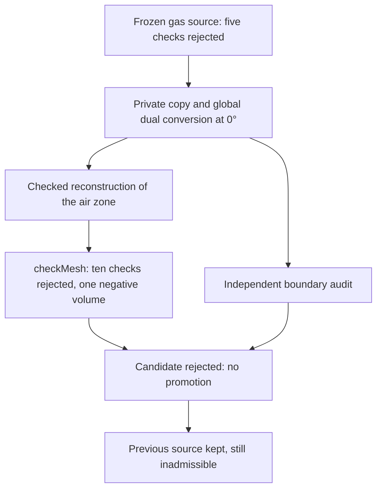

# M64 — global dual conversion executed, then rejected

**The dual conversion of the latest gas mesh worsens its quality: ten
OpenFOAM checks fail versus five before conversion. One cell has a negative
volume. The candidate is rejected, with no physical solver run.**
The [previous source](M64_SHORT_EDGE_CORRECTION_20260909.md) is kept
unchanged; it itself remains inadmissible for CFD. No change of cylinder head
shape, thermal gain, power or LPBF suitability is established.

## Actual trial and environment

A single global trial uses `polyDualMesh` from **Foundation 14,
commit `7b05503f98a85be88af930df48623b4d152bfc35`**, with a boundary feature
detection angle of 0°. This is not the old rectangular control case of 1,768
tetrahedra tested at 60°, nor a repeat of the local contraction. The whole
hybrid discretization is transformed, not only its tetrahedra.

The [primary polyDualMesh code](https://github.com/OpenFOAM/OpenFOAM-14/blob/7b05503f98a85be88af930df48623b4d152bfc35/applications/utilities/mesh/manipulation/polyDualMesh/polyDualMesh.C)
uses this angle to detect boundary edges. **0° guarantees neither zero
displacement nor exact preservation of the discrete domain.** The options
`splitAllFaces` and `concaveMultiCells` are not enabled. The first would in
particular change the multiplicity of faces between cells; it is not an
automatic fix for the quality criteria.

Commands actually executed, exclusively on a private copy:

```sh
polyDualMesh -case /output/case-01 -noFunctionObjects 0
checkMesh -case /output/case-01 -constant -noFunctionObjects -allTopology -allGeometry -writeSets
```

The mesh saved in `constant/polyMesh` is reread at precision 17. The
post-processing functions are disabled; no fake pressure or temperature field
is created to make the diagnostic pass.

The homogeneous `air` zone is verified then archived on the copy before the
conversion. After conversion, its full list is rebuilt from `owner` **and**
`neighbour`: nonnegative labels, neighbor order, exact coverage of `0…N−1`,
consistent face count. No primal cell identifier is reused as a dual
identifier. This metadata reconstruction does not modify the five
geometry/connectivity files.

Existing Kali; linux/amd64 image `a233511b…`; caps of **4 CPUs, 4 GiB, 270 s
active / 300 s total**. Network disabled, source and scripts mounted
read-only. Execution and cleanup: **15.653 s**, with no OOM and no timeout.
Container deleted, absence checked separately. Digests of the nine source
files and of the package unchanged. **No new Vast rental or spending for this
trial**; this observation is not a reading of the account balance.

## Native result: rejection, even though the processes end with code 0

| Check | Kept source | Rejected dual candidate |
|---|---:|---:|
| Cells | 785,472 | 223,154 |
| Points | 223,154 | 1,148,120 |
| Faces | 1,688,422 | 1,486,723 |
| Failed check families | 5 | 10 |
| Cells with zero or negative volume | 0 | 1 |
| Concave cells | 0 | 120,190 |
| Distinct wrongly oriented faces, native set | 0 | 136,326 |
| Faces with rejected tetrahedral decomposition, native set | 0 | 171,982 |
| Low determinant | 1,961 | 214 |
| Low interpolation weight | 1,229 | 172 |
| Faces too skewed | 18 | 435 |
| Maximum non-orthogonality | 89.953° | 131.986° |

The minimum negative volume is `−2.5433742853495796e−12` mesh unit³. The
scale remains uncertified. The generic volume fields of the historical reader
remain `unknown` for this log branch; they are not replaced by zero. The
negative value is read explicitly in the pinned native log.

The log counts 136,329 occurrences of the face pyramid error, but writes
**136,326 distinct faces** in the set. Likewise, 343,108 occurrences of
rejected decomposition give **171,982 distinct faces**. The tables use the
set sizes, without confusing occurrences, faces and tetrahedra. The 15
`shortEdges` entries are **points**, not a number of edges.

The before/after counters do not rest on an individual cell correspondence
between the two discretizations. The isolated gains in determinant or weight
do not offset the negative volumes and the new defects. A connected region
and kept patch names do not prove the geometric equivalence of the domain.

## Cross-check and decision

The independent auditor actually rereads both boundaries: **143.209 s wall
clock, 142.067 s CPU, peak memory 879.9 MB**, inputs unchanged. It finds the
oriented closure of the edges and the vertex links, as well as the names,
types and metadata of the three patches. However, the candidate has **375
non-convex polygons in the checked projection and 271 invalid triangulation
fans**.

The exact comparison of coordinates finds 82,400 of the 83,526 former unique
boundary points: 1,126 are missing and 280,248 are new. These numbers describe
a new discretization; they do not by themselves constitute evidence of a
difference, or of identity, of the continuous domain.

The maximum planarity residual is `0.0024871448012475667` mesh unit on the
candidate, versus `1.3099984372445823e−13` on the source. The exact test also
reports 50,239 non-strictly-planar polygons in the source: this diagnostic of
serialized numbers is **not a CFD acceptance threshold** nor a reason to
modify the CAD. The projection and the fan from the first vertex are declared
measurement conventions.

The volume delta computed by this fan is very small
(`−2.168404344971009e−19` mesh unit³), but proves neither geometric
equivalence nor positivity of the native volumes. No sampled distance,
Hausdorff bound or cell volume correspondence is claimed. The ten native
failures remain blocking independently of this audit.

The first audit had stopped on a multiline ASCII variant of the large faces
produced by OpenFOAM. That rejection and its receipt are kept. A fix limited
to the reader, with five additional regression tests, enables the second
audit without modifying the geometric predicates. The **31 targeted pure
tests** pass: nine worker checks, five cleanup checks and seventeen auditor
checks. These are software verifications, not physical tests. The frozen
native receipt keeps its historical "audit pending" field; the later
independent receipt is linked separately.

A full `make check` ends with code 0. The optional native verifications
skipped for lack of runtime are not counted as passed. This result verifies
the repository; it does not change the rejection of the real mesh.



The [evidence register](../../twins/m64-cylinder-head/evidence/geometry-checkpoint-20260908.json),
key `gas_global_dual_rejection`, binds the manifest, the scripts, the logs,
the digests of both meshes and the cleanup. The geometries and the private
identifier sets are not published.

The next avenue retained is a **conservative, quality-driven agglomeration of
the primal mesh**, with no new dual and no lowering of thresholds. It must
examine disjoint neighboring groups, including the pyramid/tetrahedron
transitions that the current tetrahedral utility does not handle.
Preconditions before a new native batch: admissible unions, external
coordinates and facets kept, checked volume balance, then quality of all
neighboring faces and correspondence of the defect sets. **This extension is
not yet executed**; the earlier tet/tet merges do not prove that it will
resolve all defects.

The stack in the photo keeps the roles of the
[multiphysics plan](M64_MULTIPHYSICS_EXECUTION.md#précision-du-9-septembre--calcul-ia-et-banc-séparés):
OpenFOAM for fluids/CHT depending on the model, Elmer as an independent
thermal and mechanical candidate, PhysicsNeMo after admissible computations
and evaluation, Ditto/Mosquitto for the state and telemetry of a future
bench. This pilot runs no new coupling between these programs.
