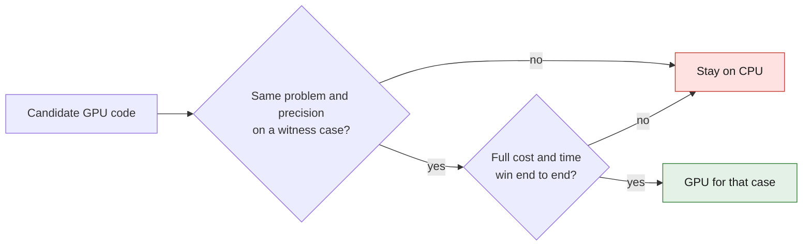

# M64 — GPU research as of September 12, 2026

**CPU for references and small cases; GPU after a compatible witness case and a
measured end-to-end gain.** Three bounded reviews studied geometry, thermal/
strength and LPBF. Targeted research, not an exhaustive systematic review.
Application: [jobs 2–3–4](M64_JOBS_234_20260912.md).

## Primary sources and decisions

| Publication / code | Contribution, limit and M64 decision |
|---|---|
| [PaMO, authors, PG2025](https://github.com/SarahWeiii/pamo) | Surface remeshing/projection on GPU, AGPL-3.0. Guarantees neither preservation of interfaces nor a hybrid polyMesh. **No replacement of the master outline.** |
| [MFEM 4.10, September 1, 2026](https://mfem.org/news/), [official TMOP](https://docs.mfem.org/4.10/mesh-optimizer_8cpp_source.html) | Software release, not evidence of a repaired cylinder head. TMOP offers CUDA and a fixed boundary; hr remains CPU. The 14-digit writer and the lack of a polyMesh bridge require an explicit conversion/cross-check. BSD-3-Clause. **Candidate for a small interior tet region**, not for moving the fins. |
| [OpenFOAM Modern C++ proof-of-concept, July 2025](https://arxiv.org/abs/2507.18268) | Offload of `laplacianFoam` via parallel C++. **Feasibility on a witness case**, not availability of engine combustion/CHT on GPU. |
| [SPUMA, December 2025, full text](https://arxiv.org/html/2512.22215v1), [CPC 321, 2026](https://doi.org/10.1016/j.cpc.2025.110009) | NVIDIA/AMD GPU port beyond the matrices. The conclusion still excludes compressible flow, domain interfaces, multiphase and heat transfer. The DrivAer results at about 8–10 million cells/GPU do not predict our domain of 784,675 cells. **Excluded from CHT/combustion in this version**; code/license to be pinned for a possible cold witness case. |
| [OpenCFD, v2606 infrastructure, June 2026](https://www.openfoam.com/news/main-news/openfoam-v2606/infrastructure) | Pilot `std::execution` branch, UMPIRE memory, field operations and solvers; main integration announced for v2612 after community testing. Serial routines and many patches can penalize the computation; non-deterministic reductions. **Exact CHT qualification needed**, not an automatic replacement of Foundation14. |
| [Adamantine 1.0, JOSS, October 2024](https://joss.theoj.org/papers/10.21105/joss.07017), [pinned code](https://github.com/adamantine-sim/adamantine/tree/3990489a10902912889617856f6e2e097d52a412) | AM thermomechanics, Apache-2.0 with LLVM exception. The paper describes the thermal operator on GPU, mechanics on CPU. The current code conditionally uses Tpetra `MemorySpace::Default` with deal.II≥9.7, then copies back and applies Host constraints ([source](https://github.com/adamantine-sim/adamantine/blob/3990489a10902912889617856f6e2e097d52a412/source/MechanicalPhysics.cc#L503)). **First candidate for global distortion**, with no promise of fully GPU mechanics. |
| [GO-MELT, Additive Manufacturing 109, 2025](https://doi.org/10.1016/j.addma.2025.104897), [pinned MIT code](https://github.com/JLnorthwestern/GO-MELT/tree/7dafdd8593711cf8ac6ccb18a1f475744610ea3d) | Multi-scale LPBF thermal in JAX, explicit matrix-free update and sub-cycling. The abstract announces 350 million steps in 7.3 days on one GPU: not a cylinder head qualified overnight. Old dependencies to isolate; no mechanical distortion established in this thermal code. **Potential thermal cross-computation.** |
| [HERMES, CMAME 452, 2026](https://doi.org/10.1016/j.cma.2025.118673), [pinned MIT code](https://github.com/aydinalperen7/hermes-gpu-heat/tree/bfa017b5266fda2c0c576135dc8397b458cd5fe5) | Moving nested thermal grids, CuPy/Numba. 316L-type constants in the code, not our AlSi10Mg witness. **Thermal alternative only**, neither stresses nor unclamping demonstrated by these kernels. Unrelated to an LLM assistant of the same name. |

SPUMA and the short JOSS paper were read in full. For GO-MELT/HERMES,
primary abstract and code accessible, but not the publisher's full text: validation
details not audited. Software releases are not presented
as articles. The OpenCFD content was consulted via the primary index
when direct access returned 403. No solver download/compilation
or GPU installation was performed in this batch.

## Admissible benchmark

- Same problem and precision: geometry, units, BCs, material laws, right-hand
  side, discretization and tolerances. FP64 first; mixed precision separately.
- Time reading, conversion, H2D/D2H transfers, assembly/setup,
  solve and save; distinguish bootstrap/JIT from warm repetitions.
  Measure peak RAM/VRAM and migrations. Energy = integral of measured
  power if available, not time × TDP.
- True residual and comparable physical quantities, not binary identity of
  fields after parallel reductions. The protected outline, however, stays exact.
- If full cost and time do not win, keep CPU. No established reason
  to rent several GPUs for the current domain of 0.8 million cells.

[PETSc PCAMGX](https://petsc.org/release/manualpages/PC/PCAMGX/) warns of
recurring transfers when the KSP stays on CPU. AmgX does not carry OpenFOAM's assembly
or physics automatically. A witness case must extract **A and b**,
not use a default right-hand side. The Foundation14 adapter remains to be qualified.

The [MFEM ex2p example](https://raw.githubusercontent.com/mfem/mfem/v4.10/examples/ex2p.cpp)
accepts `-d cpu|cuda` with an assembled/Hypre chain to be verified; its eight-digit
exports are not enough for a tight FP64 comparison.
[ex16p](https://raw.githubusercontent.com/mfem/mfem/v4.10/examples/ex16p.cpp)
does not offer this CUDA CLI. These witness cases do not replace the contacts, plasticity
and fatigue of the cylinder head. CalculiX remains the reference considered for those models.

The [executed PhysicsNeMo-Mesh pilot](M64_PHYSICSNEMO_MESH_PILOT_20260912.md)
measures operations on a four-seat reference surface, not the
latest complete M64 cylinder head. The cross-product adapter does not repair
the polyMesh. A future PhysicsNeMo reduced model will require accepted
reference cases, regimes/geometries excluded from training and an out-of-domain
check; photos and censored temperatures are not physical truth.

## Piston and valves: sources for the next integration

Foundation14 has a [moving-engine tutorial](https://raw.githubusercontent.com/OpenFOAM/OpenFOAM-14/master/tutorials/XiFluid/engine2Valve2D/constant/dynamicMeshDict)
with crank-slider, lifts and periodic remapping over 720°.
[multiValveEngine](https://cpp.openfoam.org/v14/classFoam_1_1fvMeshMovers_1_1multiValveEngine.html)
**imposes** the motion, without solving springs, valve float or bounce. Closure
and non-conformal interfaces require mass/energy conservation and positive
volumes. This two-valve tutorial is not a ready four-valve M64 case.

In the [Cantera 3.2 example](https://cantera.org/3.2/examples/python/reactors/ic_engine.html),
the valves are flow connectors and the piston speed is imposed.
The diesel example does not define our turbo gasoline engine. Separate the reduced cycle,
moving-mesh CFD and mechanical dynamics, then cross-check their exchanges.
Omniverse will show motions and fields coming from the solvers; the render does not
constitute an independent physical validation.
