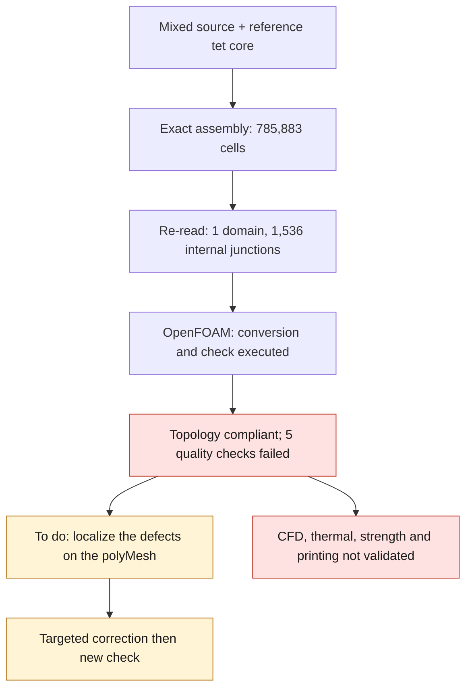

# M64 — hybrid domain assembled; OpenFOAM check executed and refused

Follow-up executed: [export and localization of the defects](M64_DEFECT_LOCALISATION_20260909.md).
The mesh described below remained unchanged; its five refusals still stand.

**The assembly of the gas domain is complete and cross-checked. OpenFOAM finds
the 785,883 cells, a connected domain and three boundaries, but refuses
the mesh quality on five checks. No physical solver is launched.**

This batch executes the three steps announced in the [previous trial](M64_NATIVE_SIZE_TRIAL_20260909.md).
It modifies neither the Porsche outline, nor the CAD master, nor the dimensions. It uses
the existing Kali machine, with no new rental or Vast spending. It is not evidence
of 700 hp performance, strength, heat dissipation or printability.

## Assembly actually performed

The core `e873b8ae…` replaces the 175,753 old tetrahedra of the mixed domain
`4f41153f…`, keeping the 67,200 hexahedra and 384 pyramids.
The 718,299 new tetrahedra give **785,883 cells and 223,155 points**.
The surface pilots `7af7f207…` and `2de5fd52…`, whose boundary differs,
are not incorporated.

The saved coordinates, vertex order, identifiers and
groups of the kept cells and of the 99,470 external faces remain exact.
The core nodes are connected through a binary64 coordinate bijection;
its interior nodes and elements receive collision-free identifiers.
The **1,536 tetrahedron/pyramid junction triangles become internal**,
never walls. The 384 quadrilateral pyramid/hexahedron junctions are
also recovered.

The 3,568 internal source faces are omitted from the boundary list after
checking their two owners. The 6,599 auxiliary 0D/1D elements,
without a physical group, are explicitly omitted from this finite-volume export.
All exported points are used by cells. The sources remain
intact; no omission constitutes the removal of a CAD detail.

The ASCII MSH 2.2 export passes two exact re-reads, binary64 values included.
It keeps entity labels and element groups, **not the node classes
or UV parameters of format 4.1**. 3D entity 1 / group `air` 100
is reused for the core following the convention observed in the source;
this is neither the creation nor the certification of a CAD entity.

A separate re-read reconstructs the correspondences and all
incidences: no duplicated cell, no non-manifold face, no missing
orientation opposition at the junctions, one connected component.
These connectivity checks do not prove the global absence of geometric
overlaps. The assembly takes 40.879 s and the re-read 17.556 s.

## OpenFOAM Foundation 14 result

A copy of the case is run under the pinned local x86 image. Four utilities
only: `gmshToFoam`, `transformPoints`, `createPatch`, then
`checkMesh -allTopology -allGeometry`. The 0.001 m/unit scale is applied
once only and remains an assumption, not a calibration of the scan.

The log identifies **OpenFOAM 14-7b05503f98a8**. The three patches are
`walls` (98,021 faces), `receiver_outlet` (1,191) and `inlet` (258).
The topological check, point usage, cell volumes and
junctions pass. The log nevertheless ends with **Failed 5 mesh checks**:

| Failed check | Reported count | Measured extreme |
|---|---:|---:|
| High-aspect-ratio cells | 10 | Maximum ratio 54,610.283 |
| Highly skewed faces | 18 | Maximum 36.679 |
| Low determinant, threshold 0.001 | 2,305 | Minimum 0 |
| Low interpolation weight, threshold 0.05 | 1,491 faces | Minimum 9.5681 × 10⁻⁶ |
| Low volume ratio, threshold 0.01 | 137 faces | Minimum 9.5682 × 10⁻⁶ |

In addition, 3,545 faces exceed 70° of non-orthogonality (maximum 89.953°)
and five edges are reported as too short. These are warnings distinct
from the five failed checks. The families may overlap: their counts
do not add up to a total of defective cells. The zero determinant
is the OpenFOAM conditioning indicator, not evidence of a zero volume;
the volume check passes in the same log.

The four utilities exit with code 0. The worker deliberately exits
with **code 2** because the log refuses the mesh. This behavior
is necessary: the [official checkMesh code](https://github.com/OpenFOAM/OpenFOAM-14/blob/master/applications/utilities/mesh/manipulation/checkMesh/checkMesh.C)
can return 0 despite failed checks. No threshold is relaxed.

The container has four CPUs and 4 GiB, no network, with inputs
read-only. The OpenFOAM log shows `nProcs: 1`: four authorized CPUs
do not mean a four-process MPI run. The total time,
cleanup included, is **17.719 s**; no timeout or OOM. The exact container
is deleted, its absence re-verified, and the inputs remain unchanged.
The supervisor flags `diagnostic_completed` and `process_completed_and_cleaned`
remain false because they require an accepted mesh: here the four
steps did complete, but with a quality refusal.

## Targeted next steps, without changing the silhouette

1. On a copy of the **saved and pinned polyMesh**, export the sets
   of defective cells/faces using the options supported by this version.
   Do not reconvert the domain for this localization.
2. Cross their identifiers with `owner/neighbour`, the cell types,
   the boundaries and the 1,536 interfaces. Determine whether the defects come
   from the tets, the layers or their transitions before choosing a correction.
   The logs alone do not make it possible to blame a particular CAD face.
3. Also verify MSH → polyMesh preservation under renumbering and scaling,
   with an explicit serialization error. The existing guard on `walls`
   covers only the change of patch type, not the whole conversion.
4. Correct the localized defects, then redo the full check without
   lowering the requirements. CFD then requires a review of the exact case and
   the application of the balance/convergence criteria already defined.

The historical refusals on the native domain are still present. Even a future
`Mesh OK.` would certify neither the scale, nor the M64 interfaces, nor the twin-turbo
loads. The prepared cold-bench case is not a cooling computation
of the cylinder head and its physical fields are not solved in this batch.

## Role of the software in the photo

The [full stack](M64_MULTIPHYSICS_EXECUTION.md) remains the integration framework.
[OpenFOAM](https://openfoam.org/) is used for flows and transfers;
[Elmer](https://github.com/ElmerCSC/elmerfem) can handle solid thermal
and structural analysis. Their presence does not validate the model of this cylinder head.
[Ditto](https://eclipse.dev/ditto/) manages the twin's state and
[Mosquitto](https://mosquitto.org/) carries the MQTT messages: these are not
physical solvers. [PhysicsNeMo](https://docs.nvidia.com/physicsnemo/latest/user-guide/model_evaluation.html)
comes in as a surrogate model evaluated on suitable references,
not as a replacement for computations still refused. None of these additions was
installed or run by this batch outside the OpenFOAM path described.

The **41 targeted tests** pass: 14 assembler, 10 re-reader, 17 supervisor.
`make check` ends with code 0; optional native tests are skipped
depending on the available dependencies. This repository check is not an engine test.
The digests and results are in the
[evidence register](../../twins/m64-cylinder-head/evidence/geometry-checkpoint-20260908.json),
entry `gas_hybrid_openfoam_diagnostic`. The private meshes and their coordinates
are not published. No thermal, mechanical or engine gain is credited.

