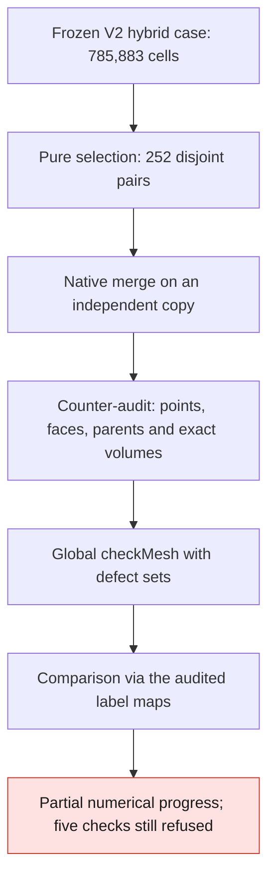
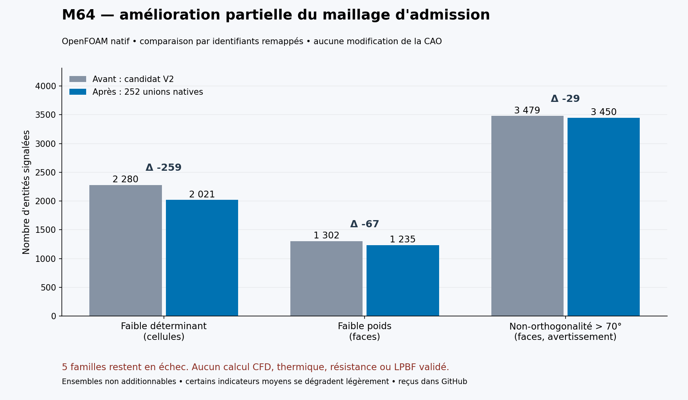
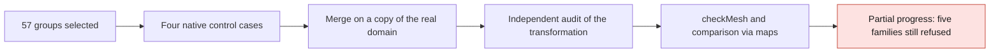

# M64 — pairwise correction of the hybrid mesh

The [57-group supplement](#supplement--57-groups-of-threefour-tetrahedra)
extends this first batch. The results for the 252 pairs below remain historical.

**252 tetrahedron unions were actually run in OpenFOAM: 259 fewer
low-determinant cells, 67 fewer low-weight faces and 29 fewer excessively
non-orthogonal faces. No new defect in the nine sets compared after label
matching. The five quality families are nevertheless still refused: no CFD,
physics or LPBF admission.**
The starting point is the [conservative correction of 189 vertices](M64_APEX_TRANSITIONS_20260909.md).

## Procedure actually run



The selection examines 9,143 internal faces; 316 pairs are individually
eligible, and 252 remain after excluding cells already used.
It reuses the predicates for rational convexity, determinant, elongation and
face quality. The [native concavity/flatness margin](https://github.com/OpenFOAM/OpenFOAM-14/blob/7b05503f98a85be88af930df48623b4d152bfc35/src/meshCheck/primitiveMeshCheck/primitiveMeshCheck.C#L1069-L1174)
is kept: weak convexity would not be enough to avoid the historical refusal.
The 1,502 affected neighboring faces are re-checked jointly, without
lowering the thresholds. These predictions do not replace the native results.

## Conservation verified on the copy actually written

The [native producer](../../twins/m64-cylinder-head/source/flowbench-intake/agglomerate_tet_pairs/agglomerateTetPairs.C)
removes only the 252 shared internal faces. It produces **785,631 cells**:
717,795 tets, 67,200 hexes, 384 pyramids and 252 six-faced polyhedra.
The domain remains a single component; no CAD or engine interface is modified.

The **223,155 points** remain exactly identical in binary64, after writing at
17 digits and reading back. The retained faces, their orientations with a
consistent owner/neighbour swap, the **99,470 external faces**, their patches
and the `air` zone are preserved through cross-checked maps.
Each polyhedron has exactly the boundary of its two parents; its rational
volume is their exact sum over the represented coordinates.
Hexes, pyramids and their interfaces take no part in the merges.
This proof of transformation is not a proof of continuous conformity to the CAD.

## Native results and attribution of the gains



*Native checkMesh defect counts before and after the 252 unions; it shows mesh quality counts, not any physical field or an accepted mesh.*

| Native set | V2 before | After unions | Checked attribution |
|---|---:|---:|---|
| Low cell determinant | 2,280 | **2,021** | 259 parents replaced by unflagged unions |
| Low interpolation weight | 1,302 | **1,235** | 34 faces removed + 33 kept and now unflagged |
| Non-orthogonality > 70° | 3,479 | **3,450** | 16 faces removed + 13 kept and now unflagged |
| Cells with two internal faces | 465 | **262** | 203 parents replaced by unflagged unions |
| Cells with zero/one internal face | 2 | 2 | Same source cells |
| Excessive elongation / excessive skewness | 10 / 18 | 10 / 18 | Same source entities |
| Low volume ratio / points on short edges | 137 / 5 | 137 / 5 | Same source entities |

The comparison does not naively subtract renumbered labels: it uses the
face/point maps and the parent groups of the cells.
**No union is flagged in the compared cell sets; no kept singleton, point or
face introduces a new defect there.** A removed face is not presented as a
kept face whose quality has been repaired.
The sets overlap and do not add up to a total of unique defects.

Not all the averages improve: non-orthogonality **21.555015° →
21.556013°**, weight **0.434744385 → 0.434743558**, volume ratio
**0.787637439 → 0.787518094**. They degrade slightly; the number of
cells/faces has also changed. The determinant minimum remains zero.
`checkMesh` ends normally with process exit code 0, but writes
**"Failed 5 mesh checks."**: that code is not an acceptance of the mesh.

## Duration, evidence and limits

OpenFOAM Foundation **14-7b05503f98a8**, pinned Linux/amd64 image, ran on
Kali under **4 CPU / 4 GiB** caps, with no network and no new Vast spending.
Compilation: 1.418 s; merge: 2.319 s; counter-audit: 15.552 s;
`checkMesh`: 11.095 s. The complete process and its cleanup take
**31.482 s**, with no timeout or OOM; the exact container is removed and absent.
The independent comparison of the sets takes 1.361 s; its ten tests pass.
The pure selection takes 10.024 s and its nine tests pass.

The last uncorrected pyramid star is the subject of two distinct pure
studies: displacement along the normal, then a bounded 3D search.
They yield **no admissible candidate and no new mesh**; the 3D search does
not prove a general impossibility. Their refusals are kept.
No global absence of intersections and no engine correlation is inferred
from the conservation of this batch alone.

<a id="couverture-géométrique-composée--portée-distincte"></a>

## Composite geometric coverage: a separate scope

An independent review accepts the narrow wording: **composite numerical
coverage verified under a declared native criterion**, for the source gas
domain and its BRep partition into 17 solids, not for their equivalence to
the mesh. The new computation re-reads the pinned receipts: 188 oriented
occurrences, 32 internal interfaces cancelled exactly, exhaustive coverage of
86 source faces by 124 external faces in 52 groups, 102 valid native
subtractions with no face/edge residue and 136 intersections with no
intersection solid. It also re-checks the 312 warning files.

The two warned subtractions remain warned. For their group, the complete
native capture separately establishes the identity of the elements that
define the three faces; the serialization differences attributed to edge
regularities do not modify the defining surfaces or contours.
Since the old raw binary streams were not kept, this conclusion explicitly
rests on the pinned capture and its decoders, not on a new reading of the
native streams.

For a regular oriented domain, `V = (1/3) ∫boundary x·n dA`:
the contributions of shared interfaces cancel before integration.
The exterior equality remains under the native Boolean criterion, with
effective fuzzy `1e−7` scan units: **neither a Hausdorff bound nor a
guaranteed volume error bound**. The recomputed relative deviations of the
adaptive quadratures range from `1.288e−10` to `1.834e−12`; the GK
cross-computation gives `9.162e−12`. The historical non-adaptive deviation
`1.597e−8` and its refusal remain on record.

This composition takes 0.034 s, with 12 targeted tests also passing in
independent review. It constitutes no CFD/CHT admission, no certification of
M64 scale or interfaces, and no print qualification.
The receipt `5cb8a63ce7ba…` is referenced separately from the merges.

## Reproducing the public figure

The script reads the counts from the register, without importing any geometry:

```sh
python3 twins/m64-cylinder-head/source/render_hybrid_pair_quality.py
```

It requires Matplotlib; the published render used version 3.10.7.
The native producers, private inputs and logs remain linked by SHA-256.
The tests for selection, transformation, supervision, local searches and
mapped comparison pass: 78 targeted tests, plus the 12 composition tests.
`make check` also finishes with exit code 0; the optional native tests
without their environment are explicitly skipped. This software success
does not contradict the five failing mesh quality checks.

Re-checked digests of the private receipts: native `feaf402cf025…`,
transformation `c9ce6b2f6220…`, mapped comparison `db85a5861bfd…`, process
`74a097f1411e…`; studies of the last star `50215fc2bee4…` and `14c915c27166…`.
The complete evidence is referenced in the [geometry register](../../twins/m64-cylinder-head/evidence/geometry-checkpoint-20260908.json)
and the [checkpoint](M64_GEOMETRY_CHECKPOINT_20260908.md). No raw mesh,
coordinate, private entity identifier or account data is published here.

<a id="complément--57-groupes-de-troisquatre-tétraèdres"></a>

## Supplement — 57 groups of three/four tetrahedra

**The second native batch replaces 214 tetrahedra with 57 polyhedra:
58 fewer low-determinant cells, five fewer low-weight faces and two fewer
excessively non-orthogonal faces. No new defect in the nine compared sets;
the five quality families are still refused.**


*Native checkMesh defect counts after the 57-group batch; it shows mesh quality counts, not a physical field or an accepted mesh.*

The selection comprises 14 groups of three parents and 43 of four.
The 428 affected neighboring faces are re-checked jointly. The search is
bounded, not exhaustive; it does not claim to have found every possible
improvement. Hexes and pyramids are not merged.



The parent graph may contain cycles: **214 internal faces** are removed, but
only **157 cells** disappear (`214 − 57`).
The result contains 785,474 cells and 1,688,427 faces. The independent audit
rebuilds the groups without reusing the merge algorithm, and checks the
oriented boundaries, convexity and exact volume sums over the represented
binary64 coordinates. The **223,155 points and 99,470 external faces** are
preserved, as are the patches and the `air` zone. The CAD does not change.

| Native set | After pairs | After groups | Attribution |
|---|---:|---:|---|
| Low determinant | 2,021 | 1,963 | 58 parents replaced by unflagged unions |
| Low weight | 1,235 | 1,230 | 2 faces removed + 3 kept and now unflagged |
| Non-orthogonality > 70° | 3,450 | 3,448 | 2 kept faces now unflagged |
| Two internal faces | 262 | 208 | 54 parents replaced by unflagged unions |
| Elongation / skewness | 10 / 18 | 10 / 18 | Same source entities |
| Low volume ratio / short edges | 137 / 5 | 137 / 5 | Same source faces / points |
| Zero/one internal face | 2 | 2 | Same source cells |

The sets do not add up. A union is a new cell, not an in-place repair of each
of its parents. The determinant minimum remains zero. The averages of weight
(`0.434743558 → 0.434737519`) and volume ratio (`0.787518094 → 0.787457211`)
drop slightly; non-orthogonality improves (`21.556013° → 21.554342°`).
Process exit code 0 from `checkMesh` still comes with
**"Failed 5 mesh checks."**.

### Pre-check incident, kept on record and corrected

The first trial compiles and merges the small synthetic case, then stops in
the audit reader: the native uniform lists `6{0}` and `3{0}` were not
accepted. This format is confirmed in
[OpenFOAM 14, UListIO.C](https://github.com/OpenFOAM/OpenFOAM-14/blob/7b05503f98a85be88af930df48623b4d152bfc35/src/OpenFOAM/containers/Lists/UList/UListIO.C#L84-L106).
The real domain is not merged in this trial; the source is intact and the
container removed. Its receipts remain on record.

A new revision accepts only `N{integer}` with bounded expansion, without
relaxing the geometric checks or the quality thresholds. It passes 19
transformation/reading tests and five cleanup tests. The new native trial
passes one convex case and three expected refusals: incomplete cycle, point
becoming orphaned, group too large. Only then does it process the real domain.
The comparison of the sets passes its nine tests and finishes in 1.472 s.

The complete real process takes **31.988 s**, under 4 CPU / 4 GiB on Kali,
with no OOM or timeout. Intact inputs and the container's absence are
re-verified. **New Vast spending: 0 USD for this batch.** No new CFD,
thermal, strength, LPBF printing or power qualification is established.
The role of OpenFOAM, Elmer, PhysicsNeMo and Ditto/MQTT remains the one in the
[execution plan](M64_MULTIPHYSICS_EXECUTION.md#précision-du-9-septembre--calcul-ia-et-banc-séparés),
not that of a fully executed chain.

The pure search on the last transition also tests eight connectivity states
and then 337 3D positions, with no admissible candidate. A face created by
the flips reaches 81.42° and does not depend on the moving vertex: this local
search is not enough. No new mesh is exported from it, without claiming a
general impossibility. The next step must widen the local remesh, with an
explicit and controlled CAD approximation tolerance, while keeping the master
and its silhouette.

Private SHA-256 receipts: native `865b2e82697e…`, audit `3ed282c30ff1…`,
comparison `96d505ee63f2…`, process `6bdc00c03097…`; first refusal
`ea0bb38660af…`. The [register](../../twins/m64-cylinder-head/evidence/geometry-checkpoint-20260908.json)
contains the full digests, keeping all earlier entries.
To reproduce this chart:

```sh
python3 twins/m64-cylinder-head/source/render_hybrid_pair_quality.py --groups
```

Without `--groups`, the script still reproduces the chart of the first batch.
`make check` finishes with exit code 0; the optional tests without their
runtime are explicitly skipped. An independent review cross-checks the text,
the PNG, the counts and the digests against the receipts. These software
successes lift neither the five quality refusals nor the missing physical
validations.
