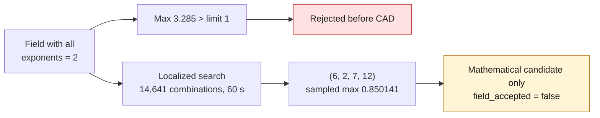

# Audit of a boundary-preserving deformation — September 7, 2026



## Result: initial field rejected, promising numerical localization

The first field, with all exponents equal to 2, is rejected. A separate
numerical search, then authorized and limited to 60 seconds, finds a localized
field whose sampled maximum is **0.850141**, below the limit of 1. It remains
a **mathematical candidate**, not accepted CAD: neither the continuous corridor
nor a modified solid is checked yet.

**Follow-up to this audit:** the 12 × 23 field was built and then rejected;
a lower-degree 10 × 11 candidate then passed the local CAD checks. See the
[consolidated Bernstein repair dossier](M64_LOCAL_BERNSTEIN_REPAIR_20260907.md).
The present document keeps the results and limits of the initial numerical
step.

## First field rejected before CAD construction

The audit uses the **real bilinear face of the private F53 STEP** and its
neighboring cylindrical surface. It creates no substitute geometry. The tested
field can preserve the five boundaries analytically, but it reaches **3.285
scan units** inside the trimmed face, while the limit imposed for this trial is
**1 unit**. It is therefore rejected: no new patch, solid, STEP or physical
result is produced by this audit.

The provenance remains a research reconstruction from the 935 scan, not a
dimensionally validated M64 cylinder head. Scan units are not treated as
certified millimeters.

## Mathematical hypothesis verified on the source

Four boundaries are isoparametric. The fifth, non-isoparametric, is shared
with an **OCCT analytic cylindrical surface**, identified by the common
topological edge; it is not a cylinder fitted to an image. The coordinates,
face indices and parameters remain private.

For the bilinear source surface `S0(u,v)`, with `u,v` normalized:

```text
F(X) = distance(X, cylinder axis)^2 / radius^2 - 1
E(u,v) = u(1-u)v(1-v)
D(u,v) = C E(u,v)^2 F(S0(u,v))^2
S1(u,v) = S0(u,v) + D(u,v) n
```

`n` is the direction of the previously tested displacement toward the air
passage. `C` imposes `D = 0.85` at the same target point. The polynomial has a
bidegree of at most `8 × 8`: no `BRepFill` interpolation is used.

The squared factors impose, in exact arithmetic, zero value and zero gradient
on the four iso edges and on `F = 0`. This would preserve the surface and its
derivatives **along these boundaries of the source surface**; it is not a
claim of initial G1 continuity of the whole assembly. The OCCT curves are
evaluated numerically, so the residuals are measured separately, without
declaring them exactly zero.

## Checks actually run

- Projection of the target point onto the source surface: error `7.11e-15` unit.
- At the target point: `F = 7.25825`, `E²F² = 0.0845102`, `C = 10.0580`.
  The normalization is therefore not close to the singularity threshold `1e-20`.
- On **121 points of the cylindrical trim**: `|F|max = 1.63e-9`,
  `|D|max = 1.28e-18` unit; maximum normalized derivatives
  `1.66e-11` in U and `4.04e-11` in V.
- On **121 points of each of the four iso edges**: `|D|max ≤ 8.42e-13`,
  maximum normalized derivatives `7.67e-12`.

The selection of the face domain uses `BRepClass_FaceClassifier` on the
parameters of the original surface, keeping the `IN/ON` states.
Points outside the trim do not contribute to the maxima below.

| Parametric domain grid | Points kept in the face | `max(abs(D))`, scan units | `max(abs(∂D/∂u))` | `max(abs(∂D/∂v))` |
|---|---:|---:|---:|---:|
| 41 × 41 | 1,597 | 3.27694 | 13.5117 | 18.6932 |
| 81 × 81 | 6,250 | 3.28468 | 13.5881 | 18.6938 |

The derivatives are per unit of normalized parameter, not dimensional slopes.
The projection ratio of the cross product of the deformed derivatives onto
that of the source remains positive at the tested points (minimum `0.825486`).
**This is not a global self-intersection check** and does not compensate for
the amplitude overshoot.

Converting the coefficients to the Bernstein basis gives `11.9944` as the
absolute maximum of the coefficients over the entire parametric rectangle.
This floating-point bound is not rounded by intervals and also concerns the
part not kept by the trimming: it is not presented as a certified bound of the
maximum on the face. The two grids are not a demonstration of convergence or a
global maximum either. **A single interior point beyond 1 is nevertheless
enough to reject this field.**

## Reproducibility and integrity

Script: `twins/m64-cylinder-head/audit_transition_implicit_constraint.py`.
Four unit tests check the polynomial product and derivation, the vanishing of
an edge factor, the linear elevation to Bernstein and the normalization/bounded
search on a synthetic symmetric field. They do not replace the native CAD audit.

Real run in OCP on Kali, limited to two CPUs, 4 GiB and 300 s.
Private report:

```text
/tmp/917-f50/out/m64-implicit-bubble-audit-20260907.json
SHA-256 55548191758d4bd9279d2057a80f787e1892a0114df01331fa43dbd7f12fecda
```

The master remains unchanged:
`700baea66bc72cdb6aee529e21b167270ebde11db94b06f8e1e55ee08bdd9bf2`.
The report is left intact; the script's division-by-zero protection was later
moved before the computation of `C`, without changing the formula or the
non-singular result recorded here.

## Numerical localization search, without CAD construction

The `--localized-search` option replaces the edge factor with
`u^p (1-u)^q v^r (1-v)^s`, still multiplied by `F²`, with each integer
exponent between 2 and 12. The **14,641 combinations** are compared on the
6,250 kept points of the 81 × 81 grid. The normalization at the target point
stays fixed at 0.85; the maximum criterion stays 1. There is no relaxation of
the threshold, no displacement of the point, no new fitted cylinder.

The best combination on this grid is **(6, 2, 7, 12)**.
Its maximum is then checked on a finer grid of the same face:

| Grid | Points kept | `max(abs(D))` | Minimum orientation ratio |
|---|---:|---:|---:|
| 81 × 81 | 6,250 | 0.849251 | 0.982683 |
| 161 × 161 | 24,732 | 0.850141 | 0.982592 |

The target point has exactly the value prescribed in the formula, even when it
does not belong to the grid; the coarse maximum below 0.85 is therefore not a
global bound. The maxima of the derivatives on the fine grid are 6.81980 in U
and 4.99246 in V. No local orientation reversal is observed at the sampled
points. This check excludes neither a maximum between the points nor a
collision with another face.

The required polynomial bidegree is at most **12 × 23**. The factor at the
target point is `1.70801e-6`, so `C = 497,654.8`. This large coefficient is a
scaling, not a sufficient measure of numerical conditioning.
The search evaluates normalized positive factors; it does not expand this
degree-23 polynomial in the power basis. Any conversion to Bernstein poles
must still be checked numerically. The components of `∇log(D)` at the target
point are `(0.0117811; 0.262300)`; the point is not an exactly imposed
stationary maximum.

Exponents all greater than or equal to 2 preserve the analytic property of
zero value and gradient at the edges. The curve residuals measured above
concern the first field; no new surface/edge check of a localized CAD patch is
claimed.

Native run bounded to two CPUs and **60 seconds**, finished with `exit 0`,
with no STEP generated. Separate private report, first report kept:

```text
/tmp/917-f50/out/m64-localized-implicit-bubble-audit-20260907.json
SHA-256 458cac4e13d5f5569c324f5ed98cb65c50c634dc6c386cc407eab60e8cf87977
```

The master's SHA was again verified unchanged after the search.
`field_accepted` and `cad_construction_authorized` remain false in the report.
The localization passes only the **sampled** amplitude and orientation
criteria; it must still pass the corridor, conversion and CAD kernel checks,
then the matched radii.

No thermal simulation, strength calculation or LPBF qualification is claimed
by this step. Manufacturing and engine installation remain prohibited.
