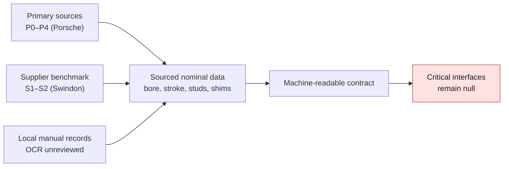

# M64 — initial register of interfaces and sources

Status: documentary research, 6 September 2026. User target: M64 family
964/993, four-valve turbo development with a two-valve comparison.
This register freezes neither a variant nor a fitment compatibility.

## Usable result

The official German Porsche catalogues are accessible: the old URLs
`D_964_KATALOG.pdf` / `D_993_KATALOG.pdf` must no longer be used as entry points.
The current catalogue provides part numbers, restrictions and a few component
dimensions; it is not a dimensioned cylinder-head drawing. The sources found make
it possible to continue without inventing a stud pattern or immediately requesting a
new scan. They are not yet sufficient to constrain every axis in CAD.

## Verified primary sources

| ID | Source and access | Use |
| --- | --- | --- |
| P0 | [Porsche Classic Originalteile Katalog, German](https://www.porsche.com/germany/accessoriesandservice/classic/originalpartscatalogue/) | Official entry point, 964 and 993 links open |
| P1 | [PET 964, Kat. 013, edition 24.07.2017](https://files.porsche.com/f/332100/b26b3c7233/kat013-d-911-94-katalog.pdf) | 794 pages; PDF pages 55–59, plates 102/103, examined for cylinder/cylinder head |
| P2 | [PET 993, Kat. 017](https://files.porsche.com/f/332100/db8e7dba1c/kat017-d-911-98-katalog.pdf) | 674 pages, initial access confirmed; detailed interface extraction still to do, later read calls errored |
| P3 | [Porsche: White giants](https://newsroom.porsche.com/en/history/porsche-history-white-giants-991-turbo-964-turbo-3-6-993-turbo-s-13863.html) | Engine dimensions of the Turbo 3.6 and Turbo S, not an interface drawing |
| P4 | [Porsche: Die 911 Turbo Generationen](https://newsroom.porsche.com/de/pressemappen/50-Jahre-Porsche-Turbo-36122/Die-911-Turbo-Generationen.html) | Official German context of the generations |
| S1 | [Swindon, M64 24-valve product](https://swindonpowertrain.com/products/24-valve-porsche-911-m64-cylinder-head-kit/) | Manufacturer-declared compatibility, not validation of our design |
| S2 | [Swindon, product sheet, 6 pages](https://swindonpowertrain.com/wp-content/uploads/2025/10/M64-24V-Cylinder-Head-Kit-Product-Sheet-0923.pdf) | PDF pages 3–4: contents and technical data |

The PDFs remain with their publishers; no manual or proprietary illustration
is added to the repository. The page numbers below are PDF pages, base 1.

## Nominal data actually sourced

| Data | Published value | Scope/source | Limit |
| --- | --- | --- | --- |
| Bore × stroke | 100 × 76.4 mm | 964 Turbo 3.6 and 993 Turbo S, P3 | Neither register diameter nor tolerance |
| Compression ratio | 7.5:1 / 8.0:1 | Respectively these two models, P3 | Historical references, not targets for our project |
| Stud, item 5 | BM 8 × 20; 99906200602 | P1 p.58, 103-00 | Position/engagement not dimensioned |
| Stud, item 6 | BM 8 × 50; 99906204102 | P1 p.58 | Position/engagement not dimensioned |
| Stud, item 7 | BM 8 × 22 / BM 8 × 30 | M64.01/02/03 / M64.50; P1 p.58 | Explicit variant difference |
| Stud, item 8 | BM 6 × 30 / BM 8 × 120 | M64.01/02/03 / M64.50; P1 p.58 | Do not merge these bills of materials |
| Valve shims | 0.25; 0.5; 1.5 mm | P1 p.59 | Not an installed spring height |
| Swindon intake/exhaust valves | 40 / 33 mm | S2 p.4 | 4V benchmark, non-OEM |
| Swindon maximum lifts | 11.5 / 9.6 mm | S2 p.4 | Not a complete cam profile |
| Durations at 1 mm | 255° / 245° | S2 p.4 | Event timing not defined here |
| Swindon bore range | 95–102.7 mm | S2 p.4 | Does not define our register |
| Stated cylinder-head volume | 16.6 cm³ | S2 p.4 | Not the assembled clearance volume including the piston |

## Differences to keep

P1 distinguishes M64.01/02/03, M64.50 and M30.69. It lists distinct
cylinder-head nuts (96410438201 / 96410438220) and a sealing change from 1991 with
a reference to TI group 1, document 1570 (02/00). Sealing part number: 96410411520.
The TI must be consulted before reconstructing the sealing face. Exploded views are
not contractual dimensional drawings.

P3 distinguishes the 964 Turbo 3.3 (M30) from the Turbo 3.6 (M64). Our common M64
reference therefore does not automatically include every 964 Turbo.

Swindon states that it reuses the M64 lubrication, cylinders, cases, chain
drive/covers and exhaust (S1). S2 specifies "standard 993" in the installation
paragraph: this nuance calls for a 964/993 check, not an assumed
equivalence. The 997 GT3 intake and the 718 coils are announced compatibilities
of the kit, not of our cylinder head. The kit also includes cam carriers,
camshafts, rocker fingers/shafts and oil returns: four valves are not a simple
modification of the holes of a two-valve cylinder head.

The kit's nominal 11.5–12:1 ratios are associated with the Swindon pistons (S2).
They are not a turbo compression recommendation. The announced speed of
12,000 rpm is not our validated speed.

## Interfaces still not dimensioned in this register

| Interface | Evidence still required | Next authorized work |
| --- | --- | --- |
| Main stud pattern, dowels | Coordinates, axes, tolerances, datum planes | PET then manual/TI or traceable supplier drawing |
| Cylinder/cylinder-head register and sealing face | Diameters, depths, groove, flatness and surface finish per version | Read TI 1570 and cross-check cylinder/gasket part numbers |
| Valve train and cam carriers | Axes/bearings, height, chain entry, clearances, accessory drive | Separate 964 and 993; define the new 4V assembly |
| Intake/exhaust | Layout, flanges, passages, fasteners and tolerances | Reconcile PET, gaskets and supplier drawings |
| Lubrication | Positions and cross-sections of feeds/returns, seals and available flow | Do not size oil cooling from a photo |
| Seats/guides and spark plug | Axes, interference fits, lengths, materials, hot clearances | Data from the selected supplier and controlled design |

A shared part number does not by itself prove that all interfaces are
identical. No dimension is measured from a photographic perspective.
The 90 mm dimension of the old 917 model is not transferred to the M64; moving
to 100 mm does not mean scaling the whole scan uniformly.

## Bounded next step

Extract the cylinder-head plate from the 993 PET, compare the bills of materials with
the 964 plates above, then obtain the service data relating to the sealing face.
Then publish a machine-readable contract where each dimension carries variant,
source/page, nominal, tolerance and status. Unknowns remain null; they
become neither CAD defaults nor validated simulation parameters.

## Targeted search in local data already present

The register `catalog/manual/993-workshop-manual-measurements.json` contains
2,496 records (111 technical data, 195 torques and 2,190 occurrences).
The source `catalog/sources/src-porsche-workshop-manual-993.json` identifies a
**993 Carrera** manual, without a Turbo volume; the rights prohibit
redistribution of the manual. The facts and their locators can be tracked
without copying the pages.

| Lead found | Internal locator | Confidence and decision |
| --- | --- | --- |
| Stud M8 × 22 | PDF 148, line 46 | OCR not reviewed; no layout |
| Dimension "g" 8.00–8.015 mm | PDF 153, line 17 | Passage relating to guides; feature/procedure to reread |
| Guide value 0.06–0.08 mm | PDF 153, line 56 | Do not call it a running clearance or interference fit without full context |
| Valve dimensions, notably "b" 7.970 − 0.012 mm | PDF 155, line 22 | Carrera/RS columns mixed by OCR; no promotion to CAD |
| Intake dimension "A" 36.7 + 0.3 mm and 37.2 + 0.3 mm | PDF 157, line 35 | Variant assignment and definition of A unresolved |
| Cylinder head: 20 Nm then 90°; cam carriers: M8, 23 Nm | Structured table PDF 60 | Torques/procedure, not center distances nor a directly computable preload force |

Pages 152–157 appear in the global list `manually_checked_pages`, but
the occurrences individually keep `ocr_unreviewed`. That list is not
sufficient to relabel each dimension as verified. In particular, the OCR dimension 0.80 mm p.152
must not become a nominal guide clearance without reading the wear-check
procedure.

`catalog/specifications/porschefanatics-993-technical-data.json` finds
bore 100 and stroke 76.4, but with corrupted OCR units and status
`ocr_transcription_unverified`. These are transcriptions related to the same
manual, not an independent cross-check. P3 remains the retained source for
the historical turbo values. The contract now holds these local
leads in a separate section; all critical interfaces remain null.

### Verification of page locators, 7 September 2026

The local PorscheFanatics script `scripts/ingest-993-manual.mjs` names
`docs/993 Workshop Manual.pdf`, `/tmp/manual-ocr.pdf` then
`data/raw/993-manual/layout.txt` as the extraction chain. The PDF of the current
PorscheFanatics checkout and the temporary PDF are absent; the raw directory
was not found in the identified current and iCloud checkouts. No
render of pages 152–157 was located through these targeted paths. The source
register contains no other locator for the copy.

There was therefore **no new visual reading** of these pages, and no
requalification of any dimension. A commercial manual reference and an earlier
mention of consultation do not prove that the copy is accessible
today. The next useful input is the exact file or its page renders
from a copy whose access is authorized, not a second reading
of the same OCR. This does not suspend the search of the official catalogues nor the
independent work on these interfaces.

An additional local candidate named `Porsche PDF.pdf` was identified by
its metadata and its first rendered page, per the PDF skill: a
158-page document attributed to Dennis Adler, cover "Porsche — The Classic Era"
with Bookey branding. It is not the 1,481-page 993 workshop manual.
Its pages 152–157 are therefore not used as a substitute. No content
of the document and no cover render is added to the repository.

### Repair bulletin found, distinct from the TI sought

The [Porsche Cars North America bulletin 9404 of 8 February 1994](https://www.design911.co.uk/uploads/pdfs/964_Cylinder_TSB.pdf),
identifier 1570, can now be consulted and its figures have been reviewed.
It describes a rework of the mating face for certain Carrera M64.01/02
of 1989–1991: removal 0.10 ± 0.02 mm, maximum 0.20 mm and machined
surface diameter 145 mm (p.4, figure 4). These are **repair** data,
not a dimensional definition of our new cylinder head.

Identity with the TI "1570 (02/00)" and applicability to the turbo M64 are
not established. The CAD contract therefore keeps its interfaces unknown.
[Provenance, conditions and limits of the bulletin](M64_TI1570_ACCESS_AND_REPAIR_SCOPE_20260907.md).
