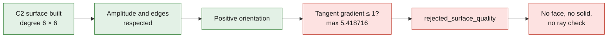

# Local C2 trial: surface built, reinforcement rejected

The reinforcement tried on the thinnest remaining isolated path was **rejected
before any face or solid was built**. The amplitude and the edges
are respected, but the deformation forms a zone far too sharp
for this exploratory geometric check. No new thermal,
mechanical, LPBF or in-solid ray computation was launched.

The source is still the F53 reconstruction derived from reference scan
935, **not a validated M64 cylinder head**. All lengths below are
scan units, whose absolute scale is not certified. The trial is
separate from the [10 × 11 Bernstein candidate](M64_LOCAL_BERNSTEIN_REPAIR_20260907.md)
that had passed its local checks. Both master files are intact.



## Construction actually executed

The initial path is `1.0524179419`. The entry point of the surface was
moved by `0.5475820581` in the direction opposite to the measured ray, with
an exploratory path target of `1.60`. **This target is not a
new solid intersection result**, since the trial stops
before that step.

The chosen support is the largest UV rectangle centered on the target point
and contained in the existing bilinear face. In each local direction,
the factor is `b(t) = 64 t³(1−t)³`, and the displacement is
`D = δ b(s) b(t)` inside, zero outside. The value and the first two
derivatives vanish at the boundaries of the support. OCCT built
a degree 6 × 6 surface; removing the excess multiplicities
of the interior knots succeeded at `1e-12`, giving multiplicity 4, hence
C2 parametric continuity of this surface.

The Bernstein factor `B₃⁶` reaches at most `5/16`; the product reaches
at most `25/256`. The recorded floating-point scalar coefficient, interpreted
as an exact rational, therefore gives the continuous bound:

```text
|D| ≤ 2466090352735025 / 4503599627370496
    = 0.5475820580824797 < 1 scan unit
```

This bound concerns the **scalar field before the native knot
removal**, not a global bound on OCCT rounding errors. The agreement between
the formula and the native surface is verified separately by sampling.

## Results and stop

| Check | Result |
|---|---:|
| Native evaluation points on the surface | 14,641 |
| Maximum formula / OCCT deviation | `7.45e-14` unit |
| Error of the moved target point | `1.59e-14` unit |
| Maximum deviation of the four curves / surface, 121 points per curve | `3.70e-12` unit |
| Maximum sampled native displacement | `0.5475820581` unit |
| Minimum sampled orientation ratio | `0.997802` — positive |
| Maximum norm of the tangent displacement gradient | **`5.418716`** |
| Maximum rotation of the normal | **`79.5427°`** |
| Smallest sampled principal radius | **`0.0082114` unit** |
| Maximum absolute principal curvature, source / trial | `0.012124` / `121.781924` unit⁻¹ |

The slope filter chosen **before the result** is a tangent gradient norm
of at most 1. It is an exploratory geometric filter intended
to exclude a spike, **not a material limit, an LPBF standard or proof
of mechanical failure**. It alone fails in this run. The
rotations and curvatures quantify the degradation; their extrema are
sampled and do not constitute continuous bounds.

Passing C2 means continuity of derivatives; it does not guarantee
low curvature. Likewise, a bounded amplitude and a positive
orientation are not enough to make this reinforcement acceptable. The candidate is
kept as a diagnostic, without sewing, solid STEP export, BOP or
new check of the 42 rays.

## The four edges are not four demonstrated engine interfaces

The existing audit identifies four **isoparametric boundaries of a
reconstruction face**. It does not assign them a mechanical function. The
[F43 generator](../../twins/reference-917-engine/source/build_scan_contour_patch_reconstruction_f43.py)
forms the outer skin by ruled sections between polygonal contours:
this process introduces numerical face boundaries. The data read do not
allow the four edges of the present trial to be individually classified
as a physical interface, a fin edge or a mere seam.

Holding them fixed was therefore a **conservative constraint of this
trial**, not an established Porsche requirement. The rejection establishes neither
the impossibility of thickening the zone, nor the necessity of a spike. Before
another strategy, the real boundaries and neighboring faces must be
attributed; an artificial seam must not be turned into an untouchable physical
boundary. This additional attribution was not executed
during the closure of this trial.

## Reproducibility and integrity

Script: [trial_isolated_transition_c2.py](../../twins/m64-cylinder-head/trial_isolated_transition_c2.py).
Native run finished with exit code 0, status `rejected_surface_quality`,
on Kali, two CPUs, 4 GiB and a 300-second limit. Exit code 0 means here
that the diagnostic finished, **not that the candidate is accepted**. The trial
refuses an existing output directory and modifies no input STEP.

Private artifacts in
`/tmp/917-f50/out/m64-isolated-transition-C2-1743-20260907/`:

- `surface-report.json`, SHA `db2f18928be6cb4e8760990848e1c44369b199f17baeb4f619c314b09765a306`;
- `private-C2-surface.npz`, SHA `8704820f4f82411dbe3591628ff5f80b1be4a677981760ad545c22584cba46a3`.

The hashes were rechecked after the trial: F53 remains
`700baea66bc72cdb6aee529e21b167270ebde11db94b06f8e1e55ee08bdd9bf2`,
and the 10 × 11 Bernstein solid remains
`42057011e25ecc48b215a58e979a0d9bcf4769f2f96f9690b751a81a7bde2cd8`.
The coordinates, poles, STEP and NPZ files remain private.

The [redacted summary](../../twins/m64-cylinder-head/evidence/isolated-c2-surface-rejection-20260907.json)
keeps only the aggregates and the evidence references. The
`engineering:documentation` skill guided presenting the result before the
steps and separating executed checks from steps not performed.
