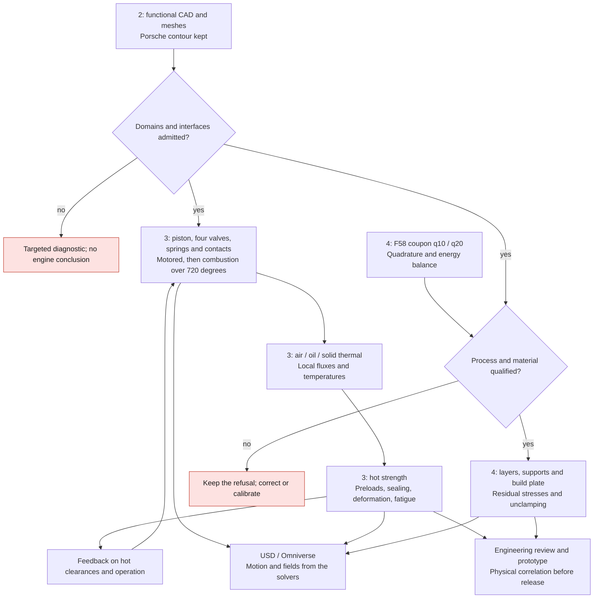

# M64 — jobs 2, 3 and 4 prepared, with no new native computation

Complement: [Neural Concept publications and application to the M64](M64_NEURAL_CONCEPT_20260912.md).

Next run: [two native LPBF coupons and cross-check](M64_QUADRATURE_EXECUTION_20260912.md).
The paragraphs below describe the historical preparation only.

**Delivered:** sub-job manifest, digest-based preparer, two private LPBF
decks, 40 µs energy cross-check and software tests. The
[GPU research and publications](M64_GPU_RESEARCH_20260912.md) motivate the choices.
Piston/valve operation is included explicitly. No rental,
no industrial solver and no contour change in this preparation.
The full jobs are **not yet admitted to execution**.

## Order of work



The thermal→clearances→cycle feedback will need convergence criteria, not
an infinite loop. The manifest describes the first pass and the prerequisites;
it does not execute this graph and does not authorize manufacture.

## 2 — CAD and meshing without a silhouette change

Keep the master; finish the definition of seats/guides, ports,
cam/rocker carriers, oil, threads, interfaces and machining allowances.
Photos and envelope dimensions do not become fitting tolerances.
Any functional change requires justification and a deviation check.

The current gas primal contains **784,675 cells**; five families remain
refused: 1,886 lowD, 9 aspect ratios, 1,223 low weights, 134 volume
ratios, 18 skewFaces. This cold intake gas is neither the solid nor the cooling
air around the fins. The master of the four-seat PhysicsNeMo pilot
is not the latest complete cylinder head with ports.

Next, different trial: TMOP/MFEM on 1,000–5,000 tets with free interior
nodes. Fix the physical boundary, the region limit and the nodes
incident to non-tet cells. **Before rental**: a bijective polyMesh↔MFEM
bridge, a checked 17-digit round trip, a CUDA image and a CPU/GPU tet
control. The upstream 14-digit writer is not suitable as is. These items
are not yet delivered: no real repair argv is invented.

Reinject only on a copy; check volumes/intersections, contour,
patches/zones, the nine sets and the native extrema. The check command remains
`checkMesh -case /output/case-01 -allTopology -allGeometry -writeSets`, in
the pinned Foundation14 image and under a bounded supervisor. Do not confuse its
exit code with `Mesh OK`. A partial gain stays diagnostic; even an
accepted mesh certifies neither interfaces nor mesh independence.

## 3 — Real operation, then thermal and strength

First case: **motored single cylinder without combustion**. Define piston,
chamber, four axes and lifts/phasing over 720°, then check motion,
closures and conservation under remapping. Then add ignition, combustion,
turbo and back pressure. Three distinct pieces of evidence are needed:

1. **Kinematics/clearances**: positions, velocities, accelerations; piston-valve,
   valve-valve, stem-guide and compressed-spring distances, with
   tolerances, expansion and flexing. Cold envelopes are not enough.
2. **Dynamic valvetrain**: masses/inertias, cam/tappet/rocker,
   stiffness/preload/damping, friction and contacts; valve float, seat
   bounce, coil bind, forces on seats/guides. An imposed lift does not
   compute these phenomena.
3. **Open cycle**: intake, residuals, compression, combustion, expansion,
   exhaust. Cantera/Wiebe for the reduced model; moving-mesh OpenFOAM for
   the local fields. Several cycles until periodicity, and angle/time/mesh
   refinement. A single completed 720° does not prove periodicity.
   2V/4V comparison under the same operating conditions.

Reuse to be bounded: the [M64 IVC→EVO model](M64_700PS_VARIABLE_THERMO_20260908.md)
is a closed cycle; F46 launches 36 cases with historical assumptions; F45 is
a one-degree-of-freedom spring screening. The 917's F2 helper encodes
60° phasing between cylinders: **not reusable as is on the six-cylinder M64**.
The moving-mesh OpenFOAM tutorial already tried had only reached 110°, not a full
M64 engine. A tutorial's native commands do not replace this work.

The `p(angle)` outputs and local fluxes feed the gas/solid/air **CHT**.
Oil requires contact conductance, supply/return, viscosity, available
flow and pressure losses. A target crankshaft power fixes
neither peak pressure nor local fluxes. An unassigned face is not adiabatic
by default. The eight interface families remain incomplete in the
[M64 contract](../../twins/m64-cylinder-head/interface-contract.json).

Transfer solid temperatures and forces to the **strength** model: studs,
inserts, sealing, hot deformation, plasticity/creep/fatigue depending on data.
Check frames, coverage and constant field of the mapping, resultants/moments,
reactions and energy conservation. Keep three mesh levels and
a time-step study. The p95 alone can hide a critical point; without a hot
fatigue law, service life remains unestablished.

The thresholds of the F50 control (energy 2%, Tmax 2%, p95 10%, displacement 5%)
stay attached to **that control**, not to the M64 by default. Pre-declare the
numerical budgets and sourced material limits before each comparison.
A hypothetical case can advance the research, not certify the fit.

## 4 — From coupon to virtual manufacturing

**Two decks actually prepared**, not launched: 29 files each,
57,600 cells, 25 ns, 0–40 µs, i.e. 1,600 steps per case. Single common
change: `endTime` 120→40 µs. Single inter-case difference: `nPoints` goes from
`(10 10 10)` to `(20 20 20)`. Keep 380 W, control AlSi10Mg, absorption,
thermal conditions and the 3,300 K ceiling. These quadrature parameters do not
guarantee eight times more points in each cell.

The [ORNL code](https://github.com/ORNL/AdditiveFOAM/blob/9c05c5eb54db03faa342b14b0806efe740de8c44/applications/solvers/additiveFoam/movingHeatSource/movingHeatSources/movingHeatSource.C)
normalizes under a 5% condition: that justifies the test, without presuming that
quadrature explains the ceiling. The limiter's sink remains a separate
numerical term, not physical heat or vaporization.

The historical `controlDict` and `fvSolution` were retrieved read-only
on Kali, with matching SHA digests. The 27 other files also match; the
existing coupled case remains intact. Pinned source receipt:
`7448656ae19242c05e47761117df488e9b4594c12f73b62c020912d68aea75da`.
Private prepared-pair receipt:
`491887d1aa2c84057b54c7982621e9f34b1116d36ad5c6e506a2a72b77760aad`.
Independent re-read: 29 sources and 58 output files checked; only
the planned changes are present.

The energy adapter is supplied and tested on synthetic controls:
1,600 regular, paired steps, six terms re-read with 80-digit Decimal,
the historical 120 µs criterion kept, censored temperatures flagged.
It does not prove the solver's exit code/OOM/cleanup: that evidence
must come from the native supervisor. No new 40 µs result is invented.

Remaining before the native run: runtime, binary, three libraries and material
re-verified on the host; pair supervisor at **600 s total**, network cut,
read-only inputs, output ≤1 GiB, 2 CPU/4 GiB, collection and destruction
verified. No GPU is justified for this small unchanged AdditiveFOAM coupon.

After process qualification, Adamantine is the priority candidate for
layers/supports/build plate and global distortion. Define hot material,
machine/recipe, orientation, toolpaths, activation, heat treatment,
unclamping and machining. GO-MELT/HERMES alone do not give the stresses.
Check thicknesses after machining, powder access and removable supports.
**1.5 mm is a project filter, not a universal manufacturability rule.**
The AlSi10Mg coupon does not select the cylinder head alloy.

## Using the package

- [Manifest of the six sub-jobs](../../twins/m64-cylinder-head/jobs/steps-234-20260912.json):
  dependencies, missing prerequisites, resource envelopes and ceilings.
- [Preparer](../../twins/m64-cylinder-head/source/prepare_jobs_234.py): four
  pinned public receipts copied with the plan and `preparation.json`. It
  launches no command/API. **Exit code zero = folder prepared, not job admitted.**
- [LPBF generator](../../twins/m64-cylinder-head/source/prepare_f58_quadrature.py):
  allowlist/SHA, fresh output, before/after checks; private geometry not published.
- [40 µs cross-check](../../twins/m64-cylinder-head/source/compare_f58_quadrature_40us.py):
  two pinned logs, unchanged F58 parser, no promotion to physical validation.

```sh
# From the real root of the worktree, preparation without rental.
job_prep_dir="$(mktemp -d /private/tmp/m64-job-prep.XXXXXX)"
python3 twins/m64-cylinder-head/source/prepare_jobs_234.py \
  --root "$PWD" \
  --plan "$PWD/twins/m64-cylinder-head/jobs/steps-234-20260912.json" \
  --output "$job_prep_dir/packet"
```

The generator accepts `--reference --source-case --historical-system --output`
with verified private paths. The reader takes
`--q10-log --q10-sha256 --q20-log --q20-sha256 --parser --output`.
Neither launches the solver. Future commands are prepared
for the existing native supervisors, not for a free shell or an LLM
put in charge of each step. The local batch is not a remote compute controller.

## Machines and budget: a snapshot, not a reservation

Verification performed: **37 targeted tests pass** (13 preparation, 10 decks,
14 energy), then the full `make check` finishes with exit code zero. Optional
native tests without an OCP/Trimesh runtime remain explicitly skipped.
The [public receipt](../../twins/m64-cylinder-head/evidence/jobs-234-preparation-20260912.json)
keeps the digests and refusals; these tests check the preparation
software, not the strength or the operation of the part.

Offers re-read through the **OpenBao wrapper** on September 12, with 100 GB of disk
allocated in the request. `dph_total` includes that storage estimate,
transfers separate; availability and real performance to be re-verified:

| Candidate use | Observed offer | USD/h |
|---|---|---:|
| CPU references; secondary GPU | 32 effective CPUs, 128,609 MB RAM, RTX 3080 Ti 12 GB | 0.1626 |
| Compatible GPU geometry | 32 effective CPUs, 64,205 MB RAM, RTX 3090 24 GB | 0.1744 |
| Heavy CPU/RAM if needed | 128 effective CPUs, 257,524 MB RAM, RTX 4060 Ti 16 GB | 0.5344 |

Effective CPUs are not guaranteed dedicated physical cores. No A100
in this momentary selection under 0.80 USD/h; re-read before a heavy FP64
trial. An RTX's FP16 Tensor TFLOPS do not predict that need. The manifest's
RAM/VRAM limits are initial envelopes, not measurements of the M64.

At 0.5344 USD/h, 3 h costs about **1.60 USD** excluding transfers, with no guarantee
of convergence. Proposed first wave: **five paid pilots at 4 USD
maximum each = 20 USD**, plus the Kali coupon with no new rental.
Each batch ≤3 h, setup/collection/cleanup included; a single paid instance
at a time. This is neither a reservation nor an automatic unlocking of the jobs.

User ceiling: **38 USD total**, work allocation 32 USD and reserve
6 USD. Deduct earlier spending and other tasks at preflight; the manifest
is neither a wallet nor a billing guard. Do not re-rent on
timeout. amd64 image/digest, key pair and SSH association, external watchdog and
cleanup must be verified before each launch by the approved wrapper.
The instance inventory was empty; no top-up/rental requested.

Next action: finish supervising the coupon pair and the local mesh
bridge, then **one qualified diagnostic**. Future visuals will distinguish
prescribed motion, solver result and reduced model. Hot coupons,
engineering review and bench correlation stay separate from the preparation.
