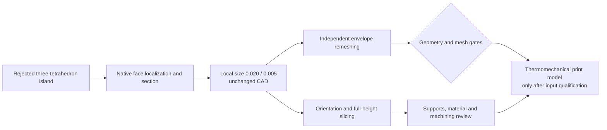
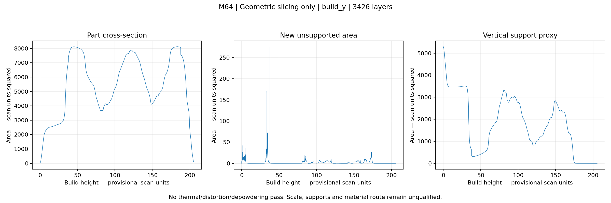

# M64 — local junction and additive-manufacturing screening, 28 September 2026

## Scope and outcome

This continuation follows the [mesh and volume investigation](M64_MESH_VOLUME_TOOLCHAIN_20260928.md).
The native head is **unchanged**. Its local knife-edge has been located and
sectioned; two complete spatially refined native meshes were generated. Neither
passes the existing quality gate. A subsequent fTetWild trial achieves one
connected material region and passes element quality, but its independent audit
still finds 14 coincident vertex records. It is not yet an accepted CAE mesh.
AM results are preliminary geometric screens, not
an accepted thermomechanical build simulation or a released head.

The private body remains bound to SHA-256
`b2b48fe40edd1a20c8e6c0d20d77e6045931189f18330b441b09bcbf4618fc0a`.
The 13-solid assembly is not modified, and no old oval or synthetic block is
substituted. Scan-derived curves, mesh coordinates, renders and CAD remain
private under the [existing source policy](../../twins/m64-cylinder-head/README.md).



## Native cause localization

The [diagnostic](../../twins/m64-cylinder-head/source/wholebody/audit_pinched_junction.py)
reads the exact prior three-tetrahedron component, not a new hand-picked point.
The centroid of its six vertices is compared to trimmed native faces, with
bounding boxes used only to exclude distant faces.

- Nearest faces: **934 and 712**, at distances **0.005467458** and
  **0.005638054** provisional scan units; they share **one native edge**.
- A line through the centroid in the direction between the two nearest native
  points intersects the solid. Native inside/outside classification identifies
  a material chord containing that centroid of **0.011193241 scan units**.
- The actual `Y = centroid Y` CAD section contains **135 edges**. Its overview
  and two local zooms show a wedge tapering to an edge. Display curves are
  sampled with requested deflection 0.0002; the tiny tetrahedra are explicitly
  labelled as an XZ projection, not a cut by that plane.

This is a **local chord**, not a global minimum-wall map. Nor does it prove that
every sharp feature is a pressure wall requiring uniform 1.5 mm thickness.
Faces have not been assigned a manufacturing role from their index alone.
The native material is not disconnected merely because fTetWild's previous
polygon-based output contained an island. Deleting the island would hide that
difference, not fix it.

The native box witness independently checks trimmed-face distance, four section
edges and a known material chord before applying these operations to the head.
Absolute physical scale remains unqualified; 0.0112 scan units is **not** a
certified 11.2-micrometre wall measurement.

## Two full native remeshing trials

The [spatial runner](../../twins/m64-cylinder-head/source/wholebody/run_junction_mesh_trial.py)
reuses the existing pinned native importer and 155-face MeshAdapt selection.
It adds only a recorded temporary size callback, before edge generation:

`size = min(max(1, previous_size), h + 0.4 * max(0, distance_to_centroid - 0.1))`.

Outside the local region, the previous size floor is retained. No CAD healing,
surface replacement, face deletion, element deletion or coincident-node welding
is performed. The companion receipt records the callback; the inherited report
alone does not contain the complete runtime settings. The callback is documented
in the [Gmsh API](https://gmsh.info/doc/texinfo/#gmsh_002fmodel_002fmesh_002fsetSizeCallback).

| Native boundary trial | Tetrahedra | Below minSICN 0.1 | Worst minSICN | Time |
|---|---:|---:|---:|---:|
| Previous 155-face control, before PhysicsNeMo | 241,299 | 160 | 0.01734060 | historical |
| Local h = 0.020 | 244,960 | **122** | **0.01867520** | 48.80 s |
| Local h = 0.005 | 261,860 | 159 | 0.00894408 | 51.84 s |

Both new trials contain one face-connected material region, zero nonpositive
Jacobians, all 4,918 CAD faces and complete tetrahedral boundaries. Mesh nodes
and connectivity survive file readback exactly. The combined export gate stays
false because of the quality failure; this is not a serialization failure.

The 0.020 trial improves both the count and worst quality against its native
control. The 0.005 trial worsens them; **finer is not automatically better**.
Neither is adopted for thermal or structural analysis. Their linear boundaries
still approximate curved CAD, and no 0.040-unit continuous deviation certificate
is supplied.

## Independent envelope remeshing

The [new runner](../../twins/m64-cylinder-head/source/wholebody/run_junction_envelope_trial.py)
feeds the completed h = 0.020 native boundary to fTetWild 0.4.1. It does not change
the input-specific historical runner or its receipts. The new mesh hash and
native report must match the completed spatial-trial receipt before execution.

The first parameter set retains the previous polygon envelope 0.020, target
edge 3, 16 threads, AMIPS stop 8, 80 passes, no simplification and no coarsening.
It has a separate 1,800-second external timeout. Positive volumes, quality,
face-connected components, full boundary and file readback are checked again;
an envelope around a linear mesh remains distinct from native CAD accuracy.

The run completes in **913.65 seconds**, without timeout or input changes:

| Completed refined-boundary fTetWild result | Value |
|---|---:|
| Tetrahedra | **1,121,049** |
| Face-connected material regions | **1** |
| Worst minSICN | **0.144648** |
| Elements below minSICN 0.1 / nonpositive Jacobians | **0 / 0** |
| Missing or extra boundary triangles / nonmanifold faces | **0 / 0** |
| Boundary triangles | 180,168 |
| Mesh-file node/connectivity readback | exact |
| Volume difference from input polygon mesh | **2.091e-5 relative** |

This removes the earlier disconnected-island failure **without deleting any
output elements**. The [independent region audit](../../twins/m64-cylinder-head/source/wholebody/audit_envelope_regions.py)
confirms one region, zero boundary edges with incidence other than two and zero
unbalanced edge orientations. However, it also finds **14 extra vertex records
at already-used coordinates**. Edge checks based on vertex identities do not
resolve coincident geometric junctions. No automatic welding is applied.
Vertex-link manifoldness, geometric self-intersections, native curved-CAD
deviation and boundary-role transfer remain unqualified. Therefore the runner's
`coarse_checks_passed=true` is a **limited numerical result**, not CAE acceptance.
The native CAD, 13-solid assembly and manufacturing status remain unchanged.

The upstream console reports an implausible `winding number 1.79059e+09s` timer.
It is retained verbatim in the log, not used for elapsed time; the 913.65-second
duration comes from the wrapper's monotonic clock.

## Printing preparation and geometric screening

The [AM adapter](../../twins/m64-cylinder-head/source/wholebody/screen_junction_am.py)
reuses the repository's existing slicing kernel on the complete **body boundary**,
not an assembled valve mechanism. It accepts a mesh for preliminary slicing only
after the one-region/full-boundary checks; that never promotes rejected volume
element quality to a CAE pass. Mesh vertex positions are not repaired or moved.

Two full-height geometric runs use layer increments **0.060 and 0.120 scan
units**, under the explicit, unverified hypothesis **1 mm per scan unit**. Six
orientations are screened at a provisional 45-degree overhang angle. Selection
minimizes projected downward area, **not** actual support volume or removability.
The vertical-column support proxy uses a 0.5-unit raster. Tiny unsupported
polygon regions below the inherited 0.01-unit² filter are excluded, so the proxy
is not a rigorous conservative bound. Invalid polygons are refused rather than
silently repaired. Layer-volume integration accounts for a shorter last layer.

Machine envelope: **Eplus3D EP-M400, 400 × 400 × 450 mm including the plate**,
rechecked against the [manufacturer](https://www.eplus3d.com/products/ep-m400-metal-3d-printer/).
Bare-part envelope fit under assumed scale excludes plate thickness, stand-off,
supports, recoater clearance and distortion. No supplier job or laser paths are
generated. This is not a claim of CP1 qualification on that machine.

The 512-point local-thickness screen is a sampling exercise, not a complete wall
map. No powder-removal pass is taken from the inherited surface-voxel-fill
routine: filling a surface cannot by itself establish the absence of enclosed
voids. Cleaning accessibility and internal support removal remain unqualified.

### Completed full-height slicing

Both runs complete on Linux with unchanged inputs. Their selected candidate is
`build_y`: nominal oriented extent **119.518 × 82.000 × 205.500 scan units**.
This is the body alone, not the 13-solid assembly or a calibrated physical box.



| Quantity | Layer 0.060 | Layer 0.120 |
|---|---:|---:|
| Complete layers | **3,426** | **1,713** |
| Empty internal layers | 0 | 0 |
| Layers with new unsupported areas | 1,910 | 1,015 |
| Detected new islands, summed over layers | 110 | 91 |
| Vertical-column support proxy, scan units³ | 365,631.78 | 367,091.31 |
| Sliced / input-polygon volume relative difference | 2.808e-6 | 8.888e-6 |
| Computation time | 50.83 s | 24.99 s |

Support proxy volume changes by about **0.40%** between these two discretizations.
This is a sensitivity check, not asymptotic convergence or a physical supports
qualification. Proxy volume is not a supplier support lattice volume or mass.
Both sliced-volume sums agree closely with the **input polygon mesh**, which
still differs from native curved CAD; this is not a 0.040-unit accuracy pass.

The shared 512-probe screen finds **42/512 probes (8.20%) below 1.5 scan units**;
p01 is 0.6513 and the smallest sampled value is 0.4220. That sampled minimum does
not replace the 0.01119 native local chord: the methods, locations and sampled
quantities differ. Sparse area-weighted screening misses tiny features and is
not a percentage of the part certified too thin. Pressure walls, fins and
machining edges still need separate role-based treatment.

The first Linux runs completed geometry calculations but failed final JSON
serialization on a NumPy boolean. Their partial reports were retained. The
adapter converts polygon volume to a built-in float; **both jobs were rerun
into new directories** and completed successfully. No partial report was
edited into a pass. The final source SHA-256 is
`417770713b81193119f2d6bb98c9822b3ce33946c0b81aae336adc7ad1f69dcc`.

### Independent empty-region classification

The [new cavity screen](../../twins/m64-cylinder-head/source/wholebody/screen_powder_connectivity.py)
voxelizes only the surface, labels six-connected empty regions and classifies
enclosed regions using up to eight ray-parity samples each. It does **not** fill
the surface before asking whether a void exists. Mixed classifications remain
ambiguous rather than passing. A hollow-box witness detects its known closed
cavity; a solid-box witness detects none. Both run in the Linux runtime.

This remains resolution-limited. Voxelization can seal a narrow open channel,
and sparse region classification does not prove every point's state. No powder
grain size, cohesion, vibration, gravity flow or cleaning operation is simulated.
The script always leaves physical powder-removal validation false.

| Voxel pitch, scan units | Candidate enclosed voids | Candidate volume, units³ | Ambiguous regions | Time |
|---|---:|---:|---:|---:|
| 1.0 | 3 | 3.000 | 0 | 9.81 s |
| 0.5 | 2 | 0.250 | 0 | 20.56 s |

Each flagged region is a single voxel. The count and volume are resolution
sensitive; these are unresolved alerts, **not confirmed sealed CAD cavities**.
No region or material is deleted, and no depowdering acceptance follows.
The independent native section remains more useful for the identified thin lip
than this coarse voxel test.

The existing [material/process campaign](M64_700CH_MATERIAL_COOLING_LPBF.md)
is retained: CP1 for the heat-spreading branch, HT1 for the hot-strength branch,
and AlSi10Mg as a separate software coupon control. **No winning alloy is
declared**, no inconsistent heat-treatment datasets are merged, and no missing
temperature-dependent constitutive laws are invented. AdditiveFOAM heat-source
calibration requires dedicated physical data; see its
[author documentation](https://ornl.github.io/AdditiveFOAM/docs/heat-source-calibration/).
The previous clipped-temperature coupon is not transferred as a head validation.

Before thermomechanical printing, the remaining inputs include a stable
manufacturing geometry, support/contact definitions, machining allowance map,
scan strategy, qualified powder/process route and same-state thermal/plastic
material cards. Before engine analysis, valve motion, gas loads, air and oil
boundary conditions and hot insert contacts remain distinct requirements.

## Reproducibility and infrastructure

Local diagnostics use OCP 7.9.3.1, Gmsh 4.15.2 and NumPy 2.2.6. The first Mac
AM attempt fails while loading SciPy 1.15.3's compiled PROPACK module, before
full slicing. Its incomplete output is retained. No system package is patched.

Vast instance **53148339**, offer 35550255, uses the existing digest-qualified
PicoGK/Python Linux image, digest
`7c7048431256c455d1396c2e71e38be15b6d0d5d035f41fdde03de47a9025ccd`.
The workload is CPU-based; no GPU acceleration or new PicoGK execution is claimed.
Readback: 72 logical CPUs, 257,559 MiB host memory and a 259,266,707,456-byte cgroup
limit. Tariff **0.354074074 USD/h**, transfer 0.00390625 USD/GB. An independent
destroy guard was armed before the paid call: two-hour lifetime, **USD 2 cap**,
planned worst-case USD 1.7281 including the USD 1 cleanup reserve.

Closeout: both result archives were recovered and their remote/local SHA-256
matched. Instance 53148339 was then **destroyed**, with `verified_absent=true`,
an empty subsequent instance inventory and an independent guard readback of
`already_destroyed`. Closure was confirmed before 09:27:58 UTC. The observed
account-credit decrement was **USD 0.126959**; this is a snapshot, not a settled
invoice, because provider billing may lag. No rental is left running by this job.

The private source/input archives are copied before execution and SHA-256
verified on Linux. Only code, aggregate results and documentation may be
published; raw CAD, node arrays and contour data stay private.

Runnable checks: `python -m unittest discover -s tests -p test_m64_junction_diagnostic.py -v`.
They cover the native box witness, local-size bounds/nonfinite refusal and
partial-last-layer integration/missing-layer refusal, plus the hollow/solid-box
void witnesses. **All four run and pass in the Linux environment.** The reused
mesher suite runs four tests and skips its OCP-8-only quadrature witness because
this environment uses OCP 7.9.3.1. A test skip is not a scientific pass.

The final staged repository passes **`make check` (exit 0)**: its principal
suite runs 3,179 tests with 147 environment-dependent skips, followed by the
additional gate suites, generated-content checks and 562 Markdown-file link
checks. The full log SHA-256 is
`3bc8cd73fbbacdfef2b8ff294dc5af519d768b670deb09769b2d61c03264380b`.
This software check does not qualify physical dimensions or manufacturing.

With the private trial directory available, the Linux commands are:

```sh
OMP_NUM_THREADS=16 OPENBLAS_NUM_THREADS=2 timeout 1800 \
  /workspace/am-env/bin/python twins/m64-cylinder-head/source/wholebody/run_junction_envelope_trial.py \
  --trial mesh-020 --output ftetwild-refined-020 --envelope .02
/workspace/am-env/bin/python twins/m64-cylinder-head/source/wholebody/audit_envelope_regions.py \
  --trial ftetwild-refined-020 --output ftetwild-refined-region-audit
/workspace/am-env/bin/python twins/m64-cylinder-head/source/wholebody/screen_junction_am.py \
  --trial mesh-020 --output am-060-r2 --layer .06
/workspace/am-env/bin/python twins/m64-cylinder-head/source/wholebody/screen_junction_am.py \
  --trial mesh-020 --output am-120-r2 --layer .12
/workspace/am-env/bin/python twins/m64-cylinder-head/source/wholebody/screen_powder_connectivity.py \
  --mesh mesh-020/native-trial/mesh/coarse-native-head.msh --output powder-050.json --pitch .5
```

Output paths must be fresh. These commands reproduce a **diagnostic campaign**,
not a supplier build file. The immediate next engineering gate is to locate and
classify the coincident fTetWild junctions against native CAD, then qualify any
repair and its geometric deviation. The AM screens already justify reviewing
role-based wall thickness and support access before consuming a full-head
thermomechanical printing budget.

### Evidence anchors

| Artifact | SHA-256 |
|---|---|
| Small rejected component | `f533d81212692dbad7ea5812488475742083d4cb5723f17b73d7babec90abd96` |
| Native section image, private | `52232212d150e638ab4a3c3305c2686df3e238c9fcc81e6395df4149d8461f8a` |
| h = 0.020 native mesh, quality rejected | `e73f26de19b7409579cd83579d53bd29d2972e4ad581f9b7887ae1ec9edb3590` |
| h = 0.005 native mesh, quality rejected | `7a0c9c7436036dcfde7a26e5293520feab8b6c9faad5618e50901a606dcc1125` |
| Refined-boundary fTetWild mesh, still unqualified | `533dddd9550296021a03026dfdf3b015d8aec1a0592efb332cbb0ca840480492` |
| Independent region-audit producer receipt | `adcf836cd4897eab92c15715fd8d3f7865b6cae15019b87077556a453bfc7143` |
| First transferred source archive | `abb7bd29e56e5c203c91506ae50bec58f8cdc46c6b741c9a26011b62eb69e3a3` |
| Transferred mesh-input archive | `9dc2a2c7c460395999361b045d8b3664d414b69204aba93f06eb06a94c05f832` |
| Recovered first AM-results archive, including failed runs | `5ca023019093e1fd389d59fcb43e5770cb9771aae6768202a2e63775cd24f916` |
| Final mesh, cavity, test and producer-source archive | `5bc4b300e82bef10657982c2017775a6bc1bbd6aa42dcb4cbb6f71c23d19ef6f` |
| Published aggregate slicing chart | `86153cc8d16c765606300952fa55f06a897bd7e9dd18277d6781b2ed662f8c43` |
