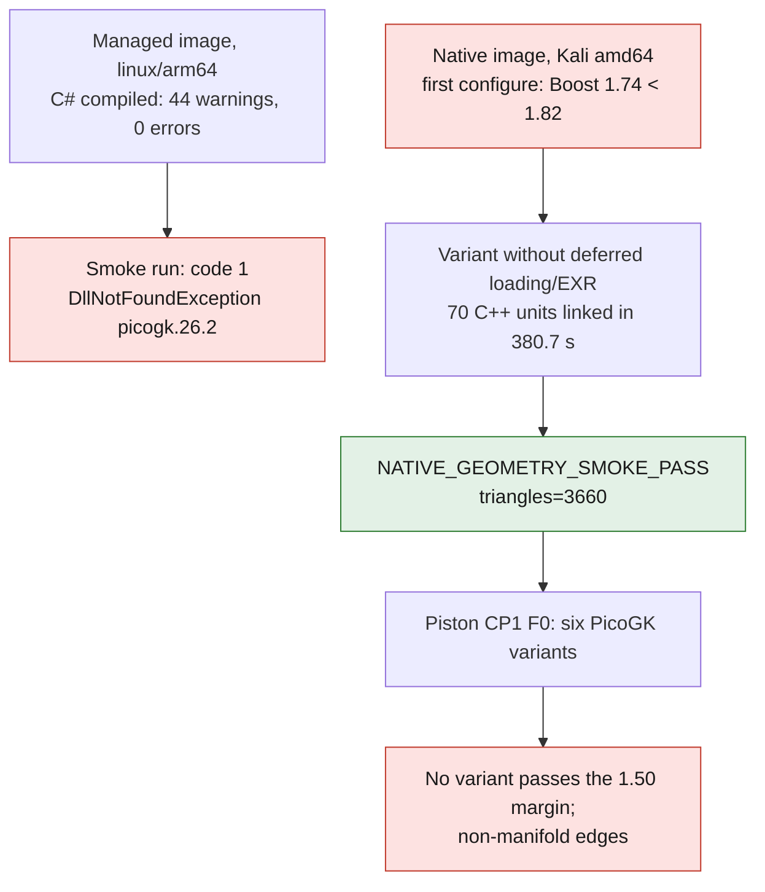

# LEAP 71 integration — M64 preflight

Continued on 7 September: see [the PicoGK execution on the real body](M64_PICOGK_EXECUTION.md).
This document keeps the historical preflight steps.

Status verified on 6 September 2026: **C# compilation and C++ runtime succeeded;
headless geometric smoke test succeeded on Kali Linux amd64**. The first failure
on the managed Linux arm64 image remains documented below. No cylinder head modified,
no thermal simulation performed, no Vast machine rented for this preflight.



## Sources and exact function

The four official repositories were fetched at the commits recorded in
`containers/m64-leap71/sources.lock`. Their LICENSE files are Apache-2.0.
The bootstrap keeps the licenses in each clone; no third-party source
is copied into this repository. Distributing a compiled runtime will also have to
honor the obligations of its dependencies, which are not all reduced
to the PicoGK license.

- [PicoGK](https://github.com/leap71/PicoGK): volumetric geometry kernel
  based on OpenVDB, not a thermal solver.
- [ShapeKernel](https://github.com/leap71/LEAP71_ShapeKernel): shapes and
  construction operations on top of PicoGK.
- [HelixHeatX](https://github.com/leap71/LEAP71_HelixHeatX): example of
  helical heat-exchanger generation. The tutorial expressly distinguishes the
  geometry kernel from the engineering knowledge that must be programmed.
- [PicoGKRuntime](https://github.com/leap71/PicoGKRuntime): C++ library,
  depending notably on OpenVDB and GLFW. This repository is available; a compatible Linux
  binary was later built and tested in the native variant.

## Actual result and reproduction

```sh
docker build -t 3dprinting993-m64-leap71:managed-preflight containers/m64-leap71
docker run --rm --network none 3dprinting993-m64-leap71:managed-preflight
```

The first command succeeded on Docker **linux/arm64**, compiling PicoGK,
ShapeKernel and all the `src` files of HelixHeatX: **44 upstream
warnings, zero errors**. The warnings concern notably nullability and
obsolete APIs; the upstream sources were not modified to hide them.
The base .NET image is pinned by digest, the four repositories by full SHA.
The transitive NuGet dependencies are not yet locked by a
`packages.lock.json`: this bootstrap is not evidence of a bit-for-bit build.

The second command was actually run, offline: **code 1,
DllNotFoundException, library `picogk.26.2` missing**. The test is meant to create
a sphere of radius 5 mm at 0.5 mm voxels and check for a non-empty mesh.
It did not reach that construction. This sphere is solely a software
control, never an approximation of a cylinder head nor a shape proposal.

`PicoGK.csproj` at the pinned commit targets **net9.0 / PicoGK 2.3.0** and embeds
`osx-arm64` and `win-x64` binaries, not `linux-x64` nor `linux-arm64`.
The smoke program uses `new Library(...)`, without `Library.Go` or viewer.
This avoids requesting a window, but does not prove headless operation
of the missing C++ runtime. `HelixHeatX.Task()` calls
visualization functions: it is not declared headless by this simple bootstrap.

## Place in the cylinder-head project

Keep the machined interfaces, datums, sealing faces and the OCCT B-Rep master.
PicoGK is a candidate for generating **internal cooling variants**
in explicitly authorized volumes: curved passages, transitions and
exchange surfaces. It provides neither M64 interfaces, nor a material law, nor a
pressure-drop budget. Do not graft the complete HelixHeatX exchanger into the cylinder head.
The Porsche envelope remains an input constraint, not a free variable.

A watertight voxelized volume is neither an exact B-Rep nor a machining drawing.
The mesh export requires a resolution study, a comparison with the master,
an audit of the walls and of communications between cavities. Any link
to the B-Rep must be reconstructed and checked, not renamed STEP. The oil
passages remain subject to flow, pressure drop, sealing, depowdering and
contamination risk before any design choice.

The variants will then have to be evaluated by independent CFD/CHT and structural
analysis; a HelixHeatX geometry constitutes no thermal result.

## Next software lock before buying compute

1. Build PicoGKRuntime 26.2 on the target platform with pinned
   submodules; do not use an unlocked `--remote` update.
2. Check dynamic dependencies, ABI name `picogk.26.2`, then pass the native
   headless smoke test on **linux/amd64**. Another possible route: first test
   the supplied macOS arm64 binary on the local machine with .NET 9.
3. Add a channel control with geometric criteria and voxel convergence,
   and only then integrate the authorized cooling domains.

No geometric GPU need is demonstrated by this preflight. Renting a GPU
machine does not by itself solve the missing runtime. The JSON results file
separates compilation, execution and fitness for Vast use.

## Separate native attempt on Kali x86

`Dockerfile.native` builds the official runtime and its pinned submodules
in a Linux amd64 image. `native-submodules.lock` records the three gitlinks
actually fetched, without `--remote`: OpenVDB 13, GLFW and ImGui.

The first configure actually failed: Debian Boost 1.74 is below the
minimum 1.82 required by OpenVDB deferred loading. The next variant
disables this deferred loading and the Imath/EXR functions via their
official options. Version checks are **not** disabled. The
configure then succeeded with TBB 2021.8, Blosc 1.21.3 and Zlib 1.2.13;
the C++ compilation started. This variant lacks the deferred-loading
or EXR functions of the default configuration.

Reproduction of this attempt, separate from the managed image:

```sh
timeout 600 docker build -f containers/m64-leap71/Dockerfile.native \
  -t 3dprinting993-m64-leap71:native-preflight containers/m64-leap71
timeout 60 docker run --rm --network none \
  3dprinting993-m64-leap71:native-preflight
```

**Actual native result:** compilation of the 70 C++ units and linking succeeded in
380.7 seconds; C# compiled, 44 warnings and zero errors. The run
`docker run --rm --network none` under a 60-second timeout returned code 0:

```text
NATIVE_GEOMETRY_SMOKE_PASS triangles=3660
```

The control is a sphere of radius 5 mm, voxel resolution 0.5 mm, converted into
3660 triangles by the native runtime. No viewer or X server was created.
`ldd` reports no missing dependency. This validates this headless geometric
operation, not all APIs, the dimensional accuracy of a
cylinder head, the complete HelixHeatX generation or a thermal computation.
The main agent independently repeated the smoke test on the same image with
`--cpus 2 --memory 4g --network none`: same result, code 0, 3660 triangles.

Local Kali amd64 image:
`sha256:f38695f9ecc99ceef65c5e1fe02adf5dbfa95ee1ae925f95fd47bdba9ebb6178`.
Library `/app/picogk.26.2.so`:
`sha256:fc62c8ae58d9e277b1b9ef1b2bb1e761159d5bab81f752c9243fb6bbd150d54b`.
No GHCR publication and no validated registry digest at this stage.

`native-preflight-result.json` records this separate result. The old report
`preflight-result.json` is kept without rewriting.

## Application to the CP1 F0 piston

On 8 September 2026, the same native runtime went beyond the simple control: it
generated six complete variants of the F0 piston from the derived BREP mesh.
The PicoGK operations vary open skirt pockets, the gallery
diameter and pin–crown ribs. The objective combines minimum mass and
cooling proxies, with a provisional mechanical margin of `1.50`
as an eliminating constraint.

The best raw weight saving of the sweep is `1.60 %`, but no variant
passes the mechanical margin. The independent audit also finds
non-manifold edges on all six STLs. The exact status is therefore **PicoGK geometric
screening run, no optimization validated and no variant selected**. See
[the piston record](../993/993_PISTON_CP1_COOLING_GALLERY_F0.md) and the
[PicoGK evidence](../../twins/993-m64-60-piston-gallery-f0/evidence/picogk-f0).

The sound BREP master was processed separately by six CalculiX cases on three
meshes. The fine hot p95 of `323.46 MPa` exceeds the ambient CP1 reference;
it rejects F0 under the synthetic envelope. This result cannot be
transferred to the PicoGK variants until their outputs are reconstructed
as manifold solids.
