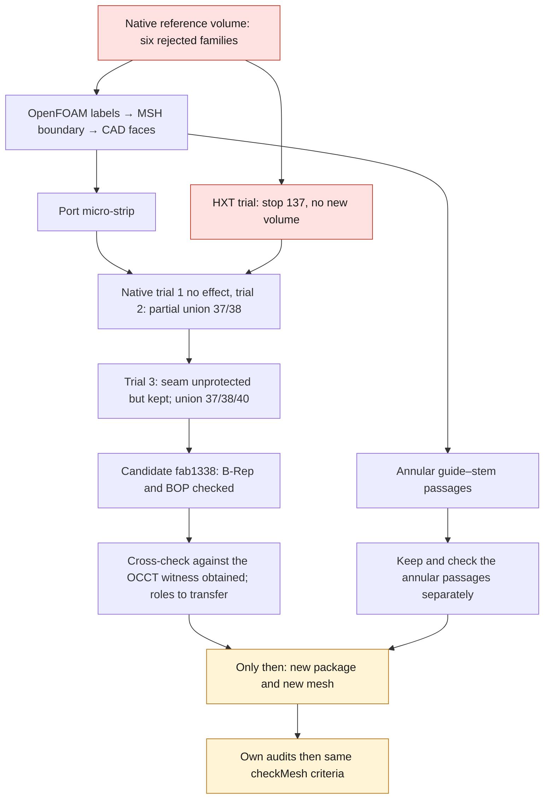

# M64 — defects localized, HXT trial and native correction

Follow-up to this milestone: [86-face package, new volume and OpenFOAM/C0 checks](M64_MAILLAGE_PARTITION_UNIFIEE_20260908.md).
The new volume is obtained; it remains rejected for CFD. The HXT and
localization results below remain those of their historical execution.

## Result

The defects of the [previous native remeshing](M64_REMAILLAGE_NATIF_20260908.md)
are now tied to the CAD faces: the port micro-strip (face 38)
and the annular guide–stem passages form two distinct zones
to be addressed. **The HXT trial did not produce a usable volume.** A
native correction then created a candidate, still without a completed independent
review and without a mesh. The reference volume keeps its six rejected families.
No CFD, thermal, mechanical or LPBF computation is validated by this step;
it authorizes neither printing nor engine operation.

The [diagnostic receipt](../../twins/m64-cylinder-head/evidence/hxt-native-diagnostic-20260908.json)
gathers the digests and the limits. The geometries, coordinates,
entity sets and detailed reports remain private.

## Localization on the reference volume

The check concerns only the native domain `7fc114c1…` and the MSH
`7774e94e…` of **469,985 tetrahedra**. The 125,027 OpenFOAM points are
uniquely matched to MSH nodes, then the topology recovers the
191,956 boundary triangles, their 88 native faces and their roles,
with no orientation disagreement. No VTK is used as geometry.

The OpenFOAM coordinates are written with **12 significant digits**:
the matching accounts for serialization rounding, not a binary identity
nor a simple nearest neighbor. The maximum observed gap is
4.996×10⁻¹³ m in the scaled case. The factor 0.001 remains tied to
the uncertified assumption "one scan unit = one millimeter".

| Rejected family | Selected entities | Cells touching face 38 | Cells touching the guide–stem rings | Cells without a boundary face |
| --- | ---: | ---: | ---: | ---: |
| Aspect ratio | 130 cells | 70 | 0 | 56 |
| Skewness | 73 faces | 55 | 0 | 0 |
| Low determinant | 4,579 cells | 492 | 2,589 | 399 |
| Concavity | 23 cells | 19 | 0 | 4 |
| Low interpolation weight | 1,146 faces | 253 | 48 | 748 |
| Low volume ratio | 540 faces | 146 | 0 | 331 |

For face sets, the affected cells are the union of their
owners and neighbors: their count is not that of the faces.
The columns do not form an exhaustive partition. The per-face
histograms may overlap; no distance to interior cells
is computed. **An observed adjacency does not establish causality.**

The intrinsic audit of face 38 probes a strip whose minimum sampled
local width is about 1.52×10⁻⁶ scan units. This is
neither a certified physical dimension nor the demonstrated global minimum. The
approximate sag formula `δ ≈ κ h² / 8` provides a refinement hypothesis,
not a guarantee of conformity or of volume quality. The CAD is unchanged.

## Comparative trial actually executed

The mesher now accepts `--volume-algorithm 10`: only the
`Mesh.Algorithm3D` option switches, after the surface is saved and before the 3D step.
Surface sizes, geometry, annular passages and check thresholds
are not relaxed. HXT is a parallel reimplementation
of Delaunay, identified by the value 10 in the
[official Gmsh 4.15.2 manual](https://gmsh.info/doc/texinfo/gmsh.html).
It is therefore not a second independent physical model.

The native x86 run on Kali was bounded to four CPUs, 4 GiB and 180 s,
with no network. It stopped with **code 137 after 93 s**; Docker
reports `OOMKilled: false`. These traces are not enough to attribute
the stop to a lack of memory or to any certain cause.

The last checkpoint dates from **25.076 s**, at the start of the 3D step:
191,958 surface triangles saved, zero tetrahedra in that file,
status `incomplete`. This surface `9825add5…` differs from that of the reference
volume: its old conformity receipts are not transferred to it.
The trial container is removed. No CFD solver was launched.

## Native correction actually attempted

Three `ShapeUpgrade_UnifySameDomain` trials were run with OCP
7.9.3.1, each from the same native domain `7fc114c1…`:

| Trial | Result actually observed | Faces / edges / vertices |
| --- | --- | ---: |
| 1 — `cf81801a…` | No effect on the partitions; faces and edges preserved by in-memory identity | 88 / 195 / 120 |
| 2 — `e08029b6…` | Old faces 37 and 38 → new face 37; old face 40 separate | 87 / 194 / 120 |
| 3 — `fab1338a…` | Old faces 37, 38 and 40 → new face 37, in 7.133 s | 86 / 191 / 118 |

The third trial releases only one additional protection: that
of seam 105, natively recognized as closed on face 40 and incident
to that face alone, with no interface between physical roles. The
`KeepShape` protection can prevent a face merge; its behavior is described
in the [OCCT reference](https://dev.opencascade.org/doc/refman/html/class_shape_upgrade___unify_same_domain.html).
The comparison of the trials identifies here the protection of this seam
as the lock on the full unification of the group.

The final candidate is a solid. **Only the four partition edges
101–104 disappear; the 191 other original edges remain identical
in memory, including seam 105.** Unprotecting a seam therefore did
not mean removing it. This observation establishes no CFD gain.

The operation enables neither edge merging nor B-spline concatenation and
calls no tolerance change. In the third trial, the 190 edges
outside the four partitions and the seam are protected, notably the
seat interfaces and the C0 segments, still identical in memory.
After re-export and re-read, BRepCheck and the five BOP modes used
detect no defect. The inputs and their in-memory serialization
remain unchanged. A rerun with a guard enforcing in-memory
immutability and preservation of the protected edges reproduces **exactly
the same file `fab1338a…`**, in 7.306 s.

### Independent cross-check completed

The audit compares the candidate with an **OCCT serialization witness**: source
read, written, then re-read once, with no reconstruction operation. This in-memory
witness corresponds exactly to the no-effect disk witness `cf81801a…`.
The raw comparison with the source is not identical: normalizations of
supports, curves and of two preexisting p-curves are recorded, not
erased by a widened comparison tolerance.

Against this witness, the 85 other faces, the 191 remaining edges, the support
of the merged face, the 16 outer edges and the two occurrences of
the seam match exactly, p-curves and orientations included.
Only vertices 68/69, left without any kept edge, disappear;
the other incidences and tolerances are kept. The native checks
and this comparison pass in 11.372 s. The variations in integrals
remain a numerical corroboration, not a continuous error bound.
**The roles and the mesh profile have not yet been transferred.**

The next lock is the verified transfer of the roles into a new
package, then remeshing and its own cross-audits.
**No mesh and no physical computation of candidate `fab1338a…` has
been run yet.** The receipts of the previous domain are not transferred to it.

## Traceability and cost

The full SHA-256 digests are kept in the receipt linked above: localization
`c8a5de6b…`, intrinsic audit `f147ca56…`, HXT process `d7a13e82…`,
HXT checkpoint `bf30d87b…`, native trials `27550019…`, `90319cb9…`
and `291f4258…`, protected rerun `efd98c21…`, cross-audit `7bd9c92d…`.
The targeted tests pass: mesher **20/20**, localization **5/5**,
merge protection **5/5**. `make check` completes successfully:
**2,326 tests in the main suite, of which 108 skipped**, then the complementary
targets; log `c2832b91…`. These are software witnesses,
not physical tests. The manufacturing review remains not achieved.

At the time of this round's verification: Vast balance **43.9166429608502 USD**,
no instance and no new spending; user cap **44 USD**.
