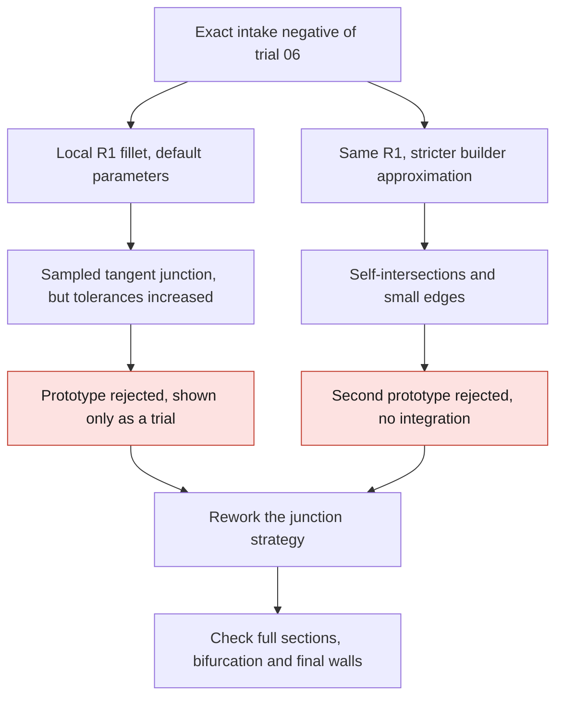

# M64 — intake junction prototypes and HXT counter-trial

Continuation of the [previous local corrections](M64_LOCAL_MESH_AND_JUNCTION_FOLLOWUP_20260907.md).
The goal is to treat a real internal shoulder and to improve the
discretization without arbitrarily changing the outer silhouette.
**These trials remain CAD and meshing developments, not a thermally
or mechanically validated cylinder head.**

The follow-up is traced in the [PicoGK local junction control case of September 8](M64_PICOGK_LOCAL_JUNCTION_WITNESS_20260908.md).

## Local junction: real before/after, two constructions rejected

The [receipt for the two prototypes](../../twins/m64-cylinder-head/evidence/local-intake-fillet-countertrials-20260907.json)
concerns only the intake negative of body 06. Three edges between
branches and dome are selected geometrically, excluding the outer
reference circle. The radius of 1 scan unit is a design
assumption, not a Porsche dimension or a flow optimum.

The first trial builds three fillet surfaces. The negative remains a
valid BRepCheck solid, with no BOP defect in memory. The angles between tangent
planes sampled at the six new edges remain below 0.00032°.
This is not a global demonstration of G1 continuity, and the bifurcation
between the two branches is not fully taken over.

The native tolerances nevertheless rise to 1.53 × 10⁻⁵ unit on some
faces/edges and 1.60 × 10⁻⁴ on some vertices. **The prototype is rejected**:
no threshold change and no promotion to the full body. The builder's
settings had not been modified.

The local checks of the first prototype establish only:

- continued inclusion of the seven reference disks, with zero missing
  area; **not a proof of equality of the full sections**;
- added gas volume of 29.164 units³, zero volume removed in the Booleans;
- no addition outside the original body before the ports are created;
- numerical distance of 10.451 units between this addition and the original shell.
  **This is not a final thickness**, notably after the other port;
- bounding box and six original B-spline supports preserved.

The difference of the adaptive global volumes and the volume of the Boolean delta
show a residual of about 0.03648 unit³, unexplained. The integration
estimators are not enough to claim exact conservation.

### Second trial: stricter approximation, degraded result

The [OCCT 7.9.3 primary source](https://github.com/Open-Cascade-SAS/OCCT/blob/V7_9_3/src/ChFi3d/ChFi3d_Builder_1.cxx)
shows default approximation parameters less strict than some
topological thresholds of the model. The second trial keeps the radius, the selected
edges and all acceptance criteria; it only tightens the
construction parameters, before the edges are added.

| Construction parameter | Default | Second trial |
|---|---:|---:|
| Tang | 0.01 | 0.01 |
| Tesp | 10⁻⁴ | 10⁻⁷ |
| T2d | 10⁻⁵ | 10⁻⁷ |
| TApp3d | 10⁻⁴ | 10⁻⁸ |
| TolApp2d | 10⁻⁵ | 10⁻⁸ |
| Fleche | 10⁻³ | 10⁻⁴ |

This tightening does not succeed: **5 self-intersections and 4 edges that are too
small**, before and after native reread. The maximum tolerance reaches
0.1784 unit and a sampled angular deviation of 15.57°. The result is
rejected, with no third parameter trial, new STEP or cut of the body.
The detailed internal cause of this degradation is not demonstrated.

The [builder](../../twins/m64-cylinder-head/source/build_local_port_junction_fillet.py)
keeps the `default` and `strict-approximation-v1` modes separate.
The [local audit](../../twins/m64-cylinder-head/source/audit_local_port_junction_fillet.py)
must not be used to turn an inclusion of disks into a
proof of equality of sections or of the final wall.

### Image and section

The private before/after view uses the 32,584 and 40,178 native triangles of the
first trial, without smoothing or deformation. It shows **the volume of the gas
passage, not a new cylinder head shape**. Orange identifies the three
added surfaces; it is neither a temperature nor a stress field.
The section is an intersection of the triangles with a plane, not a new solid.

After independent review, the [render](../../twins/m64-cylinder-head/source/render_local_port_junction.py)
also verifies that the colored IDs match the difference of the support
signatures and the number of faces in the builder's history. Four
[tests](../../tests/test_local_port_junction_render.py) notably reject an
old face wrongly presented as new. The real render rerun with
this check produces the same image: the IDs of this image were correct.
The geometric files and images derived from the scan remain private; their
digests are in the public receipt.

The next rework of the junction must change the construction on a
geometric justification, not continue a parameter loop or
propagate a rejected negative into the full model.

## Meshing of body 05: HXT10 is not retained

The [HXT10 counter-trial](../../twins/m64-cylinder-head/evidence/native-mesh-trial05-HXT10-20260907.json)
keeps the CAD, the three MeshAdapt assignments, the sizes and the settings
without optimization. The only explicit option changed is the Gmsh volume
generator, from Delaunay1 to HXT10. This is a mesh comparison,
**not two independent physical validation methods**.

A synthetic control case first observed HXT, surface preservation,
MSH reread and positive Jacobians. Its quality threshold fails for
both generators: one tet below 0.1. The control case remains rejected. A single
diagnostic trial on the part was then explicitly authorized on the basis
of the observed API checks; no quality criterion was lowered
and no CAE qualification was granted by this control case.

The body computation on Kali takes 24.49 s, exit 2, with no memory overrun.
The two MSH files actually reread give:

| Measure | Delaunay1 with local MeshAdapt | HXT10 with the same surface settings |
|---|---:|---:|
| Tetrahedra | 259,699 | 340,571 |
| Tetrahedra minSICN < 0.1 | 4,744 | 7,530 |
| Tetrahedra minSICN < 10⁻⁶ | 0 | 181 |
| Non-positive Jacobians | 0 | 21 |
| Boundary triangles minSICN < 0.1 | 799 | 799 |

During HXT generation, the unoriented geometry of the 4,892 triangulations
remains identical, but the orientation of the triangles of one face changes. Between the
two MSH files, one face also differs in unoriented triangulation and nine in
orientation. These differences do not reduce to the sign of a floating-point zero.
**A strictly identical boundary between the two runs is therefore
not demonstrated**; any strict causal attribution to the generator alone is
excluded. Identical triangle counts, areas or volumes are not enough.

The added check keeps the exact coordinates in hexadecimal
representation, as well as an oriented signature modulo cyclic rotation of the
three vertices. Rounding to twelve decimals remains a separate check, not an
exact proof. The Jacobians and the quality are checked after export:
the small coordinate deviation on reread does not mask the non-positive
elements. **HXT is rejected**, both for quality and for the strict
preservation required. All containers of the batch were removed after collection.

## Verification and limits of the batch

The [software receipt](../../twins/m64-cylinder-head/evidence/local-fillet-hxt-software-checks-20260907.json)
records a `make check` with exit 0: 2,144 tests in the main
discovery, of which 79 explicitly skipped, then the additional targets.
The targeted native-runtime suites pass: 9 junction/render tests and
21 meshing tests, none skipped. These tests requalify no rejected candidate.

No Vast rental, no new cylinder head cut, no thermal,
mechanical, fatigue or LPBF result is produced by these counter-trials.
The next rework must address the shape of the junction and the quality of the
boundaries, with new evidence attached to the corresponding geometry.
