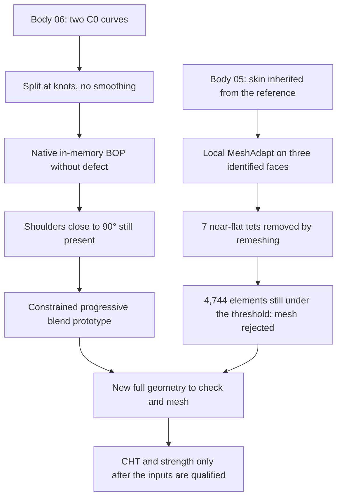

# M64 — local mesh correction and blends still to be reworked

Follow-up to the [CAD, contacts and mesh batch](M64_NATIVE_CAD_CONTACTS_AND_MESH_20260907.md).
Two separate trials progress: the discretization of the skin on body 05 and
the topological representation of body 06. **Neither constitutes a validated
cylinder head nor a print authorization.** The geometries are not
interchangeable; their digests bind each result to its object.

## Mesh 05: real improvement without modifying the CAD

The [MeshAdapt counter-trial](../../twins/m64-cylinder-head/evidence/native-mesh-trial05-local-MeshAdapt-20260907.json)
changes only the meshing algorithm of three faces whose provenance in the
original skin was checked. All sizes, the volume algorithm and the other
options remain identical. The choice is tested on Kali x86, in the same
container limited to two CPUs and 4 GiB, without a new Vast rental. The actual
generation lasts 23.71 s; the inputs remain unchanged.

| Measurement on the reread MSH files | Before | After local correction |
|---|---:|---:|
| Tetrahedra | 261,564 | 259,699 |
| Tetrahedra with quality minSICN < 0.1 | 4,902 | 4,744 |
| Near-flat tetrahedra, minSICN < 10⁻⁶ | 7 | 0 |
| Non-positive Jacobians | 1 | 0 |
| Boundary triangles minSICN < 0.1 | 869 | 799 |
| Discretized volume gap relative to native | +0.281956% | +0.282046% |

On the three targeted faces, the quality minima go respectively from
0.00515 / 0.02452 / 0.00180 to 0.30998 / 0.37297 / 0.17985. The 4,889 other
faces show the same triangulation signature, computed from coordinates rounded
to twelve decimals. This check is neither a bit-for-bit identity nor an
exhaustive proof of geometric equivalence.

The file keeps one connected region, all CAD faces meshed and a complete
boundary. The seven near-flat elements disappear through remeshing, not
through manual deletion. But **4,744 elements remain under the project
threshold of 0.1: the global mesh is still rejected**. The face with the
largest area error among the three targeted keeps a gap of about 1.71%;
geometric convergence is therefore not demonstrated either.

### The post-export check is now mandatory

The later comparison of the MSH files found a non-positive Jacobian in the
initial file, while the Jacobians were all positive in memory. The coordinates
varied only very slightly: a maximum displacement check at 10⁻¹⁰ unit was not
enough for these nearly degenerate elements.

The [helper](../../twins/m64-cylinder-head/source/mesh_native_ported_head.py)
now recomputes **minSICN and minDetJac after rereading**, enforces the same
number of tetrahedra, strictly positive Jacobians and the unchanged minSICN
threshold. The [dedicated tests](../../tests/test_m64_native_ported_mesh.py)
include an inversion despite a displacement below 10⁻¹⁰. The receipt keeps the
real code executed for the counter-trial (`540d168f…`), distinct from the
later hardened helper (`3b412b00…`). No earlier report was rewritten as a
success.

## Body 06: corrected representation, shoulders unchanged

The [topological split](../../twins/m64-cylinder-head/evidence/trial06-topological-edge-split-20260907.json)
replaces two C0 curves with five segments at their existing knots. It neither
smooths nor refits the curves and does not increase their tolerances. The
native candidate keeps one solid, one shell and 4,889 faces; the full
in-memory BOP check no longer reports a defect. The saved and reread B-Rep
passes BRepCheck and the continuity check. **The full BOP was not repeated
after rereading, and no new STEP was exported or qualified.**

The table of parametric curves on surface is identical byte for byte. The
B-spline supports remain unchanged; a few analytic coefficients vary by at
most 2.22 × 10⁻¹⁶ at serialization. The curve intervals are covered once, with
the orientations of their occurrences kept. These are representation checks,
not evidence of functional smoothing.

The volume gap computed without adaptive integration was not reliable for
comparing these two representations. The adaptive cross-computation gives a
gap of about −1.53 × 10⁻⁷ unit³; its relative error estimator stays around
3.03 × 10⁻⁸. Do not confuse the requested precision with a bound reached.

The internal shape defect is still present: the branches open onto residual
portions of a flat dome, with angles between tangent planes close to 90°. The
split does not remove these shoulders and demonstrates no flow gain. The next
prototype must create a progressive blend, preserving the reference sections
and the insert seats.

The mesh results of body 05 are not transferred to body 06. The next steps
remain geometric: progressive blend, correctly discretized skin, then explicit
physical conditions and convergence. No heat field, stress, fatigue or LPBF
result for the cylinder head is added by this batch.

## Software verification and traceability

The [separate software receipt](../../twins/m64-cylinder-head/evidence/local-mesh-followup-software-checks-20260907.json)
records a new `make check` ended with exit 0: 2,131 tests in the main
discovery, 76 of them explicitly skipped, then the additional targets. The 17
targeted mesh tests also pass with no test skipped. An independent read-only
review found no false success in the added criteria and checked the figures
against the private evidence. It ran no new mesh.

The testing and documentation skills led to keeping the counterexample of
inversion after export, the rejected results and the digests of the code
actually executed, without confusing them with future code.

The [follow-up on the blend prototypes and the mesh](M64_LOCAL_FILLET_AND_HXT_COUNTERTRIALS_20260907.md)
keeps the new trials and their rejections separately.
