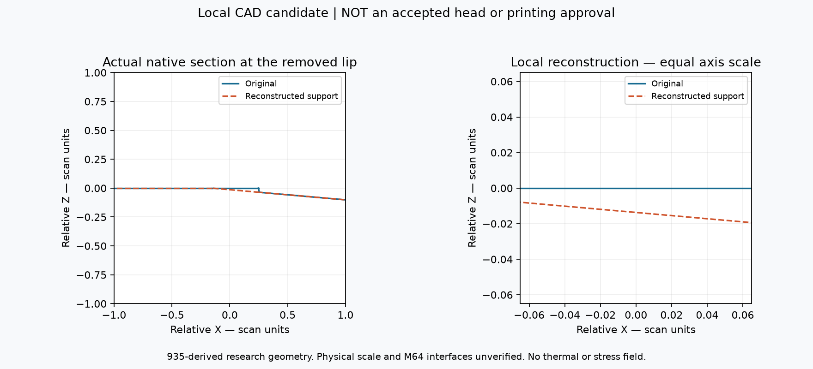
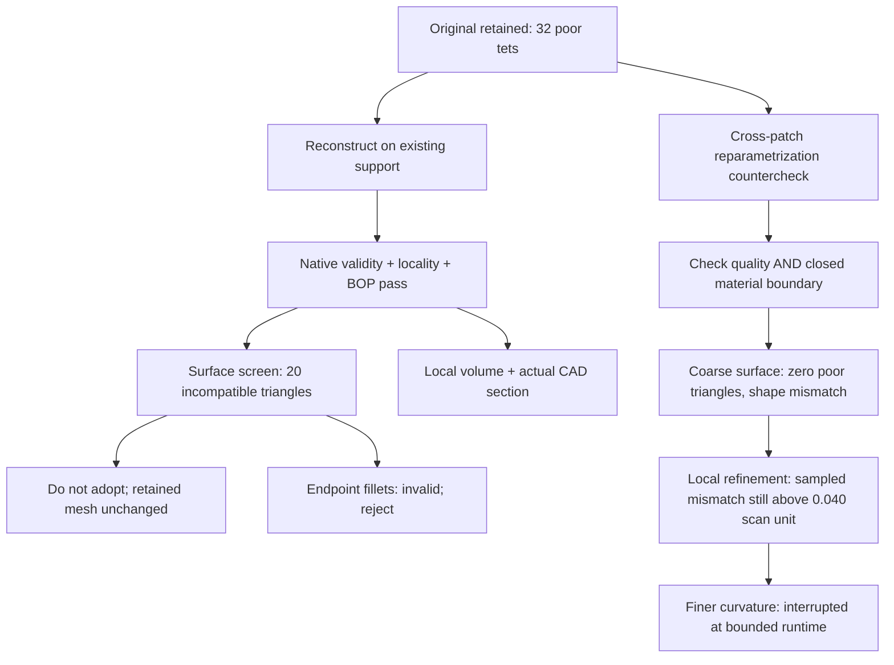

# M64 — local native reconstruction, 28–29 September 2026

## Result and decision

**A bounded native junction reconstruction succeeds; the mesh gate does not.**
The new private candidate removes the diagnosed small lip by extending its
existing bilinear support surface, without a spherical crater. It passes native
validity, export/readback and the separate BOP check. Exactly **six original
faces** change. All other **4,912 original faces** retain their identity and
serialized data in memory; the on-disk original remains hash-identical.

However, its completed surface mesh contains **20 triangles incompatible with
tetrahedral minSICN 0.1**, versus **seven** in the matched unchanged-CAD control.
It is **not adopted as a meshing improvement**. The retained volume result is
still **32 rejected tetrahedra / 1,341,461**. No new volume job is launched from
this known-incompatible surface, and no manufacturing gate is closed.

A separate **unchanged-CAD cross-patch trial reaches zero incompatible surface
triangles**, then 26 poor tetrahedra in its volume run. That is **not a retained
improvement**: the coarse cross-patch approximation fails the geometric
distance screen and the stored-boundary flux check. Its results are separated
below from the native reconstruction.

This follows the [bounded-cut experiments](M64_BOUNDED_MESH_TRIALS_20260928.md).
The input remains the scan-derived **935 research body**, not metrologically
qualified M64 geometry. Coordinates and areas/volumes use provisional scan
units, not certified millimetres. The 0.040 mm carrier-displacement objective
is a different requirement. The [scan source and licence](../../catalog/sources/src-wolfe-classics-935-billet-cylinder-head-scan.json)
remain unchanged. Native bodies, meshes, coordinates and detailed receipts
stay private; the requested diagnostic image, source code and aggregate
results are published.



*Blue: original section. Orange: the experimental reconstruction. Both axes
have equal scale. These are sampled native section curves, not an invented
product render, a temperature field or print-process simulation. The image
shows a local change, not a certified bound on whole-part deviation.*

## Construction and checks

The [support reconstruction](../../twins/m64-cylinder-head/source/wholebody/trial_trimmed_support.py)
reuses native support face 1647: degree 1×1, 2×2 poles, non-rational. It projects
65 samples per boundary-edge use of source faces 1412 and 1648 onto that
surface. The working rectangle lies strictly inside the original support's
parameter rectangle; a 1% parameter-range margin surrounds the samples. No
support pole is moved. A 0.1-unit prism along the original plane's normal
defines a serial, non-destructive Boolean subtraction with zero added fuzzy
tolerance. These parameters define a research experiment, not machining
allowances or supplier process settings.

The source-to-support projection reaches **0.03563368 scan unit** at the sampled
lip. This route therefore does **not** claim to satisfy the earlier 0.020
experimental envelope. Its preliminary sample guard is 0.040 scan unit; that
is explicitly **not** a bidirectional distance certificate or a physical
0.040 mm result. Functional roles and admissible changes to these surfaces
are still unverified. There is no automatic replacement of the CAD master.

| Check | Actual result |
|---|---|
| Changed original faces | 1165, 1411, 1412, 1413, 1647, 1648 — exactly the six allowed |
| Removed original lip faces | 1412 and 1648 deleted; candidate face numbering is different |
| Native topology | One valid solid, one shell, 4,918 faces |
| Protected original faces | 4,912 identities and serializations unchanged in memory |
| Tolerances | Maximum stored face/edge/vertex tolerances not increased |
| Original source | In-memory and on-disk source unchanged for this candidate |
| Export/readback | Valid, one solid |
| BOP audit | Pass: no faulty results, errors or warnings |
| Surface screen | 441,356 triangles; 20 below the necessary q2 threshold; minimum **0.01050315779** |
| Full volume mesh, thermal, fatigue, print simulation | Not run on this candidate; surface gate remains open |

The BOP check reuses the error-aware auditor; it is distinct from BRep validity.
The surface recipe is the matched curvature-aware MeshAdapt recipe from the
previous report: min 0.00002, max 3, curvature sizing 12, explicit short-curve
endpoint sizes and two threads, without automatic OCC repairs.
The necessary surface threshold remains `q2 >= 2*0.1/(3-0.1)`; no quality limit
is lowered. Candidate indices 1411 and 1413 still contain acute corners near
**1.444691° and 1.371396°**. Removing the lip alone does not reconstruct those
remaining endpoint transitions.

## Rejected alternatives

The [constrained patch trial](../../twins/m64-cylinder-head/source/wholebody/trial_constrained_patch.py)
tries N-side filling over two measured neighborhoods: lower (141,142,143) and
upper (1411,1412,1413,1647,1648). Their exterior boundaries each have one closed
edge loop (18 and 13 edges respectively), not a verified rectangular patch.
The boundary is copied before construction so a builder cannot mutate the
original constraint edges. Requested fitting tolerances are not treated as
achieved errors. The implementation uses the installed OCP 7.9.3.1 API;
the [upstream filling documentation](https://occt3d.com/dev/doc/refman/html/class_b_rep_offset_a_p_i___make_filling.html)
describes the boundary/interior constraint mechanism, not a guarantee that
these particular junctions can be filled.

| Trial | Result / rejection |
|---|---|
| Lower patch, boundary only | Reported G0 error **0.19815246**; fixed-boundary guard fails |
| Lower patch, boundary + 33 interior constraints | Reported G0 error **0.07109225**; fixed-boundary guard fails |
| Upper patch, boundary only | Native surface builder does not complete |
| Upper patch, interior constraints | Native surface builder does not complete |
| Same-domain merge after support reconstruction | One valid solid, 4,917 faces, but protected and source in-memory serializations change; rejected |
| Two selected floor-edge fillets, radii 0.010 and 0.020 | Preflight detects propagation to a third circle edge; both stopped before building |
| Three explicitly selected circle edges, radii 0.010 and 0.020 | Builders complete, but native validity, tolerance and protected-data checks fail; both rejected |

The third fillet edge is the observed 1165/1415 adjacency, not a silently
accepted arbitrary contour extension. The second experiment explicitly names
all three pairs and permits only their bounded endpoint neighborhood (11
original faces). It still fails. The same-domain trial uses
[KeepShape and safe-input mode](https://occt3d.com/dev/doc/refman/html/class_shape_upgrade___unify_same_domain.html)
and fences protected edges; those API settings do not override the observed
mutation checks. The original file remains unchanged in every trial.

The [cross-patch mesher](../../twins/m64-cylinder-head/source/wholebody/trial_compound_junction_mesh.py)
also tests the same neighborhoods **without modifying native CAD**, following
[Gmsh tutorial 12](https://gmsh.info/doc/texinfo/#t12). This is discrete
reparametrization, not reconstruction of editable native surfaces, nor proof
of exact CAD conformance. Its classification option and size factor are
recorded explicitly.

- On the Mac, Gmsh aborts with a PETSc object-class error, child exit **-6**;
  there is no completed surface. This is a runtime failure, not a quality result.
- On Linux/Kali, classification 0 completes: **441,952 triangles**, seven
  incompatible triangles, **233 edges not incident twice** and **26 duplicate
  triangles** in the exported all-entity surface. This is not a usable closed
  material boundary. No duplicate deletion or face filtering is used to
  manufacture a pass.
- Reclassification 1 completes with **441,590 triangles, zero incompatible
  triangles, minimum q2 0.07085403360, zero duplicate triangles and zero edges
  not incident twice**. Unlike classification 0's all-entity diagnostic, this
  surface clears those necessary quality/topology checks. This alone is not
  native shape preservation or a complete manifold/self-intersection proof.

The [bidirectional sampled shape audit](../../twins/m64-cylinder-head/source/wholebody/audit_compound_shape.py)
checks each whole compound against its original native faces. Mesh samples
include vertices, edge midpoints and triangle centroids; native samples use
17×17 trimmed parameter grids and 65 samples per edge use. Native closest-point
queries are compared with VTK closest points on **triangles**, not merely on
vertices. An analytic offset-triangle test checks that distinction.

| Coarse compound | Mesh → native, maximum sampled | Native → mesh, maximum sampled |
|---|---:|---:|
| Lower, 549 triangles | 0.53499280 | 0.74990746 |
| Upper, 79 triangles | 0.22419336 | 0.40528238 |

These scan-unit errors already exceed 0.040 at sampled points. Sampling cannot
bound unsampled extrema, but observed excessive distances suffice to reject
this recipe. Reclassification assigns no elements to original faces 1412,
1413 and 1648 in the upper compound. The auditor records those empty labels
and compares the **whole compound**, not a falsely empty surface. Per-face
boundary-condition preservation is explicitly false; it is not inferred from
geometric face IDs surviving in the file. The first auditor revision stopped
on such an empty label; the diagnostic fix does not certify missing labels.

The concurrent diagnostic volume run completed before the attempted stop
could reach its process. It generated **1,406,120 tetrahedra**, **26 below 0.1**,
minimum minSICN **0.05531874591**. The independent readback reports positive
Jacobians, exact roundtrip, one connected tetrahedral region and complete
boundary incidence. Native relative volume error is about **0.11298%**.
The stored-triangle flux differs from the tetrahedral sum by **0.17472%**;
the coarse checker consequently fails. The region-derived boundary has
balanced edge orientation, which does not prove that the independently
stored triangle orientations give the same flux. No element deletion or
orientation rewrite is used to force acceptance.

This volume job regenerated a surface with **441,524 triangles**, also zero
incompatible. The shape-sampling table above belongs to the separate 441,590
surface and its exact SHA, not a claimed audit of every regenerated boundary
triangle. Repeated multithreaded discretizations are not assumed identical.

### Targeted refinement, not just a smaller global mesh

An additional Linux surface run uses a Distance/Threshold background field
on the six measured internal junction curves. It samples each curve at 1,000
points, requests size 0.050 within distance 0.2, transitions to size 3 by
distance 0.8, and uses compound size factor 0.5. The original CAD and quality
limits are unchanged. This follows the documented
[Gmsh distance/threshold sizing](https://gmsh.info/doc/texinfo/#t10), not an
assumed feature-preservation guarantee.

It completes in **290.62 s**, with **490,496 triangles, zero incompatible
triangles, no duplicate triangles and no edges without incidence two**.
Minimum q2 remains 0.07085403360. All eight original compound faces now have
assigned triangles, but facewise physical boundary conditions are still not
certified.

| Refined compound | Mesh → native, maximum sampled | Native → mesh, maximum sampled |
|---|---:|---:|
| Lower, 25,148 triangles | 0.05979825 (75,893 samples) | 0.02220408 (1,781 samples) |
| Upper, 9,079 triangles | 0.06869970 (27,561 samples) | 0.06807562 (1,987 samples) |

The native-side samples are identical to the coarse comparison. The much
denser mesh-side samples are not an identical sample set. The reduction is
real at those checks, but observed errors still exceed the preliminary
0.040 **scan-unit** screen. Therefore this refined surface is also not admitted
as a conforming substitute, and no volume run is started from it.

The final bounded Linux trial increases curvature sizing from 12 to **64**,
uses junction size **0.020** and compound factor **1.0**. It reaches its own
540-second alarm during compound surface meshing: child exit **-14** after
540.14 s. The receipt remains `incomplete`; no completed surface, shape audit
or volume-quality result exists for this recipe. The outer runner records
`timed_out: false` because the child's alarm fired before its 550-second
deadline. That field does **not** turn the interrupted calculation into a
completed test. No worker remains, and the original BRep hash is unchanged.

## Local volume crosscheck

The [volume and section auditor](../../twins/m64-cylinder-head/source/wholebody/audit_reconstruction_lip.py)
constructs the local intersection between the original body and the cutting
tool. That removed region is one valid solid with three faces. Integrating
this small region avoids subtracting nearly equal million-unit whole-body
volumes. Two algorithms are compared on the same OCCT geometry; they are
**not independent geometry kernels or rigorous interval enclosures**.

| Method | Result in cubic scan units |
|---|---:|
| Adaptive native integration, requested relative epsilon 1e-9 | 0.0137170522214431 |
| Adaptive native integration, requested relative epsilon 1e-12 | 0.0137170522214443 |
| Oriented triangle-flux sum, deflection 0.001 (182 triangles) | 0.0137174809077451 |
| Flux, deflection 0.00025 (212 triangles) | 0.0137092158149937 |
| Flux, deflection 0.0000625 (484 triangles) | 0.0137145600949496 |

Native returned error estimates are **0.00568 and 0.00361**, not the requested
epsilons. Faceted refinement is not monotonic. Although the values locate
the removal volume near 0.0137, neither stable printed digits nor requested
tolerances close a certified volume-error gate. No bidirectional boundary
distance, minimum wall, bore compatibility or stress-concentration proof is
inferred from these results.



## Reproduce and verify

Use the existing isolated Python 3.13 CAD environment (OCP 7.9.3.1,
Gmsh 4.15.2, NumPy 2.2.6). Examples require private inputs and fresh output
directories. Neither diagnostic exit 0 nor the word `candidate` means
manufacturing authorisation. Run the compound-mesher example on the tested
Linux runtime; the documented Mac/PETSc abort is not silently worked around.

```sh
python twins/m64-cylinder-head/source/wholebody/trial_trimmed_support.py \
  --body /private/original.brep --output /private/fresh-support
python twins/m64-cylinder-head/source/wholebody/screen_tip_cut_surface.py \
  --candidate /private/fresh-support --output /private/fresh-surface \
  --cpu-seconds 540
python twins/m64-cylinder-head/source/wholebody/audit_reconstruction_lip.py \
  --body /private/original.brep --candidate /private/fresh-support \
  --output /private/fresh-volume-and-section
python twins/m64-cylinder-head/source/wholebody/trial_compound_junction_mesh.py \
  --body /private/original.brep --output /private/fresh-compound \
  --classify 1 --factor .5 --junction-size .05 --curvature 12
python twins/m64-cylinder-head/source/wholebody/audit_compound_shape.py \
  --body /private/original.brep --mesh /private/fresh-compound/surface-private.msh \
  --receipt /private/fresh-compound/report.json --output /private/fresh-shape.json
python -m unittest discover -s tests -p test_m64_constrained_patch.py -v
make check
```

Five focused tests pass in the isolated CAD runtime: fixed-boundary filling
and area on two analytic rectangles, protected-edge unification fencing,
the native support tool's analytic prism volume and input preservation,
surface-hole/duplicate detection, a translated box's oriented volume, and
native sample distances to an offset triangle.
They validate software behavior, not this head's suitability for service.
Earlier producer revisions are saved in private source archives with their
receipts; historical receipts are not rewritten after code changes.

The full repository `make check` exits 0: **3,205 main-suite tests**, **160
optional/environment skips**, supplemental checks, and **zero broken links in
572 Markdown files**. The five new numerical/CAD tests run separately in the
qualified environment with no skips. These software checks do not close any
manufacturing gate. The final-code full check completes in **233.63 s**;
the focused CAD checks also pass after that run.

No paid instance is rented. The Mac and the existing authorized Kali host
provide the tested CAD/meshing runtimes. No release record, catalogue
qualification, design master or PorscheFanatics deployment changes.
All numerical jobs launched for this iteration have ended; there is no
unattended calculation claimed as continuing after handoff.

### Evidence identifiers

| Private artifact / receipt | SHA-256 |
|---|---|
| Reference BRep | `b2b48fe40edd1a20c8e6c0d20d77e6045931189f18330b441b09bcbf4618fc0a` |
| Reconstructed candidate BRep | `bcf86e43fd19747ada003ed105f53274c440d8a955a822f9718876ccb3cd1c47` |
| Candidate construction receipt | `79cc50bb826a9bd97ec728c1a2cea43a8cbef31fef7d298013fd911a1fa7cf85` |
| Candidate BOP receipt | `04414fce26fdf2df80024911608f910939b89119b4605039a0ff6b3fed730c63` |
| Candidate surface receipt | `07899f7f8b65cacc97ab7a610207d383267bc682be395c5390cea18134a818c7` |
| Local removed-volume receipt | `c6cc1cee00fec04f99c9b5516903ffbaf6390b454ccd188bceffa370a582a035` |
| Reclassified cross-patch surface receipt | `b15a59cbad0133d865f5ed048e9b4e27f50c5ef365929c4e5d1a5f5d81c699f3` |
| Its sampled shape receipt | `0668948e7eb177fec374d843dd347b3db4323c69f8ffa98e171ddbeb6025ee61` |
| Diagnostic cross-patch volume receipt | `22a096d6cd866ed35ccd48f57100c7866ab526b5ae5d83891de9ebe5e9cc44c0` |
| Locally refined surface receipt | `cd9233999db9e759e580131331708e36625fb74d0564d93aa94f087b409c3779` |
| Locally refined surface mesh | `13dcb0d7a4fa7e993908e2fb776866708f000ba0cf1396402bb0cdb37668240e` |
| Finer-curvature incomplete receipt | `e7f4679893ce031d1e7445c8396d186bfaf2f521a819e5ecbe61b11a1c9507f5` |
| Finer-curvature process receipt | `1affedcc7c6e31e86200e754a4cf8321d26d993d9ab948b8fb7d046c374a0509` |
| First full repository-check log | `43a9ee53b9f2ff58daab6e26fc1d6271bc587322db61879decd3c1c75eb685f8` |
| Final-code full repository-check log | `1f57d95a37ea06a8b3c2a35900a0840962ad285783da147af068fd83fb7fffa4` |

The published section PNG has SHA-256
`5c0cb5be8c70c629b1e474d46bed79c9c74b1ce690f61c306710c5d4cb059474`.

## Next bounded construction

The successful support operation is reusable construction evidence, **not the
finished correction**. The remaining issue is the acute endpoint transition
between cylindrical, planar and support surfaces. A new construction must
replace that junction consistently, with a declared local shape allowance
and preserved protected geometry; moving only the interior of a face or
removing only the lens cannot remove its fixed acute boundary angles.
Surface feasibility, native distance/volume checks and a complete volume
audit must precede any thermal/mechanical/printing claim. Unknown functional
roles and physical scale remain engineering gates, not solver settings.
