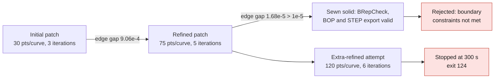
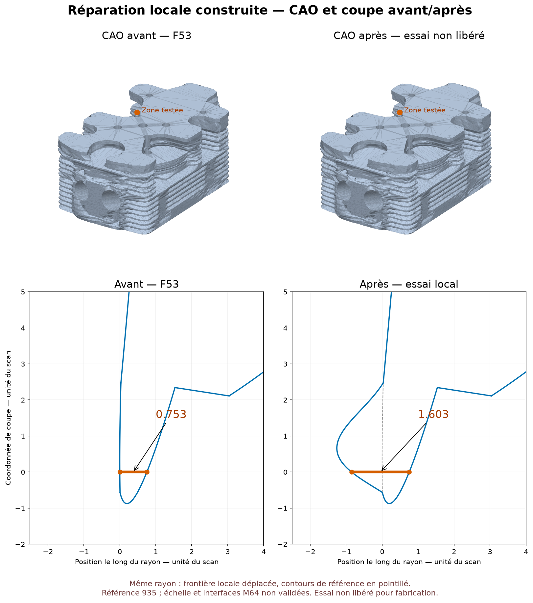

# Real local-reconstruction trial — September 7, 2026

## A modification was actually built

`trial_transition_filling.py` takes the exact private F53 STEP, picks a
single face of the weakest transition, provides its five edge curves
in order to `BRepFill_Filling` and adds a constrained point displaced by
**0.85 scan units toward the air passage**. The target point is classified
`OUT` by OCCT on the original solid. No global substitute outline,
ellipse or interface displacement is introduced. The master stays intact.

This operation modifies a local surface. It must not be described
as an exact preservation of the whole outer skin.

## Result of the re-sewn candidate, still rejected

| Check actually executed | Result |
|---|---|
| Patch construction | Completed, valid BRepCheck face |
| Sewing | One shell, zero free or multiple edges |
| Full solid, before/after STEP export | Exact BRepCheck valid |
| BOP self-intersection | No defect reported |
| Change in the six bounding limits | 0 in the computation performed |
| Volume change | +36.5937 units³, i.e. +0.002937 % |
| Targeted weak path | 0.752667 → 1.602667 scan units |
| 42 rays, same algorithm on both geometries | 39 unchanged to `1e-5`, one increased, two unresolved |
| Paths decreased among the 40 paired | None, to within `1e-5` |

This is a **sampled local** gain, not an exhaustive thickness
map. The unchanged bounding box is not a surface deviation map
nor a proof that all silhouettes are preserved.

The paired comparison of the 42 rays was carried out a second time with
the same inner-interval selector on the master and the candidate. The
40 resolutions are therefore not presented as a physical improvement
over the 37 of the first F54 audit, whose selector was different.

## Why the candidate remains refused

The first patch resolution (30 points/curve, three iterations)
produces a maximum sampled gap at the edges of `9.06e-4`. Refinement
to 75 points/curve, five iterations, maximum degree 12 and 48 segments reduces
this maximum to `1.68e-5` over 31 control points per edge. The threshold kept
is `1e-5`: the edge criteria are not met.

A denser independent check, **121 points on each of the same five
curves**, compares the reference and the patch:

| Curve, private traversal order | Max distance to the original surface | Max distance to the patch surface |
|---|---:|---:|
| 1 | `1.52e-9` | `1.05e-5` |
| 2 | `6.73e-13` | `2.84e-5` |
| 3 | `1.00e-14` | `1.10e-5` |
| 4 | `8.77e-12` | `2.45e-6` |
| 5 | `1.00e-14` | `2.45e-6` |

The OCCT tolerances carried by the five original edges and the original
face are all `1e-7`; that of the exported replacement face
is also `1e-7`. There is therefore a **measured degradation of the junction**,
not merely a threshold stricter than the reference. The dense check
also reveals a higher peak than the initial sampling.

The displacement of the constrained point is satisfied to within `2.20e-7` on the
refined patch. That does not compensate for the edge defect. Sewing and
BRepCheck can succeed while this independent geometric check
fails; no tolerance is relaxed to declare the candidate accepted.

The last authorized attempt increases the resolution only
(120 points/curve, six iterations, degree 14, 96 segments). It is stopped
by the **300-second** cap, `exit 124`, during `building_filling`.
No new candidate is produced. The processes are verified as terminated.
Each trial is limited to two CPUs and 4 GiB of address space; the last one
used about 2.1 GiB RSS before being stopped.

## Artifacts and reproducibility

*Real CAD and OCCT sections of the 935 scan-derived reference before and after the local patch; a diagnostic, not a released geometry.*

This image is produced by `render_transition_filling_section.py` from
the two checked STEPs and their OCCT sections; it is neither a generative image,
nor an Omniverse render, nor a thermal result. The reference source
is attributed to Wolfe Classics, in accordance with the register
`catalog/sources/src-wolfe-classics-935-billet-cylinder-head-scan.json`.
The geometries and coordinates remain private; only this diagnostic
illustration is published.

Under `/tmp/917-f50/out/`, on Kali:

- `m64-local-transition-filling-20260907-v3/`: initial-resolution patch and edge rejection.
- `m64-local-transition-filling-20260907-refined/`: refined patch, still rejected.
- `m64-local-transition-filling-20260907-sewing-diagnostic/`: full solid and checks, final status `rejected_boundary_constraints_despite_diagnostic_checks`.
- `m64-local-transition-filling-20260907-extra-refined/`: last attempt stopped at 300 s; report at the construction stage, no success claimed.
- `m64-filling-independent-audit-20260907.json`: second recorded check, with paired rays, 121 points per edge and a parametric audit of the source surface. Produced by `audit_transition_filling_reference.py`, independently of the initial construction report.

Digests:

- Unchanged master, verified after the last trial: `700baea66bc72cdb6aee529e21b167270ebde11db94b06f8e1e55ee08bdd9bf2`.
- Diagnostic full STEP: `1c2e8bb78d3de01ccf724fac953b62281603a910cd1b7869e373dfcb9e263eec`.
- Refined face: `7a2eabdb33f54b10d4456a5b6ca78e398e6cb609415dd57ceb1b355ec38c7510`.
- Independent paired/dense/parametric report: `ead88223c4a52c65c96dd5f83cc180b25cd3b6178ffe186bd5bc3234b961cf2b`.

The private image `m64-transition-filling-before-after-20260907-v2.png`
shows the full before/after CAD and the two OCCT sections at the same point.
The orange segment is computed on the rays, not inferred from the render.
Image hash: `9314c60d8b8ab2571885f3667d210f1e7a91d81116de6c2312f9355590825e87`.
The `create-viz` skill led to keeping the same views/scales and to
showing the initial reference as a dotted line; no generative image is
used. The displaced local surface explicitly remains an unreleased trial.

The first two launches had interrupted the instrumentation with
`Standard_OutOfRange` while reading the indexed G0 errors. They did
not demonstrate a failure of the builder. The checks kept afterwards
use an independent geometric projection of the original curves
and of the point onto the resulting surface.

Six unit tests check the paired comparison, the distinction
between resolution and gain, and the rejection of mismatched ray identities.
They also refuse non-finite or non-positive lengths, unknown statuses
and invalid tolerances: a NaN cannot be counted as
an unchanged path.
They come on top of the five tests of the origin diagnostic. The CAD results
above come from real native runs, not from these tests alone.

The OCCT reference documentation describes C0 edges and point
constraints, as well as the possibility of incompatible constraints; this is
why `IsDone()` alone does not amount to accepting the patch.
[Official BRepFill_Filling reference](https://occt3d.com/dev/doc/refman/html/class_b_rep_fill___filling.html).

## Justified next steps and limits

The method demonstrated a real local thickening without a change in the bounding
box. The next problem is no longer "no shape built",
but **how to impose the boundary curves with an error below the
threshold without excessively multiplying the cost of the patch**: correction of the
parametric curves/edges on the reconstructed surface or local splitting
of the patch, then a junction check and a new geometric comparison.
None of these additional operators was run in this batch.

### Inner-pole route: audit only, then stop

The source surface is a bilinear B-Spline: degrees 1 × 1, 2 × 2 grid,
no inner pole available. Four anchor curves are isoparametric
in the 121-point audit; the fifth is a B-Spline p-curve varying
simultaneously over about 47.5 % of the U domain and 19.2 % of the V domain.
It is therefore not simply a split isoparametric edge. Even a
degree elevation followed by keeping only the outer rows of poles
would not preserve this non-isoparametric trimming curve. This simple
route is stopped without any degree elevation or further deformation.

A distinct route then identified the analytical cylinder of the
fifth boundary and tested a polynomial vanishing on all five edges. The field
exceeds the local displacement limit and is rejected before construction:
[audit of the implicit-constraint bubble](M64_IMPLICIT_BOUNDARY_BUBBLE_20260907.md).
The distinct Bernstein-product route then leads to a local
10 × 11 candidate whose CAD checks pass, without engine release:
[consolidated Bernstein repair dossier](M64_LOCAL_BERNSTEIN_REPAIR_20260907.md).

The four other weak non-adjacent paths and the other zones of the
part remain to be addressed. Thermal/CHT, strength, fatigue, oil
circulation, M64 interfaces and full LPBF are not validated. The geometry
remains a scan-derived 935 research reference; scan units do not
constitute a certified scale. No manufacturing or start-up
is authorized, and no private STEP/STL is added to the repository.
