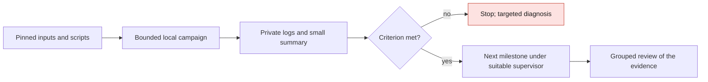

# M64 — scripted campaigns, 38 USD Vast budget

Follow-up actually run:
[PhysicsNeMo-Mesh pilot on A100, cross-calculation and cleanup](M64_PHYSICSNEMO_MESH_PILOT_20260912.md).
The batch below remains the account of the previous step, without rental.

## Decision and execution

Option chosen: deterministic scripts, private logs on disk, small JSON
summaries and human/AI reviews at milestones. **No LLM drives each solver
step.** Three bounded agent tasks handled the cross-calculation, the batch
execution and the mesh/process research in parallel. Agents also consume
tokens: their reports are limited to useful results and references, without
systematically replaying the whole history.

The [533 batch](M64_MIXED_CELL_CORRECTION_20260909.md#extension-533-groups-cross-checked-on-september-12)
is cross-checked, but remains refused on quality. Its native run took 31.842 s
on Kali under four CPUs/4 GiB: no measured justification for a rental to repeat
the same work. The master contour remains unchanged.

## Local batch available

[`run_local_batch.py`](../../twins/m64-cylinder-head/source/run_local_batch.py)
chains one to eight trusted local commands, without shell or retry.
The manifest pins scripts and inputs by SHA-256; imports and dependencies must
be declared too. Each command has a timeout, the campaign a ceiling of 3,600 s
maximum and one second reserved for cleanup.
Each output must be new. On failure, modified input, timeout or a gate that is
not strictly `true`, no following step is launched.
Logs stay on disk; the stdout summary is limited to 4 KiB.

This runner **is not a sandbox**, does not provision a machine, does not launch
SSH/Docker directly and calls no LLM API. The native phases stay in the
existing container supervisors with their CPU/memory ceilings, read-only
inputs and controlled deletion. The local batch must not be used to abandon a
remote computation on timeout.

```sh
python3 twins/m64-cylinder-head/source/run_local_batch.py \
  --manifest /chemin/prive/plan.json --output /chemin/prive/sortie-neuve
```

Minimal plan format (the illustrative values must be replaced):

```json
{
  "schema": "m64-local-batch/v1",
  "campaign_timeout_seconds": 60,
  "inputs": {"/chemin/prive/controle.py": "SHA256_COMPLET"},
  "commands": [{
    "argv": ["/chemin/python-reel", "/chemin/prive/controle.py", "--output", "{output}/gate.json"],
    "script": "/chemin/prive/controle.py",
    "timeout_seconds": 30,
    "gate": {"report": "gate.json", "key": "accepted"}
  }]
}
```

[`summarize_native_mesh_gate.py`](../../twins/m64-cylinder-head/source/summarize_native_mesh_gate.py)
links two pinned receipts (native and independent comparison), checks the
statuses and the nine sets, then produces only the counts and the quality
refusal. It **does not rerun the audit** and does not export coordinates.
Even an accepted mesh is not enough to authorize CFD or manufacturing.

Pilot actually run on September 12: eight reader tests pass, then the two
private receipts are summarized. Both commands finish with exit code zero; the
campaign stops in **0.162 s**, code two, reason `gate_not_true`, because five
quality checks remain refused. This code two is the expected stop of the
chain, not a solver failure. The
[compact public summary](../../twins/m64-cylinder-head/evidence/low-token-mesh-gate-20260912.json)
contains no cell identifier or coordinate.
Digest: `e7a340371015a32af418c2c78f401e20b85aa2b979d4d8403db58deb5603e2c0`.
Private supervision: `d55fd855d64b7c44a5b84942b339d7e457ac48618e944c9478649af46ec1e7a3`.

The first pilot had refused a type inconsistency in the reader
(`unidentified_failed_families_after` is a number, not a list). Its failure is
kept on record; after a fix and a regression test, a new pinned manifest and a
new output were used. No automatic retry or new native computation. The runner
passes 25 distinct tests: success, gate refusals, input mutation, timeouts and
cleanup. The independent review of the two scripts finds no blocker within
this trusted local scope. A full `make check` finishes with exit code zero;
absent optional native checks remain reported as skipped.
These tests concern the software and the dossier, not engine qualification.



## Tokens and money: ceilings, not a promise of a finished product

- Planning objective: **four reviews of 15,000 tokens maximum each**, i.e.
  60,000 tokens envisaged, agents included: geometry, physics, manufacturing,
  final dossier. This is **not an installed Codex/API limiter**; the runner
  does not call OpenAI. The computations/scripts consume no LLM tokens per
  iteration. A total percentage reduction is not measured.
- User ceiling: **38 USD in total**, with a proposed working allocation of
  32 USD and a reserve of 6 USD for transfers/storage/cleanup.
  Not 38 USD per agent. This allocation is neither a new provider wallet nor a
  protection against spending by other users.
- Before each rental: current balance via the OpenBao wrapper, absence of
  duplicates, `linux/amd64` image by digest, verified SSH pair, expected key
  association, ready workload and armed external watchdog. Do not bypass the
  stricter limits of the existing wrapper (PicoGK pilot ≤4 USD).
- The offers observed on September 12 included 32 effective CPUs, about
  128 GB and an RTX 5070 at 0.678 USD/h, or 40 effective CPUs, about 127 GB and
  an A100 at 0.709 USD/h. These are `dph_total` snapshots, **not reservations
  or complete quotes**; check allocated storage and transfer rates on the exact
  offer before creation.
- Framing example, not a reservation: 12 h at 0.709 USD/h ≈ 8.51 USD excluding
  transfers/adjustments. No hardware is rented in this batch.
  [Vast bills storage even when stopped](https://docs.vast.ai/guides/reference/billing):
  collect the results then delete the instance, do not merely stop it.

## Targeted research: technical decision

Primary sources consulted on September 12; novelty alone is not a criterion
for replacing a verified method.

| Avenue | What it brings and decision for the M64 |
|---|---|
| [PhysicsNeMo-Mesh, NVIDIA post of April 7, 2026](https://nvidia.github.io/physicsnemo/blog/2026/04/07/physicsnemo-mesh/) | Geometry, neighborhood and discrete computation operations on GPU, simplicial meshes. Candidate for batch processing of surfaces/tets; do not blindly convert the hybrid polyMesh into it nor call its outputs OpenFOAM evidence. CPU/GPU benchmark only after a tested adapter; not installed in this batch. |
| [Gmsh/HXT](https://gmsh.info/doc/texinfo/gmsh.html#Choosing-the-right-unstructured-algorithm) | CPU/OpenMP parallelization. HXT has already been tried on the core; repeating the same mesh with more RAM does not fix its small boundary facets. No new HXT run launched. |
| [fTetWild](https://github.com/wildmeshing/fTetWild) | Robust tetrahedralization within an approximation envelope, MPL-2.0 license, 2020 paper. Not a hybrid fixer that exactly preserves our interfaces. Admissible geometric deviation to be defined before any trial; the default ε=diagonal/1000 is not an engine tolerance. Not retained to replace the master. |
| [TMOP/MFEM, Camier et al., 2022](https://arxiv.org/pdf/2205.12721) | Optimization by node displacement and partial GPU assembly; quality functions and displacement limiting. Older methodological paper, not a new September 2026 advance. A representation change/adapter would be needed for our polyhedra; the published gains are not performance measured on this cylinder head. |

PhysicsNeMo as a reduced model and Qwen/vLLM as an assistant remain optional.
A reduced model will have to be evaluated on separate reference cases; no
training on the temperature limiter turns it into physics.
An LLM will be rented only after defining a test task and comparing with the
script alone, loading time and cost included. No new LLM server is installed
by this batch.

## Next bounded batches

1. **Geometry**: treat the small boundary facets/edges behind the persistent
   defects, on the same CAD surfaces and with a check of the junctions. Do not
   rerun the HXT/Relocate variants already refused on identical inputs. The
   533 results remain a diagnostic base, not an approved mesh.
2. **Independent process**: isolate the source quadrature on the existing F58
   coupon, thermal only, common window 0–40 µs at 25 ns. Compare
   `nPoints=(10,10,10)` and `(20,20,20)` without changing laser, material or
   limiter. The pinned code of `movingHeatSource.C` normalizes the energy only
   if `abs(1-sumWeights/V0)<0.05`: this numerical sensitivity deserves a test,
   without presuming it explains the 3,300 K. Proposed pilot: two CPUs,
   4 GiB, 600 s including cleanup, single stop, no GPU justified.
   Check the derived recipe and the references before launch; this pilot is
   **not run** in the present dossier.
3. **After admission of the domains**: run thermal then strength and
   manufacturing checks with traceable transfers. Engine interfaces, hot
   properties, fatigue, real manufacturing and bench correlation remain
   separate. No 38 USD budget guarantees closing them.
