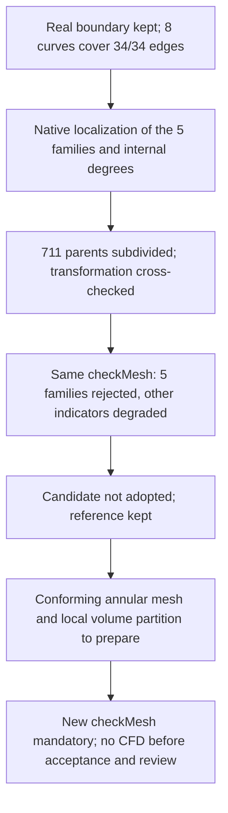

# M64 — meshing the unified-partition domain

## Result — volume obtained, OpenFOAM quality still rejected

The gas domain `fab1338a…` has a **new native package with 86 faces,
191 edges, 118 vertices, one shell and one solid**. The role transfer, the
face exports, the guide inventory and the quadrature were executed. **The new
Delaunay mesh contains 401,961 tetrahedra and 186,370 boundary triangles**,
obtained in 36.113 s. Its eleven integrity guards and the radial envelopes of
the guides before and after 3D pass. **OpenFOAM still rejects five quality
families**, versus six before; the number of cells with a low determinant
**increases from 4,579 to 5,442**. A new check of the eight native curves now
covers the whole interface; the historical rejection of the four C0 chains
alone remains recorded, without being requalified as a success. The central
subdivision trial run afterward lowers the low determinants, but degrades
other indicators: **it is not adopted**.

This step validates neither CFD, nor thermal behavior, nor strength, nor the
LPBF process. Printing, M64 mounting and operation at 700 PS twin-turbo are
neither authorized nor demonstrated. The detailed geometric data remain
private.

## From the checked candidate to the computation package

The [native correction and its independent review](M64_LOCALISATION_ET_HXT_20260908.md)
explain the unification of the former faces 37, 38 and 40 into a single port
face. The seat interfaces, the C0 segments and the annular passages were not
removed to ease the computation.

Review `7bd9c92d…` compares the candidate with the **OCCT serialization
control** `cf81801a…`, not with a raw identity of all the scan descriptors.
This distinction remains kept in the new manifest `58b8be5a…`. The
correspondence comprises 85 one-to-one faces and the three-to-one group; it is
therefore not a global bijection between the old and new indices.

The [package builder](../../twins/m64-cylinder-head/source/flowbench-intake/package_unified_gas_domain.py)
explicitly binds domain, original manifest, review and sources by their
digests. It exports and rereads the **86 native faces**: each is recognized as
a face and passes BRepCheck. The roles are assigned with no unmatched or
ambiguous face; the inputs and the master domain remain unchanged.

**Caveat on `native_roundtrip`:** for the body of this package, it is a
bit-identical copy of `fab1338a…`, followed by its rereading and its B-Rep/BOP
checks. The field does not constitute a new full OCCT write-then-reread cycle
of the body. The exports and rereadings of the faces, on the other hand, were
indeed performed. No STEP export is qualified.

The checks of the intake throats and of the communication of the guide
extensions are **inherited through the boundary correspondence review**. No
new Boolean intersection of the throats or guides was computed on this
package. The bench stem seals remain idealized; their physical sealing is not
qualified. The historical values do not become new measurements on this
candidate.

## New inventory and integration reference

Inventory `815716df…` rereads the 86 faces, identifies 33 cylindrical surfaces
and the eight guide–stem annular portions: new indices 53–56 and 59–62. It
contains **no mesh result**: the facet envelope guard stays at `null` and
`mesh_accepted` at `false`. This guard will have to be evaluated on the
triangles actually generated.

Quadrature `1bdb66f6…` was recomputed on the exact domain `fab1338a…`:

| Native method | Volume in scan units³ |
| --- | ---: |
| Non-adaptive | 995,961.70449802 |
| Adaptive, requested precision 10⁻⁹ | 995,964.5870689296 |

The quadrature estimate is not a demonstrated error bound. These volumes are
not certified mm³: the scan scale remains an assumption. The non-adaptive
reference will be used to compare the Gmsh import on the same integration
basis, without transferring that of an earlier candidate.

## Pass executed and descriptive comparison

The pass used Gmsh 4.15.2, **Delaunay 3D (`Mesh.Algorithm3D = 1`)**, with a
limit of four CPUs, 4 GiB and 300 s on Kali. The local guide field stays at
0.20 scan unit. The field targeting the former "face 38" micro-band is
removed: this index no longer represents that partition. This removal is
neither an enlargement of the guide–stem clearance nor a relaxation of the
quality criteria. The algorithm choices are described in the
[official Gmsh manual](https://gmsh.info/doc/texinfo/gmsh.html).

Volume `c0cbb257…` is reread from MSH 2.2. The eleven guards detect no
tetrahedron with non-positive volume, no missing or extra boundary, and no
connectivity break; the groups and the native CAD are kept. The pre-3D surface
`0ab139b2…` contains 93,185 nodes. The radial guards of the eight guide–stem
portions pass on their real facets before and after 3D: this result does not
come from the mesh-less inventory.

| Gmsh diagnostic after rereading | Old `7fc114c1…` | New `fab1338a…` |
| --- | ---: | ---: |
| Tetrahedra | 469,985 | 401,961 |
| Minimum SICN | 2.5073×10⁻⁷ | 1.29054×10⁻⁵ |
| SICN below 0.1 | 1,343 | 491 |
| SICN below 10⁻⁶ | 5 | 0 |

This comparison is **descriptive**, not an isolated causality: the
unification of the partitions and the removal of the now obsolete "face 38"
field are two changes. SICN is a Gmsh diagnostic, not a substitute for the
OpenFOAM criteria nor evidence of CFD accuracy.

## OpenFOAM check actually executed

Review `48c9803b…` authorized only conversion and diagnostics, with no solver.
It finds before/after 3D the 93,185 boundary nodes and 186,370 oriented
triangles with their roles and 86 native faces. The ASCII coordinates are
identical; 185,881 triangle identifiers are reassigned with no change of
geometry or connectivity.

The four commands `gmshToFoam`, `transformPoints`, `createPatch` and
`checkMesh -allTopology -allGeometry` end with code zero. However, the log
concludes **`Failed 5 mesh checks`**, without `Mesh OK`: the supervisor
therefore returns code 2. A process success is not a quality acceptance. No
CFD solver was launched.

| OpenFOAM check | Old `7fc114c1…` | New `fab1338a…` |
| --- | ---: | ---: |
| Excessive aspect ratio: cells; maximum | 130; 23,937.13 | 3; 2,011.04 |
| Excessive skewness: faces; maximum | 73; 346.48 | 10; 13.1054 |
| Determinant below 0.001: cells | 4,579 | **5,442 — worse** |
| Concavity: cells | 23 | 0 |
| Interpolation weight below 0.05: faces | 1,146 | 519 |
| Volume ratio below 0.01: faces | 540 | 149 |

Concavity now passes; the five other families remain rejected. In addition,
262,008 faces exceed 70° of non-orthogonality and five edges are reported too
short: these are separate warnings, not two additional families in the count
of five failures.

The 0.001 scale is applied only once, still as an assumption. The three
boundaries count 184,917 `walls` faces, 1,191 outlet faces and 262 inlet
faces. The original files remain unchanged; changing the wall type does not
change the geometry. The absence of the diagnostic container after cleanup is
verified.

## First C0 cross-audit: historical rejection kept

The independent check `ec44d805…` ends in **8.312 s, code 2**. The five
anchors are distinct and uniquely matched with a measured distance of zero.
The four native C0 curves 97–100 are each represented by a monotone chain of
respectively **12, 2, 2 and 2 segments**. These local checks pass separately.

The pre/post-3D preservation of the 93,185 nodes and 186,370 triangles also
passes; the cross-audit finds these triangles as the real outward-oriented
boundary of the tetrahedra, and not only as surface records kept in the MSH
file.

**The global result of this first audit remains rejected.** The interface of
faces 36/37 contains 34 mesh edges, of which only 18 are covered by the four
chains and 16 others. After merging, the native interface comprises curves
93–100, instead of only 97–100 of the former face pair. The historical
predicate requiring the four chains to cover the whole interface therefore no
longer matches this enlarged perimeter. No criterion was changed to turn this
rejection into an acceptance.

The four chains alone prove neither complete coverage, nor the native 1D
classification of the mesh, nor the continuous fidelity of the chords to the
CAD. The extended check below addresses the first of these gaps.

## Additional results: full interface and localized defects

The new check `dfdeb376…` examines **the eight native curves 93–100** and
their chains: **34 of 34 mesh edges covered**, with no gap, excess or double
count. The native inventory and its anchors are uniquely matched; the
preservation of the real tetrahedral boundary remains verified. This check of
limited scope ends in 7.674 s. It also recomputes the old C0 subset: **18/34,
rejection unchanged**. Explicitly extending the inventory to the whole
interface is not removing the 16 remaining edges from the criterion. It still
proves neither continuous conformity of the chords, nor CFD or manufacturing
quality.

The five OpenFOAM families are now localized on **this same volume**, through
the native labels, the 112,649 points and the 186,370 boundary triangles; the
86 faces and their roles are found. The matching accounts for OpenFOAM writing
at 12 significant digits, without claiming binary identity of the coordinates
and without using the VTK as CAD.

Of the **5,442 low-determinant cells, 4,382 touch the guide–stem annular
passages**. The three high-aspect-ratio cells touch face 37; the ten
high-skewness faces are spread between native faces 29 (five), 28 (three) and
36 (two). An adjacency does not, by itself, establish the numerical or
physical cause of the defect.

The number of internal faces of the low-determinant cells is distributed as
follows: **degree 1: 1; degree 2: 710; degree 3: 4,605; degree 4: 126**. This
is a topological diagnostic of the case without coupled boundaries, not a
quality exemption.

For a 3D cell and the internal or coupled faces `I`, OpenFOAM 14 computes
`A_avg = Σᵢ∈I |Sᵢ| / |I|`, then
`D = |det(Σᵢ∈I (Sᵢ/A_avg) ⊗ (Sᵢ/A_avg))|`; if `I` is empty, `D = 0`.
**Uncoupled walls are excluded from this sum.** This area-tensor determinant
is not the Jacobian of the tetrahedron. The formula is verified in
[`primitiveMeshCheck.C`, commit `7b05503f98a85be88af930df48623b4d152bfc35`](https://github.com/OpenFOAM/OpenFOAM-14/blob/7b05503f98a85be88af930df48623b4d152bfc35/src/meshCheck/primitiveMeshCheck/primitiveMeshCheck.C#L457-L551).

With at most two vectors in this sum, its rank cannot reach three: this
explains a structural difficulty for 711 cells of the batch, not the 4,731
others. This observation motivated the targeted trial below; it did not allow
presuming its final quality.

## Topological trial executed: candidate rejected

Producer `59893e71…` subdivides each of the **711 tetrahedra with at most two
internal faces** into four children around a new barycenter: 2,844 children,
in 12.144 s. The candidate is `7e942138…`, distinct from the reference
`c0cbb257…`. The selection comes from the incidence of the whole mesh, not
from the list of OpenFOAM defects alone.

Cross-audit `2d9cdd23…`, in 11.879 s, keeps exactly the 112,649 original node
records, the 186,370 boundary triangles and the 401,250 untargeted tetrahedra.
The 711 new nodes are verified separately. In rational arithmetic on the
serialized decimal coordinates, each child has exactly **one quarter of the
positive volume of the parent**. The real boundary and the internal
orientations are preserved. This transformation check does not accept the
quality of the candidate.

| Measurement after rereading or `checkMesh` | Reference `c0cbb257…` | Candidate `7e942138…` |
| --- | ---: | ---: |
| Tetrahedra | 401,961 | 404,094 |
| Cells with determinant below 0.001 | 5,442 | 5,259 |
| Excessive aspect ratio: cells | 3 | 3 |
| Excessive skewness: faces | 10 | 10 |
| Interpolation weight below 0.05: faces | 519 | **529** |
| Volume ratio below 0.01: faces | 149 | **158** |
| Non-orthogonality above 70°: faces | 262,008 | **263,136** |
| Tetrahedra with SICN below 0.1 | 491 | **1,000** |
| Minimum SICN | 1.29054×10⁻⁵ | 1.29054×10⁻⁵ |

The Gmsh rereading takes 1.287 s, with no optimization of the file. The
OpenFOAM chain ends in about 9 s: its four commands return zero, but **five
families remain rejected** and the supervisor returns 2. The reduction of 183
low determinants does not offset the observed degradations; **the reference
`c0cbb257…` is kept and the candidate is not adopted**. No CFD solver, thermal
computation or LPBF trial is launched.

The results of the older meshes are not attributed to this pass. The next
step aims at a conforming mesh of the annular passages and a suitable local
volume partition, **without deforming the CAD or widening the clearances to
make the check pass**. No simplified annular model has yet been run or
qualified. A produced volume is not enough to authorize a CFD solver.

## Traceability and resources

At the current checkpoint, `make check` ended with code **0**: **2,391 tests**
in the main suite in **178.922 s**, of which **108 skipped**, then additional
targets completed. Private log:
`dc765bd25cd723689caad0c97dda53d12afdd8bcf81cc83cb354c865d92df23a`. These tests
verify the software and contracts; they overturn no rejection of the mesh
check and do not physically validate the cylinder head.

The [synthetic public receipt](../../twins/m64-cylinder-head/evidence/unified-native-mesh-20260908.json)
gathers the digests, measurements, rejections and limits of this pass. The
detailed geometries and coordinates remain in the private traces.

The [receipt of the full interface and of the subdivision trial](../../twins/m64-cylinder-head/evidence/unified-interface-and-star-trial-20260908.json)
carries the additional evidence: producer `59893e71…`, cross-audit
`2d9cdd23…`, OpenFOAM check `9c68cb1d…`, log `135f9d8f…` and Gmsh quality
`1f3af0ca…`. It distinguishes the preserved integrity from the quality
rejection.

Digests of the prepared package: domain `fab1338a…`, manifest `58b8be5a…`,
builder source `9bb1486f…`, review `7bd9c92d…`, inventory `815716df…` and
quadrature `1bdb66f6…`. The pass report is `de7094fd…`; its volume and pre-3D
meshes are respectively `c0cbb257…` and `0ab139b2…`. The conversion review is
`48c9803b…`, the OpenFOAM receipt `a466529e…` and its log `f3ec17cd…`. The C0
cross-audit is `ec44d805…`, bound to source `d29d5dae…`; its 20 targeted tests
pass with no test skipped. These software tests do not replace the rejection
observed on the real mesh.

New receipts: full interface inventory `dfdeb376…`, localization `801dad7d…`,
degree complement `ca37bc26…`, export of the native sets `4eb33217…`. They
concern the same files `c0cbb257…` and `0ab139b2…`; they are distinct from the
receipts of the subdivision trial `7e942138…`.

For the initial Delaunay mesh, the source actually executed is
**`04811670b4e46fbbc4e1268e277db9744ec39cb20846869243d5623bf7164408`**, frozen in
the private traces. After this pass, a preflight guard was added against
omitting the size and the reference of the guides; eight targeted tests of the
unified profile pass. The executed pass already supplied these options and
verified the facets. **The later hardened source is not attributed to it
retroactively.** The source starting point remains `e9ac07c`.

No new Vast spending for this local x86 run. The verified available balance is
**43.9166429608502 USD**, under the user cap of **44 USD**; no Vast instance is
present in the verified reading. The two diagnostic containers of the trial on
Kali, each limited to four CPUs and 4 GiB, were deleted; their absence was
verified. No promise of an accepted mesh or of a printable cylinder head is
attached to this integrity result.
