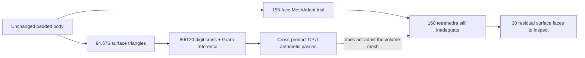

# M64 — area precision and targeted meshing, 28 September 2026

## Outcome

The [27 September whole-body checkpoint](M64_WHOLEBODY_SUPPORT_GPU_20260927.md)
is unchanged. No new CAD, valve, material or engine geometry was substituted.
This continuation establishes two bounded results:

- The cross-product area method passes the original numerical threshold on all
  **94,676 triangles** against two independently formulated, high-precision
  references. This is a new **CPU-only arithmetic audit**, not a new CUDA or
  PhysicsNeMo execution or an override of the previous rejected GPU receipt.
- Local surface remeshing reduces inadequate tetrahedra from **1,314 to 160**
  against a same-Mac control, a count reduction of 87.82%. The mesh still fails
  the unchanged `minSICN >= 0.1` project criterion. No thermal/structural solver
  or manufacturing release is authorised by these results.

All work ran on the existing 10-CPU / 64-GiB Mac. **No new Vast rental** was
created and no existing rental was controlled. Git `main` was fetched through
the approved repository-scoped wrapper; it has no commits missing from this
engineering branch at the start of the continuation.

## Area diagnosis and narrowly scoped remedy

The inspected [NVIDIA 2.2.0 implementation](https://github.com/NVIDIA/physicsnemo/blob/v2.2.0/physicsnemo/mesh/geometry/_cell_areas.py)
computes triangle areas with a difference of dot-product products. This is
algebraically equivalent to the cross product, but the subtraction loses
significant digits on thin triangles. A synthetic positive triangle with
height `2^-30` reproduces area cancellation to zero in binary64; the cross
method retains its exact area `2^-31`.

The [new arithmetic audit](../../twins/m64-cylinder-head/source/wholebody/audit_area_precision.py)
starts from the exact binary64 coordinates using `Decimal.from_float` and
evaluates **both cross-product and Gram-determinant formulas at 80 and 120
decimal digits on every triangle**, not just the worst samples. The maximum
relative disagreement between formulas is about 1.25e-70; between precisions,
about 2.48e-76. This is a converged numerical reference on the supplied data,
not a formal interval proof or a metrology uncertainty estimate.

| CPU method vs rounded 120-digit reference | Failures at rtol 1e-10, atol 0 | Maximum relative error |
|---|---:|---:|
| Torch reproduction of the Lagrange formula | 1,382 | 4.97907e-7 |
| Torch 3D cross product | 0 | 1.37379e-12 |
| Retained NumPy cross product | 0 | 1.92757e-12 |

Runtime: Torch 2.10.0, NumPy 2.2.6, approximately 7.21 seconds for the audit.
The Linux CPU result previously counted 1,389 failures against NumPy; this Mac
run uses a high-precision reference and a different platform, so it is not a
bitwise reproduction of that receipt.

The cross-product approach **already exists** in the
[12 September PhysicsNeMo pilot](M64_PHYSICSNEMO_MESH_PILOT_20260912.md) and its
[separate adapter](../../twins/m64-cylinder-head/source/physicsnemo-mesh/benchmark_cross_adapter.py).
The advance here is high-precision confirmation on the **new padded body's
surface**, not invention of that adapter. The older executable pins a different
body/runtime and cannot be presented as a run on this input. The new narrow
arithmetic helper accepts finite float64 3D triangles only and rejects zero
areas; it does not patch installed PhysicsNeMo. CUDA and quality-metric
validation remain separate pending work.

## Where the poor tetrahedra originate

The previous Linux Netgen receipt contains 1,240 inadequate tetrahedra:
948 touch at least one boundary face; 292 have no boundary face. There are
179 incident CAD faces, mostly B-splines (161). Face-incidence counts are
**not disjoint tetrahedron counts**. The surface has 815 inadequate triangles
spread over 155 CAD faces. These are geometric classifications, not an
unverified claim that every problematic face is a fin, port or new pad.

The [targeted runner](../../twins/m64-cylinder-head/source/wholebody/run_local_surface_trial.py)
applies Gmsh MeshAdapt only to those 155 hash-bound source faces. It resolves
their imported tags by the existing descriptor-bijection check, not tag order.
It uses a temporary, explicitly recorded generation hook and restores it in
`finally`; installed files and the frozen volume-audit helper are unchanged.
The **companion receipt is mandatory** because the frozen helper report alone
does not describe this hook. CAD tolerances, BRep geometry, scale and quality
thresholds are not edited. Gmsh documents the available surface algorithms in
its [official meshing guide](https://gmsh.info/doc/texinfo/#Choosing-the-right-unstructured-algorithm).

All local trials use Gmsh 4.15.2, OCP 7.9.3.1, a fresh native baseline and
Delaunay volume meshing followed by Netgen. They are bounded by the retained
CPU limit and a maximum audit size of 1.5 million tetrahedra.

| Same-Mac trial | Size interval, scan units | Tetrahedra | Below 0.1 | Minimum minSICN | Bad-element volume fraction |
|---|---|---:|---:|---:|---:|
| Control, default surface algorithm | 1–6 | 241,656 | 1,314 | 0.000213802 | 0.285034% |
| Global refinement | 0.5–3 | 594,658 | 543 | 0.0000154003 | 0.010478% |
| MeshAdapt on 155 faces | 1–6 | 241,299 | 160 | 0.0173405985 | 0.028898% |

The targeted run improves count and minimum quality versus the control, but
the finer run has a smaller bad-volume fraction. No single scalar establishes
overall convergence. All three remain **rejected**, including after mesh
save/reread. The global refinement emits 16 `BFGS update error2` messages;
its completed audit is retained as rejected, not silently promoted.

The targeted run preserves one connected tetrahedral region, a complete
matching boundary, positive Jacobians and surface elements on all 4,918 CAD
faces. Native imported face descriptors and volume remain unchanged after
meshing. Its linear-mesh/CAD volume discrepancy is 0.298284%, below the coarse
1% check but slightly worse than the control's 0.288579%; this is **not** a
surface-deviation or 0.040 mm certificate. Input and executed-source hashes
remain unchanged.

## Remaining rejection and next bounded experiment

The targeted output retains 160 inadequate tetrahedra: 130 touch boundary
faces and 30 do not. It has 74 inadequate surface triangles on 30 faces;
26 of those faces were already targeted, four were not. The worst tetrahedron
touches source face 1481. These identifiers are valid only for the pinned
body and receipts below.

Next: inspect the 30 residual surface faces and their boundary constraints,
then test local edge sizing or meshing changes with a fixed control. Repeating
global refinement alone is not justified as a complete remedy by these data.
Only after mesh admission and convergence should qualified thermal, mechanical
and fatigue loads be applied. The assembly, continuous valve motion, oil
circuit, print process and physical M64 interface gates remain open.

## Reproducibility

Scans, BReps, mesh coordinates, high-precision arrays and detailed location
receipts stay private. Public sources/tests contain no raw geometry.

| Private input or receipt | SHA-256 |
|---|---|
| Native body | `b2b48fe40edd1a20c8e6c0d20d77e6045931189f18330b441b09bcbf4618fc0a` |
| Display surface | `9660e54dc3215bbdfd2a2710fff4108e65b2447d5642a0e583c06d86492281b2` |
| High-precision audit | `a29406a515ff1d08f2bf3ac6865e53e0db9ee9873b896dbb42e30798c7641748` |
| Local native baseline | `b9e3e80e7873540f5ab2ca456f0b9295783d9cd539247098b8d7308df26c1dd5` |
| Mac control | `9fbf8b52a4d3849af63a6bbb1c2500c758c5f853e2df86c7231338634605b638` |
| Global refinement | `6dc5c95e16b6f4b81e4b42e836fccbc35ebbd3d3fc95c98d7a340a7db3a2bb4b` |
| Targeted mesh report | `512b3efe0fd29afd33f4becad54b63ebbc14df229ba63cbc4090c86177392018` |
| Mandatory targeted-trial companion | `9e35966baeefdba17671e4b2050db70da7611bad74c6453916bc538d6f9f3f48` |
| Residual quality locations | `3174c8df6b091821d0c7b097cd6309a796294bcbead456d37f72475ef684b27d` |

Frozen new producer hashes: arithmetic audit
`d2a59a8e7ea16685ac74934b9cc555a0e9c13f791b6547a6e3373e582942c8c5`;
surface runner `1ef987d833125281899776542ef99f4701d3f958552dde59883456db0aabe488`.
The current scope is computational diagnosis and meshing, not manufacturing
qualification. The prior Omniverse service-readiness and website deployment
identity blockers have not been resolved or bypassed in this continuation.

## Repository verification

`make check` completed successfully on the Mac: the main discovery suite ran
3,165 tests with 143 skips, followed by the repository's additional checks.
The three new precision/face-selection tests passed. Documentation checks found
zero broken links in 558 Markdown files; the report index and catalogue previews
are current. These are software and evidence-consistency checks, not physical
validation of the head.
