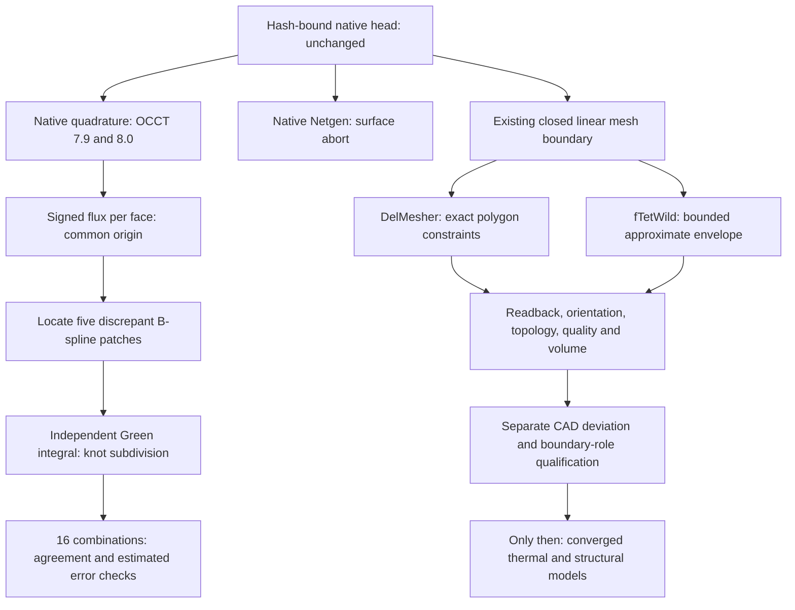

# M64 — 2026 mesh tools and volume-control recovery, 28 September 2026

## Outcome and scope

**The numerical volume discrepancy has been localized and a new reconciled
flux control passes the unchanged relative agreement target of `1e-10`.**
Sixteen combinations give a relative spread of **1.548e-11** after independently
integrating five problematic B-spline patches. This is a numerical consistency
result on the current reference body, not a rigorous interval enclosure of its
volume, dimensional certification, or approval of the separate coplanar CAD
candidate. The old failed receipts remain failed.

Meshing is a separate gate. Native Netgen aborted on surface meshing.
DelMesher completed its full conforming pipeline, but the double-precision
output contains one nearly flat tetrahedron with the opposite orientation to
the other 1,812,930. It is rejected, not silently flipped or deleted.
The first fTetWild trial produces **1,157,489 positive tetrahedra**, none below
minSICN 0.1 (minimum **0.1254123**). However, it has **two connected regions**:
the smaller contains three tetrahedra and intersects the native CAD. It is not
discarded to manufacture a passing topology result.

The reference BRep and its 13-solid assembly are unchanged. No heat-transfer,
strength, combustion, fatigue, physical fitment or LPBF validation is asserted.
All lengths and volumes remain in provisional scan units; calling those units
millimetres does not establish metrology. See the
[preceding CAD-constrained trials](M64_CAD_CONSTRAINED_MESH_20260928.md).

## Process and acceptance rules



Every trial uses a fresh output directory. Inputs, scripts and results receive
SHA-256 digests. The native geometry remains private; public Git contains code,
tests, aggregate results and provenance, not scans or proprietary CAD.

The volume-mesh checks remain positive Jacobians, one connected volume, complete
boundary, unchanged export/readback, and **minimum Gmsh minSICN >= 0.1**.
No author's face-angle or AMIPS bound is substituted for that metric.
The diagnostic audit ceiling is explicitly three million tetrahedra on the new
512-GB host; that is an audit-resource limit, not a loosened quality threshold.
Polygon conformance, native curved-CAD conformance, and physical measurement
accuracy are three different assertions.

## Research: what is genuinely new, and what was tested

This is a targeted review of primary sources, not a claim to have exhausted
every 2026 publication or repository. Versions were checked on September 28.

| Tool / primary source | Relevance | Decision in this batch |
|---|---|---|
| [DelMesher / DelOptim, SIGGRAPH 2026](https://github.com/MarcoAttene/DelOptim), [paper](https://cims.nyu.edu/gcl/papers/2026-chamfering.pdf), DOI 10.1145/3811395 | New surface-chamfering and enriched constrained Delaunay pipeline | Built and tested on Linux, then actual full-head boundary |
| [OCCT 8.0.1](https://github.com/Open-Cascade-SAS/OCCT/releases/tag/V8.0.1), [OCP 8.0.1.0.0](https://pypi.org/project/cadquery-ocp/) | New kernel/bindings; relevant seam and pcurve fixes | Isolated side-by-side volume test; updating alone does not fix this case |
| [Netgen 6.2.2607](https://pypi.org/project/netgen-mesher/), [native OCC API](https://docu.ngsolve.org/latest/i-tutorials/unit-4.4-occ/occ.html) | Native BRep pipeline, distinct from Gmsh's Netgen post-optimizer | Real head imported with 4,918 faces and one solid; meshing aborted |
| [CGAL 6.2.1](https://github.com/CGAL/cgal/releases/tag/v6.2.1), [tetrahedral remeshing](https://doc.cgal.org/latest/Tetrahedral_remeshing/index.html) | Feature-aware flips, collapse/split and relocation | Reviewed, not executed; release is new, remeshing method is older |
| [fTetWild](https://github.com/wildmeshing/fTetWild), [wildmeshing 0.4.1](https://pypi.org/project/wildmeshing/) | Approximate-boundary tetrahedralization within an envelope | Actual bounded experiment; SIGGRAPH 2020 algorithm, not a 2026 invention |
| [MMG / ParMmg](https://github.com/MmgTools/mmg/releases) | Metric-driven mesh adaptation | Reviewed as an alternative, not executed; no intrinsic native-CAD proof |
| [MFEM / TMOP](https://mfem.org/) | High-order mesh optimization, including accelerator workflows | Reviewed; not a replacement for correct boundary geometry |
| [TetraSDF](https://github.com/naver-ai/TetraSDF) | Neural implicit tetrahedral geometry | Not selected: fidelity to a learned field is not fidelity to this native head |

DelMesher's angle guarantee applies before restoration of the original
polyhedral constraints. Restoring those constraints can reintroduce low-quality
tetrahedra. The implementation used here is commit
`761eaa4ac23168567e06a3ce64f2061af1ec190c`, C++20 Release, default LGPL-3.0 mode;
the alternative licensing/code path is not enabled. fTetWild is MPL-2.0;
CGAL tetrahedral remeshing has GPL/commercial licensing. Dependencies retain
their own licences; no supplier-owned head geometry is redistributed.

The NVIDIA skill catalogue was consulted. The discovered PhysicsNeMo guides
concern models, discovery and distributed tensors, not a native CAD meshing
repair. No new skill was installed. Prior actual PhysicsNeMo/PicoGK results
remain documented in the [previous run](M64_NEMO_PICOGK_CONTINUATION_20260928.md).

## Volume: diagnosis, correction, limitations

The isolated OCCT 8.0.1 run reproduces the old failure:

| Method, requested tolerance `1e-12` | Reference volume | Candidate volume |
|---|---:|---:|
| Adaptive Gauss | 1,111,779.373543864 | 1,111,779.373544035 |
| Adaptive Gauss–Kronrod | 1,111,779.150504044 | 1,111,779.150554835 |

The default, nonadaptive reference is 1,111,796.916022225. A requested
integration tolerance is not proof that the numerical integral attained it.
These are two integration schemes in the same kernel family, not independent
CAD engines.

The [face diagnostic](../../twins/m64-cylinder-head/source/wholebody/audit_volume_face_quadrature.py)
then sums signed contributions about the **same origin** for every face. An
analytic translated 2 × 3 × 4 box is checked first: both sums must equal 24.
Using a different origin for each open face would invalidate the sum.

The dominant disagreement is on faces 713, 712 and 582, with smaller
contributions on 710 and 711. They are B-spline patches, not invented missing
material. Source face 713 alone differs by about 0.24443 scan units³ between
the two fixed-origin kernel integrators.

The [independent implementation](../../twins/m64-cylinder-head/source/wholebody/integrate_trimmed_flux.py)
does not call BRepGProp for integration. It evaluates native surface derivatives
and integrates

`f(u,v) = S · (S_u × S_v) / 3`

over the trimmed parameter domain using Green's theorem:

`integral_D f du dv = integral_boundary [integral_u0^u f(s,v) ds] dv`.

Every trimming edge and its orientation are retained. Inner integration is
split at surface U knots, and outer integration at trimming-curve knots and
surface V-knot crossings. Fixed Gauss–Legendre orders 32 and 64 are compared
against QUADPACK outer integration with inner orders 64 and 128. On the five
selected faces all four estimates agree within **2.19e-11 scan units³**.
No edge, sliver or CAD face is removed to obtain that agreement.

The [reconciliation control](../../twins/m64-cylinder-head/source/wholebody/reconcile_volume_flux.py)
requires all 4,918 original faces exactly once, all five independent patch
receipts, complete four-method coverage and finite nonnegative error estimates.
Replacing only those five flux contributions in both full native sums gives:

| Quantity | Observed result |
|---|---:|
| Lowest of 16 recombined volumes | 1,111,779.374077778 |
| Highest of 16 recombined volumes | 1,111,779.374094988 |
| Relative spread | 1.5479839632348558e-11 |
| Required relative spread | <= 1e-10 |
| Largest sum of estimated native absolute errors before patch allowance | 6.812e-5 scan units³ |
| Reconciled numerical-agreement gate | Passed |

The five corrected contributions are common to the recombined native sums;
the whole result is **not** sixteen independent CAD implementations. Their
own four quadratures are checked separately. Estimated errors are not rigorous
interval bounds. The check does not promote the 4,917-face topology candidate,
transfer face roles, or replace a native BRep mass property with an unexplained
constant.

A further whole-body Green-integral cross-check was run in 16 isolated batches.
Four-method coverage completed on 4,435 faces; two have partial coverage and
481 were not reached after strict quadrature warnings or a trim/reference-
parameter condition stopped their batch. That all-face experiment is
**incomplete** and is not substituted for the scoped, completed reconciliation
above. The reconciled control still includes all 4,918 faces through its native
base sums; the 481 unvisited faces are not missing from that separate control.

## Meshing: actual execution and rejected outputs

The [mesher runner](../../twins/m64-cylinder-head/source/wholebody/trial_meshers_2026.py)
reuses the existing topology and minSICN auditor. It never fixes a mixed
orientation by flipping individual tetrahedra; only a uniform library-wide
orientation convention can be converted, explicitly recorded.

### Netgen

Native `OCCGeometry` reads the original BRep directly: 4,918 faces, one solid,
imported volume 1,111,779.373496644. Parameters are maxh 6, minh 1 and grading
0.3. The process aborts with surface-meshing `more elements on face` errors.
Exit 134 is preserved. No completed volume mesh is claimed.

### DelMesher

The original Python 1.0.1 API returns both interior and exterior tetrahedra.
On a unit tetrahedron the unfiltered result fills a 27-unit³ bounding box,
not the intended 1/6-unit³ solid. Source inspection confirms that the Python
extraction omits the interior/exterior split.

The CLI preserves that split. Its actual filename at the pinned commit is
`enrichedCDT_mesh.tet`, despite the README's `out_mesh.tet`. The classified
parser reads the explicit interior count and excludes exterior elements.

The unmodified CLI text writer uses insufficient coordinate precision: the
analytic tetrahedron volume becomes 0.1666666635948244. A
[one-line export patch](../../twins/m64-cylinder-head/source/wholebody/delmesher-tet-precision.patch)
sets `max_digits10` on that stream. It changes serialization only, not meshing,
predicates or interior classification. Rebuilding restores the witness volume
to 0.16666666666666666; its topology/readback pass. Its quality gate still fails
(two elements below 0.1), demonstrating that volume fidelity is not mesh quality.

The full-head trial uses the existing closed, oriented linear-mesh boundary:
45,479 vertices and 90,986 triangles, float64 OFF export, enriched CDT enabled,
sliver removal enabled, no LFS constraints ignored, and a 200,000 inserted-vertex
refinement cap. Capped completion is not claimed as convergence.

After 276 s in the mesher (about 5.76 GB reported peak RSS), classification gives
1,812,931 interior and 1,831,986 excluded exterior tetrahedra. Float64 determinant
audit finds 1,812,930 negative and one positive determinant, the latter only
1.136e-17. This cannot be repaired by a uniform orientation permutation.
The run therefore fails before quality acceptance. The exact-predicate
algorithm's success does not guarantee a nondegenerate exported float64 mesh.

### Envelope alternative

The [fTetWild runner](../../twins/m64-cylinder-head/source/wholebody/trial_envelope_mesher.py)
requests an envelope of **0.02 provisional scan units** around the same linear
boundary, target edge length 3, AMIPS stopping quality 8, at most 80 passes,
16 threads, no preprocessing simplification, no coarsening, and no open-surface
smoothing. Interior extraction uses the input winding reference.

| First trial, envelope 0.02 | Observed result |
|---|---:|
| Elapsed time including audit | 822.25 s |
| Vertices / tetrahedra | 247,479 / 1,157,489 |
| Minimum minSICN | 0.12541234334863854 |
| Elements below 0.1 / nonpositive Jacobians | 0 / 0 |
| Exact binary MSH write/readback | Passed |
| Boundary triangles | 183,250 |
| Connected tetrahedral regions | **2 — rejected** |
| Tetrahedral volume | 1,115,133.416340841 |
| Boundary-divergence / tetra-volume relative disagreement | 2.22e-16 |
| Volume change against the input linear mesh | 1.8109e-5 relative |

The first region contains 1,157,486 tetrahedra. The second contains three,
total volume 6.3409e-6 provisional units³. Each was reconstructed as a valid
native tetrahedral solid, then intersected with the unchanged reference BRep
using OCCT Common, without fuzzy Boolean settings. The three common volumes
are positive: 1.12409e-6, 3.55878e-6 and 1.10059e-6. This rules out simply
declaring the region outside the CAD. No element was deleted or joined by an
invented bridge. These tiny Boolean intersections are diagnostic, not exact
physical overlap measurements.

The [independent region audit](../../twins/m64-cylinder-head/source/wholebody/audit_envelope_regions.py)
confirms the two face-connected components. Every boundary edge has exactly
two incident triangles with balanced orientation. It also finds **13 surplus
vertex records at already-used coordinates**. Three of the small region's six
vertices have zero nearest-vertex distance to the main region: it is a pinched
geometric contact, not a positive-area tetrahedral connection. Welding points
alone does not demonstrate a sound material junction. Vertex-link manifoldness
and geometric self-intersections remain unqualified; edge counts alone are
not presented as proof of either.
An exact-coordinate welding experiment moves no point and removes no tetrahedron,
but still gives two volume components and creates **12 boundary edges without
the required two-triangle incidence**. That hypothetical weld is rejected too;
the saved mesh is not overwritten. The issue cannot be hidden by merging equal
coordinates.

The first receipt binds the original runner revision
`233fce92cb51710974914849e2ac9988bcb59cd8238fd61316cfabb504ae38ff`;
its source snapshot remains in the private bundle. The checked-in runner now
also permits a second explicit global envelope, 0.005, while keeping every
quality gate and the native geometry unchanged.

A per-vertex envelope was investigated before choosing that repeat. The
[Python binding](https://github.com/wildmeshing/wildmeshing-python/blob/bc835076c1e2b2c92fe5364f5bc7f4119e6c5fd3/src/tetrahedralize.cpp)
only applies `epsr_tags` under the `NEW_ENVELOPE` build flag, and the
[kernel](https://github.com/wildmeshing/fTetWild/blob/f471f09dd26006745387dd61694762f861c787b9/src/AABBWrapper.h)
multiplies those ratios by the bounding-box diagonal. A four-vertex analytic
witness with an invalid one-entry tag vector did **not** raise the required
length error in the installed wheel. The exposed argument therefore cannot be
treated as a working local envelope control in this runtime. The repeat uses
the verified scalar constructor parameter instead; no local refinement is
claimed.

The **0.005 repeat reaches its 2,400-second process timeout** during pass 21.
No final material mesh is exported and the receipt remains `incomplete`.
The larger transient grid in the solver log is not a completed head mesh; no
minSICN or connectivity acceptance is inferred from it. The repeat is retained
as a bounded, inconclusive computation, not evidence that 0.005 is impossible
or that the disconnected junction has been repaired.

The envelope is a requested solver parameter, not an independently measured
Hausdorff certificate. In particular it does not include the old linear
boundary's deviation from the native curved BRep. The 0.040-mm physical claim
therefore cannot be inferred even if the mesh-quality checks pass.
Moreover, the input linear mesh encloses 1,115,113.223176158 provisional units³,
about 0.30% above the reconciled native volume. A small change relative to that
mesh does not erase the inherited approximation. The output has not received
independent curved-CAD deviation certification or a boundary-condition map.

## PicoGK's role

PicoGK can reconstruct a local junction, regularize a voxel field and generate
new geometry. It is not a direct exact-BRep tetrahedral mesher or a substitute
for quadrature control. The previous pitch-0.3 trial has sampled directional
maximum deviations of about **0.319 / 0.128** provisional units, both above
0.040, and does not replace the reference. Global voxel replacement remains
rejected. A local PicoGK
candidate must preserve protected interfaces and independently pass deviation,
connectivity, volume and remeshing checks before adoption.

The [fine-resolution auditor](../../twins/m64-cylinder-head/source/wholebody/audit_picogk_fine.py)
also takes the **already-generated pitch-0.15 output, 17,214,748 triangles**,
onto the rented native Linux host. This is an audit of the existing PicoGK
result, not a new head generation or a change to the frozen five-million-
triangle auditor. It reuses the exact same topology and nearest-triangle
distance functions, 512 samples per direction, seeds 917/918 and 0.040-unit
screen. Its explicit process limits are 64 GiB virtual memory and 1,200 seconds;
an analytic tetrahedron witness runs first. No sampling threshold is loosened.

The audit completes in **514.99 seconds**, peak RSS **9,181,712,384 bytes**.
Input and helper hashes are unchanged. The fine result has no zero-area or
duplicate triangles, no boundary/nonmanifold edges and consistent edge winding.
Nevertheless, **six connected vertex components** and Euler characteristic
**-4** replace the reference's one component and -14: topology is not conserved.
These surface components have not been classified as detached material versus
nested cavities. Neither classification is invented from their count alone.

| Pitch, provisional scan units | Forward / reverse sampled maximum | Forward / reverse p95 | Relative signed-volume change | Surface vertex components |
|---|---|---|---|---:|
| 0.30, preceding retained audit | 0.318982 / 0.127787 | 0.046296 / 0.029767 | +0.041628% | 2 |
| **0.15, new completed audit** | **0.112054 / 0.069160** | **0.008821 / 0.008138** | **+0.0099726%** | **6** |

Thus the bulk volume and sampled p95 improve, but **both maximum-distance
screens and topology conservation fail**. Passing p95 cannot be substituted
for the maximum-distance gate. More RAM made the missing audit possible; it did
not make the candidate accurate. None of these samples is a continuous
Hausdorff bound or a comparison against native curved CAD. The .15 result is
retained privately and rejected as a whole-head replacement.

## Infrastructure, cost and reproducibility

Vast instance **53130211**, offer **51885235**, was created only after an
external deadline/destroy guard was armed. The wrapper verifies the exact label,
immutable image, tariff, machine attributes and SSH host key. Advertised capacity:
128 effective CPU threads, 515,586 MB RAM, RTX 3060 12 GB, 100 GB disk. Actual SSH
readback: 128 CPUs and about 503 GiB system RAM. Price including allocated disk:
**0.343703704 USD/hour**; transfers 0.00390625 USD/GB in either direction.

The batch is capped at three hours / 4 USD, with a planned worst-case allocation
of **2.0511 USD including the one-dollar cleanup reserve**. This is a ceiling,
not the eventual invoice. Credit before launch: **36.437279977 USD**. No recharge
or additional rental was requested. These algorithms use CPU; GPU utilisation
is not claimed as evidence of their performance.

**Closeout:** after both private result archives were copied back and their
SHA-256 digests matched, instance 53130211 was destroyed on September 28 around
08:21 UTC. The approved wrapper returned `destroyed: true` and
`verified_absent: true`; a separate inventory read returned `[]`.
Credit readback was **35.934014191 USD**, an observed decrease of approximately
**0.5033 USD** during this batch, not a finalized itemized invoice. The native
geometry and results remain in the local private bundle; only the rented copy
was removed. No rental is left running for this batch.

The existing image is the
[qualified PicoGK/Python image](../../twins/m64-cylinder-head/evidence/picogk-python-image-qualification-20260907.json),
digest `7c7048431256c455d1396c2e71e38be15b6d0d5d035f41fdde03de47a9025ccd`.
Its SSH shell does not inherit the configured loader path: the first PicoGK
smoke failed, and succeeded when rerun with explicit `LD_LIBRARY_PATH=/app`.
The new Gmsh runtime needed libGLU/libXft/libXcursor/libXinerama; the DelMesher
build needed the compiler/make packages. Those startup failures and installation
logs are retained; they are not scientific failures or successful mesh runs.
Mac SciPy failed to load a compiled extension, so the independent quadrature
ran on native Linux rather than altering system libraries.

Reproduction, with private input paths supplied by an authorized operator:

```sh
# DelOptim: exact reviewed upstream, separate precision-only build
git clone https://github.com/MarcoAttene/DelOptim.git DelOptim
git -C DelOptim checkout --detach 761eaa4ac23168567e06a3ce64f2061af1ec190c
git -C DelOptim apply --ignore-space-change /path/to/delmesher-tet-precision.patch
cmake -S DelOptim -B DelOptim/build-precision -DCMAKE_BUILD_TYPE=Release -DDELMESHER_BUILD_TESTS=OFF
cmake --build DelOptim/build-precision -j 8

# Fresh, isolated Python environment; do not upgrade a pinned previous runtime
python3 -m venv mesh-env
mesh-env/bin/pip install numpy==2.2.6 scipy==1.15.3 gmsh==4.15.2 \
  cadquery-ocp==8.0.1.0.0 delmesher==1.0.1 netgen-mesher==6.2.2607 wildmeshing==0.4.1
mesh-env/bin/python twins/m64-cylinder-head/source/wholebody/trial_meshers_2026.py \
  --engine delmesher --delmesher-cli DelOptim/build-precision/delmesher \
  --max-vertices 200000 --input /private/coarse-native-head.msh --output /private/new-trial

# Approximate-boundary alternative; new output for each parameter choice
mesh-env/bin/python twins/m64-cylinder-head/source/wholebody/trial_envelope_mesher.py \
  --input /private/coarse-native-head.msh --output /private/envelope-trial --envelope .02
mesh-env/bin/python twins/m64-cylinder-head/source/wholebody/audit_envelope_regions.py \
  --trial /private/envelope-trial --output /private/region-audit

# Keep the repository test/source layout: a loose stale module can shadow imports
mesh-env/bin/python -m unittest discover -s tests -p test_m64_meshers_2026.py -v
```

The analytic box, bilinear B-spline with an internal knot, reversed-face
orientation, classified mesh parser, mixed-orientation refusal and complete
flux coverage have runnable tests in
[`test_m64_meshers_2026.py`](../../tests/test_m64_meshers_2026.py).
Five tests pass in the actual Linux environment, including the independent
region check on two disconnected analytic tetrahedra. The Linux tests exercise
actual optional libraries; a skip in the general repository environment must
not be called a scientific pass. On this Mac, the installed SciPy sparse
extension cannot load; the optional check is skipped there, not reported as
executed. The first remote rerun also exposed a stale top-level module shadowing
the revised reconciliation helper. Restoring the test/source directory layout
fixes that execution setup; the failed log remains in the private archive.
The complete `make check` also passes: 3,175 tests in its principal suite,
145 optional/environment skips, all supplemental checks successful, and zero
broken links across 561 Markdown files. These are repository/software checks,
not engineering approval of the head.

### Evidence anchors

| Private artifact / producer | SHA-256 |
|---|---|
| Reference native BRep | `b2b48fe40edd1a20c8e6c0d20d77e6045931189f18330b441b09bcbf4618fc0a` |
| Input volume mesh | `965de13aefda6f5a314c9edee295578b4f638d58c173dfe2098d77ae21e4e7af` |
| New mesh runner | `694ffd9c690f9145f59d53b56d28b1a5852749589172f7bc07a9fa58da4cedb0` |
| Independent trimmed-flux implementation | `701f8dd5034c70758ece03782b81250d827f8cfb1223c5cff596d8d3de72239b` |
| Reconciled-volume receipt | `03e29d1a34bb3dc95c0bd2127ae83a47d44a4bfa0979900b9150f7238c9e889a` |
| Reviewed reconciliation receipt, identical numerical outcome | `35e84dc44f3942cd7dd60d4825d66a4f130556a3d76d0870f11cc40e93a43235` |
| DelMesher precision-patched Linux executable | `96da08dcdbafc6cabb974fecb8727b1d6d3733811e77388488d8c137230f22e6` |
| Classified full-head DelMesher output, rejected | `5c08878cbd5f3e6c8907266a82b8491d0abff0007642880e7f7ed924f0d15e70` |
| First fTetWild MSH, quality passed but connectivity rejected | `12ae2270945682ec49f822219c0ad813b60273232db62873e6e9aedd69d0b356` |
| PicoGK pitch-0.15 STL, retained but rejected | `d1e8fa5eb3740d2e1a86ab2cfc2221d478503f01b39221f785f1400201eaf652` |
| Completed fine PicoGK audit | `0ed3605201fcda82879802e1394baaf1b0d791368b7688c7dfae0b9a98e37e0d` |
| Fine PicoGK audit producer | `d5997b904604f3f398fef4ee02c2d73111f5b0a9bab60ef94790ed6a076b8c12` |
| First recovered private result archive | `6339a84aef1e6c75b3057969e8736d8e51947f385e79d4b820040641582feaac` |
| Final recovered private result archive | `286b9fd9a730e12cb70e4922bf51ee41192286a54c3eae9c7e3d1abd78cbd256` |

The private bundle retains source snapshots, commands, failures, solver logs,
full geometry and result hashes. Failed exploratory revisions are retained
as such; only the final scoped reconciled control is described as passing.

## Next engineering boundary

1. Locate the pinched mesh junction on the native trimmed faces. First test a
   locally finer, CAD-constrained boundary; the current envelope input is only
   the preceding coarse linear mesh, not the exact curved reference.
2. If native geometry itself needs reconstruction, use a bounded local PicoGK
   region with protected interfaces, not a global head replacement. Recheck
   two-sided deviation, every component, volume and native validity; do not
   discard small regions or silently merge coincident points to pass a gate.
3. Only after an accepted full mesh and a checked boundary-role map, resume
   mesh-converged thermal/structural analysis. This batch supplies neither
   physical metrology nor manufacturing authorization.
