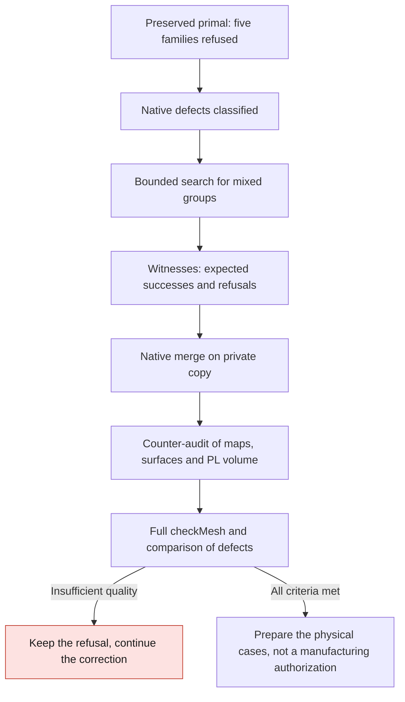

# M64 — conservative correction of mixed groups

**533 mixed groups were merged natively on a copy, including the 34 earlier
ones, preserved. The initial 34 summary is kept below and the extension is
documented at the end of the page. The mesh remains refused on five quality
families. The declared geometric conservation passes; neither the thermal
behavior, nor the strength, nor the manufacturing of the cylinder head is
validated.**

Single source: the primal from the
[controlled local contraction](M64_SHORT_EDGE_CORRECTION_20260909.md),
report `3aaf796baaa41664b9926322d7098976cd88ca5876230708dda2c7cf9cc3e8e7`.
The [rejected dual](M64_GLOBAL_DUAL_REJECTION_20260909.md) is not reused.
No new scale is applied, no CAD contour is modified.

## Localization actually run

Independent reading of the six mesh files and the nine OpenFOAM sets, with a
check of their digests before/after. The sets are those of the previous native
computation: this reading is not a new quality computation or a geometry
transformation.

| Native defect | Attribution on the preserved primal |
|---|---|
| 1,961 cells with low determinant | All tetrahedral; 396 direct neighbors of hexes or pyramids |
| 9 cells with high aspect ratio | All tetrahedral |
| 1,229 faces with low weight | 1,228 tet/tet interfaces, one hex/pyramid |
| 135 faces with low volume ratio | All tet/tet |
| 3,447 non-orthogonal faces | 3,034 tet/tet, 390 pyramid/tet, 23 poly/tet |
| 18 highly skewed faces | All on `walls`, with a tet as owner cell |

The 2 cells with a single internal face and the 208 with two internal faces
are tets with no direct hex/pyramid neighbor. The `shortEdges` set contains
**four point identifiers**, not four edges.

The domain contains 785,472 cells: 717,579 tets, 67,200 hexes, 384 pyramids and
309 other polyhedra. The private list comprises 5,914 cells affected by or
parents of the defects, including 1,428 mixed neighborhoods. This list does
not authorize any merge by itself.

Classification run: 8.690 s duration, 8.658 s CPU and peak memory
1,161,347,072 bytes; six targeted tests pass. No solver launched.
Report: `577e46e47d3e7485f41ed452c5a64f1d50d812628c745bb15c96e15aefc20a91`.
The detailed coordinates and identifiers remain private.

## Extension and checks

The previous utility handled only tetrahedral parents.
The extension examines connected groups of **two to eight cells**, with
triangular or quadrangular parent faces. It neither moves nor deletes any
point, keeps each retained face and the patches, and deletes only the faces
internal to a union and the merged cells.

Two representations are explicitly separated:

- The quality prediction uses OpenFOAM-style centers and volumes: face centers
  weighted by projected areas and cell centers computed by pyramids.
- The geometric cross-check uses a triangle fan fixed on the first vertex of
  each source face, with binary coordinates converted to exact rationals. It
  checks the volume conservation of this representation and the convexity of
  each union. A serialization rotation must not silently change the diagonal
  of a quad.

The volume conservation of this fan is not declared identical to the native
volume with a face-centered fan. No global proof of absence of intersection of
the scan or of continuous conformity to the CAD is deduced from it.

The quality criteria are not lowered: determinant ≥ 0.001, aspect ratio
≤ 1,000, weight ≥ 0.05, volume ratio ≥ 0.01, skewness ≤ 4.
Non-orthogonality beyond 70° must not get worse. The native concavity test
remains applicable, including to kept coplanar faces.
The neighboring faces are recomputed after the joint choice of groups.

## Place of the photographed stack

The official sources, rechecked, confirm the roles, not an automatic coupling:
[Elmer](https://github.com/ElmerCSC/elmerfem) can compute thermal and
mechanical behavior; [PhysicsNeMo](https://developer.nvidia.com/physicsnemo)
makes it possible to build and evaluate physical AI models.
[Ditto](https://eclipse.dev/ditto/intro-overview.html) represents the state of
a piece of equipment and [Mosquitto](https://mosquitto.org/) carries MQTT
messages. These last two services do not replace the solvers and do not
produce missing bench measurements. The
[multiphysics plan and its diagram](M64_MULTIPHYSICS_EXECUTION.md#clarification-of-september-9-computation-ai-and-bench-kept-separate)
remains the reference: no telemetry service or additional AI model is
presented as run by this pilot.

The test strategy separates pure witnesses, native witnesses, verification of
the real mesh and physical qualification. No new Vast spending for this batch,
run on the existing Kali machine.

## Native trial actually run

The search stops at the ceiling of 40,000 evaluations, after 759 of the 13,782
starting faces, in 8.960 s: it is not exhaustive. Out of 38 individually
admissible groups, 34 disjoint groups are retained: 22 pyramid/tet unions and
12 pyramid/three-tet unions. The 238 external faces of the groups are
rechecked jointly.

The C++ program is compiled in the frozen OpenFOAM 14 `linux/amd64` image.
The pyramid/tet witness passes the audit, with exact PL volume `5/3`, six
points and seven faces preserved. The four expected refusals are observed:
boundary selection, omitted cyclic internal face, orphan point and nine
parents. Each refusal leaves the small mesh intact and writes no map.

On the real domain, the 92 parents become 34 cells; 82 strictly internal faces
are deleted. Result: **785,414 cells, 1,688,340 faces, 223,154 points**. The
cross-check confirms the four maps, all points bit for bit, all retained
oriented faces and their patches, and the conservation of PL volume by
partition. The 34 external quads of the groups are not exactly planar, but
their declared fan passes the convexity check; this is not a physical
certification of the scan.

| Native check | Before | After |
|---|---:|---:|
| Cells with low determinant | 1,961 | 1,955 |
| Non-orthogonal faces > 70° | 3,447 | 3,411 |
| Faces with low weight | 1,229 | 1,229 |
| Faces with low volume ratio | 135 | 135 |
| Highly skewed faces | 18 | 18 |
| Cells with high aspect ratio | 9 | 9 |
| Refused check families | 5 | 5 |

These values come from the `checkMesh` log, not from the predictor. The latter
announced only 24 non-orthogonal faces removed. The independent comparison of
the sets explains the 36 fewer: **24 internal faces deleted and 12 kept faces
now below the threshold**. The six determinant defects disappear into six
unions; these are not six unchanged cells repaired. No new defective
identifier after mapping is observed in the nine sets, nor a new refused check
family. This local non-regression is not a global acceptance of the mesh.

### Collection incident, separate from the computation

Compilation, the batch of five witnesses, merge, audit and `checkMesh` finish
with exit code zero; the four negative cases exit as planned with code one.
The worker then fails by classifying the announcement
`cells with two non-boundary faces` as a set of faces. This reader defect
interrupts the collection, **not the native check already finished**.
The initial receipt remains unchanged and keeps its incomplete status; it must
not be rewritten as a success. The follow-up is limited to re-reading the
existing files, without new computation or mesh modification.

This recovery is actually run in 4.032 s, with a check of the digests
before/after: source, manifest, six geometric files, four maps, five logs,
audit and witnesses. The first entity name in the announcement determines the
expected class; the header, count, uniqueness and range of the identifiers of
each file are then checked. The nine sets are present and consistent. The
separate recovery report keeps `process_completed=false` for the initial worker
and explicitly declares `native_executed=false` for this re-read.

The separate cross-calculation then runs in 2.199 s. It reconstructs the
mappings between parent cells and unions, faces and points, checks the files
actually written and the native announcements. Result: zero new defects in the
nine sets, no unresolved set and the same five refused families. Both re-reads
have a 60 s wall-clock supervision; no OpenFOAM rerun is performed.

The **95 targeted pure tests** pass: classification 6, selection 10,
producer/worker 29, audit 15, cleanup 5, recovery 15 and comparison 15. They
add to the batch of five native witnesses and the check of the real domain;
none constitutes an engine test. `make check` passes, with the absent optional
native checks reported as skipped.

The private container is deleted and its absence is rechecked independently.
Total duration with cleanup: 32.298 s; no memory/time limit reached.
Limits imposed: four CPUs, 4 GiB, 220 s for the worker and 300 s in total. A
signed/unsigned comparison compilation warning is kept in the log; no
compilation error.

Initial receipts kept:

- Package: `d5100738ff52c136a4a755861536ba98b11fda6342d192c9105956beffb4ee70`.
- Worker: `c9080392eb2a03361317db3084e398bfe7ffe8acd8ffe3cc7d2c6b41bf43a8ad`.
- Supervision: `0a280fd48eec692fad7f65080b0f81ff486f88d2c9c1ab46dfd3efd4d191f46d`.
- Union audit: `6ad743a2a6b35f486a027e37621944547082a18d9c9dd1e7d703f90c2a65bd34`.
- `checkMesh` log: `2052fa445aab3713a0a040d1394f77607908ae662fd2d76c2332df145ca16ac5`.

Supplementary receipts, without rewriting the previous ones:

- Recovery: `d317023924d85bef240bd2169a5d02760d060626c7a59cce99bd515834b199a7`.
- Recovery code: `c42d70200961174f769658d895354c9b554ce82c25a1eee2d585283f43ef8e56`.
- Independent comparison: `f4151214d8e530009f94821560a5f8b5cb1a4c38414b22c3d2291cfaf3cbb2c9`.
- Comparison code: `b94f4f3f3dac8d6b1ab2a1f078d210c039282a882002cc78274f1774dc39fd03`.

The digests are not proof of quality by themselves: they identify the files
read, the tests run and the refusals kept.

## Extension: 533 groups, cross-checked on September 12

The native batch of September 9 is taken up from its saved files; no new
OpenFOAM computation is needed for this publication. The pure search examines
the 13,462 remaining pairs and engages 12,523 width-limited searches: 572,013
evaluations in 50.743 s, peak memory about 1.27 GB.
The 957 individually admissible groups give 533 retained disjoint groups:
**34 unchanged and 499 new**, 1,330 parent cells and 990 internal faces to
remove. The 3,292 external faces are checked jointly.
All seeds are visited, but the search remains **non-exhaustive** (width three,
four extensions, eight parents maximum, greedy selection).

Compilation, witnesses, native merge, independent audit and `checkMesh` finish
with exit code zero in 31.842 s on Kali, under ceilings of four CPUs/4 GiB.
The classification defect of the first entity name is fixed in a copy of the
worker; the receipts of the old failure are not rewritten. The inputs are
preserved, the container deleted and its absence rechecked on September 12.
Result: **784,675 cells, 1,687,432 faces, 223,154 points**.

| Native set | Batch 34 | Batch 533 |
|---|---:|---:|
| Low determinant | 1,955 | 1,886 |
| Non-orthogonality > 70° | 3,411 | 2,910 |
| Low weight | 1,229 | 1,223 |
| Low volume ratio | 135 | 134 |
| High aspect ratio | 9 | 9 |
| Skewness | 18 | 18 |
| `shortEdges`: flagged points | 4 | 4 |
| One internal face | 2 | 2 |
| Two internal faces | 208 | 207 |

The September 12 read-back takes 4.075 s (4.360 s with supervision), under a
60 s ceiling. It compares the exported files with **batch 34**, with mappings
composed via the common primal and all parents, not only the representatives.
The 34 components remain identical; the 499 additions are disjoint. No new
defective identifier, unknown set or new refused family is observed.

The 501 fewer non-orthogonality defects comprise 175 deleted faces and 326 kept
faces now below the threshold. The drop of 69 low determinants comprises two
image coalescences and 67 images no longer flagged: **not 69 unchanged cells
repaired**. The worst extrema remain insufficient, and the mean volume ratio
drops slightly. This non-regression of the sets therefore does not claim an
improvement of every scalar.
The five families remain failing: neither CFD, nor thermal/strength, nor
manufacturing is authorized by this batch. No Vast spending for these trials.

Identities of the private evidence, without coordinates or geometric identifiers:

- Pure selection: `b7d263f3f2c1c243b939caca04ca21ffcc84453ea01eb58d0cb6f8fc8b1f90cc`.
- Native manifest: `c8215d4dc88aad6513f2685908e90425dd7bbc92ce0b2996d173d0412c0af421`.
- Native report: `8b5b48f416a96fe054304fe11e0d94b7b978a54d4d66bb682158571dd0d17998`.
- Union audit: `ed53bc2348df6ff4887acd92a2e9322326eb55d32b400dfc49b7f0230913b157`.
- `checkMesh`: `5782126619c81596d508b5c2d0b12e2faacb0a67ad88ae0bd7dcedfabf5040cb`.
- Independent comparison: `9fd4feb771388affbe8759f6f4f770163014153b8a606edc3456a58e64add614`.

The [batch mode](M64_LOW_TOKEN_CAMPAIGN_20260912.md) reuses these pinned
receipts and stops automatically on the quality refusal, without rerunning
this batch.
