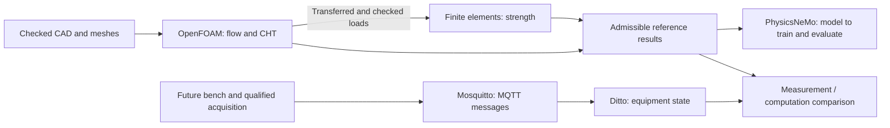
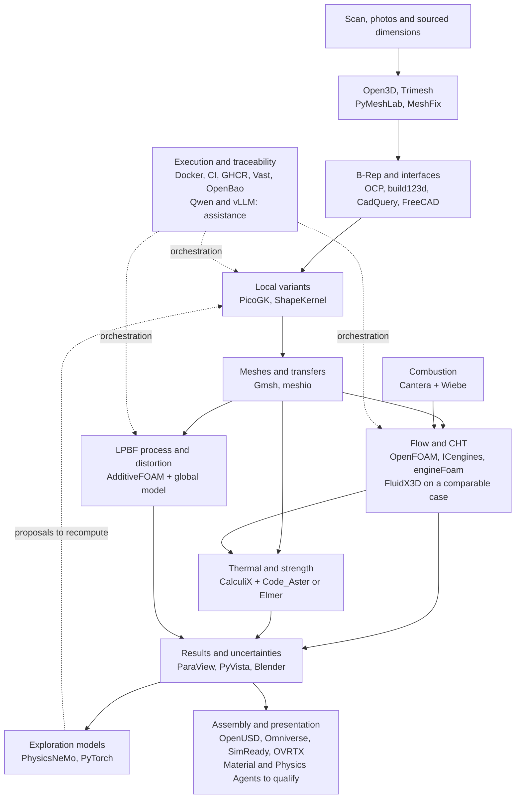
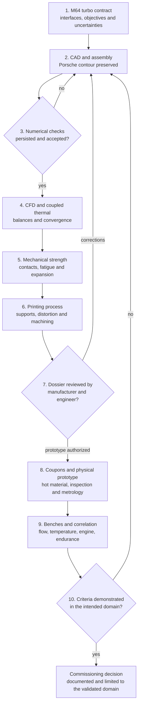

# M64 — multiphysics simulation scope

Preparation of September 12: [scientific review, air/oil cooling,
materials, tests and 24 research missions](M64_RESEARCH_EXECUTION_20260912.md).
The new "700hp" wording is kept as a unit ambiguity; it does not silently
replace the historical 700 PS reference below.

Detailed state of the latest batch: [PicoGK and Vast](M64_PICOGK_EXECUTION.md).
Resumption of September 8: [candidate chamber, assembly and preparation of the
intake bench](M64_ADMISSION_CHAMBRE_20260908.md), with
[local PicoGK comparison](M64_PICOGK_LOCAL_JUNCTION_WITNESS_20260908.md).
Continuation of the batch: [gas volume, CAD correction and executed OpenFOAM witness](M64_DOMAINE_GAZ_OPENFOAM_20260908.md).
Complementary checks of September 8: [native chamber/intake body](M64_CORPS_ADMISSION_MAILLAGE_20260908.md),
[approximation of the short edges](M64_NATIVE_EDGE_APPROXIMATION_20260908.md) and
[spatial refinement of the AdditiveFOAM coupon](M64_F58_SPATIAL_REFINEMENT_20260908.md).
Next trial: [remesh of the two short edges, not adopted after the OpenFOAM check](M64_SHORT_EDGE_REMESH_20260908.md).
Next localization: [defects in the guide–stem bands and seat–port transitions](M64_ANNULAR_MESH_LOCALISATION_20260908.md).
Process: [native witnesses and flow trial of the F58 coupon](M64_F58_COUPLED_FLOW_20260908.md).
Next diagnostic: [contract of the Marangoni predictor, native witness passed](M64_F58_PREDICTOR_CONTRACT_20260908.md).
Corrected trial: [coupon with flow, stopped at 109.55 µs out of 120 µs](M64_F58_CORRECTED_COUPON_20260908.md).
CAD: [copy with exhaust and native audit, qualification refused](M64_EXHAUST_NATIVE_AUDIT_20260908.md).
Next check: [material removed and walls of the exhaust guide bores](M64_EXHAUST_MATERIAL_CONTROLS_20260908.md), real contacts still to be verified.
Next checkpoint: [nominal contacts of the four guides measured, curve supports verified and gas partition refused](M64_GEOMETRY_CHECKPOINT_20260908.md), with no modification of the body and no physical qualification.
Target sizing: [twin-turbo M64 700 PS](M64_700CH_ENGINE_RESEARCH.md).
Engine cycle: [Cantera variable thermodynamics and energy cross-computation](M64_700PS_VARIABLE_THERMO_20260908.md), with no validation of power or local loads.
Parallel campaign: [materials, cooling and LPBF](M64_700CH_MATERIAL_COOLING_LPBF.md).
The Mermaid maps and the inventory below cover the requested stack; they do
not declare the whole chain executed on the current body.

## User decision

M64 964/993 base, turbo objective, four valves per cylinder and a two-valve
comparison. The computation target is 700 metric horsepower at the
crankshaft; it is not a power obtained. The precise variant remains open.
Keep the Porsche silhouette derived from the relevant references: no
substitute oval envelope.
The old 917/935 models are not validated M64 interfaces.

## Execution order and expected evidence

1. **Interfaces**: build a sourced table of the studs, cylinder registers,
   gasket planes, valvetrain, intake/exhaust and lubrication. Separate
   published dimensions, deductions and unknowns; keep variants and
   tolerances.
2. **Assembly CAD**: rebuild the functional surfaces, seats, guides,
   valvetrain, fasteners and machining allowances. Correct the wall and mesh
   defects. Verify cold clearances before simulation.
3. **Turbo loads**: define speed, load, fuel, forced induction, cylinder
   pressure and thermal states as traceable scenarios. Use Cantera for the
   appropriate thermochemical studies; no mechanism or zero-dimensional
   result constitutes a three-dimensional CFD validation.
4. **Full thermal**: OpenFOAM CFD/CHT on gas, solid and cooling air; compare
   air only against oil assistance. Include pressure losses and auxiliary
   power. Check energy conservation, temporal and spatial convergence on
   three levels, then an independent cross-computation.
5. **Full strength**: finite elements with hot properties, cylinder pressure,
   preloads, seat/guide contacts and transferred thermal fields. Evaluate
   displacements, sealing, plastic yielding and thermomechanical fatigue
   according to the available data. Check convergence and force equilibrium.
6. **Valvetrain**: piston/valve and valve/valve clearances over the cycle,
   expansion, springs, contacts and dynamics following a documented cam law.
   A prescribed animation establishes neither the absence of valve float nor
   service life.
7. **LPBF manufacturing**: identified material-machine-recipe, orientation,
   accessible supports, depowdering, allowances, distortions, heat treatment
   and machining. Local AdditiveFOAM does not replace a full build
   distortion computation; correct the existing numerical failures.
8. **Omniverse**: inspect the assembly, the motions and the interferences;
   display the computed fields with units, legends, cases and provenance.
   Distinguish imported results, animation and actually resolved dynamics.

## Initial check of September 6, 2026, before the Vast attempts

- Kali 192.168.2.3 responds over SSH; x86_64 architecture and Docker
  accessible.
- The local preflight of the `omniverse-cad-to-simready` skill failed:
  OpenUSD and Asset Validator absent from the queried runtime, required
  checkouts absent and OVRTX/Material/Physics services not ready. No
  Omniverse computation run.
- Local report: `/private/tmp/m64-omniverse-preflight-20260906/report.json`.
- No Vast rental made during this initial check. Two later attempts and
  their deletion are recorded in `M64_VAST_EXECUTION_20260906.md`; no
  instance remains active after them.
- The skill's workflow is stopped at preflight; this software blocker does
  not suspend the documentary research on the M64 interfaces.

## Delivery criterion

Publish the evidence and the failures for each case, without transferring
the old 917 results to M64. The two/four-valve comparison uses the same
imposed conditions and accounts for uncertainties. No virtual result replaces
material/process qualification, inspection of the part and bench
correlation; no engine manufacturing authorization is established.

## Integrating the stack requested in the photos

The software packages are neither interchangeable nor all solvers. The
following selection defines their role, not a declaration of installation or
success.

| Function | Requested building blocks and role |
| --- | --- |
| Exact interfaces and CAD | OCCT/OCP with build123d, CadQuery or FreeCAD; keep an editable functional master |
| Cooling geometry | PicoGK/ShapeKernel; HelixHeatX as a construction example, not a thermal model of a cylinder head |
| Scan and meshing | Open3D/Trimesh/PyMeshLab/MeshFix according to the defect, Gmsh/meshio; each repair compared with the source |
| Engine gas and heat | OpenFOAM/ICengines and Cantera; Wiebe law explicitly distinct from a resolved CFD combustion |
| Cross-computation | FluidX3D only on a physical problem it actually covers and that is comparable; usage license to check before commercial use |
| Thermomechanics | CalculiX; Code_Aster or Elmer as an independent candidate depending on the contacts and material laws needed |
| Manufacturing | AdditiveFOAM for the local process, complemented by a full-build distortion model |
| Inspection and rendering | OpenUSD, Omniverse/SimReady/OVRTX, ParaView/PyVista/Blender; no render is evidence of strength |
| Reduced-order models | PhysicsNeMo/PyTorch after obtaining a set of eligible computations; Qwen/vLLM is neither a solver nor a validation authority |
| Execution | Docker/CI/GHCR, Kali and Vast through the authorized OpenBao wrapper |

### Supplement from the two photos: manufacturing, engine and telemetry

References verified on September 8, 2026. The photographed tables are
architecture suggestions, not evidence of integration or validation.
Examining them changes neither the kept contour, nor the material still to
be qualified, nor the acceptance criteria of the computations.

| Photographed building block | Role kept and limit |
|---|---|
| OpenFOAM with AM extensions | [ORNL's AdditiveFOAM](https://github.com/ORNL/AdditiveFOAM) covers heat transport and flow of the local process. It remains distinct from the engine CFD. The [current coupon](M64_F58_CORRECTED_COUPON_20260908.md) is incomplete and still hits the temperature limiter. |
| MOOSE | Candidate for global manufacturing distortion: [mechanics coupled to heat transfer and contacts](https://mooseframework.inl.gov/modules/solid_mechanics/index.html), with [element activation](https://mooseframework.inl.gov/source/meshmodifiers/ElementSubdomainModifier.html). This requires a configured model: layers, supports, clamping, hot laws, cooling and removal from the build plate. No executed MOOSE cylinder head case is established here. |
| "PRISMA-Plasticity" | The identified project is [PRISMS-Plasticity](https://github.com/prisms-center/plasticity), a finite element solver for continuum and crystal plasticity. It is a probable match for the name, not a certain one. No new microstructure solver adopted without data to parameterize it. |
| Elmer Multiphysics | [Elmer](https://github.com/ElmerCSC/elmerfem) has heat transfer and mechanics models. It remains a candidate for cross-computation, with the same loads, interfaces and material laws. Its presence in the list does not establish an executed computation. |
| NVIDIA Modulus / PhysicsNeMo | [Modulus was renamed PhysicsNeMo](https://github.com/NVIDIA/physicsnemo). A single family of reduced-order models, not two independent validations. In this project, train and verify on eligible computations with separate test cases; do not learn the thermal limiter as if it were a real phenomenon. |
| Eclipse Ditto and Mosquitto | [Ditto](https://eclipse.dev/ditto/intro-overview.html) manages the digital state of equipment; [Mosquitto](https://mosquitto.org/) carries MQTT messages. To be connected to the measurements of a future bench with units, timestamps and calibration. Neither physical solvers nor prerequisites for the CAD correction; no sensor or service newly connected. |
| Marlin / Klipper and Node-RED | [Marlin](https://marlinfw.org/docs/gcode/M003.html) can drive a laser; [Klipper](https://www.klipper3d.org/Installation.html) is printer firmware. This proves no compatibility with the controller of an industrial LPBF machine. Any telemetry integration will depend on the interface actually provided by the manufacturer, not on presumed G-code. |

Execution priority unchanged: checked geometry and contacts, acceptable
meshes, thermal and mechanical computations, then process and comparison.
Adding a middleware or an AI model closes none of these criteria.
The Mermaid diagrams below describe the target chain; these new leads are
not presented as modules already deployed.

### Clarification of September 9: computation, AI and bench kept separate

The new photo confirms the same five building blocks; it does not require an
additional installation. Official sources re-verified:
[OpenFOAM](https://cfd.direct/openfoam/features/),
[Elmer / CSC](https://research.csc.fi/eosc-services/elmer-3/),
[PhysicsNeMo](https://docs.nvidia.com/physicsnemo/latest/overview.html),
[Ditto](https://eclipse.dev/ditto/intro-overview.html) and
[Mosquitto](https://mosquitto.org/).

For this project, the transfer from OpenFOAM to finite elements will have to
check frames, units, regions and time instants: solid temperatures and
applied pressures, with conservation of loads across the change of mesh.
Elmer remains a candidate cross-computation, not a coupling already in
operation. PhysicsNeMo may speed up exploration after evaluation on
independent cases; its predictions will remain distinct from the reference
results.

Ditto and Mosquitto are not on the critical path of the CAD correction.
The future acquisition will have to keep provenance, calibration, units,
timestamps and measurement quality; a replayed or simulated message will
never be labeled as a bench measurement. No connection or rental is created
for these services in this batch. The [updated geometry checkpoint](M64_GEOMETRY_CHECKPOINT_20260908.md)
traces the trials and their limits, with no change of the contour.

Progress of this resumption: see `M64_INTERFACE_SOURCE_REGISTER.md`,
`M64_LEAP71_STACK.md`, `M64_CHT_RUNTIME_SMOKE.md` and
`M64_VAST_EXECUTION_20260906.md`. The evidence of the old 917 project remains
historical; it is not renamed as M64 evidence.

Checks of this resumption: full `make check` passed, then seven targeted
tests of the M64 contract passed after adding the manual's leads. The native
PicoGK linux/amd64 test was repeated independently on Kali. These software
and dossier checks do not constitute a validation of the part.

## Map of the target chain

This diagram describes the work to be covered, **not a chain fully executed
on the current cylinder head**. The arrows carry geometries, boundary
conditions or results identified by their digest. CAD libraries that share
Open CASCADE are not independent cross-computations.

[Mermaid source](../media/diagrams/m64-stack.mmd) ·
[SVG](../media/diagrams/m64-stack.svg) · [PNG](../media/diagrams/m64-stack.png) ·
[Editable scene](../media/diagrams/m64-stack.excalidraw).

### Evidence inventory as of September 7, 2026

This historical inventory is not the status of the new candidates of
September 8: their distinct digests and results are linked at the top of the
page.

Reading of the code, contracts and kept receipts, with no new installation.
"Integrated" does not mean "executed", and an execution is not a validation.
The current geometry is the one tied to STL `e006e148…` in the
[PicoGK receipt](../../twins/m64-cylinder-head/evidence/picogk-roundtrips-20260907.json).

| Building blocks | Observed state and evidence | Next verifiable use |
|---|---|---|
| build123d, Open CASCADE/OCP, CadQuery, FreeCAD | OCP executed on the current master; other builders or dependencies present, with no recent evidence of each being used on this body. [CAD audit](M64_FOUR_SEAT_BODY_CAD_AUDIT.md). | Complete the features and the assembly; check the editable STEP and the machining operations. |
| Open3D, Trimesh, PyMeshLab, MeshFix | Trimesh used on the current outputs; other repairers available or used historically. [Domain audit](../../twins/m64-cylinder-head/evidence/picogk-cooling-domain-mesh-audit-20260907.json). | Use each repair only on an identified defect; keep the raw data and the deviations. |
| PicoGK, ShapeKernel, HelixHeatX | Three resolutions audited, defects kept and coarse connectivity executed; HelixHeatX remains an example, not a grafted heat exchanger. [Actual execution](M64_PICOGK_EXECUTION.md). | Treat the micro-shells with evidence of their origin, refine the void functions and generate only the admissible local variants. |
| Gmsh, meshio | Generators/conversions integrated; two solid meshes audited but not qualified for the current CAE. [Solid audit](M64_SOLID_MESH_AUDIT_20260907.md). | Mesh the right SHA with regions and physical groups, then verify quality and convergence. |
| OpenFOAM, AATE/ICengines, engineFoam | Historical OpenFOAM runs, AATE utilities tested; no complete cycle attested on this body. [F49](../../archive/917/docs/917_F49_CFD_CHT.md), [F37](../../archive/917/docs/917_F37_ICE_ENGINE_FOAM.md). | Fix the version, the executable actually available and the moving engine case; do not create an alias pretending to be an absent solver. |
| Cantera and Wiebe model | Historical zero-dimensional cases, not 3D combustion of the current geometry. [Model authority](../../twins/reference-917-engine/engine-solver-authority-f46.json). | Documented turbo/fuel/lift-law scenarios; compare the models and pass on the loads with their uncertainty. |
| FluidX3D | LBM already executed on F36, not on this body; old disagreements unresolved. [Historical cross-computation](../../twins/reference-917-engine/evidence/f36-final-cfd-thermal/cross-solver-report.json). | Comparable flow case, with compatible validity domain and license. |
| CalculiX; Code_Aster or Elmer | CalculiX executed on old models; no Code_Aster/Elmer execution found. | Choose and qualify the second solver on witnesses, then compare contacts, heat transfers and stresses of the same case. |
| AdditiveFOAM and global distortion | F58 coupon, zero-laser witness and three time steps executed; the active case remains capped. This is not a print of a cylinder head. [Latest checks](M64_700CH_MATERIAL_COOLING_LPBF.md). | Correct the artificial capping, qualify the recipe, then compute supports, distortion, plate removal and machining. |
| OpenUSD, Omniverse/SimReady, OVRTX, Material/Physics Agents | Conversion of the 12-component V2 module succeeded, **without the body**; Material failed, physics suite not executed. [NVIDIA status](M64_AVANCEMENT_20260907.md). | Assemble body and valvetrain; resolve the service failures, verify units/instances and overlay the real CAE fields. |
| PhysicsNeMo, PyTorch, Qwen, vLLM | Runtimes prepared/tested, no cylinder head model trained and evaluated. [AI contract](../../twins/reference-917-engine/physicsnemo-readiness-f52.json). | Build admissible cases; separate training/test, measure the error and recompute the variants kept. Qwen/vLLM assist, with no validation authority. |
| ParaView, PyVista, Blender | Current PyVista/VTK renders and sections; Blender code and ParaView exports present, with no recent receipt for each application. | Show the same units, geometry, cases and color scales; keep explicitly labeled section views and animations. |
| Docker, CI, GHCR, Vast, OpenBao | Python/PicoGK image published, real computations collected; resumption rental stopped and absence verified. [Latest receipt](../../twins/m64-cylinder-head/evidence/picogk-roundtrip-checkpoint-audit-20260907.json). | One job bounded by receipt, digest, budget and stop guard; never a secret or a proprietary scan in the public image. |

All the names in the photo are tracked. Running several interfaces to the
same kernel, or several repairers with no identified need, does not create
additional evidence of part quality. Alternative software is qualified on a
witness case before choosing its production or cross-computation role. An
exclusion must be justified in the dossier, not hidden.

### Three technical limits to respect

- **FluidX3D**: the upstream documentation limits the model to `Mach < 0.3`
  and offers no chemical reactions. The intended cross-computation therefore
  concerns a covered flow, not a second full turbo combustion. Commercial use
  is prohibited by the current public license; it will not be undertaken in
  this framework without appropriate rights.
  [Upstream documentation and license](https://github.com/ProjectPhysX/FluidX3D).
- **PhysicsNeMo**: a framework of physical models to build/adapt and
  evaluate, not a specialized model that deduces a working cylinder head from
  photos. The choice of models remains conditional on the data and the
  equations of the case. [NVIDIA documentation](https://docs.nvidia.com/physicsnemo/latest/overview.html).
- **Omniverse and AdditiveFOAM**: the assembly and the rendered fields do not
  replace strength/fatigue; a local process computation does not on its own
  close build distortion, material or inspection.
  [AdditiveFOAM, ORNL source](https://github.com/ORNL/AdditiveFOAM).

## Validation path and correction loops

The acceptance thresholds must be fixed **before** the comparison. Same
interface geometry, same scenarios and units, same boundary conditions,
energy/force balance and uncertainties tracked for both solvers and for the
two/four-valve versions. Agreement between two codes does not constitute a
physical correlation if the same erroneous data feeds them.

[Mermaid source](../media/diagrams/m64-validation.mmd) ·
[SVG](../media/diagrams/m64-validation.svg) · [PNG](../media/diagrams/m64-validation.png) ·
[Editable scene](../media/diagrams/m64-validation.excalidraw).

The scan remains the available reference: missing dimensions do not become
measured by multiplying photos or simulations. A design can be pursued under
assumptions and their sensitivity studied; an undemonstrated critical
interface remains explicitly not certified. The coupons, the prototype and
the benches on the map are physical steps to be carried out, not events
claimed to have been simulated successfully.

Before modifying the cooling: protect the interfaces, separate outside air
and internal passages, then compare air only against possible oil assistance
with a budget for flow, pressure, heat and auxiliary power.
The benefit must exceed the uncertainties and remain compatible with
fatigue, cleaning, depowdering and machining. The Porsche exterior shape is
not a free variable.

## Register to keep for each execution

Each case publishes the software's role, version/commit, image digest,
geometry digest, units and frame, parameters and their provenance, material
and boundary conditions, mesh, solver, fixed criteria, results, convergence,
any failure, duration/cost and decision. Large files or non-redistributable
sources remain private and are linked by their digest.

The statuses must remain distinct:
`planned`, `integrated`, `executed`, `numerically_verified`,
`physically_correlated`, `manufacturing_authorized`.
A later status never follows automatically from the previous one.
The diagrams describe the architecture and the decisions; the dated receipts
remain the authority on what was actually executed.
