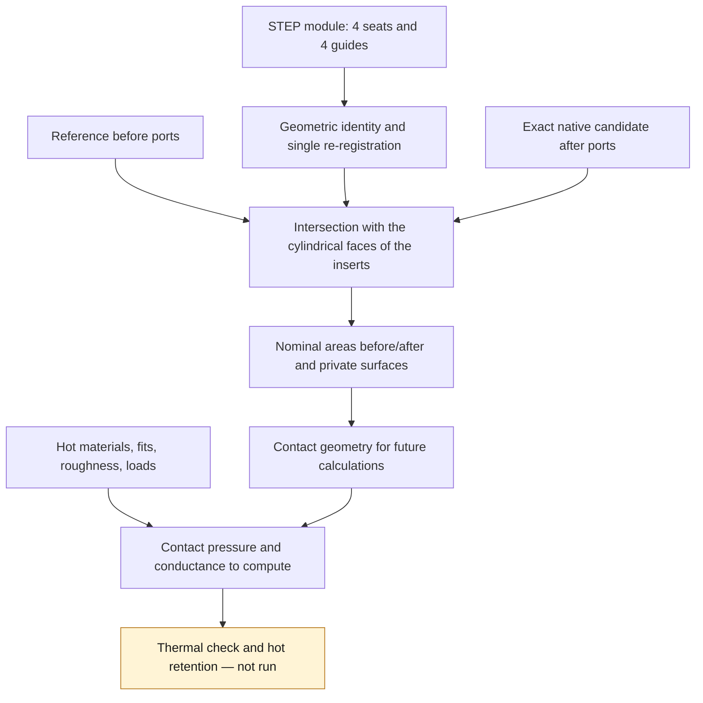

# M64 — smooth surfaces, insert contacts and native mesh

This batch continues the [port trial 05](M64_PORTS_AND_CONTINUOUS_MOTION_20260907.md).
The results are attached to an exact geometry by digest, never transferred
automatically to a new version of the part. The master remains private and
unchanged; the scale and the M64 interfaces are not certified.

## Nominal contacts actually computed on trial 05

The [contact receipt](../../twins/m64-cylinder-head/evidence/insert-OD-contacts-trial05-20260907.json)
concerns the native B-Rep `3e3cc163…`, not its non-qualified STEP. The eight
inserts of the STEP module are identified by unique geometric matching, then
re-registered once. Their volumetric intersection with the body, **before and
after cutting**, is zero in the booleans run. The second check was added after
an independent review, and the real computation was then rerun: 21.54 s,
inputs unchanged and same area fractions.

The intersection between the external cylindrical face of each insert and the
body gives the following nominal surfaces, after creating the ports:

| Insert | Fraction of the nominal cylindrical surface in contact |
|---|---:|
| Four seats | 100% each |
| Two intake guides | 65.714% each |
| Exhaust guide 1 | 67.612% |
| Exhaust guide 2 | 67.592% |

The reference without drilled ports covers 100% of these eight faces. The
decrease on the guides therefore comes from opening the gas passages.
The percentage describes an area; it does not guarantee a uniform bearing
length around the whole circumference. A contact surface establishes **neither
clamping, nor contact pressure, nor thermal conductance, nor hot retention**.
The assembly clearance/interference, thermal expansion, material properties,
roughness and loads remain to be defined and computed.

The shoulders, inner faces and valve/seat sealing bands are explicitly excluded
from this calculation. The native contact surfaces and their digests are kept
in the private folder. The two adaptive quadratures request ε = 10⁻⁹ and
10⁻¹¹; their estimators are not rigorous mathematical bounds.

The coincidence remains that of the OCCT kernel, at its native tolerances: up
to 10⁻⁷ unit on the reference and the inserts; on the candidate, up to
5 × 10⁻⁶ on the edges, 5.100001 × 10⁻⁶ on the vertices and 10⁻⁷ on the faces.
The additional boolean tolerance parameter remains zero. A witness shows that
a real radial clearance of 5 × 10⁻⁸ unit can still be classified as
coincident, while a clearance of 10⁻⁶ no longer is. This is therefore **not
proof of zero clearance**.
The volumetric penetration check is a numerical screen at the absolute
threshold of 10⁻⁷ unit³, not a certified bound on a physical interference.

The [software witnesses](../../tests/test_m64_insert_contacts.py) cover a full
contact, a guide exposed over half its length, a positive radial clearance, the
rejection of a wrong cylindrical face, of an insert buried in a block with no
bore and of a contact gain wrongly presented as material removal. A fifth test
documents the case of a clearance below the tolerance. The
[script](../../twins/m64-cylinder-head/source/audit_insert_contact_surfaces.py)
modifies no input geometry.

## Limit of the batch

These surfaces prepare the [CHT inputs](M64_CHT_HEAD_INPUT_AUDIT.md). They do
not yet constitute a complete gas/solid/air/oil partition, nor physical
boundary conditions. An unidentified face does not become adiabatic by
default. No result on temperature, strength, fatigue, engine power or LPBF
simulation of the cylinder head is deduced from these contacts.

## Bounded C1 trunks, built and re-imported

Trial 05 used a ruled trunk, only C0 between sections. The new
[C1 generator](../../twins/m64-cylinder-head/source/build_bounded_c1_trunk.py)
keeps all circular sections, without a global loft or fitting of a resampled
point cloud. The slopes of a local cubic Hermite interpolation are limited
jointly on the centers, radii and `center ± radius` limits.
The Bernstein control points remain within the bounds of the neighboring
stations. The exact rational calculation verifies this property, then
separately checks the floating-point poles actually passed to the CAD kernel.

This construction gives four rational faces per trunk, with a C1 axial B-spline
basis. The sections are preserved to numerical precision; it does not claim to
reconstruct the measured Porsche inner surfaces.
The common tangents do not guarantee C2 and the later fusion with the valve
branches does not automatically become C1.

The [two trunks run](../../twins/m64-cylinder-head/evidence/bounded-C1-trunks-20260907.json)
each have a valid solid, zero BOP defects reported before/after B-Rep re-import
and after STEP re-import, without modifying the translator settings or the
native tolerances. The global overshoot computed on the stored poles is zero
for these two objects. The volume check uses the polynomial integral of the
squared radius, multiplied by π, compared with a native adaptive integration:
relative gap 3.16 × 10⁻¹⁰ at intake and 2.39 × 10⁻¹² at exhaust. These checks
concern the trunks alone, not the whole cylinder head.

The starting slope formulas follow the method described in the
[primary SciPy PCHIP documentation](https://docs.scipy.org/doc/scipy/reference/generated/scipy.interpolate.PchipInterpolator.html).
The joint limiting and the exact conversion are verified by the project's
code; the SciPy documentation does not certify these local developments.

Eleven [dedicated tests](../../tests/test_bounded_c1_trunk.py) cover the
stations, edges and derivatives, the exact conversion, the refused inputs and
the real native solids in both axial directions. The
[independent review](../../twins/m64-cylinder-head/evidence/bounded-C1-independent-checks-20260907.json)
adds 286 rational checks on eight synthetic models, 16 invalid mutations
rejected and two re-reads of the native poles after sewing. It does not
requalify the junctions to the branches or the rejected integrated trial. The
`--trunk-interpolation bounded-c1` selector is added to the port generator,
with the digest of the new code in the inputs. The historical modes remain
available to reproduce the rejected trials; they are not replaced.

### Full trial 06: candidate not retained

The [new integrated trial](../../twins/m64-cylinder-head/evidence/scan-seeded-ports-trial-06-bounded-C1-20260907.json)
actually rebuilt both banks and cut the body in 380.55 s.
The native gas cores are each single-piece and pass the BOP checks run. After
cutting, the body remains a valid BRepCheck solid, but **two `GeomAbs_C0`
defects are reported**; they persist on B-Rep re-read. The trial is therefore
rejected, with no promotion to master or to computation geometry.

Its STEP adds 67 curve-on-surface defects and shows an integrated volume
difference of 12.834 units³ relative to the native one. The isolated trunks
passed the exchange check, but this is not enough for their boolean junctions
or for the cut body. The continuity and the intersection representations must
be reworked locally. The inputs and the original master remain unchanged.

## STEP diagnosis of trial 05: repair not achieved

The diagnosis located 26 edge/face pairs, involving 21 edges. It finds both a
drop in local tolerances on import and a degradation of some parametric curves
on surface. A targeted `SameParameter` fix leaves 24 defects; a targeted
removal/reprojection followed by `SameParameter` leaves 23. **Both trials are
rejected**, with no new master or qualified STEP. The original inputs remain
unchanged.

The [dedicated receipt](../../twins/m64-cylinder-head/evidence/trial05-STEP-repair-counterchecks-20260907.json)
keeps their digests. These failures are not masked by globally increasing the
tolerances. They do not automatically call the native B-Rep into question, but
keep the STEP exchange milestone closed.

## Real mesh of trial 05 and failures kept on record

The [native mesh generator](../../twins/m64-cylinder-head/source/mesh_native_ported_head.py)
imports the B-Rep `3e3cc163…` directly into Gmsh 4.15.2 on Kali x86.
It does not go through the rejected STEP and applies no repair, sewing,
closing, simplification or scale change. The area and centroid comparison
gives a bijection of the 4,892 faces, with no observed loss; this
descriptor-based check is not exhaustive proof of equivalence.

A real mesh is generated, exported then re-read: **261,564 tetrahedra, 63,530
nodes and 88,312 boundary triangles**, one connected region and a complete
boundary. The discretized volume exceeds the native volume by 0.282%.
But 4,902 tets have a minSICN quality index below the project threshold of
0.1, including seven quasi-degenerate ones below 10⁻⁶. The minimum is about
7.52 × 10⁻¹⁷. The Jacobians were positive in memory. A later check of the
re-read MSH finds a non-positive Jacobian, which reinforces its rejection; see
the [local correction and post-export check](M64_LOCAL_MESH_AND_JUNCTION_FOLLOWUP_20260907.md).
**This mesh is rejected before any thermal or mechanical computation.**

The first counter-trial keeps the geometry, sizes 1 to 6 units and the
generation, then adds a Netgen tetrahedral optimization. The initial mesh is
reproduced, but the optimizer ends with code 139, without exceeding memory.
No optimized mesh is accepted. The software crash does not prove that the
B-Rep is invalid. Both trials are limited to two CPUs, 4 GiB and 295 s,
network disabled; the containers were deleted after collection.
No Vast rental was needed.

A separate diagnosis re-reads the same MSH: 869 surface triangles are also
below 0.1. The seven quasi-flat tets all have their four nodes on the same CAD
face. The problem is therefore not only interior: the boundary discretization
must also be examined before rerunning a volume optimization. The coordinates
and identifiers remain private.
The [receipts of the two trials and of the diagnosis](../../twins/m64-cylinder-head/evidence/native-mesh-trial05-counterchecks-20260907.json)
distinguish them from the new C1 body of trial 06, to which they are not
transferred.

An independent geometric counter-check finds the three faces concerned in the
master before cutting: full common area with their source faces, zero surface
differences in both directions, and no common area with the two gas negatives.
They are therefore inherited from the preserved skin, according to these
operations at native tolerances. **Inference for the next step:** modifying
only the port trunks should not resolve these bad elements; a local
discretization correction of this skin must be tested.
This [local counter-trial was then run](M64_LOCAL_MESH_AND_JUNCTION_FOLLOWUP_20260907.md):
it removes the seven quasi-flat tets without modifying the CAD, but does not
yet satisfy the global quality threshold.

## Views of trial 06

The private views represent the 71,302 tessellation triangles of the current
body, without smoothing or decimation. The half view and the section use the
same geometry and display **native rejection: 2 defects; STEP rejected: 69
defects**. Blue/orange identifies intake/exhaust, with no thermal field or CFD
result. The sections serve for inspection; they do not modify the CAD.

The trial 06 receipt contains the digests of the images and of the render,
without publishing the geometry or the coordinates from the private scan.

## Tests of the batch

`make check` finishes with exit 0: its main discovery runs **2,119 tests,
including 76 explicitly skipped** in the default runtime, then the
complementary targets finish. The targeted suites are also run in the
qualified OCP runtime: **43 tests passed, none skipped** (11 C1, 13 routing,
5 contacts, 5 mesh, 7 continuous motion, 2 skin).
The [software receipt](../../twins/m64-cylinder-head/evidence/C1-contact-mesh-software-checks-20260907.json)
keeps the digests of the logs and sources. A passing software suite reverses
neither the CAD rejection of trial 06, nor the quality rejection of mesh 05,
nor the physical milestones still open.

The testing and documentation skills were used to add the tolerance/contact
and C1 bound counterexamples, and to keep the evidence and its limits
separate.
