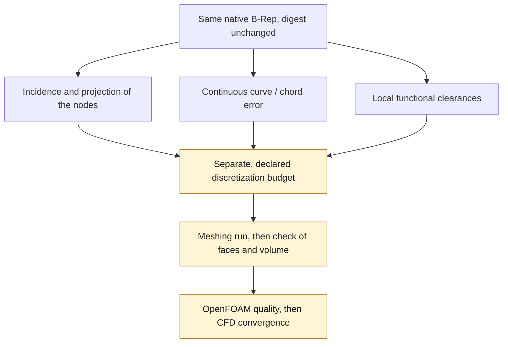

# M64 — approximating the short edges: result and scope of the tolerances

Follow-up executed separately: [single-chord remesh and OpenFOAM rejection](M64_SHORT_EDGE_REMESH_20260908.md).
The bounds and the historical scope below remain unchanged.

**No new mesh and no CAD change in this sub-batch.** The bounds
computed below inform a possible reduction in the number of segments
on native edges 98/99 of the unified gas domain `fab1338a…`.
They constitute neither a CFD result nor a physical accuracy of the scan.

## Do not confuse three criteria

1. **Native representation / projection tolerance:** `5e−6` scan unit
   is the tolerance of the OCCT edges concerned. It is used for the native split
   and for matching the nodes to their supports.
2. **Continuous discretization error:** distance between an entire curve and
   its chords. No global contract imposing `5e−6` on this error was
   found in the active checks. The incidence test had explicitly
   left this proof at `false`.
3. **Guide–stem radial clearance:** the `0.0075` budget belongs to the geometric
   check of these cylindrical surfaces. It does not become a generic
   budget for the seat/port edges 98/99.

The [OCCT BRep_Tool](https://occt3d.com/dev/doc/refman/html/class_b_rep___tool.html) API
describes the tolerance of the entity, while [Gmsh](https://gmsh.info/doc/texinfo/gmsh.html#Specifying-mesh-element-sizes)
has distinct constraints for curve discretization and for mesh
sizes. **Our engineering conclusion:** a B-Rep tolerance is not enough,
on its own, to define the admissible error of a CFD mesh.

## Bounds actually computed

Both edges are polynomial Béziers of degree 6. The computation uses
the native binary coordinates converted to exact fractions, then
128 de Casteljau sub-arcs. The convex hull of the poles bounds the distance
to the entire chord; exact points give a lower bound.
The perturbations of the endpoints toward the real nodes are included, with
outward rounding. The check of the existing mesh takes the minimum distance
over **the union of the two segments**, not only over the associated segment.

| Edge / representation | Lower bound curve → segments | Hausdorff upper bound |
|---|---:|---:|
| 98 / one chord considered | 1.52498192e−5 | 1.52498640e−5 |
| 99 / one chord considered | 8.82529733e−6 | 8.82564969e−6 |
| 98 / two current chords | 7.77457517e−6 | 7.77471599e−6 |
| 99 / two current chords | 2.31031464e−6 | 2.31046194e−6 |

All distances are in **uncalibrated scan units**. The
OCCT cross-check on 17 points agrees to within `2.31e−14` unit; six
synthetic assertions pass. The inputs remain unchanged.
The bounds in this table are rounded outward.

If a continuous error of `5e−6` were imposed, a single chord would fail
for both edges; the two current chords of 98 would fail too.
This is a conclusion **conditional on that budget**, not proof that
the mesh must respect this budget nor that any reduction is impossible.
The incidence PASS `c0ce7de8…` is not revoked: it precisely did not claim
to verify the continuous fidelity of the chords.
The usages can be checked in the [native split](../../twins/m64-cylinder-head/source/flowbench-intake/split_gas_c0_edge.py)
and the [incidence auditor](../../twins/m64-cylinder-head/source/flowbench-intake/audit_segmented_c0_mesh.py).

## Next decision

The reduction to two nodes is **neither launched nor qualified here**. Before a
comparative run: define a discretization budget specific to the local
functions, match the Gmsh tags to the native edges without assuming their numbers
are identical, keep the vertices/C0 and the shared boundaries, check
the faces actually produced and their intersections, then run the
OpenFOAM checks on this new mesh. A declared approximation must not
be presented as modified CAD or as exact geometry.
Convergence of the computation remains necessary after the mesh is accepted.

The [previous MeshAdapt run](M64_SURFACE_MESHADAPT_20260908.md) remains
rejected on its OpenFOAM quality; no threshold or history is rewritten.

## Private traceability

The coordinates and geometries remain private; their evidence is
not replaced by the rounded table above.

| Artifact | SHA-256 |
|---|---|
| Native domain | `fab1338a3e3cf36469977716a9cb54b3118382f592c7c41d7c789bdb5fb3aeba` |
| Tightened bounds, report 02 | `9150138a046b944dc0ebdcb5f24934cbd66ef11b130c86ab7e292b163e6fa357` |
| Union of the two chords, report 03 | `db8588e7f12acaba568590a91806878fee6531ace1fa9eeaef69397350e59f76` |
| Extraction source / initial bounds | `cb392cbbeb2fa4b6bcd7d7699a25c98a62b57635a93fd8e5f776ab0d5355fd17` |
| Tightening source | `48e2d7e34b2d73e5c7e3303a2424668e11596303ec0e09b45ca76f7f91e0daf7` |
| Union cross-check source | `af813d14152827f84d3cf8b1fbf267a20eb049c48f2c19b616f9894784625f87` |
