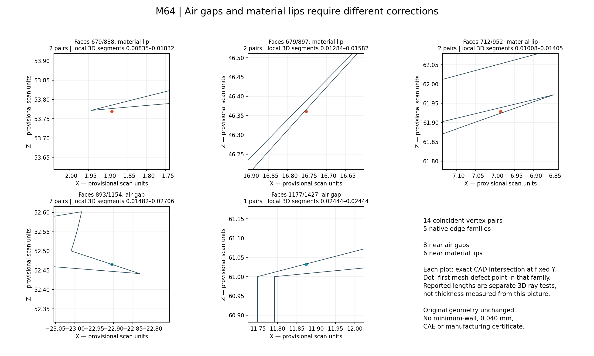
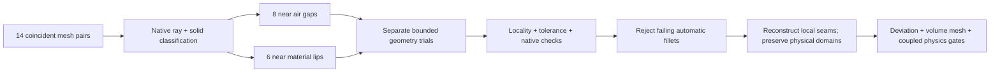

# M64 — native junction recovery, 28 September 2026

## What this continuation establishes

The 14 coincident mesh-vertex pairs diagnosed in the
[previous continuation](M64_PHYSICS_AM_CONTINUATION_20260928.md) are now
classified against the **unchanged native head**, not against a repaired mesh.
Eight lie near narrow air gaps and six near thin material lips, in five
native edge families. Filling every gap, deleting every thin region or
welding the pairs would confuse different physical domains.

**No replacement head or manufacturing release is produced.** The tested
automatic fillets must satisfy locality and topological-tolerance checks,
not just the CAD kernel's `IsValid` result. The original file, exterior
design and installed assembly remain unchanged. This is CPU geometry work
on the existing Mac; no new Vast instance or expenditure is incurred.
Five strict-construction builds complete; **all five are rejected**. This
rules out those particular automatic repairs, not every possible local patch.

## Native classification, with real sections



| Native face pair | Coincident pairs | Native segment classification | Local segment range, provisional scan units |
|---|---:|---|---:|
| 679 / 888 | 2 | Material | 0.008351–0.018319 |
| 679 / 897 | 2 | Material | 0.012837–0.015817 |
| 712 / 952 | 2 | Material | 0.010081–0.014053 |
| 893 / 1154 | 7 | Air | 0.014822–0.027057 |
| 1177 / 1427 | 1 | Air | 0.024439 |

Each pair shares one native edge. The
[classifier](../../twins/m64-cylinder-head/source/wholebody/trial_native_junction_blend.py)
joins the two previously located, trimmed-face nearest points, intersects
that line with the native body and requires exactly the two expected
boundary intersections in the local window. Three interior points must
agree as inside or outside. Ambiguous or non-boundary segments are rejected.
An analytic notched-box test distinguishes air from material and rejects
zero-length, nonfinite and incorrectly terminated segments.

These are **local segment lengths**, not global minimum wall thickness,
minimum clearance, physical millimetres or a 0.040 mm certificate. Native
face numbers are geometric identifiers, not verified functional names such
as an oil passage or exhaust seat. Here “air” labels a non-material gap;
neither its actual fluid nor connection to the cooling airflow is established.
The plotted curves are actual fixed-Y
CAD sections sampled at 0.0002 provisional-unit display deflection; the
3D ray lengths are separate tests, not measurements from the image.

## Bounded correction experiments

The first radius-0.02 experiment on 893/1154 builds a valid single solid,
but changes six source faces rather than just the selected two. It is
rejected by that initial scope check. Independent topology inspection
shows that those six faces are exactly the faces incident to the selected
edge's endpoints. Subsequent experiments declare that small patch **before
building**, cap it at eight faces and prohibit propagation onto another
edge. This is an explicit geometry-trial scope change, not a manufacturing
acceptance or permission to modify arbitrary neighbouring features.

Default construction also reveals why validity alone is insufficient:

- On 893/1154, stored face/edge/vertex tolerances rise to about **0.121871**
  provisional units, despite `IsValid=true`.
- On 712/952, the maximum edge tolerance reaches **0.000696041** and the
  working in-memory input serialization changes. The on-disk original does
  not change.
- On 679/888, the contour would propagate to another edge. The runner stops
  before construction.

These tolerance values are **kernel representation metadata**, not measured
physical dimensional errors. Nevertheless they violate the unchanged
no-increase criterion: original maximum face tolerance is 1e-7, and maximum
edge/vertex tolerance is approximately 8.03396e-6.

The final runner therefore uses two independent native-file reads, retains
an untouched reference and reuses the existing
[strict fillet construction helper](../../twins/m64-cylinder-head/source/build_local_port_junction_fillet.py).
Construction parameters are tightened before creating the contour; no
acceptance threshold is relaxed. Every non-patch source face must retain
its identity and serialized representation. The whole original reference
must remain byte-identical in memory as well as unchanged on disk.

An intermediate attempt using `BRepBuilderAPI_Copy` is rejected before
filleting because its serialization differs from the source. That does
not prove a geometric defect in copying; it fails the deliberately exact
copy check. Re-reading the native file satisfies the check without a new
copying/repair algorithm.

The five completed strict runs still fail:

| Pair / radius | Kernel result | Reason not accepted |
|---|---|---|
| 893 / 1154, 0.02 | One valid solid, six patch faces changed | Maximum tolerance about 0.121872; strict construction does not resolve this junction |
| 712 / 952, 0.02 | One valid solid, four patch faces changed | Edge tolerance about 0.000696044; a protected-face serialization also changes |
| 679 / 897, 0.02 | One solid, four patch faces changed; invalid | Native validity and protected-face serialization fail, despite unchanged maximum tolerances |
| 1177 / 1427, 0.02 | One solid, six patch faces changed; invalid | Face/edge tolerance about 0.0426722; vertex tolerance about 4.48471 |
| 893 / 1154, 0.10 | One solid, six patch faces changed; invalid | Maximum tolerance about 0.936765; a larger radius does not fix this trial |

No mesh is generated from these rejected shapes and no failed candidate
replaces the master. A successful construction would still need independent
BOP checks, two-way deviation, remeshing, physical-domain assignment and
the existing thermal, structural and manufacturing gates.
The reference body remains unchanged in memory and on disk in all five
strict runs. The 679/888 contour-propagation rejection is a separate earlier
preflight; it is not counted as a completed strict build.

## Compute and recovery decision

The previous paid tighter-envelope run was lost when its spending guard
destroyed the VM after an inventory-read failure. This continuation does
not weaken that guard or repeat the same uncheckpointed paid job. Native
diagnostics and receipts are written locally before each expensive operation.

Inspection of the upstream
[Python tetrahedralizer API](https://wildmeshing.github.io/python/) and
[binding source](https://github.com/wildmeshing/wildmeshing-python/blob/bc835076c1e2b2c92fe5364f5bc7f4119e6c5fd3/src/tetrahedralize.cpp)
found no exposed identical-state checkpoint/resume operation in that inspected
revision. Exporting a completed bounded-pass mesh and remeshing its boundary
would be a new experiment, **not exact continuation of the interrupted state**.
That source inspection is not proof of every capability of the previously
installed wheel.

Kali responds to the approved SSH identity: x86-64, 12 logical CPUs and about
10 GiB available memory at inspection. Docker access is denied and noninteractive
sudo requests a password. No privilege change, installation or remote compute
job is performed. The current geometry trials do not need a new GPU rental.

## Next engineering gate

The evidence points to **local seam reconstruction**, with the air/material
classification retained and neighbouring functional surfaces explicitly
protected, rather than blind welding or global shape changes. The tested
automatic fillet route is not a demonstrated repair. Any next patch must
pass the existing native, tolerance, deviation and full-volume mesh checks
before it is used in a print or operating simulation.



Full-head LPBF, oil/air cooling, hot resistance, cylinder/piston clearance,
plug packaging and complete valve operation remain unvalidated. The prior
AdditiveFOAM bare-plate reference cases and valve sensitivities are not
transferred to a changed head. No alloy, valve type or build process is
released by this work.

## Reproducibility

Private native geometry, located coordinates and full receipts stay outside
Git. Public files contain the runner, analytical regression test, section
renderer and this report. Intermediate rejected source variants are retained
with their original private receipts, not rewritten as successful runs.

| Retained file | SHA-256 |
|---|---|
| Original native body | `b2b48fe40edd1a20c8e6c0d20d77e6045931189f18330b441b09bcbf4618fc0a` |
| Prior coincident-junction diagnostic | `14e6d154a84c1170b11b72fb63e2b1c3454fe706455391c5cee8fc726b9a41cf` |
| Final strict runner | `6f9ac0cc87adf934b1affc7e4cd94f0cd1e39ac383d9d941f99294c86bfbb69b` |
| Strict 893/1154, radius 0.02 receipt | `46170d6fdea5ed1322a3df195ea2f9862ff5f59f6f938c3aeb8721d7b7f8c711` |
| Strict 712/952, radius 0.02 receipt | `8fd964ba084ac6dc1d209f200b63c7da1fd436b80c82185e8c742c7390b586a5` |
| Strict 679/897, radius 0.02 receipt | `57d71d8198997e529e430ea8aa7620e2b62c75f8ddae2e7dc2f812ca4444d5aa` |
| Strict 1177/1427, radius 0.02 receipt | `932ff24eb4b83567ba57e7568884983318ffe98869cd1a5a0ba7dd5ecfb6d6d8` |
| Strict 893/1154, radius 0.10 receipt | `e5c912473e949557d5fbd53ae1264af8e5063eeb410b95a7290a1d647aeddcbc` |
| Final section renderer | `f0343f9b9581bb4dc078936b2d2a3173b7038332072b372c29f415aba68df077` |
| Final section receipt, inputs unchanged | `ba7e7e3238fdbaf3e775e1c4a3abb930c737975cad89b2970faccb1bc0d8866a` |
| Section image | `2cdf13f6d873d38942324a17c6eda12c3870795c6e7fb9d1909e9e84d8777b0a` |

An initial section render completed while its imported helper was being
updated; its receipt correctly records `inputs_unchanged=false`. It is not
used as evidence. The fresh final render records true and reproduces the
same image bytes. No failed receipt is overwritten.

```sh
python -m unittest discover -s tests -p test_m64_native_junction_blend.py -v
python twins/m64-cylinder-head/source/wholebody/trial_native_junction_blend.py \
  --body "$PRIVATE_BODY" --diagnostic "$PRIVATE_JUNCTION_RECEIPT" \
  --output "$NEW_PRIVATE_OUTPUT" --pair 893 1154 --radius .02
python twins/m64-cylinder-head/source/wholebody/render_junction_classes.py \
  --body "$PRIVATE_BODY" --diagnostic "$PRIVATE_JUNCTION_RECEIPT" \
  --output "$NEW_PRIVATE_RENDER"
```

Use the recorded OCP 7.9.3.1 runtime, distinct new output paths, the exact
body and diagnostic hashes enforced by the runner. Exit 2 means rejection,
not a manufactured-part verdict. A timeout without a final receipt is
incomplete, never accepted.

Verification: the new analytic native test passes in the OCP runtime.
`make check` exits 0, including **3,184 tests with 148 optional-runtime skips**
and the subsequent repository gates. Markdown checks find zero broken links
in 564 files. These are software checks, not physical validation. All five
strict trial receipts record unchanged inputs and reference body; none
exercises an accepted-candidate export. Final independent hashing confirms
the original body digest above.
