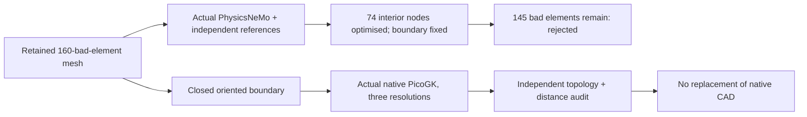

# M64 — actual PhysicsNeMo and PicoGK continuation, 28 September 2026

## Outcome and scope

Actual **PhysicsNeMo 2.2.0 CPU automatic differentiation** reduces the retained
whole-body mesh from **160 to 145 inadequate tetrahedra**, without moving any
boundary vertex. The original native BRep is neither edited nor replaced.
The unchanged project threshold `minSICN >= 0.1` still rejects this mesh.

Actual **PicoGK 2.3.0 / native kernel 26.2** has processed the same body's closed
tetrahedral boundary at three voxel resolutions. These are separate diagnostic
meshes, not proposed replacements for the native CAD. The coarse independent
audit rejects the roundtrip; generation success is not geometry acceptance.

This follows the [precision/remeshing checkpoint](M64_MESH_PRECISION_RECOVERY_20260928.md).
All computation ran on the existing Mac. No Vast instance was rented. The
NVIDIA skill catalog was checked; its discovery and domain-sharding guides
did not directly match this small geometry/mesh experiment. The actual Mesh
API and existing repository producers were used instead.

## Independent PhysicsNeMo mesh audit

The [bridge auditor](../../twins/m64-cylinder-head/source/wholebody/audit_nemo_picogk_bridge.py)
loads the exact saved 241,299-tetrahedron mesh, checks its retained report and
mandatory surface-algorithm companion, and calls actual `Mesh.cell_areas` and
`Mesh.quality_metrics`. The [official Mesh API](https://docs.nvidia.com/physicsnemo/latest/physicsnemo/api/mesh/core.html)
defines these geometric operations; this is not a learned thermal surrogate.

All 241,299 volumes, edge-length ratios and normalized aspect ratios agree
with an independently formulated NumPy reference at **rtol 1e-10, atol 0**.
The volume reference uses a determinant; the aspect reference uses cross-product
face areas and tetrahedral altitudes. Maximum absolute discrepancies are
1.42109e-13, 1.42109e-14 and 6.82121e-13, respectively. All recorded quality
arrays are finite. This does not validate every library quality formula, and
PhysicsNeMo's combined quality score is **not** Gmsh's minSICN criterion.

The 160 rejected elements have normalized aspect ratios between 16.45 and
108.15. The bridge also exports the oriented tetrahedral boundary for PicoGK:
90,986 triangles, one connected vertex component, zero boundary/nonmanifold
edges, consistent winding and no zero-area or duplicate triangles after STL
float32 serialization. The surface is the **linear volume-mesh boundary**, not
a new fine tessellation or a 0.040-unit bound against the native CAD.

No installed PhysicsNeMo code was patched. The previous rejected CUDA area
receipt remains unchanged; this CPU tetrahedral audit does not supersede it.

## Boundary-fixed automatic-differentiation experiment

The [bounded optimiser](../../twins/m64-cylinder-head/source/wholebody/optimize_nemo_interior.py)
selects 74 non-boundary nodes incident to the original bad elements. Their
incident patch contains 1,463 tetrahedra. All other nodes remain fixed.
Three original bad elements have exclusively boundary nodes and cannot be
corrected by an interior-only movement at fixed connectivity.

The objective uses actual PhysicsNeMo aspect ratios and a signed-volume
barrier, with 120 Adam steps. Displacements have a **per-axis** bound of 25%
of each node's initial shortest incident edge (not a spherical-radius bound).
Every ten steps the independent Gmsh auditor evaluates the full mesh. Selection
requires fewer bad elements, no inverted elements, no worse minimum quality
apart from a 1e-12 comparison allowance, and no larger bad-volume fraction.
The acceptance threshold itself is unchanged.

| Measure | Retained input | Selected result after save/reread |
|---|---:|---:|
| Tetrahedra | 241,299 | 241,299 |
| minSICN below 0.1 | 160 | **145** |
| Minimum minSICN | 0.0173405985 | 0.0173690202 |
| Nonpositive Jacobians | 0 | 0 |
| Bad-element volume fraction | 0.028898% | 0.026620% |
| Boundary coordinates / connectivity | reference | bitwise unchanged |

Maximum **interior mesh-node** displacement is 1.38094 scan units. This is not
a CAD/surface displacement or a certified mechanical deformation. Saved
readback retains positive signed volumes, one connected tetrahedral region,
complete boundary matching and the same total enclosed volume. Runtime is
approximately 6.9 seconds; this is not a CPU/GPU benchmark.
An independent repeat of the same bounded job produced a **byte-identical
saved MSH file** and the same 145 rejected elements. This establishes repeatability
on this runtime, not cross-platform reproducibility or physical accuracy.

The first attempt's final JSON serialization failed on a NumPy integer from
the topology helper. Its source and partial receipt are retained privately,
not counted as accepted evidence. Normalizing the helper's input coordinates
to Python scalars fixed that reporting boundary; the full second execution
produced the accepted arithmetic receipt. No old published producer or
evidence file was overwritten.

## PicoGK execution and independent refusal

The existing [HeadVoxels producer](../../twins/m64-cylinder-head/source/picogk/Program.cs)
was compiled unchanged with .NET SDK 9.0.317 in a private job directory.
The SDK archive's SHA-512 matched Microsoft's release metadata. PicoGK source
commit is `0e6cf6b6f4993ec16dbcd72d8f27f26b999980f3`, extracted from the existing
managed-preflight image; tracked upstream sources are unchanged. The native
macOS arm64 library was used, **not** an emulated Linux kernel or a .NET 8
whole-engine worker. The separate native sphere/offset witness passed, with
about 0.597% sphere-volume error at its deliberately coarse smoke resolution.

| Voxel size, provisional scan units | Output triangles | Native job duration |
|---|---:|---:|
| 0.6 | 1,048,056 | 2.8 s |
| 0.3 | 4,274,384 | 13.7 s |
| 0.15 | 17,214,748 | 76.6 s |

The producer's morphological opening is a **feature-sensitivity diagnostic**,
not a wall-thickness test, cooling design or printable candidate. Its native
peak-working-set field returns zero on this run and is not a credible memory
measurement; independent Python audits record their own peak RSS.

The [new audit entry point](../../twins/m64-cylinder-head/source/wholebody/audit_picogk_bridge.py)
reuses the existing topology and nearest-triangle-distance functions without
inventing STEP provenance. It samples 512 area-weighted points in each
direction with fixed seeds. These samples are not a continuous Hausdorff bound.

At 0.6, the raw output has **four zero-area triangles and three nonmanifold
edges**, with inconsistent winding. Its sampled maximum displacement from the
input boundary is 1.15985 scan units; reverse maximum is 0.46521. The 0.040
screen therefore fails even before any metrology or physical qualification.
No smoothing, degenerate removal or whole-body substitution is silently applied.

At 0.3, the raw mesh is closed and consistently wound, without zero-area or
duplicate triangles, but has **two boundary vertex components instead of one**
and Euler characteristic -12 instead of -14. This alone does not classify a
second shell as a detached material island or an internal cavity. The sampled
forward/reverse maxima are **0.318982 / 0.127787** scan units; the respective
p95 values are 0.046296 / 0.029767. Both directional maximum-distance screens
still fail. The relative signed-volume difference improves from +0.168985%
at 0.6 to +0.041628% at 0.3; that aggregate is not surface equivalence.
Independent audits took 24.8 / 77.2 seconds and about 0.89 / 3.20 GiB peak RSS.

The 17.2-million-triangle output is retained but exceeds this audit's explicit
five-million-triangle budget; it is **not promoted by its smaller voxel size**.

## Private artifact fingerprints

Raw geometry, coordinates and derived STL/MSH files remain private. Public
content contains code, tests and aggregates only.

| Artifact | SHA-256 |
|---|---|
| Retained tetrahedral mesh | `965de13aefda6f5a314c9edee295578b4f638d58c173dfe2098d77ae21e4e7af` |
| PhysicsNeMo audit and bridge receipt | `1f3119b4a08be65f66b0ed0af8c1270e19039a87f63380f473aa27b878c17d50` |
| Boundary STL supplied to PicoGK | `1029336715767630c07926b5c54e1d883e183ce0ebe3f7fb8d752455db9acd0a` |
| Completed optimisation receipt | `449a3a025810d847df3e685a57d35a2e375050691e3ca76f82cd729db1515374` |
| Identical saved mesh from both completed optimiser runs | `e8c6c54ae3028e811b9e2a74039ab8d88caf2567cf5d8bb0a703c733b70c67eb` |
| Optimiser repeat receipt | `2e548f7c0de540f52969f917374f4cfe003ad2048564e7145873c089d90ba0da` |
| Native PicoGK library | `5c1cd3fc12766a85bc5c1441a95f065fb274338d1333c3ae2d3396b59d0e18e7` |
| Compiled HeadVoxels | `24cc53e4e2dc57532591bbd1642ae1b5b9a22721de34e096e10a33e9d6324024` |
| Native sphere witness receipt | `91ebcaec699d64c709077c15071548ad03b5a9189b7e53da144d5f1adfedd1f2` |
| PicoGK 0.6 independent audit | `c635a771bca43730d5b3bd244c1e32dd76f27b2a6b4ebc8739e02c29d97620fd` |
| PicoGK 0.3 independent audit | `c91424c66472f5a27f394b30a97c8c316e29a93354e800b06df752bebb6be39c` |

New producer hashes: bridge `6938fa5b63e2c6455d9d0adf69fd62882e1039ffd6097ecaad31c9751321dae8`,
optimiser `3d041a54eeacfa0bd1ec8170bed43096e0db0c215f072d0d777ac10991853fc2`,
PicoGK audit `4b4b5169577e6921e97268fe039f139dcd064d20dcab4dc919839047fead6ae8`.

## Software verification

`make check` completed successfully: 3,167 tests in the main discovery suite,
143 skipped, followed by the repository's additional checks. Both new focused
tests passed, including rejection of inverted synthetic tetrahedra and an
optimiser selection rule that refuses trading minimum quality or bad volume
for a lower bad-element count. Documentation checks found zero broken links
in 559 Markdown files. Source hashes still match the completed executions.
These checks verify software and evidence consistency, not engine operation.

## Next gate

The next bounded step is CAD-constrained **local surface remeshing**, since
interior-only optimisation cannot change deficient boundary triangles or
all-boundary tetrahedra. PicoGK proposals must stay separate and undergo
functional-interface and native-CAD deviation checks before any local adoption.
Global voxel substitution is not justified by these results. Continuous valve
motion, thermal/structural convergence, material cards, print-process
qualification and physical interface uncertainty remain open. No 0.040 mm
certificate, 700 hp result or manufacturing authorization is issued.
