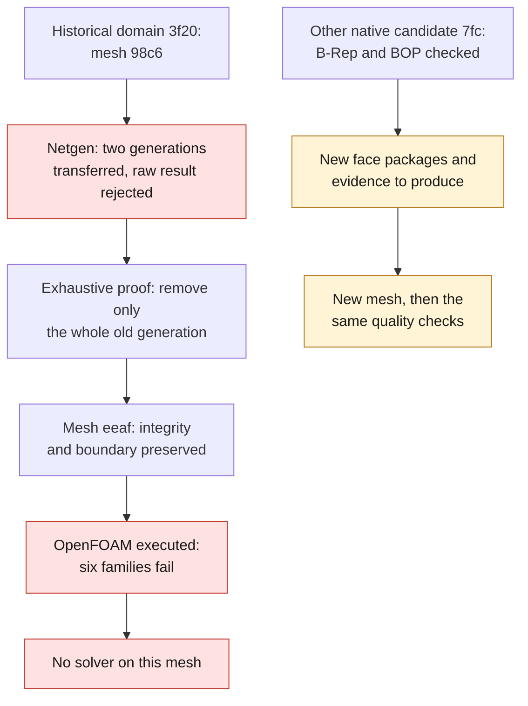

# M64 — Netgen recovery and OpenFOAM cross-check

This batch concerns the historical native domain `3f20f4c5…`, **not** the
[candidate with corrected C0 representation](M64_CORRECTIONS_NATIVES_20260908.md)
`7fc114c1…`, which has not been remeshed yet. No result is transferred
automatically between these two files.

## Volume optimization: generation recovered, mesh still rejected by OpenFOAM

The intake mesh produced by Netgen processing now contains **458,307 tetrahedra** after recovery of its complete generation. The **191,968 triangles of the 88 boundary faces** keep exactly their coordinates, orientations and roles after remapping of the node numbers. **The new OpenFOAM check still rejects six families of criteria.** This step deals with the transfer and integrity of a numerical mesh; it validates neither the flow rate, nor the temperature, nor the strength of the cylinder head.

The [evidence capsule](../../twins/m64-cylinder-head/evidence/native-gas-netgen-recovery-20260908.json) gathers the digests of the scripts, process logs and reports. The geometries and detailed evidence remain private; their digests alone do not constitute a public reproduction of the computations.

### Runs actually executed

One preflight and **three native Netgen calls** were performed in the Gmsh **4.15.2** image, `linux/amd64`, digest `27bb1cab…b2764d4`. Each attempt was bounded to **4 CPUs, 4 GiB and 300 seconds**, with no network. No CFD solver was launched in this batch.

| Step | Observed result | Exit | Wall time from the process receipt |
|---|---|---:|---:|
| Preflight | NumPy missing; no Netgen call | 2 | 4 s |
| Call 1 | Transfer with no surface actually attached to the volume; native abort | 139 | 10 s |
| Call 2 | Adjacencies restored; Netgen finishes, then check blocked by the element cache | 2 | 65 s |
| Call 3 | Immediate save and cache rebuilt; two superimposed generations detected and rejected | 2 | 129 s |

The durations in the table are the integer measurements from the process receipts, not CPU times. Calls 2 and 3 spend **44.958 s** and **45.102 s** respectively in the optimizer. The parameter `niter=1` does not limit this native branch to a single internal iteration: it means a single API call per attempt. The containers were all removed and their absence verified; no new Vast rental was made.

### Transfer defect identified and controlled correction

Rebuilding the discrete links with `createTopology(False, False)` restores **88 volume–face adjacencies**. It keeps all old nodes and elements, their connectivities and their groups. The **101 points and 3,687 auxiliary lines** added are carried exclusively by nodes or edges already present on the boundary; no new closing surface is created.

Reading the Gmsh code explains the following mechanism: on this entirely discrete volume, the cleanup branch can keep the old tets before the Netgen transfer adds the new ones. The call with a rebuilt cache makes it possible to measure the defect: **939,496 tets**, total signed volume **doubled**, **111,186 duplicates** and inconsistent volume incidences. This raw result is kept and remains rejected. The rebuilt cache only repairs the indexing, not this superposition. [Gmsh 4.15.2 source](https://gmsh.info/src/gmsh-4.15.2-source.tgz), [cache API](https://gmsh.info/doc/texinfo/gmsh.html#index-gmsh_002fmodel_002fmesh_002frebuildElementCache).

The recovery did **not deduplicate the 111,186 tets** nor remove poor-quality elements. It exhaustively identified the **481,189 elements of the old generation**, then removed that entire generation from the copy. The **458,307 new tets** were all kept. Only **30,776 nodes that had become orphans**, after checking all incidences, were removed; no coordinate was changed.

The proof compares all old tets, their roles and the order of their four vertices, with a **global bijection of the 126,760 nodes** and an **exact comparison of the ASCII coordinates with Decimal**. It also checks the whole boundary. Numbers alone are not enough: MSH2 output reassigns identifiers by default, even when `Mesh.Renumber=0`. [Separate MSH2 option](https://gmsh.info/doc/texinfo/gmsh.html#index-Mesh_002ePreserveNumberingMsh2).

The recovered mesh passes the following direct checks: **zero duplicates**, **zero faces incident to more than two tets**, **zero internal faces with the same orientation**, **strictly positive signed volumes**, complete oriented outer boundary and total signed volume equal to that of the initial mesh. The extraction re-ran neither Netgen nor a mesh generation.

### Measured quality: improvements and regressions

An independent re-read in Gmsh, **with no generation or optimization**, takes **2.287 s** and finishes with exit 0. It confirms **124,940 nodes**, **458,307 tets** and all the original physical groups.

| Measure | Initial | Recovered generation | Reading |
|---|---:|---:|---|
| Minimum SICN | 1.39830 × 10⁻⁷ | 7.62991 × 10⁻⁷ | Extreme improved, still very low |
| Tets with SICN < 10⁻⁶ | 8 | 1 | Fewer nearly degenerate elements |
| Tets with SICN < 0.1 | 1,409 | 1,595 | Regression of this indicator |
| Non-positive SICN | 0 | 0 | None observed |
| Minimum Jacobian | 6.21332 × 10⁻¹² | 9.83784 × 10⁻¹² | Positive in the unscaled coordinates |
| Non-positive Jacobians | 0 | 0 | None observed |

The SICN threshold of **0.1 is a diagnostic indicator here**, not a CFD authorization nor a criterion lowered to accept the result. The Jacobian values use the scan coordinates; they certify no physical scale in millimeters. **No uniform improvement of the mesh is claimed.**

### OpenFOAM check actually executed

After independent review, the recovered file **`eeaf1c79…56d66d`** was converted and then checked in **OpenFOAM Foundation 14** with the same scripts, the same image **`a233511b…de1c17`** and the same criteria as the initial mesh. The steps `gmshToFoam`, `transformPoints`, `createPatch` and `checkMesh -allTopology -allGeometry` were actually executed; no solver was launched. The scale conversion of **0.001 m per scan unit**, applied only once, remains a physically uncalibrated assumption.

| Failing OpenFOAM criterion | Initial | Recovered generation |
|---|---:|---:|
| Cells with excessive aspect ratio | 139 | 151 |
| Maximum aspect ratio | 36,243.06 | 53,139.06 |
| Highly distorted faces (`skewness`) | 53 | 30 |
| Maximum skewness | 183.10 | 104.31 |
| Cells with determinant < 0.001 | 4,243 | 1,790 |
| Concave cells | 25 | 15 |
| Faces with interpolation weight < 0.05 | 1,200 | 897 |
| Faces with volume ratio < 0.01 | 532 | 443 |

Five counts decrease, but the number of very elongated cells and their maximum ratio increase. **All six families remain rejected.** The cell determinant evaluated by OpenFOAM for its finite-volume computations is not the geometric Jacobian measured by Gmsh; their results do not substitute for one another.

The four commands return **0**, but the log concludes with **six failed checks**. The supervisor therefore returns **2** and keeps the CFD rejection. The wall time of the receipt is **11 s**, of which **6.438 s** for `checkMesh`. The container was removed and its absence verified. The capsule contains the full digests of the report **`624e45df…d4a225`**, the log **`a0ce4926…81e308`**, the review **`a5586f06…7861a1`** and the process receipt **`de5eb2c2…35c56a`**.

### Validation state and next decision

The check of the recovered mesh is now **executed and rejected**, not `non_executed`. The CFD, thermal, structural and additive process solvers remain `non_executed` **in this batch**. The next step is a local correction motivated by the defects still observed, followed by the same checks; no lowering of thresholds nor solver run on the rejected mesh is authorized.

Software assertions, the program's exit and positive Jacobians constitute neither computational convergence, nor physical validation, nor authorization to print or to run an engine.

## Chain of evidence

The diagram at the top of this page summarizes the chain: the historical domain
`3f20` goes through the Netgen recovery and fails the OpenFOAM check, while the
native candidate `7fc` still needs its own face packages, mesh and checks.

## Next bounded batch

Create a new native face package for `7fc114c1…`, keep the historical
profile, then recompute the digests and transfer the roles through the
audited geometric correspondence. The old notice reporting C0 and an old
STEP check are not reusable for this candidate. Redo the surface and its
checks first, before the volume and any CFD. The three
new vertices must remain represented; no removal of detail
nor increase of tolerance is implicitly authorized.

The software tests of the [CAD batch](M64_CORRECTIONS_NATIVES_20260908.md)
pass separately (see its software verification and resources section); they do not change these qualification rejections.
