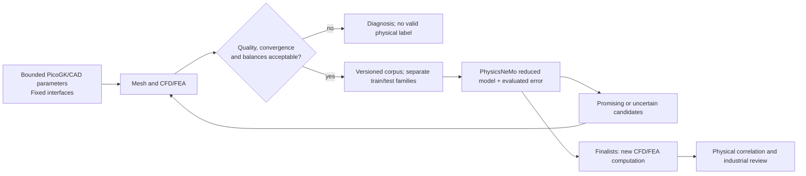

# Neural Concept: application to the turbo M64

Research verified on September 12, 2026. Four publications consulted;
no M64 training and no engine performance gain demonstrated.

## Publications and decision

| Primary source | Contribution and limit for our project |
|---|---|
| [Baqué et al., Geodesic Convolutional Shape Optimization, ICML 2018](https://proceedings.mlr.press/v80/baque18a.html), §3 and §4.1–4.3 | Predictor trained on simulations, optimization, new simulation when the shape leaves the learned domain. 3D experiment on 2,000 synthetic shapes: not a prescribed minimum for the M64. No reusable official repository identified in this search. |
| [Remelli et al., MeshSDF, NeurIPS 2020](https://arxiv.org/html/2006.03997v2), §3.2, §4.3 and supplement §8.7 | Gradients toward an implicit representation. The automotive experiment uses 1,400 cars and OpenFOAM, not photos alone. No code license identified in the [official repository](https://github.com/cvlab-epfl/MeshSDF) at the time of the check: clarification needed before integration. |
| [Durasov et al., Enabling Uncertainty Estimation in Iterative Neural Networks, ICML 2024](https://proceedings.mlr.press/v235/durasov24a.html), §3.2, §4.2 and §5.1 | Spread across iterations as an uncertainty indicator for selecting new simulations. Not a universal bound on physical error. [MIT code](https://github.com/cvlab-epfl/iter_unc/blob/main/LICENSE); full reproduction of the CFD corpus not documented in the README consulted. |
| [Talabot et al., PartSDF, TMLR 2025, version of October 20](https://arxiv.org/html/2502.12985v3), §4.4, §5 and appendix D | Component-based representation, with an example of a car body optimized around fixed wheels. Part labels required; difficulties on thin structures and spurious fragments. [MIT code](https://github.com/cvlab-epfl/PartSDF/blob/main/LICENSE), [data/checkpoints CC BY 4.0](https://zenodo.org/records/17466765). These data do not qualify a cylinder head. |

The [Neural Concept commercial benchmark of September 10, 2025](https://www.neuralconcept.com/post/from-dataset-to-design-impact-how-neural-concept-set-a-new-benchmark-on-mits-drivaernet)
announces four A100s and 24 hours of training on DrivAerNet++. It is a
company publication, not an independent reproduction, an M64 quote
or a free release of its product.

## Proposed transposition, not an achieved result

Adopt **active learning** first, without replacing the CAD with a freely
generated shape. The master outline is kept: no oval envelope.
Freeze the interfaces and the zones not allowed to change; a "fixed" latent
component does not replace a dimensional check of the exported geometry.

Proposed first sub-problem: intake port at imposed lifts, flow rate and
pressure loss. Thermal, strength and valvetrain dynamics require their own
data; a steady-flow bench does not simulate the engine cycle. Start with a
simple KPI predictor on parameters, then consider
[DoMINO/PhysicsNeMo](https://docs.nvidia.com/physicsnemo/latest/physicsnemo/api/models/operators.html)
for surface/volume fields if the data justify that complexity.
PartSDF comes next if the parametrization becomes insufficient. PicoGK
is not assumed to be differentiable: bounded derivative-free optimization, or
a separate, explicitly verified differentiable path.

Each sample must link geometry/parent, parameters, units, material,
boundary conditions, solver versions/settings, mesh quality,
convergence, balances, fields and KPIs. Separate training, calibration and test
by geometric family and operating regime, not by near-identical snapshots.
Measure local errors at the seats and thermal bridges, not just
a global average. Uncertainty scores and out-of-domain cases call for
new computations: they do not guarantee safety.

Results artificially clipped at 3,300 K do not become physical truths
through training. Do not mix an LPBF coupon with engine operation.
The missing M64 interfaces come neither from photos nor from pretrained
automotive weights.

## Tokens and total cost

Scripts for generation, execution, extraction and selection; the LLM receives
compact receipts and proposes analyses or code to be tested. No LLM at
each solver step, no autonomous manufacturing decision. Count the tokens
actually processed by the hosted LLM separately from an OpenAI saving,
which remains an unmeasured counterfactual.

Compare "CAE data + training + new simulations + final recomputation"
against a direct CAE optimization. Fast inference is not enough to prove
payback. No token saving or engine efficiency gain is measured here.
