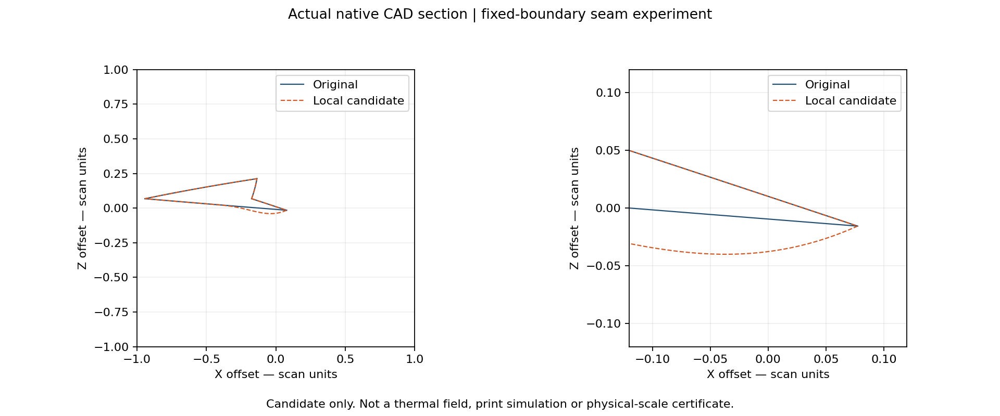
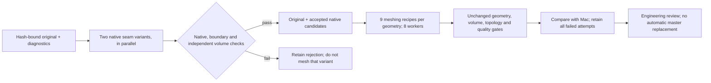

# M64 — bounded parallel CAD and meshing campaign, 28 September 2026

## Scope and acceptance

**Outcome: 57 attempted volume meshes; none accepted.** Both native surface
variants pass their local CAD and independent-volume checks. Changing the
meshing recipe reduces below-threshold elements by about 92–93% on the original
body, but does not meet the unchanged minimum quality limit. The Linux results
are recovered and the rented instance is destroyed, with absence verified.

The user authorises a separate Vast rental and a **USD 10 total campaign cap**.
The [preceding fixed-boundary experiment](M64_FIXED_BOUNDARY_SEAM_20260928.md)
is extended to two amplitudes, 0.020 and 0.035 provisional scan units. Original
external geometry remains the reference. No master, installed assembly or
catalogue release status is replaced by this campaign.

The [dispatcher](../../twins/m64-cylinder-head/source/wholebody/run_parallel_cad_trials.py)
runs the existing bounded seam producer, independent face-flux/native-volume
comparison, and frozen native volume-mesh checks. These are CAD and numerical
mesh experiments, not complete-head CFD, thermal fatigue or LPBF qualification.
The original remains scan-derived 935 research geometry, not certified M64
interfaces. Provisional coordinates do not establish physical 0.040 mm accuracy.



Native CAD section, not a thermal contour or a redesigned outer silhouette.
Scan source attribution: [Wolfe Classics](../../catalog/sources/src-wolfe-classics-935-billet-cylinder-head-scan.json).
The scan and native geometric files remain private; only this requested
documentation image is published.

## Finite experiment matrix

| Variable | Values |
|---|---|
| Native geometry | Original; fixed-boundary 0.020; fixed-boundary 0.035 |
| Mesh size interval | 1–6 or 0.5–3 scan units |
| Gmsh surface algorithm | Frontal-Delaunay (6), MeshAdapt (1) |
| Volume algorithm | Delaunay (1), HXT (10) |
| Tetrahedral optimisation | Netgen; one additional unoptimised reference per geometry |

This makes **27 volume-mesh trials per platform**, conditional on the two native
candidates passing their geometry and independent-volume checks. Eight isolated
worker processes run concurrently on Linux. A separate Mac campaign uses two
workers with the same source hashes and input bytes, enabling a cross-platform
comparison rather than silently substituting historical results.

Each native candidate preserves boundary curves, stored entity tolerances and
protected-face serializations; it must survive exact native validity, readback,
self-intersection and seven fixed-gap witness checks. Volume removal must agree
between the rectangular-face divergence integral and adaptive whole-solid
integration. No default non-adaptive volume value is used to overrule disagreement.

Each mesh retains the existing thresholds: minSICN >= 0.1, strictly positive
Jacobians and signed volumes, one connected region, full native-face coverage,
complete boundary, coarse volume error <= 1%, unchanged CAD and accepted mesh
readback. HXT must also retain the pre-volume surface triangulation. A timeout,
native crash, incomplete report or missing gate is never accepted. Surface
algorithm overrides are recorded in a mandatory companion recipe receipt.

Per worker: 600-second alarm, 610-second parent timeout and descendant cleanup;
Linux additionally limits virtual memory to 16 GiB. The remote campaign has a
3,000-second process timeout. No CAD safety or physical acceptance threshold is
relaxed to make a variant pass.



## Rental and resource evidence

The unrelated fan-project rental is explicitly identified as read-only background
and never targeted for stopping, deletion, SSH modification or workload injection.
The installed OpenBao wrapper is not modified. The additional
[deadline guard](../../deploy/vast/m64-cad-batch/deadline_guard.py) reuses the
hash-checked PicoGK exact-identity cleanup engine for the existing CAD-image
profile. No credential is exported or transferred to the rented machine.

Infrastructure attempts are retained:

1. Offer 47067002 disappeared before the paid request; no instance was created.
2. Offer 50894162 created instance 53191353. Its initially absent status was
   treated as terminal by the first guard. The guard destroyed that exact
   instance and confirmed absence; an independent inventory confirmed this.
   No CAD computation ran. The guard was corrected to permit only the existing
   120-second metadata grace, not to treat unknown state as ready.
3. A fresh attempt on 50894162 received provider `no_such_ask`; no new owned
   instance was observed. Its exact-label watch remained armed.
4. Offer 52474760 created **53192753**. Image, scoped SSH host key, BatchMode SSH
   and the image's CAD transport smoke passed before private geometry transfer.

The quote was 96 effective CPUs, 386,639 MB RAM and one RTX 5090, with 300 GB
allocated storage, **USD 0.916666667/hour**, and USD 0.01171875/GB each way.
Actual Linux readback shows 192 visible CPUs, but cgroup quota is **92.16 CPUs**;
host RAM is not presented as exclusive allocation. The cgroup memory limit is
**550,416,416,768 bytes (512.62 GiB)**. NVIDIA reports RTX 5090, 32,607 MiB.
This CAD/mesh campaign is CPU work: no GPU-accelerated CAD claim is made.

The successful attempt retains the original campaign deadline, 17:00:49 UTC,
and reserves the final five minutes for deletion. Its conservative quote-based
ceiling, including up to 24 GB transfer and a USD 1 cleanup reserve, is
**USD 3.8823**. USD 2 is separately reserved for preceding attempts; the total
planned ceiling remains below the user's USD 10 cap. These are bounds, not an
itemised provider invoice. The fan job's charges are not attributed to this run.
As with the existing guard, Mac sleep, network outage or provider failure can
delay deletion; only a verified absence receipt establishes billing-stop evidence.

The image is the existing CAD author, pinned at
`sha256:c59c53b2611a1e3a9e9de5d2cedf8bfb0cd57e72582b2d6b29f6c8fc82bf7e6b`.
A separate runtime pins OCP 7.9.3.1, Gmsh 4.15.2, NumPy 2.2.6 and Matplotlib
3.10.8. The missing Linux OpenMP library was diagnosed and installed before any
mesh run. Installed Debian/transitive packages are recorded but not claimed
bit-for-bit reproducible. The native surface/translated-box regression passed
on Linux in 0.833 seconds. The private transfer archive's SHA-256 matched before
extraction: `7a68f987d3152ef5cfc041e59ca7ee2318e1a26ed10707a21f964a0dabd1072d`.

## Completed numerical comparison

The [complete 57-trial table](../media/m64-parallel-cad-20260928/mesh-trials.csv)
retains unsuccessful trials, exact recipes, exit codes, final recorded stages,
quality metrics, failed gates and private-report SHA-256 hashes. Empty quality
cells mean **not obtained**, not zero defects. No coordinates or raw scan are
published in this table.

| Platform | Matrix wall time | Attempted meshes | Completed but rejected | Native process crashes |
|---|---:|---:|---:|---:|
| Mac, two workers | 851.04 s | 27 | 15 | 12 |
| Linux, eight workers | 597.05 s | 27 | 13 | 14 |
| Linux, additional HXT-only controls, three workers | 35.04 s longest worker | 3 | 3 | 0 |

The matrix timings include native candidate generation and baselines, but not
cloud provisioning, dependency installation, transfer or recovery. They are
not a controlled CPU/GPU speed benchmark. Input and source hashes remain
unchanged within both matrix runs. Native outputs and meshes are **not
byte-identical across platforms**, despite identical source/input bytes and
qualified library versions; separate baseline hashes are used for each.

### Native candidates and independent volume checks

Both amplitudes pass on **both platforms**: native validity, exact stored
tolerances, protected-face serializations, readback, self-intersection and
all seven fixed gap witnesses. For the 0.020 candidate, face-flux integration
gives approximately −0.00295736994 scan units³; the adaptive whole-solid
difference is −0.00295736990. For 0.035, these are −0.00517539739 and
−0.00517539727. The maximum cross-method discrepancy is below 1.3e-10 scan
units³, versus the local audit threshold 1e-8. This is a numerical cross-check,
not a rigorous integration error bound or a physical measurement.

### Mesh improvement without changing the head outline

All rows below use Delaunay volume meshing and Netgen optimisation.

| Geometry / surface recipe / size | Mac poor elements | Mac minimum minSICN | Linux poor elements | Linux minimum minSICN |
|---|---:|---:|---:|---:|
| Original / Frontal-Delaunay / 1–6 | 1,314 | 0.000213802 | 1,240 | 0.001562658 |
| Original / MeshAdapt / 1–6 | 113 | 0.020272604 | 131 | 0.012495775 |
| Original / MeshAdapt / 0.5–3 | 86 | 0.025680802 | 94 | 0.023339142 |
| Candidate 0.020 / MeshAdapt / 0.5–3 | 87 | 0.025803181 | 92 | 0.025804932 |
| Candidate 0.035 / MeshAdapt / 0.5–3 | 87 | 0.025804666 | 90 | 0.023327709 |

“Poor” means minSICN < 0.1; **every row remains rejected**. The original-body
poor-element count falls by 93.46% on Mac and 92.42% on Linux. This improvement
comes from the meshing recipe, not from a demonstrated cooling or strength gain.
The two local surface variants do not consistently beat the original across
platforms or quality metrics; neither is selected as the new master.

The fine original meshes have 538,968 tetrahedra on Mac and 536,574 on Linux.
Their positive-Jacobian, positive-volume, connectivity, complete-boundary and
all-face coverage gates pass. For the Mac mesh, the coarse native-volume
discrepancy is 0.1245%. Its `mesh_export_roundtrip` gate is false **because it
also includes the failing re-read quality test**: connectivity and tags survive,
and coordinate roundoff is only 5.74e-14 scan units. This is not evidence of
export corruption.

### HXT/Netgen isolation, not an ignored crash

All 24 HXT + Netgen trials terminate by native signal at the recorded
`optimizing_tetrahedra_netgen` stage, after 3D generation. Two fine
Frontal-Delaunay/Delaunay + Netgen Linux trials also crash there. Thus the
failure is **not exclusive to HXT**, and no upstream root-cause diagnosis is
claimed from a stage marker alone.

Three additional Linux controls use the unchanged native helper directly,
with Frontal-Delaunay surfaces, size 1–6, HXT volume and **no Netgen**. All
finish in about 35 seconds without a process crash. They still fail: 7,433,
7,534 and 7,429 below-threshold elements for original, 0.020 and 0.035; nearly
degenerate minimum quality (about −1.6e-14); non-positive Jacobians after
re-read; and changed surface triangulations during 3D generation. Avoiding
the crashing optimiser therefore does not yield an acceptable mesh.

The exact extra-control invocation, for each freshly hash-checked body and
its matching native baseline, is:

```sh
python source/mesh_native_ported_head.py --mode mesh \
  --input BODY.brep --sha256 EXPECTED_SHA256 --baseline native-baseline.json \
  --output NEW_OUTPUT_DIRECTORY --minimum 1 --maximum 6 \
  --volume-algorithm 10 --optimizer none
```

### Next bounded correction

The remaining 94 poor elements in the Linux original fine mesh split into
72 touching a boundary face and 22 with no boundary face. Leading native
face incidences include 989, 1994, 713 and 712. Incidence counts overlap;
these identifiers have not been anatomically classified. The similar Mac
case has 66 boundary-adjacent and 20 interior poor elements.

The next experiment must separate constrained surface defects from interior
slivers, map the implicated faces to protected engine interfaces, and test
local meshing/geometry changes against the original. The already widened
seam alone is not shown to fix these remaining defects. No anatomical surface
is moved simply because it appears in a poor-element incidence list.

OpenFOAM/CHT, CalculiX, Cantera, AdditiveFOAM, PhysicsNeMo and Omniverse are
**not executed on these rejected meshes**. No new PicoGK or LLM inference is
claimed. The campaign addresses the prerequisite CAD/volume-mesh gate; it
does not test engine operation, valves, thermal resistance or metal printing.

OpenClaw on `kali2` was optional; the local SSH name does not currently resolve.
No guessed host address, copied credentials or unverified agent service was used.
Additional LLM output would not replace the numerical acceptance checks.

## Recovery, budget closeout and software verification

The recovered Linux archive is 165,631,518 bytes. Its local SHA-256 matches
the remote value:
`22261e794ed2f9c8f7a14173de1a5c0210214086a2974452402a138909a12a74`.
It retains native candidates, all trial reports, meshes, crash logs, HXT-only
control commands, runtime package versions and installation diagnostics.
The Mac results and original source bundle are retained alongside it under
the private campaign directory `work/m64-private-20260907/parallel-cad-20260928.BDtQRBJN`.

The matrix executed dispatcher SHA-256
`3a7302e5dd93c35e4a0c26ed629e10fd084edac97ad2089d53ca43d1064e04a3`
and native helper SHA-256
`7171d7b1da250d63086b7fac1e5e1617190ec26f45f2928e729d60582a1d1c04`.
After execution, the new dispatcher acceptance aggregator was hardened to
reject missing mandatory gates, including the HXT surface gate. Tests cover
this. No numerical helper, trial result or historic hash-bound source is
edited; the original executed dispatcher is retained in the private input
bundle. This post-run reporting hardening is not presented as a rerun.

The wrapper reports `destroyed: true`, `instance_id: 53192753`, and
`verified_absent: true`. By **14:34:48 UTC**, an independent inventory is empty.
The exact-label guard separately exits with `already_destroyed` and verified
absence. The earlier unsuccessful ask's guard exits `no_instance_observed`.
No delete or workload command targets the unrelated fan rental.

Using the attempt manifest's start at 14:10:34 UTC and the verified-absence
checkpoint gives less than **USD 0.38 compute** at the quoted hourly rate.
This is a quote-based time estimate, **not an itemised invoice**; image/network
charges and early access attempts are separate. The conservative reservation
of USD 3.8823 plus USD 2 for prior attempts remains below USD 10. No continuing
head-rental charge is expected after verified deletion.

Software verification includes 41 targeted CAD tests (9 optional-runtime
skips), the actual native regression on both platforms, and full `make check`
exit 0: 3,189 tests in the main suite, 151 optional-runtime skips, plus remaining
repository gates. The final suite ran after acceptance hardening (203.15 s).
All 57 public CSV rows were checked against private report bytes, SHA-256,
metrics and failed-gate lists; the hardened aggregator rejects every one.
Documentation checks report zero broken links in 567 Markdown files.
No manufacturing approval follows from software checks.
