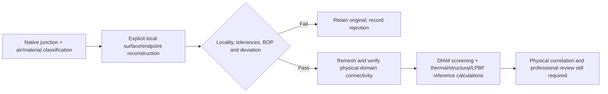

# M64 — tools from the supplied photographs and native continuation, 28 September 2026

## Decision

Keep the Mac/Linux engineering path. Integrate useful **measurement and
verification practices**, not every package in an awesome list. No Windows
installation, cloud CAD upload, paid LLM or Vast rental is made by this batch.
The original head remains unchanged; no printable or 0.040 mm result is claimed.

The owner's photographs identify
[Awesome Physical Engineering AI, revision 0f470ed](https://github.com/cluster2600/Awesome-Physical-Engineering-AI/tree/0f470ed34413f9ceaf95bc446e8c861a6a642202).
That list is discovery material, not engineering evidence. The decisions below
come from the linked primary documentation and our existing recorded trials.

## What is included, and what is not

| Item | Decision for this project | Evidence and limit |
|---|---|---|
| build123d / OCCT; FreeCAD and CadQuery | Keep the existing native geometry path and human review tools. Execute one bounded operation, inspect it, then accept or reject. | [Recorded stack](../SOFTWARE_STACK.md). Changing an interface to the same kernel is not an independent geometry solution. |
| Gmsh | Keep the existing mesher and native-CAD conformance checks. Preserve solid/fluid separation, boundary groups, volume balance, positive Jacobians and connectivity checks. | [Gmsh manual](https://gmsh.info/doc/texinfo/). Previously executed, not a newly installed fix. |
| OpenFOAM / CalculiX / Cantera | Keep the reference solvers; rerun affected cases only after geometry and mesh gates pass. | [Existing continuation](M64_PHYSICS_AM_CONTINUATION_20260928.md). Reference-case success is not whole-head correlation. |
| CAD Skills / DfAM Check | Add an **opt-in, source-pinned acceptance test** for the external CLI, before any use on the head. | [Upstream revision b10144a](https://github.com/earthtojake/text-to-cad/tree/b10144ad98616fa7156f655cbd2aba0091216d40/skills/dfam-check), MIT licence. No global skill/plugin installation or imported readiness verdict. |
| ToolCAD / freecad-mcp | Retain the useful bounded operation → numerical feedback → next operation pattern. Existing Python/OCCT runners already provide direct access, so no MCP layer is added. | [ToolCAD paper](https://arxiv.org/abs/2604.07960), [FreeCAD connector](https://github.com/neka-nat/freecad-mcp/tree/d6bbe4b38be3a622b5981d9d2afa7037ee080534). No ToolCAD weights, RL training or live MCP execution in this batch. |
| MIT OCW | Add a reference for independent analytical checks, conservation and mesh/time convergence. | [Finite Element Analysis of Solids and Fluids II](https://ocw.mit.edu/courses/2-094-finite-element-analysis-of-solids-and-fluids-ii-spring-2011/). Educational material, not engine-specific boundary conditions or certification. The executed analytic check here is a simple chamfer volume, not a thermal calculation. |
| ParaView / PyVista / VTK | Keep actual field/geometry views, with units and provenance. | Existing stack; a rendering is neither a stress calculation nor evidence of printability. |
| PhysicsNeMo / PicoGK | Keep their established roles: surrogate research / bounded new geometry. | No new model inference, training or voxel replacement is performed here. A new junction must pass the same deterministic checks. |
| Elmer / FEniCS / MFEM / SU2 | Defer additional solver integration until a particular reference case requires an independent implementation. | [MFEM](https://mfem.org/features/) offers GPU-capable numerical infrastructure, not automatic B-Rep repair. No demonstrated head speedup. |
| SolidWorks MCP variants | Exclude from this execution path: no Windows/SolidWorks environment. | [SolidPilot](https://github.com/eyfel/mcp-server-solidworks) is a prototype; its volume/area comparison does not prove a 0.040 mm surface bound. |
| Jarvis Onshape | Not selected: external account/data transfer and another CAD integration are unnecessary for this local trial. | [Project](https://github.com/ReshefElisha/jarvis-onshape-mcp). No upload or credential access. |
| openfoam-mcp-server | Do not integrate this wrapper as our thermal execution layer. This does **not** exclude OpenFOAM itself. | [Project status](https://github.com/webworn/openfoam-mcp-server): partial OpenFOAM integration, heat-transfer implementation still pending. |
| Cadrille / CAD-Recode; generic CAD-generation wrappers | Do not restart whole-head generation. | [Our measured comparison](M64_CAD_SPECIALISTS_20260912.md) omitted observed drillings; no integration was accepted. |
| Engineering-library lists / digital-twin lists / Roboflow | Reference discovery only. | They supply neither missing M64 dimensions nor a qualified material card or a repair of these junctions. |

## DfAM integration boundary

[The new runnable acceptance test](../../tests/test_m64_external_dfam.py)
checks the exact external script before execution, then invokes its CLI on:

- a 10 mm cube: known volume, thickness and zero support-volume estimate;
- all six axis-aligned cube orientations;
- two plates, 0.2 and 0.3 mm thick, separated by 0.03 mm: clearance must not
  be mistaken for wall thickness;
- an open planar triangle: missing facts must produce a partial report and
  nonzero exit, not a successful printability claim.

The upstream script SHA-256 is
`48b3cbcfe55f7f02d59bb7b8030d9384e04e032d012eed0af0203bb7989e44a6`.
Its source was reviewed and fetched into a private sparse checkout. There is
no vendored copy or automatic download in the test suite.

**Executed result:** all four CLI fixture invocations pass their expected
outcomes. The cube returns 1,000 mm³ and 10 mm sampled thickness; the two
plates return separate 0.2 and 0.3 mm minima, not their 0.03 mm clearance;
six cube orientations are returned; the open triangle exits 2 with missing
wall facts explicitly identified. No head screening is performed by this test.

The first attempt in the old Python 3.10 CAD environment correctly fails our
acceptance test: SciPy's PROPACK extension cannot load on this Mac, and the
external tool returns a **partial** report. A module being discoverable is not
runtime readiness. That environment is not modified. The successful isolated
Apple Silicon environment uses Python **3.14.7**, NumPy **2.5.3**, SciPy
**1.18.1**, trimesh **5.1.0**, Rtree **1.4.1**, NetworkX **3.7** and lxml
**6.1.3**. These are the observed test versions, not permission to upgrade the
locked CAD/simulation containers.

Do **not** apply its generic metal-PBF wall defaults to this loaded cylinder
head. They do not supersede our design screens, process-specific evidence or
hot-strength requirements. Its thickness calculation samples face-centre rays;
it is not an exhaustive minimum-wall bound. Its six orientations and projected
support prisms are screening estimates, not generated industrial supports.
It does not establish powder escape, actual melt-pool behaviour, residual stress,
distortion, surface finish or machinability.

Its `_mm` output labels assume input units. The bounding-box scale heuristic is
not metrology. Consequently no head measurement from this tool is accepted as
physical millimetres, and no supplier-ready result is produced from our
provisional scan units. A future head run needs an explicit units assumption
and must remain an assumption-labelled screen unless scale is evidenced.

## Native experiment actually executed

Following the [five rejected fillet trials](M64_NATIVE_JUNCTION_RECOVERY_20260928.md),
[a new chamfer runner](../../twins/m64-cylinder-head/source/wholebody/trial_native_junction_chamfer.py)
tests a different local primitive on face pair **893 / 1154**. It preserves the
master, reads an independent working body, prohibits contour propagation,
declares the endpoint patch before construction and reuses the classifier and
unchanged maximum-tolerance guards. It does not edit frozen historical code.

Both endpoint vertices meet **four edges**; both supporting faces and the
shared curve are B-Splines. OCCT documents four-or-more-edge endpoints as an
unsupported chamfer configuration. This is a reason to stop a blind parameter
sweep, not proof that it alone caused the measured tolerance increase.
[Native API reference](https://occt3d.com/dev/doc/refman/html/class_b_rep_fillet_a_p_i___make_chamfer.html).
The executed runtime remains **OCP 7.9.3.1**, not the website's newer version.

| Chamfer distance, provisional scan units | Native result | Maximum face / edge tolerance | Maximum vertex tolerance | Verdict |
|---|---|---|---|---|
| 0.020 | Valid single solid, six local source faces replaced | 0.0004004741 | 0.0004004741 | Rejected |
| 0.005 | Valid single solid, same six local source faces replaced | 0.0016867726 | 0.0031157359 | Rejected |

Original maxima are `1e-7` for faces and approximately `8.03396e-6` for
edges/vertices. These numbers are **kernel metadata**, not measured physical
surface errors. Both trials retain every protected-face serialization and
leave the source unchanged in memory and on disk. Neither candidate is exported
or meshed. The smaller distance does not resolve the rejection.


These are the retained **original** CAD sections from the preceding diagnostic,
not pictures of a successful chamfer or new thermal/printing results.

The runner first passed [an analytical regression test](../../tests/test_m64_native_junction_chamfer.py):
a single 0.02-unit chamfer along a 2-unit cube edge removes
`0.5 × 0.02² × 2 = 0.0004` cubic units. It also rejects invalid distances and
nonfinite/increased tolerance values. This validates the small software path,
not the head.

| Private receipt / retained input | SHA-256 |
|---|---|
| Unchanged native head | `b2b48fe40edd1a20c8e6c0d20d77e6045931189f18330b441b09bcbf4618fc0a` |
| Chamfer runner | `ef63ede1890bf92eecd46b76d40e63a31852d350fdbc529273944408bfa331e1` |
| Distance 0.020 receipt | `32e214cfbe1eaedd5fb393a6e94ef80588c71ccf6a013c12402ac3e908b852d1` |
| Distance 0.005 receipt | `6053a763d5fe43da4e4ffd55467b23be0808c4a2b383964b8054054c3f48ca0a` |

## Next bounded operation



The next experiment should explicitly handle the multi-edge endpoints and
shared surface boundaries instead of assuming a fillet/chamfer builder can
repair them. Changes must stay within a declared patch and must not close a
passage to obtain a valid mesh. The historical Bernstein repair concerns a
different reference face; its success cannot simply be transferred here.

## Reproduction

Use the recorded OCP runtime for the native test and runner, with the exact
private body/diagnostic hashes and a fresh private output directory:

```sh
python -m unittest discover -s tests -p test_m64_native_junction_chamfer.py -v
python twins/m64-cylinder-head/source/wholebody/trial_native_junction_chamfer.py \
  --body "$PRIVATE_BODY" --diagnostic "$PRIVATE_JUNCTION_RECEIPT" \
  --output "$NEW_PRIVATE_OUTPUT" --pair 893 1154 --distance .02
```

Exit 2 is a recorded rejection. The 300-second process alarm leaves the started
receipt incomplete if construction is interrupted; absence of a final report
is never success. No candidate export path is enabled by this diagnostic.

After reviewing/fetching the exact upstream revision and providing its declared
dependencies in an isolated environment, run the opt-in DfAM test:

```sh
M64_DFAM_TOOL=/absolute/path/to/text-to-cad/skills/dfam-check/scripts/dfam_tool.py \
  python -m unittest discover -s tests -p test_m64_external_dfam.py -v
```

Default repository tests skip optional external/native runtimes when absent;
such skips are not execution evidence. No raw scan or private geometry is
published with this report.

## Repository verification

- Full `make check`: exit 0; the main unittest run reports **3,186 tests,
  150 skipped**, followed by the additional repository checks.
- Native analytical regression: **1 test passed** in the recorded OCP runtime.
- External DfAM acceptance: **1 test passed**, exercising the four CLI fixtures
  above in the isolated mesh runtime; not skipped.
- Strict documentation links: **0 broken links in 565 Markdown files** after
  adding the new files to Git's index; the checker only knows tracked files.
- Generated report index and `git diff --check`: pass.
- The native head's SHA-256 was rechecked and remains unchanged.

These are software and bounded-geometry checks, not printing, thermal,
fatigue, engine-fitment or 700 hp validation.
