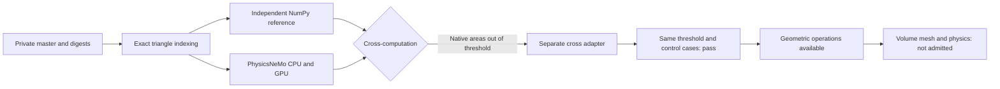

# M64 — PhysicsNeMo-Mesh actually run on Vast

Prepared follow-up: [jobs 2–3–4, piston/valve cycle and GPU research](M64_JOBS_234_20260912.md).

## Result and decision

On September 12, 2026, an A100 40 GB ran two cross-computations on the
**293,308 triangles / 146,648 vertices** of the reference body from scan 935.
**No vertex moved, no triangle deleted, no contour change.** This four-seat
body is not the latest complete M64 cylinder head with its ports; the pilot
qualifies geometric operations, not an engine part. The absolute scale and the
interfaces remain uncertified.

| Workload actually timed | CPU, 4 threads | A100 CUDA | CPU/GPU ratio |
|---|---:|---:|---:|
| Native PhysicsNeMo: Mesh construction, areas, normals, seven qualities | 117.872 ms | 1.768 ms | 66.67 |
| Separate adapter: Mesh construction, areas and normals by cross product | 8.555 ms | 0.253 ms | 33.75 |

Medians of five repetitions after a separate warm-up; a fresh Mesh object on
each call, CUDA synchronized before/after. **Ratios exclude transfers, warm-up,
imports and installation; the workloads differ between the rows.** The round
trip transfers are 2.067/18.694 ms for the first batch and 2.063/1.439 ms for
the second. The NumPy copy to CPU (~3.9 ms) is separate again. No end-to-end
gain and no CFD speedup is demonstrated. A single round trip is therefore not
a reason to rent a big card again.

## Numerical defect found and adaptation verified

The independent NumPy cross-computation uses:

$$
A=\tfrac12\|(v_1-v_0)\times(v_2-v_0)\|,\qquad
n=\frac{(v_1-v_0)\times(v_2-v_0)}
        {\|(v_1-v_0)\times(v_2-v_0)\|}.
$$

The native version 2.2.2 computes the triangle areas through a difference of
dot products. It exceeds our strict numerical threshold on **4,438 triangles
(1.513%)**, on CPU as on GPU: maximum relative error **3.232 × 10⁻⁶**, no
positive area canceled on this body. The normals pass. CPU/GPU agreement alone
would therefore have hidden this gap from the cross-computation. The seven
qualities agree between CPU and GPU, but have no independent NumPy reference
and are not the criteria of the OpenFOAM hybrid polyMesh.

Two synthetic control cases, separate from the scan, also expose a positive
area rounded to zero and a non-unit normal at very small scale. These are not
geometrically degenerate triangles to delete.

The [explicit adapter](../../twins/m64-cylinder-head/source/physicsnemo-mesh/benchmark_cross_adapter.py)
uses the Mesh structure and the PyTorch cross product and norm operations. It
**modifies neither PhysicsNeMo nor the tolerances**. On the body: **zero
triangles out of threshold**, maximum CUDA relative error of the areas **at
most 2.93 × 10⁻¹⁶**; both control cases also pass. A truly collinear triangle
keeps a non-finite normal and is refused, not artificially validated. This
check does not prove robustness on every scale or every mesh.

Thresholds unchanged: areas `rtol=1e-10, atol=0`; normals
`rtol=1e-10, atol=1e-12`. These are numerical comparison thresholds, **not
machining tolerances or a metrological uncertainty**.

Decision: keep the tested adapter for these geometric fields on this input,
and keep the native version as a comparative diagnostic rejected on global
precision. No smoothing, automatic repair or CFD admission.



## Execution, costs and backup

- A100 SXM4 40 GB, 40 effective CPUs, 127,445 MB RAM, 100 GB disk; only four
  CPU threads used for a controlled comparison.
- PicoGK/Python `linux/amd64` image by digest, SSH pair and key association
  checked before computing; no secret published. PhysicsNeMo was installed in a
  separate venv: **not a new qualified PhysicsNeMo Docker image**.
- Python 3.11.2, PhysicsNeMo 2.2.2, Torch 2.10.0+cu128, CUDA 12.8,
  NumPy 2.4.6. PhysicsNeMo wheel and five source files verified by SHA-256.
  The pip reports and the dependency freeze are kept privately; not all
  transitive dependencies are locked in advance.
- First bootstrap rejected: old pip and normalization of the name
  `typing_extensions`. Second fresh venv, pip 26.2.1: installation and GPU check
  completed in 155.04 s. No second machine purchase.
- Observed price: 0.708889 USD/h; pilot capped at 3 USD, external timeout of
  2 h with a cleanup reserve. The 12 GB of budgeted download cover the image
  **and dependencies**, not only the compressed image.
- **Instance deleted**, absence confirmed by the provider, empty inventory and
  independent watchdog finished. Reports, images and environment archive
  retrieved with comparison of remote/local digests.
- Credit before/after: 38.480688 → 38.283279 USD, i.e. **0.197409 USD of
  observed decrease**. This reading is not a final itemized invoice. No
  additional purchase and no automatic top-up; user cap of 38 USD total kept.

## Evidence and reproduction

- [Execution and cleanup receipt](../../twins/m64-cylinder-head/evidence/physicsnemo-mesh-pilot-20260912.json).
- [Aggregated full native measurements](../../twins/m64-cylinder-head/evidence/physicsnemo-mesh-stock-20260912.json).
- [Aggregated adapter measurements](../../twins/m64-cylinder-head/evidence/physicsnemo-mesh-cross-20260912.json).
- [Scripts](../../twins/m64-cylinder-head/source/physicsnemo-mesh): bounded
  bootstrap, exact indexing, reference, native benchmark, adapter, rendering.

The NPZ packages, input receipts and digests are frozen for this trial. Their
regeneration must go through a new audit and new explicit digests; do not
disable the checks to accept another body. No raw mesh, coordinate or image
derived from the scan is added to this public commit. Two private 1800 × 1250
views were produced and inspected: gray body and triangle quality
`q=4sqrt(3)A/sum(lengths²)`, fixed scale [0,1], without temperature, stress,
decimation or smoothing.

In the tested Linux GPU environment, with the frozen private inputs:

```sh
python -B benchmark_mesh.py --mesh head-surface.npz \
  --reference cpu-reference.npz --reference-report report.json --output lot-neuf
timeout --signal=TERM --kill-after=10 310 python -B benchmark_cross_adapter.py \
  --library benchmark_mesh.py --mesh head-surface.npz \
  --reference cpu-reference.npz --reference-report report.json --output cross-neuf
```

The native benchmark limits its child to 290 s, then kills and waits for the
process group. The adapter requires the external supervision above: the
300 s Python alarm does not replace the hard timeout of the native process nor
the billing watchdog. The outputs must be fresh. No cloud launch in the tests,
no LLM in the computation loop.

The 37 targeted tests pass with the wheel audit enabled. They verify exact
indexing, tetrahedron orientation/volume, references, preservation of inputs,
numerical control cases and supervision. The 18 benchmark tests and the 9
adapter tests also pass on the rented machine. The local wheel audit is
optional and offline (`M64_PHYSICSNEMO_WHEEL` designates the previously
downloaded file).

A full `make check` ends with code zero; the optional native checks without
dependencies remain explicitly skipped, including the wheel audit, not provided
by default. The independent review raises no blocking point within the scope
of this pilot. This does not constitute a physical validation.

## Useful next step

Reuse these computations in the geometric batches, keeping the data on the GPU
where relevant. Correcting the small boundary facets and checking the CAD
interfaces remain the next geometric work. Conformity of the volume mesh,
CFD/CHT, strength, fatigue and printing process have **not** become
established thanks to this benchmark.

Primary sources consulted:
[Mesh module and supported domains, NVIDIA](https://nvidia.github.io/physicsnemo/blog/2026/04/07/physicsnemo-mesh/),
[distribution 2.2.2](https://pypi.org/project/nvidia-physicsnemo/2.2.2/).
The figures in the table come from our receipts, not from the speedups
announced by NVIDIA.
