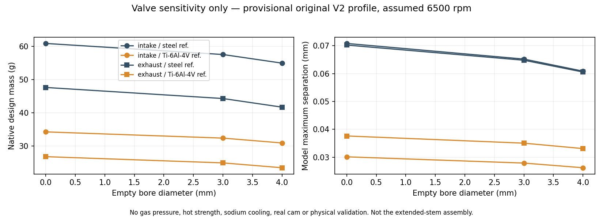
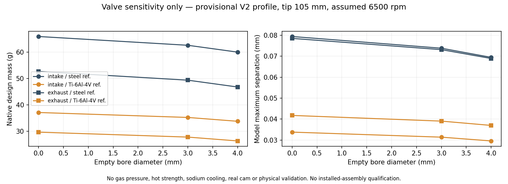
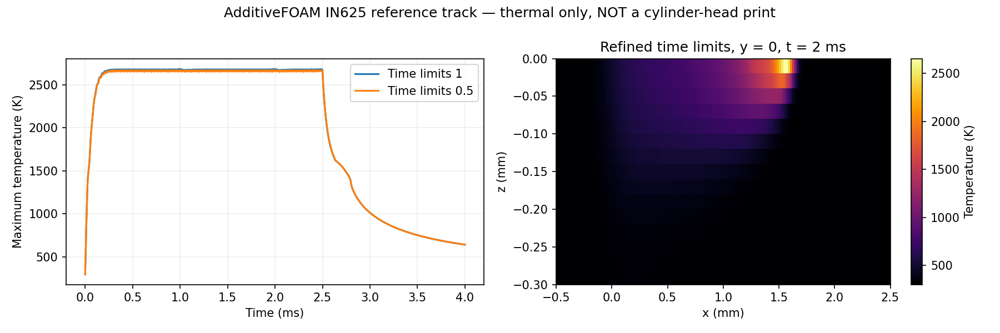
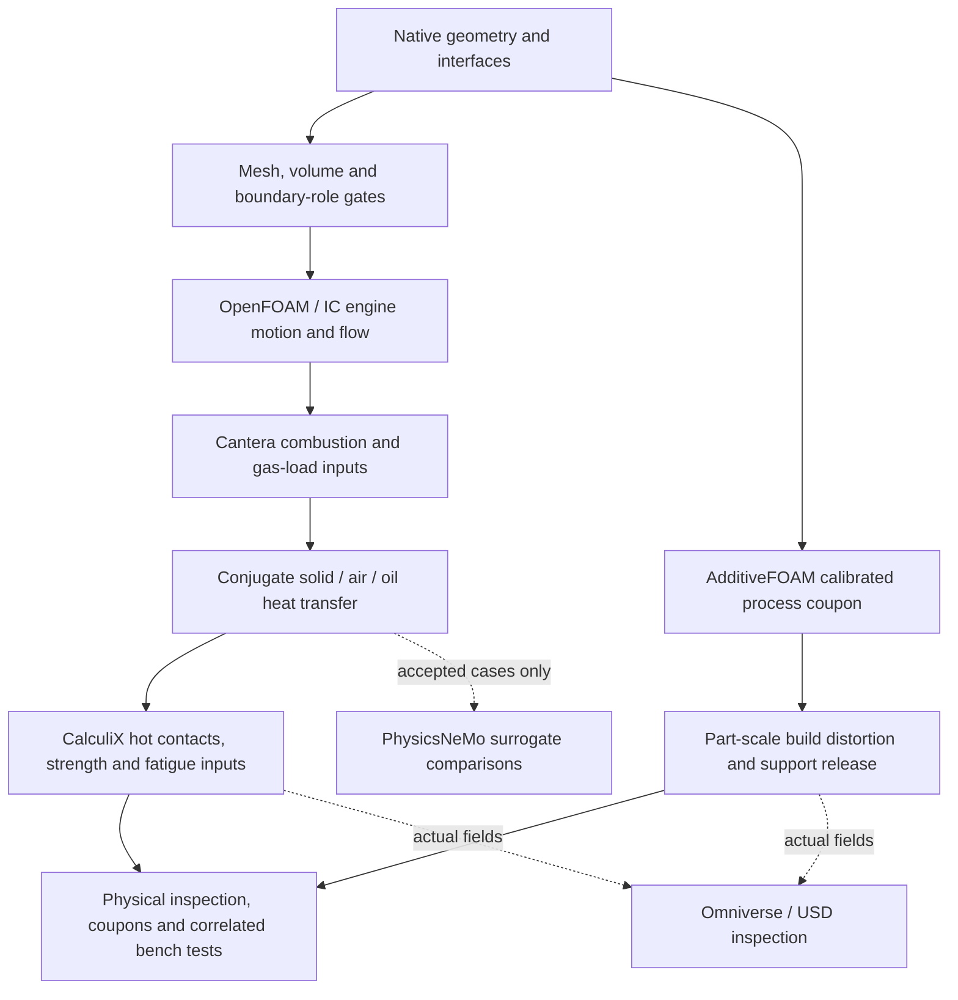

# M64 — junction, printing and valve comparisons, 28 September 2026

## Scope

This follows the [full-height slicing and junction screen](M64_JUNCTION_AM_SCREEN_20260928.md).
The existing native head and 13-solid assembly remain unchanged. No oval,
generic block, welded mesh or deleted cell replaces them. **Manufacturing and
engine-operation authorization remain false.** Physical scale, interfaces,
complete assembly and hot material/process data are not certified.

The new work separates three questions: whether a mesh can represent the body,
whether a process solver actually runs, and how valve mass affects an assumed
actuator. None substitutes for the other two. Software test success is not a
physical safety factor or evidence of 700 hp output.

## Why the 14 coincident vertex pairs cannot simply be welded

The [new diagnostic](../../twins/m64-cylinder-head/source/wholebody/audit_coincident_junctions.py)
checks the previous mesh arrays against the hash-bound Gmsh serialization and
locates coincident groups against the unchanged native BRep. All **14 groups**
contain separate indexed vertex stars that coincide geometrically.

Identifying each pair in memory produces **two connected components in each
vertex link**, and **14 boundary edges with incidence other than two**. The
necessary ball/half-ball conditions fail. This rejects blind welding: it would
hide the duplicate coordinates while creating nonmanifold junctions. The
counterfactual mesh is never saved or used in a solver. These are local
combinatorial tests, not a global geometric intersection certificate.

The groups lie near five native face-pair families: seven near 893/1154, two
near 679/897, two near 712/952, two near 679/888, and one near 1177/1427.
Indices are localization aids, not functional labels or permission to trim
material. A synthetic pair of tetrahedral stars demonstrates the failure;
half-ball and spherical-link witnesses demonstrate the accepted topology.

A tighter fTetWild run uses the same locally refined native boundary, polygon
envelope **0.005 provisional units**, target edge 3, AMIPS stop 8, 80 passes,
16 threads, no simplification and no coarsening. The external timeout is
5,400 s. Its results must pass the same independent component, quality and
coincidence checks; a polygon envelope is not continuous native-CAD conformity
or certified physical millimetres.

## Valve comparison: original and extended profiles, 24 cases

The [comparison script](../../twins/m64-cylinder-head/source/valvetrain/screen_valve_variants.py)
reuses the existing V2 valve profiles and dynamics. It generates native solid
and empty-bored stems, performs nondestructive Boolean subtraction, checks one
valid solid, verifies removed volume against the analytic cylinder, and checks
native file readback. It does not change the installed assembly.

**Important scope:** these are the original **82 mm V2 design profiles**, not
the later +23-unit extensions in the scan-derived assembly. Their frame is
explicit design millimetres, independent of the uncalibrated scan. Keeper
grooves, closing welds, complete tips and supplier manufacturing routes are
not qualified. Empty closed bores are sensitivity geometries, **not LPBF
instructions for sealed powder cavities** and not sodium-filled valves.



| Reference material / empty bore | Intake mass, g | Exhaust mass, g | Intake max separation, mm | Exhaust max separation, mm |
|---|---:|---:|---:|---:|
| Steel / solid | 60.863 | 47.628 | 0.07081 | 0.07023 |
| Steel / 3 mm | 57.533 | 44.298 | 0.06521 | 0.06479 |
| Steel / 4 mm | 54.944 | 41.709 | 0.06088 | 0.06057 |
| Ti-6Al-4V / solid | 34.269 | 26.817 | 0.03016 | 0.03763 |
| Ti-6Al-4V / 3 mm | 32.395 | 24.942 | 0.02792 | 0.03505 |
| Ti-6Al-4V / 4 mm | 30.936 | 23.484 | 0.02624 | 0.03311 |

Mass is native volume times density. Steel density 7,850 kg/m³ is an inherited
handbook assumption, not a selected valve grade. Ti density 4,420 kg/m³ at
22 °C comes from [TIMET's TIMETAL 6-4 datasheet](https://www.timet.com/documents/datasheets/alpha-and-beta-alloys/timetal-6-4.pdf),
not a qualified LPBF lot. The Ti case is 43.69% lighter at unchanged geometry;
this does not demonstrate better hot strength, wear or exhaust durability.

Dynamic columns use the existing assumed cam/spring/contact model at an
**unselected 6,500 rpm**, three cycles, and 14,400 integration steps per cycle.
Each case also runs at 3,600 and 7,200 steps: 36 integrations in total.
Only native valve mass changes; the spring's material law, geometry and
calibration do not become titanium properties. All 12 cases retain some
modeled contact loss. Gas-pressure forces, actual cam data, temperature,
spring/contact damping calibration and periodic steady state are absent.
This comparison is not an installed valvetrain pass.

The retained diameters imply **125.66 N per bar** differential pressure on an
intake head and **85.53 N per bar** on an exhaust head, before accounting for
stem area and detailed pressure distribution. Thus pressure-force histories
cannot be omitted from a turbo valvetrain decision. No cylinder/manifold
pressure is selected by this projected-area calculation.

### Follow-up on the +23-unit stem extension

A second set of **12 cases** uses a 105 mm design tip, following the existing
extension helper's 82→105 constants. The native added volume is independently
checked against its analytic cylinder volume. At the assumed scale, the
extension adds **5.105 g in reference steel or 2.874 g in Ti** per valve, for
any of the three bore choices. The empty bores remain 60 mm long; they are
not silently extended with the stem.



Solid intake mass becomes **65.967 g steel / 37.143 g Ti**; solid exhaust
mass becomes **52.732 / 29.691 g**. In the same assumed dynamics, their maximum
separations become **0.07938 / 0.03380 mm** for intake and **0.07848 / 0.04176 mm**
for exhaust. This detects the added inertia that an original-length comparison
would omit. All 12 extended cases still show modeled contact loss. It does not
validate the scan registration, hot guide clearance, added-stem stiffness or
complete actuator. No assembled valve is replaced by these comparison solids.

For a 6 mm outer stem, a 3 mm bore removes **25% of axial conducting area**,
but only 6.25% of bending second moment; remaining wall is 1.5 mm. A 4 mm bore
removes **44.44% of axial area** and 19.75% of bending second moment, leaving
1 mm wall. These ratios do not include the head, fillets, weld or local stress.
Using the TIMET mill-annealed room-temperature conductivity, 6.6 W/(m·K),
only gives a straight-segment conductance estimate; it is not a hot valve
heat-transfer calculation. Seat/guide contact paths remain unsolved.

MAHLE treats [valves, seats and guides as a system](https://www.mahle.com/en/products-and-services/engine_components/)
and describes sodium-filled high-temperature valve options. Sodium transport
must be modeled separately from an empty bore, with supplier geometry,
fill, orientation, motion and temperature data. No vendor temperature
reduction is transferred to this M64. **No valve material or construction is
selected for release.**

## AdditiveFOAM process verification

Fresh upstream source: [ORNL/AdditiveFOAM](https://github.com/ORNL/AdditiveFOAM)
commit `8314d3c0832d11a6540e352b6612fe7e2ee3f429`, version 2.0.0 / OpenFOAM 14.
The existing hash-checked [Marangoni contract patch](../../twins/m64-cylinder-head/source/additivefoam/README.md)
is applied in a separate private clone. Historical source and binaries are not
overwritten. No material coefficient or temperature limiter is tuned to obtain
a pass.

The initial build produced the solver but failed to link two analysis/conversion
utilities because the private library directory was missing from the linker's
runtime search path. Supplying that path and repeating `Allwmake` completes
the build with exit 0, without another source change. The first diagnostic
run then rejects an incompatible `fieldMinMax` function-object name. A fresh
case uses OpenFOAM Foundation 14's native `volFieldValue` min/max/integral
operations; the failed run is retained, not rewritten into a pass.

The case is the upstream **AMB2018-02-B IN625 single-track thermal benchmark**,
not the M64 aluminium head and not an alloy recommendation. It retains the
56,250-cell, 20 μm Cartesian mesh, 179.2 W laser, 0.33 absorption, 0.8 m/s
track, material/phase-change data and thermal boundaries. The domain is
3 × 0.5 × 0.3 mm; the prescribed track lasts 2.5 ms, with cooling to 4 ms.
ASCII field export and diagnostic function objects are the only first-run
changes; runtime dictionary modification is disabled.

This is a **bare-plate laser track, without powder deposition**, as specified
by [NIST's experimental definition](https://www.nist.gov/ambench/amb2018-02-description).
The upstream tutorial is a shortened computational domain, not a recreation
of NIST's complete 14 mm track and substrate. NIST corrects the AMMT case-B
power to 179.2 W and the D4σ spot diameter to 170 μm; those must not be mixed
with the other machine's 195 W and 100 μm values.

This tutorial has **zero flow outer correctors**: it solves transient thermal
diffusion and phase change, not melt-pool fluid flow, recoil, evaporation,
porosity, residual stress or support detachment. The nominal absorbed power
is 59.136 W; its full-track integral is 0.14784 J. Numerical input-power
agreement alone is not a complete thermal energy balance.

A fresh repeated case halves both maximum diffusion and phase-change time-step
limits from 1 to 0.5. The purpose is numerical sensitivity on an unchanged
mesh; two adaptive histories do not prove asymptotic convergence or physical
calibration. [Heat-source calibration](https://ornl.github.io/AdditiveFOAM/docs/heat-source-calibration/)
still needs experimental melt-pool data. The prior AlSi10Mg coupon's 3,300 K
clipping and missing qualified head material card remain unresolved by a
different alloy's benchmark.

### Completed thermal runs

Both containers exit **0**, reach exactly **4 ms**, and pass `checkMesh`.
The [independent history audit](../../twins/m64-cylinder-head/source/additivefoam/audit_amb2018_thermal.py)
requires synchronized finite diagnostics, the complete log time grid, unchanged
listed physics/mesh inputs and only the declared time-control differences.
The [aggregate receipt](../../twins/m64-cylinder-head/evidence/amb2018-thermal-comparison-20260928.json)
binds logs, histories and the actual 2 ms temperature fields by hash.

| Thermal-only IN625 run | Time limits 1 | Time limits 0.5 |
|---|---:|---:|
| Completed steps | 499 | 985 |
| Peak temperature, K | 2,685.424 | 2,670.657 |
| Maximum temperature after 4 ms, K | 642.952 | 643.078 |
| Integrated deposited energy, J | 0.1478399981 | 0.1478400000 |
| Steps whose final phase residual reaches/exceeds 1e-8 | 0 | 0 |
| Solver clock time, s | 158 | 464 |

Peak-temperature difference is **0.553%**. At 2 ms, the full temperature-rise
fields differ by **0.661% relative L2**, with a **55.43 K local maximum
difference**. The local difference is not hidden by the peak statistic.
Input energy uses each source value averaged over its preceding time step,
not a trapezoidal rule at a fictitious instantaneous source sample.



These results establish successful execution and measured temporal sensitivity
of this reference case only. Spatial convergence, a full energy balance,
experimental correlation, melt flow and part-scale distortion remain open.
Neither 2,671 K nor 643 K is a predicted M64 engine temperature.

For later experimental comparison, NIST publishes AMMT-B
[length 359 ± 20 μm](https://www.nist.gov/ambench/chal-amb2018-02-mp-length)
and [width 123.5 ± 6.5 μm / depth 36 ± 1.9 μm](https://www.nist.gov/ambench/chal-amb2018-02-mp-xsection)
(reported standard deviations, not manufacturing tolerances). They are **not
scored as passed here**: the 20 μm cells poorly resolve that depth, the
short track does not demonstrate the experimental steady-state window, and
the measurement uses a 1,563.15 K solidus threshold whereas the tutorial's
phase path spans 1,410–1,620 K. These definitions need reconciliation before
comparing melt-pool boundaries. The upstream tutorial cites a
[calibrated reduced-physics study](https://impact.ornl.gov/en/publications/calibrating-uncertain-parameters-in-melt-pool-simulations-of-addi/);
its calibration does not automatically validate this binary, grid or head.

## Full physical scope and execution order

Reuse the [existing jobs 2/3/4](M64_JOBS_234_20260912.md) and
[material/cooling/process campaign](M64_700CH_MATERIAL_COOLING_LPBF.md), not a new
parallel validation framework. “Electric air cooling” is provisionally
interpreted as a variable-speed blower, not thermoelectric refrigeration.

| System | Required calculation and result | Prerequisite still missing |
|---|---|---|
| Whole-head printing | Layer activation, supports/contact, heating/cooling, plastic strain, distortion after stress relief, plate cutting and machining; powder-access checks | Accepted manufacturing geometry, scale, support/removal strategy, supplier process and same-state hot material laws |
| Oil passages | Pressure loss and distribution over oil temperature/viscosity, local heat pickup, wall temperature/coking risk, leakage proof loads, pumping power | Actual connected passages, pump/relief/exchanger curves, oil specification and port interfaces |
| Air and fins | Conjugate heat transfer with ducts and blower curve; mass/energy balance; fan electrical demand included in net output | Actual duct/fin fluid regions, ambient range and blower/controller map |
| Cylinder, piston, head and fasteners | Gas-pressure and thermal loads, preloaded contacts/sealing, hot bore distortion, piston clearance and cyclic fatigue | Bore/stroke, piston/crown/rings, stud preload, seal/contact laws and verified engine interfaces |
| Two spark plugs and chamber | Full-cycle clearances, electrode hot spots, twin-ignition combustion, knock/pre-ignition sensitivity | Installed plug/thread geometry, piston TDC position, actual fuel and ignition data |
| Four valves and actuation | Continuous crank-angle motion and collisions; seating/contact, gas forces, guide/seat heat paths, spring surge, wear/fatigue/creep | Complete actuator and extended stems, real cam, supplier material/coating and hot allowables |
| Solid / hollow / titanium valves | Matched-geometry alternatives, including sodium only as a separate supplier-defined construction | Production route, cavity closure, filling and coupled thermal model; inertia comparison above is insufficient |

Heat transferred into oil must subsequently leave through an exchanger. Air
and oil heat rates, exhaust heat, net shaft power and blower/pump losses must
close the same engine energy account; no channel makes heat disappear.
The user's 700 hp target remains a study target; the earlier 700 PS convention
is not silently promoted to 700 mechanical horsepower or a measured result.



PicoGK remains available for targeted new channels/features after protected
interfaces and physical roles are assigned. Previous rejected global roundtrips
are not rehabilitated by this work. PhysicsNeMo cannot supply missing measured
material laws; Omniverse visualization cannot replace CFD, hot strength or AM
qualification. Their earlier receipts remain historical, not new runs claimed
in this continuation. NVIDIA's CAD-to-SimReady workflow reinforces this
separation between geometry, physical metadata and actual solver evidence.

## Reproduction and receipts

Private working directory basename: `physics-am-20260928.CwRvX8qO`.
Scan-derived CAD/coordinates and detailed logs stay private; code, tests,
aggregate figures and fingerprints are published.

| Artifact | SHA-256 |
|---|---|
| Unchanged native body | `b2b48fe40edd1a20c8e6c0d20d77e6045931189f18330b441b09bcbf4618fc0a` |
| Previous mesh arrays | `89255640826b11fa9c466737c6afe4c8470dd23f3d4433dd29848ab8f2740294` |
| Coincident-link diagnostic source | `abbf7c851fd55f72329b1f5bc140b8bf9c4ddd2b2aab1791c70ea893bde43b3f` |
| Coincident-link report, run 02 | `14e6d154a84c1170b11b72fb63e2b1c3454fe706455391c5cee8fc726b9a41cf` |
| Valve comparison private report, run 03 | `fe1b47eca7f259412b648138371f897d6d3545e6764624a2ffed6b0d08c3426f` |
| Extended-profile private report | `10dd648e63bcfce7787cb630663084442fb69ab8bb8d0ca34be0b43dc625bb5e` |
| Thermal comparison report | `e209a2a05d8afaa148806f420d28238a20782fa6dbc4c6c924fd2afc0b764df5` |
| New AdditiveFOAM executable | `549d6359b68a17ed6036ed30443bc8091380a0f1180b9150dc22dcefb96a3391` |
| New moving-beam library | `1ae3524e60b5de658aedd47479da18a5bd1052803b108e214cbeb193411e0d22` |

The valve runner requires the existing NumPy/Matplotlib/OCP 7.9.3.1 environment
and a fresh output directory. The coincidence runner requires the existing
Gmsh/OCP environment and a completed, unchanged, hash-bound mesh trial:

```sh
python twins/m64-cylinder-head/source/valvetrain/screen_valve_variants.py --output /private/fresh-valves
python twins/m64-cylinder-head/source/valvetrain/screen_valve_variants.py --stem-tip 105 --output /private/fresh-extended-valves
python twins/m64-cylinder-head/source/wholebody/audit_coincident_junctions.py \
  --trial /private/completed-trial --body /private/candidate.brep \
  --output /private/fresh-coincident-report.json
```

The isolated OpenFOAM image is
`sha256:cc9a915f6a35d8aae16cf89cb568616d9bcf1825d2e0d379ea057982ed0b0396`.
Containers run as nonroot, without network, with read-only root/source mounts
during solving, bounded memory/CPU/time, and only their case directory writable.
`blockMesh` and `checkMesh -allTopology -allGeometry` precede `additiveFoam`.
Build and calculation logs are retained separately from failed attempts.

Repository verification: `make check` passes, including **3,183 tests,
147 explicitly skipped**, native container checks and zero broken Markdown
links. The four new targeted tests also pass in the actual local numerical
environment. This verifies software behavior, not physical qualification.
