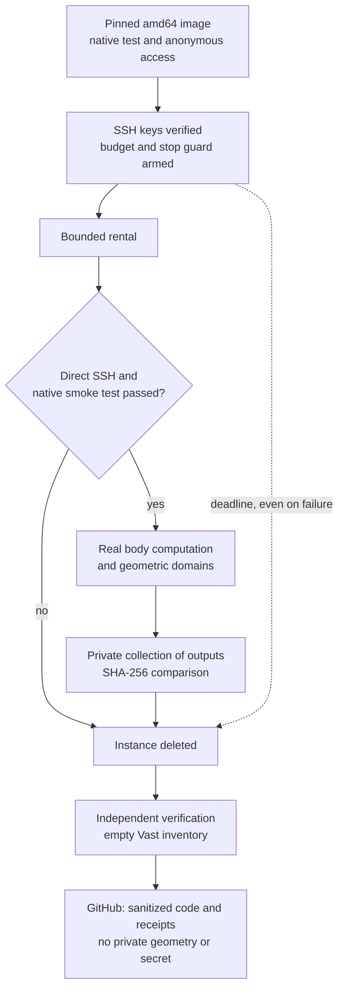

# PicoGK — working on the real M64/4V body

## Latest resumption: full audit, rental stopped

The September 7 resumption completed **all three audits at 0.6 / 0.3 / 0.15**,
with reports retrieved, matching digests and a zero process exit.
The [full receipt](../../twins/m64-cylinder-head/evidence/picogk-roundtrip-checkpoint-audit-20260907.json)
also keeps the defects: "audit completed" does not mean "part accepted".
The STEP and the three input PicoGK outputs were not modified.

| Voxel pitch, scan units | Relative volume-integral deviation | Master → output distance, p95 | Maximum sampled in both directions |
|---|---:|---:|---:|
| 0.6 | +0.128645 % | 0.240100 | 2.142979 |
| 0.3 | +0.030637 % | 0.056512 | 0.879505 |
| 0.15 | +0.007549 % | 0.010575 | 0.398493 |

The distances use 4,096 area-weighted points in each direction, measured to the
**triangles**, not only to the vertices. The master → output p95 relies on the
same sampling of the master. These are not distances to the exact STEP, nor a
continuous Hausdorff bound, nor a machining tolerance.
The absolute scale remains a hypothesis. The deviations shrink, without
establishing mesh independence or the preservation of functional interfaces.
The volume integral of the 0.6 case is diagnostic only: its mesh fails the
checks below.

### Defects kept, not hidden by small global deviations

- **Raw 0.6 rejected**: four exactly degenerate triangles, three non-manifold
  edges and inconsistent orientation. The normal-chord computation refused this
  case; no thickness result is invented for it.
- **0.3 and 0.15 closed and oriented**, without those edge defects, but with
  one and three additional negative micro-shells respectively. Their topology
  is therefore not that of the master. All are kept.
- At 0.3, the 12-triangle micro-shell was located privately. Its geometric
  volume, about 0.00174247 unit³, was compared with the STEP by OCCT Boolean
  operations: region minus master topologically empty, intersection equal to
  the region, zero partition error at the declared tolerances.
  The negative shell therefore encloses a region occupied by material in the
  supplied STEP. Its nesting inside the candidate's main shell remains to be
  tested; this numerical defect is not a measured physical porosity.
  This evidence covers **this case only**;
  the three micro-shells at 0.15 did not undergo this STEP counter-test.
- The normal chords at 0.3 and 0.15 give 10/512 and 3/512 values below
  1.5 units respectively. These are **not exact percentages of walls that are
  too thin**, nor a mechanical improvement: points, normals and measurement
  bias change with the triangulation. No minimum thickness is proven.

The triangulated surface at 0.15 remains about 1.215 % smaller than the
master's. No cooling gain is inferred from refinement alone.
The script [`audit_shell_against_step.py`](../../twins/m64-cylinder-head/source/picogk/audit_shell_against_step.py)
separates the exact triangle extraction from the OCCT counter-test; no
isolated interior point is used as evidence for a whole region.

### Connectivity, rendering and remote compute

The [connectivity check](../../twins/m64-cylinder-head/source/picogk-connectivity/README.md)
was run on Kali: 2,719,728 points, pitch 1.2 and phase 0.371, on the native
0.3 VDB fields. Every void point is connected to the boundary faces with both
6 and 26 neighbors. **No isolated cavity detected on this grid** does not mean
no cavity in the part: the earlier micro-shells illustrate precisely its
resolution limit. The two conventions for points lying exactly on the boundary
are explicit and tested; no tolerance was raised to make an overlap pass.

A new VTK rendering of the master and the 0.3 output, with a section through the
axes of the seat and guide bores, was computed and shown in the thread.
All 293,308 / 3,391,888 triangles are displayed, without decimation or
coordinate smoothing. It is not a thermal map or a photo of a manufactured
cylinder head. The body remains incomplete, notably for the ports and the
valvetrain; the geometric sources remain private.

The new qualified image includes the Python audit runtime:

```text
ghcr.io/cluster2600/3dprinting993-picogk-m64@sha256:7c7048431256c455d1396c2e71e38be15b6d0d5d035f41fdde03de47a9025ccd
```

[Successful build and smoke test](https://github.com/cluster2600/porscheparts/actions/runs/34154864350);
[independent qualification](../../twins/m64-cylinder-head/evidence/picogk-python-image-qualification-20260907.json).
The audit scripts are transferred separately and identified by their SHA.
Each resolution runs in a separate process; the checkpoints are atomic and
bound to the inputs, code, versions and parameters. An incompatible resumption
is refused. Queries are limited to 32 points per batch, without claiming that
this caps all of the mesh memory.

Instance **50193671** offered 88 CPU threads, 257,773 MB of advertised RAM
(251 GiB visible to the OS), an RTX 3060 12 GB and 100 GB of disk, for about
**0.2815 USD/h**. The geometric audits used the CPU. Duration of the main check:
**28 min 02 s**, maximum resident memory about **12.91 GiB**.
These measurements do not include the full rental duration or other processes.

Batch budget capped at **4 USD**, external guard armed before the rental, maximum
duration three hours. SSH keys verified cryptographically, binding to the
instance and direct connection checked before the work. After collection, the
rental was destroyed without waiting for the deadline; the wrapper, the guard
and an independent inventory confirmed its absence. Observed credit:
**44.114244 → 43.936093 USD**, a drop of about **0.1782 USD**. This reading
is not a final invoice and does not rule out delayed accounting.
No automatic top-up and no other rental was started in this batch.

The full `make check` finished with exit code zero: 2,076 tests collected in
the main suite, 61 skipped for optional dependencies, then additional checks.
The 16 mesh/checkpoint tests and the five shell tests actually passed in the
Linux image; the two STEP smoke tests passed with OCP. The connectivity check
has 12 tests and a SciPy counter-test on 80 synthetic configurations. The
latter runs in the dedicated QA runtime: the Mac's general Python has a SciPy
extension that does not load, reported as an unavailable optional dependency
and not as a passed scientific test. The 700 PS target model has 14 tests.
These software checks prove neither engine strength nor manufacturability.

The parallel research also delivers the
[700 PS target sizing](M64_700CH_ENGINE_RESEARCH.md) and the
[material/air/oil/LPBF campaign](M64_700CH_MATERIAL_COOLING_LPBF.md).
The laser-off AdditiveFOAM smoke test and the new 25 ns step were actually
run, **on an AlSi10Mg coupon, not on this cylinder head**. The active case
remains capped and unqualified; its outcome authorizes no engine print.

## History: first batch of September 7, before this resumption

The public Docker image was built and used on a Vast instance.
The real body and three volume domains were computed at 0.6 units,
retrieved and verified by SHA-256. The body STL and the three domain STLs
are byte-for-byte identical to the corresponding outputs on Kali.
The rental is destroyed and the independent Vast inventory is empty.

On Kali, the voxelizations at 0.6 / 0.3 / 0.15 units completed. The
independent audit campaign processed the first two resolutions, then was
interrupted with code 137 during the 0.15 resolution, before the overall
report was written. Only two progress summaries were retrieved, not the
detailed distance and chord reports. The exact cause is not established:
a memory spike is a hypothesis, not a proven diagnosis. The three computations
remain available, but the full audit is neither delivered nor declared passed.

**This batch delivers a reproducible geometric chain and its evidence, not a
new cylinder head validated thermally, mechanically or for printing.**

## Scope

The body studied is the private reconstruction from the 935 reference scan,
with four seat and guide bores. The project target is the 964/993 M64 turbo;
this documentary origin does not prove M64 interchangeability.
The master STEP remains intact. The scale hypothesis `1 unit = 1 mm` is not
a metrological certification. No new oval or free exterior contour is
introduced.

## Compute image of the first batch

Public software image, with no scan, STEP or private geometry:

```text
ghcr.io/cluster2600/3dprinting993-picogk-m64@sha256:131d29d42635b1c691649edb04fa716d8fddd7751f3ebc6011efb9be8a1b0414
```

[Successful GitHub Actions build](https://github.com/cluster2600/porscheparts/actions/runs/34147345040).
Platform `linux/amd64`; anonymous pull of the exact digest and offline native
smoke test repeated on Kali. The upstream sources are pinned; .NET 9 and the
PicoGK 26.2 runtime are included. The package dependencies do not yet
constitute a guaranteed bit-for-bit rebuild.

The synthetic smoke test checks the software, not the cylinder head. The
native mesh/voxel objects are released before the library that owns them.

## Capabilities actually used

| Operation | Use for design | Evidence limit |
|---|---|---|
| STL → voxels → STL at several resolutions | Quantify deviations from the master | Does not replace the exact B-Rep bearing faces |
| Erosion/dilation and difference | Locate sensitive details | Not a certified thickness measurement |
| Analytic signed-distance box − body | Prepare the non-solid volumes | Outside air, bores and cavities not yet classified |
| 1.5-unit erosion and intersection | Build an exploratory geometric reserve | Neither a zone allowed for removal nor an admissible mechanical thickness |
| Body − reserve | Keep a protective geometric envelope | Functional surfaces require specific masks |
| Named OpenVDB fields and read-back | Reuse the volume domains without rebuilding everything | Narrow-band fields, not an exact distance everywhere |

The modules are in [`source/picogk`](../../twins/m64-cylinder-head/source/picogk/README.md)
and [`source/picogk-cooling`](../../twins/m64-cylinder-head/source/picogk-cooling/README.md).
The second one compiles with the SDK of the already qualified image; its binary
and native library are identified in each receipt.

## Independent checks

- STEP check, declared triangulation and input SHA before/after.
- Closure, orientation, surface connectivity and mesh volumes.
- Tool for sampled distances in both directions to the master's triangles,
  not only to their vertices. The first campaign had not persisted its
  detailed report; the resumption described at the top now delivers the
  distributions and their defects. These are not Hausdorff bounds.
- Body/complement and reserve/envelope partitions verified separately.
- Hollow-cube smoke test to distinguish material volume from outer envelope.
- Read-back of the VDB fields by name and check of their reconstructed volumes.
- Opaque VTK preview of all triangles and a real section through the axes
  of two bores, without coordinate smoothing or AI-generated imagery.

A significant defect was observed in the native `CalculateProperties`
measurement on hollow domains: its intermediate mesh → voxels pass can
return the volume of the solid envelope. The native values are kept with the
warning; an oriented integration independent of the mesh serves as the
counter-check. The check threshold was not raised to hide the deviation.
The validity of the integrated volume remains conditional on the mesh being
closed and oriented.

A second defect was reproduced in the C# membership call `bIsInside` under
Linux x86: the native Boolean return value could be misread. The module
uses a local adapter returning one byte, tested on points in the material,
in a cavity and outside. The native library and the image remain unchanged;
the fix is isolated and documented with the module, without claiming that all
upstream APIs are qualified.

On the domain exports at 0.6 units, the independent audit also detected four
exactly degenerate triangles and three non-manifold edges in the complement
and the skin. Matching volumes do not remove this defect: the original
outputs remain kept and are not declared ready-to-use CFD meshes. Separate
copies that filter only those triangles of exactly zero area pass the
closure/orientation check, without moving any vertex or altering the bytes of
the kept triangles. The eroded core needs no removal.

At 0.3 units, the three raw exports pass the same checks without any removal.
The skin does, however, contain a small 12-triangle negative shell, kept and
flagged for investigation: neither arbitrarily deleted nor interpreted as
material porosity. These checks still do not classify the connectivity of the
fluid volumes.

Two surface shells do not prove two volume cavities. The first propagation
check described at the top does not yet qualify the complement as a "cooling
CFD domain": resolution, access and the functions of the volumes must still
be established.

## Vast history of the first batch, incidents and shutdown



[Mermaid source](../media/diagrams/m64-vast-run.mmd) ·
[SVG](../media/diagrams/m64-vast-run.svg) · [PNG](../media/diagrams/m64-vast-run.png) ·
[Editable scene](../media/diagrams/m64-vast-run.excalidraw).

The [Vast receipt](../../twins/m64-cylinder-head/evidence/picogk-vast-execution-20260907.json)
traces instance `50187676`, the digest, the hashes, the SSH checks and the
verified deletion. Advertised resources: 80 CPU threads, 257,776 MB of RAM,
an RTX 3060 with 12 GB and 100 GB of disk, at about 0.280 USD/h. These
PicoGK operations did not use GPU acceleration. This is not a GPU performance
test, nor a justification for renting B200s.

| Computation at 0.6 units | Internal duration from the report | Maximum process memory |
|---|---:|---:|
| Body and morphological difference | 3.063 s | 861,216,768 bytes |
| Complement, core, skin and VDB | 12.324 s | 1,293,873,152 bytes |

These durations exclude startup, the image download, the compilation of the
second module and the transfers. They are not a normalized benchmark against
Kali. The domain module was compiled with the SDK of the qualified image; its
assembly has a different digest from the one compiled on Kali. The native
library is identical and the three STLs match. The VDB files have different
SHAs; their binary identity is not claimed. The read-back of the four named
fields passes on each host.

Three earlier paid attempts are kept as failures, with cancellation and
verified absence:

- `50185391`: state-contract rejection; the initial diagnosis does not keep
  the exact cause.
- `50186579`: `actual_status` missing despite `cur_state=running`. The
  controller now accepts this observed fallback state, never the merely
  desired state.
- `50186920`: SSH validation failure whose exact category was not kept. The
  controller now waits for the direct port, pins that endpoint for the
  connection and classifies errors. A proxy/direct switch is a hypothesis for
  the old failure, not a demonstrated cause.

The fourth attempt passed SSH, the native smoke test and then the real
computations. Access uses only the approved OpenBao wrapper; no secret value
is recorded in the public receipts. The deadline guard had been armed before
the rental; it deleted the instance on entering its cleanup reserve, then an
independent read confirmed an empty inventory.
The retrieved results are kept privately, with their digests.

The credit drop observed across the four attempts is about 0.053 USD on the
reading after shutdown. **This is not a final invoice**: accounting for
compute, storage or transfers may be delayed.
No automatic top-up was requested.

## Software verification of the first batch

`make check` finished with code 0: main suite of 2,032 tests, 46 skipped,
then additional checks. The contract tests do not prove the physics of the
part. The native executions and geometry audits are documented separately;
the interrupted fine audit is not hidden by the passing software tests.

## Moving toward a part improvement

The [full chain and its validations](M64_MULTIPHYSICS_EXECUTION.md)
defines the roles of all the requested software and the evidence still missing.

1. Identify the interfaces, bearing faces, threads and zones not to be modified.
2. Classify the void spaces and fix the inlets/outlets of the envisaged circuits.
3. Generate local variants of channels and connections only in the authorized
   volumes. A channel centerline of radius `r` requires a reserve of `1.5 + r`,
   plus a numerical margin, and not simply 1.5.
4. Compare flow rate, pressure drop, temperatures, stresses and depowdering
   access; keep a modification only on demonstrated benefit.

The values 1.5 and 20 units used here are exploratory parameters, not qualified
engine or LPBF criteria. PicoGK prepares the geometry; it does not replace
OpenFOAM/CHT, strength/fatigue, hot material data, or the study of the
printing process.

## Photos, AI and PhysicsNeMo

Documentary photos can help identify functions, compare architectures and
visually check the reconstruction. They must be grouped by exact reference
(930, 935, M64 or aftermarket kit), with source and rights. Their abundance
does not make them calibrated views of the same part: no hidden dimension is
declared measured on that basis.

A vision AI can propose correspondences; PicoGK executes the coded geometric
rules. [PhysicsNeMo](https://docs.nvidia.com/physicsnemo/latest/overview.html)
is a framework for training and using physics models, not a pretrained
cylinder-head engineer that infers all the physics from photographs.
Two routes are possible: a reduced-order model learned from reference
computations, or an equation-informed model (PINN), which also requires
defined geometry, material parameters, loads and boundary conditions.

For this project, the CFD/CHT and structural results will be the reference
data of any exploration accelerator. Separate the training geometries and
operating points from the test ones; measure the errors on temperatures, flow
rates, pressure drops and stresses; redo an independent computation for each
retained variant. A model that reproduces its training data demonstrates
neither an engine improvement nor durability in service.

No corpus of "1,000 photos", specialized PhysicsNeMo model or cylinder-head
training campaign is declared assembled or executed in this batch.

## Publishable receipts and private files

- [Full resumption of the audits, micro-shells, cost and shutdown](../../twins/m64-cylinder-head/evidence/picogk-roundtrip-checkpoint-audit-20260907.json).
- [Qualification of the new Python/PicoGK image](../../twins/m64-cylinder-head/evidence/picogk-python-image-qualification-20260907.json).
- [Sampled connectivity of the voids](../../twins/m64-cylinder-head/evidence/picogk-connectivity-20260907.json).
- [Image qualification](../../twins/m64-cylinder-head/evidence/picogk-image-qualification-20260907.json).
- [Three voxelization runs on Kali](../../twins/m64-cylinder-head/evidence/picogk-roundtrips-20260907.json).
- [Independent audits of the three resolutions, with partial state](../../twins/m64-cylinder-head/evidence/picogk-three-resolution-audit-20260907.json).
- [Volume domains at two resolutions](../../twins/m64-cylinder-head/evidence/picogk-domains-20260907.json).
- [Topological counter-audit and exact filter](../../twins/m64-cylinder-head/evidence/picogk-cooling-domain-mesh-audit-20260907.json).
- [Real computations on Vast, collection and verified shutdown](../../twins/m64-cylinder-head/evidence/picogk-vast-execution-20260907.json).

The receipts include the digests of the inputs, outputs, private reports,
programs and libraries. The STL, STEP, VDB and private renders are not
embedded in the public repository. The rendering script is versioned and the
images were shown in the work thread; their colors represent no computed
temperature or stress.

**Status: controlled geometric preparation, not a validated cylinder head, nor
one authorized for manufacture or operation.**
