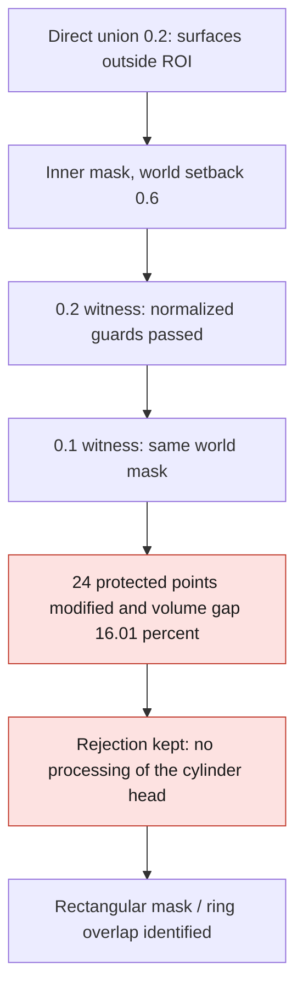
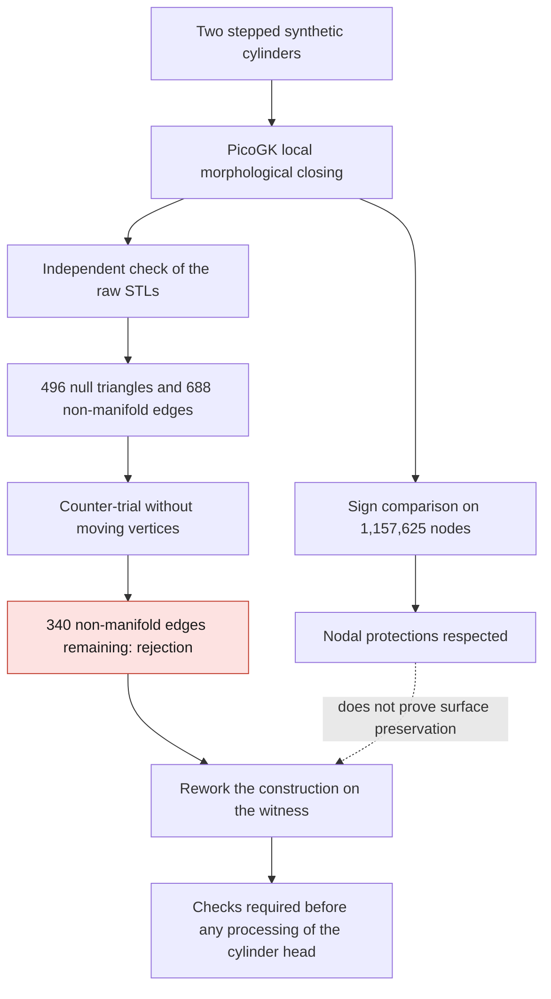
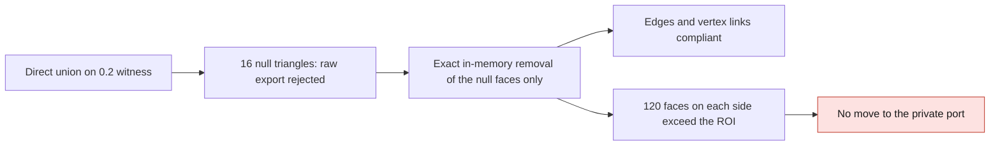

# M64 — PicoGK local junction witness, September 8, 2026

## Latest state: inner mask tested at 0.2 then 0.1, follow-up rejected

The work is no longer limited to the first witness below. A direct union with
an inner mask passed the normalized guards at step **0.2**, then failed at
step **0.1** on **24 protected points**. The volume actually added varies by
**16.01%**, beyond the preregistered threshold of 5%. **None of these synthetic
trials was applied to the private cylinder head.** The master remains
unchanged; no physical or printing validation is claimed.

The priority on the real geometry is documented separately in
[Intake, chamber and next useful computation](M64_ADMISSION_CHAMBRE_20260908.md).
The PicoGK witnesses inform a junction method; they do not replace the ports,
the chamber and the components needed for the gas domain.

### Two steps compared, without relaxing the guards

The [inner-mask module](../../twins/m64-cylinder-head/source/picogk-local-junction-buffered/README.md)
keeps the authorized zone and sets the construction mask back by 0.6 unit.
The [separate fine version](../../twins/m64-cylinder-head/source/picogk-local-junction-buffered-v2/README.md)
keeps this setback **fixed in world coordinates**, i.e. 3h at 0.2 and 6h at
0.1. A setback of 3h at 0.1 would have changed the geometry; this variant was
not run. Two levels do not demonstrate asymptotic convergence.

The v2 audit also explicitly requires zero SDF variation outside the ROI and at
the protections, zero unavailable pairs and a bit-for-bit re-read of six VDB
fields in their native boxes. The old audit displayed the SDF variations
without integrating them into its decision: the 0.2 witness was therefore
re-audited in a **new receipt**, without overwriting its results, and passes
these reinforced guards.

| Measure | Step 0.2 | Step 0.1 |
|---|---:|---:|
| Nodes compared | 1,157,625 | 8,615,125 |
| Protected points modified, `<0` convention | 0 | 24 |
| SDF values modified outside ROI | 0 | 0 |
| Raw null faces of the candidate | 16 | 0 |
| Raw null faces of the diagnostic addition | 8 | 40 |
| Volume actually added, unit³ | 9.485154 | 8.176398 |
| Residual `Vafter−Vbefore−Vdiagnostic addition`, unit³ | 3.618601 | 1.120716 |

At the fine step, the raw before/after surfaces pass the combinatorial screen;
the raw diagnostic addition remains rejected. After removing, **in memory, only
the exactly null faces**, the three surfaces pass the combinatorial topology at
both steps. No vertex moved, no non-null triangle removed, no filling or
retriangulation. All modified triangles are contained in the authorized ROI,
but this property **does not protect the interfaces that lie inside this ROI**.

The 24 failing points all lie in the inner mask **and** in the protected band
around the R10/Y0 ring. The XZ corner of the mask reaches a radius of
**10.46518**: the geometric overlap is demonstrated. The SDF values there go
from zero to strictly negative, maximum **0.00177247 unit**.
The `<0` guard fails even if the `<=0` guard stays at zero; no epsilon is
introduced to make it pass. The exact algorithmic cause of the SDF variation
is not established by this localization alone.

The relative volume difference is **16.0065% > 5%**. The maximum sampled
bidirectional distances are 0.09240 before, 0.10106 after and **0.36516 for
the diagnostic addition > 0.2 unit**. These are not continuous Hausdorff
bounds. The volume residuals remain unexplained.

Native: 5.278 s at step 0.2 and 31.274 s at step 0.1; fine audit 60.52 s,
comparison 7.53 s. Ceilings: 2 CPUs, 4 GiB, 300 s per stage. The fine audit
received a **resource-only** ceiling of 500,000 faces; the historical helpers,
their predicates and their thresholds did not change on disk.
The 12 targeted tests pass in the QA runtime, seven of them for the reinforced
decision and the metrics. No Vast server or new radial mask.

The [compact public receipt](../../twins/m64-cylinder-head/evidence/picogk-buffered-junction-comparison-20260908.json)
links the sources, policies, native reports, audits, comparison and diagnosis
by their exact digests. It keeps the raw and combined failures separately. The
historical sequence below remains a record of the previous trials, not the
final state of the batch.

## History: first result, not to be confused with a cylinder head

The first synthetic witness is **rejected**. The signs of the field are indeed
preserved on the protected nodes, but the exported surface contains degenerate
triangles and non-manifold edges. Removing only the triangles whose cross
product is zero is not enough. The private geometry of the cylinder head was
not processed by this pass; the master is unchanged.

This experiment follows the [rejected B-Rep fillets and HXT counter-mesh](
M64_LOCAL_FILLET_AND_HXT_COUNTERTRIALS_20260907.md). It replaces neither a
complete functional CAD, nor a thermal, mechanical or LPBF simulation.

## Initial preregistered protocol

The [contract](../../twins/m64-cylinder-head/source/picogk-local-junction/criteria.json)
is frozen before execution: exploratory radius 1 unit, resolution 0.2, no
occupancy modification outside the authorized region or at the protected
interfaces, no loss of the initial gas, no addition touching the mask edge.
Each guard is evaluated with `< 0` and `<= 0`. After this initial failure, no
0.1 pass or application to the real port was launched automatically.
The fine witness described at the top belongs to a separate authorization and
policy, later than the mask correction.

The witness uses no Porsche dimension: it assembles two stepped coaxial
cylinders. The units are those of this synthetic problem, not a calibration of
the M64 scan. `voxFillet(1)` here performs a closing by offsets +1 then −1,
not an exact analytic fillet nor proof of G1 continuity. The booleans of the
[pinned runtime](https://github.com/leap71/PicoGKRuntime/blob/0f26321c18ed878a7820ef769c38fd5d49d39242/Source/PicoGKVdbVoxels.h)
call `RebuildGrid`, but this function starts with an unconditional `return` in
this revision: **it does not rebuild the field**.
Our first explanation on this point was incorrect; the defects therefore cannot
be attributed to this disabled reconstruction.

Native Linux amd64 run on Kali: image
`sha256:7c7048431256c455d1396c2e71e38be15b6d0d5d035f41fdde03de47a9025ccd`,
2 CPUs, memory limited to 4 GiB, network disabled, timeout 300 s.
Program duration 6.233 s; process peak memory 123.45 MiB, distinct from the
total consumption of the container. No new Vast server was rented for this
witness. The compilation succeeded with warning NU1900 on the offline NuGet
vulnerability check.

## Raw results and counter-trial

828 nodes change from exterior to gas. The four prohibition counters remain
zero for each of the two conventions. A native exit 0 indicates only this
step: the mesh audit then returns 3.

| Surface | Raw triangles | Zero area | Edges with incidence > 2 | Edges with incidence 1 |
|---|---:|---:|---:|---:|
| Before | 89,708 | 0 | 0 | 0 |
| After | 91,932 | 496 | 688 | 0 |
| Diagnostic addition | 4,464 | 8 | 8 | 0 |

The [counter-trial without displacement](../../twins/m64-cylinder-head/source/picogk-local-junction/exact_zero_countertrial.py)
works only in memory on copies. It indexes the vertices with exactly identical
coordinates and removes the faces whose three float64 cross product components
are exactly zero, with no proximity threshold. This is not an exact symbolic
predicate for arbitrary reals. No near-null face, no oriented or opposite
duplicate, no small shell is removed automatically.

After removing the 496 null faces, the candidate contains 91,436 triangles, no
duplicate triangle, but still **340 edges with incidence greater than two**.
The status remains rejected. The addition alone passes this edge screen after
removing eight triangles; this result does not qualify the complete candidate.
No derived STL was written by this counter-trial, no original modified.

The oriented volumes are 3,923.043931 before, 3,929.770959 after and 5.866553
for the addition, in units³. The residual
`V(after) − V(before) − V(addition) = 0.860474131 unit³` remains unexplained:
no exact volume conservation is claimed.

## Precise limits of these checks

- An identical sign on the nodes does not impose the same surface position: on
  an edge, going from `(-1,+1)` to `(-2,+1)` preserves the signs but moves the
  interpolated zero from `h/2` to `2h/3`.
- Zero edges with incidence one does not establish a usable surface: edges with
  incidence greater than two are enough to reject the candidate. These defects
  do not on their own prove the presence of physical holes or cavities.
- The first auditor uses `Trimesh.split` with default repair on the temporary
  sub-meshes. The main mesh, its volume and its face/edge counters are not
  modified; the component counts from this function are not retained as a
  shell inventory.
- The new [combinatorial auditor](../../twins/m64-cylinder-head/source/picogk-local-junction/audit_surface_topology.py)
  does not depend on Trimesh and keeps all faces. It finds **a single component
  through all edge incidences** in each of the three STLs, and also a single
  component through vertices. The candidate remains rejected: 496 exactly null
  faces according to a dyadic integer cross product, 552 invalid vertex links
  and 20 excess duplicate triangles among the raw faces. The old hundreds of
  groups therefore did not describe cavities. Geometric intersections remain
  untested.
- The fields of this first pass were not saved as VDB. The STLs and receipts
  remain, but an inspection of the fields requires a new traced run.
- The `raw_native_SDF_units` field of the initial receipt is misnamed.
  `GetZSlice` copies the field values without conversion; for this implicit
  witness, they are expressed in the geometric units of the callback.
  Multiplying a difference again by the voxel size would be incorrect. The
  published signs and occupancy counters do not depend on this naming error.
- Neither the geometric intersections between triangles, nor hot strength,
  nor the engine interfaces, nor the printability of the cylinder head are
  validated.

## History: minimal correction proposed, then tested below

Let `A` be the initial gas, `C` its morphological closing and `R` the
authorized region. The following set identity is exact:

`A ∪ ((C \ A) ∩ R) = A ∪ (C ∩ R)`.

The right-hand form avoids reintroducing a thin shell from a boolean
difference into the construction of the candidate. This is a numerical
correction hypothesis, not proof of the cause of the defect. It must be tested
on a **new witness**, with the same checks; the subtracted addition can remain
a diagnostic but must no longer serve as a constructive operand.
The continuous protections must be examined separately from the signs.

## Direct union actually run: improvement, but rejection maintained

The [sibling module](../../twins/m64-cylinder-head/source/picogk-local-junction-direct-union/README.md)
has now run this formulation at the same step 0.2: 4.737 s and process peak
memory 179,163,136 bytes. The four occupancy guards still pass, but **72 field
values change outside the ROI**, with a maximum gap of 0.0012884736061096191
world unit. The values at the sampled protections remain identical. This delta
is not a bound on the displacement of the isosurface; the
[erratum linked to the receipts](../../twins/m64-cylinder-head/source/picogk-local-junction-direct-union/interpretation-erratum.json)
explicitly forbids multiplying it by 0.2.

The raw candidate has 90,028 triangles, of which **16 are exactly null**, and
16 edges with incidence greater than two. This is fewer than the first
witness, but it remains rejected. The six fields were saved as VDB this time;
their re-read checks names, count, scale metadata and accessibility, **not the
identity of the values before/after serialization**.

A separate in-memory counter-audit removes only the exactly null faces,
demonstrated by integer arithmetic on the stored dyadic coordinates. It moves
no vertex and writes no derived STL. The three normalized surfaces then pass
the closed/oriented combinatorial screen, including the vertex links. The
candidate keeps 90,012 faces.
Geometric intersections, nesting of the shells and invariance of the continuous
field remain untested: this is not a physical qualification.

The additional spatial check **fails**: after comparing the multisets of
oriented triangles, 120 removed faces and 120 added unpaired faces are not
entirely contained in the ROI. Their vertices extend down to
`Y = −3.2999999523`, while the authorized limit is `−3`.
This is not in itself a measurement of continuous shape deviation, but it
prevents establishing the invariance of the mesh outside the ROI by this exact
proof. The volume residual is also kept: 3.618739229847031 unit³.

The next correction proposed at this stage distinguished an **inner
computation mask** from a **zone authorized to change**, with a controlled
extraction margin. Widening the authorized zone after the fact to make this
trial pass is not a correction. A new preregistered witness is needed, then the
same topological and spatial checks before any application to the cylinder
head port. Resolution 0.1 had not been launched in this direct-union sub-batch.
The later buffered trials and their fine-step rejection are described at the
top.

## Software verification of the historical direct-union batch

`make check` finishes with exit 0: main suite of 2,167 tests, of which 82
skipped, and additional targets finished. The latter also contain skipped
tests; this number is not a global count across all targets. The 23 targeted
tests pass with no skip in the equipped QA runtime.
They cover in particular vertex pinching, null faces, duplicates, small
negative shells kept, a one-ULP difference, the set identity and the
comparison of oriented faces outside the ROI.

The [log digests](../../twins/m64-cylinder-head/evidence/picogk-local-witness-software-checks-20260908.json)
are published separately. These tests **change no rejection status** of the
witness or the cylinder head.

The compact receipts and digests are in
[the public evidence](../../twins/m64-cylinder-head/evidence/picogk-local-junction-witness-20260908.json).
The [direct union evidence](../../twins/m64-cylinder-head/evidence/picogk-direct-union-witness-20260908.json)
keeps its results and interpretation corrections separately.
The private STLs and CAD files are not published. The result remains a
reconstruction experiment, **with no authorization for manufacturing or
startup**.
