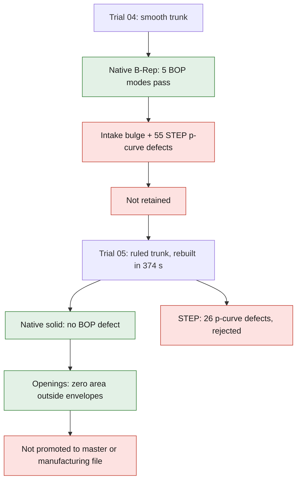

# M64 4V — gas passages and motion envelopes

This batch works on the **functions of the part**, starting from the private
body with four pockets. It does not replace the silhouette with a new
envelope. The reference still comes from a 935 scan; the registration to the
4V module is a design assumption, not a certified M64 interface.

The [continuation of the batch — C1 trunks, contacts and native mesh](M64_NATIVE_CAD_CONTACTS_AND_MESH_20260907.md)
keeps the new trials, including the rejection of integrated body 06. The
results of trial 05 below are not transferred to this new geometry.

**Result of the first cut candidate: not retained.** The native B-Rep is a
single piece and passes the five BOP checks executed, but the interpolation of
the intake trunk creates a real bulge and its STEP shows 55 p-curve defects
after reading. The starting master is neither replaced nor modified. The
[trial 04 receipt](../../twins/m64-cylinder-head/evidence/scan-seeded-ports-trial-04-20260907.json)
keeps the digests and distinguishes these checks from engine validation.

**Latest run: trial 05, trunk with ruled interpolation.** The correction was
actually rebuilt and cut, in 374 s on the local processor. The
[trial 05 receipt](../../twins/m64-cylinder-head/evidence/scan-seeded-ports-trial-05-ruled-20260907.json)
confirms a single native solid, no BOP defect reported in the five modes
executed and a consistent `.brep` rereading. The STEP still shows **26 p-curve
defects** and remains rejected. This private candidate is not promoted to
master nor to manufacturing file; the check of the openings is separate.

That check was then run on trial 05, without reusing the contacts of the old
geometry: **zero face portions and zero area outside the defined envelopes**,
on the intake as on the exhaust side. The area partitions pass without
changing the thresholds. This time the ruled envelope is identical to the new
trunk: this result remains relative to these regions and proves neither the
OEM conformity of the port mouths nor the absence of a pocket inside an
authorized region. All raw contacts remain kept.

## Full stroke of the four valves

The four native exclusion volumes cover all positions between closed and
maximum lift, not only a few frames of an animation. Their intersection with
the starting body is topologically empty: no solid, no shell, face, edge or
vertex in common in the Booleans executed. The
[public receipt](../../twins/m64-cylinder-head/evidence/continuous-valve-envelopes-20260907.json)
binds the master, the module, the four envelopes and the code by SHA-256.

The proof exploits the profile actually used: positive radius, non-increasing
with Z, and an **initial cylindrical base of positive height**. For a rigid
axial stroke L toward the chamber, extending this base by L covers the union
of all positions. The added volume is `π R² L`. Seven native tests cover,
among other things, an obstacle met at mid-stroke while the ends are free, and
the rejection of an initially conical profile to which this algorithm does not
apply. This last case was added after independent review.

The lifts are the V2 candidates: 11.5 intake / 9.6 exhaust, under the
registration assumption of 1 scan unit per mm. The body is not transformed a
second time. These volumes add **no margin for thermal expansion, bending or
guiding**, and contain no piston, spring or cam. The absence of nominal
collision does not establish a sufficient positive clearance when hot.

## Blends from the scan sections

The starting body has only the four stepped seat/guide pockets: its former
ports were filled in during the skin reconstruction. Ten circular sections
fitted to the scan were found: three on the `low_B` side, seven on the
`high_B` side. They serve as construction constraints, **not as fully measured
inner surfaces nor machined flanges**. The fitting residuals are not a total
metrological uncertainty.

The new model connects two throats per bank to a common port, then to the
corresponding sections. The axes and diameters are bound to the same V2
module, to the integration receipt, to its local correction and to the SHA of
the final body. The curvature choices and the guide protection remain
exploratory.

The assignment `intake → high_B`, `exhaust → low_B` follows the current V2
bank. It is **new, non-OEM and opposite to the names of the old F36
builder**. The latter must not be silently transferred as evidence.

The port mouths are not widened to artificially obtain a favorable result.
The minimum area of the circles of the intake branch represents about 67.6% of
the sum of the two throats; on the exhaust side, about 98.0%. This is a
geometric screen, without stem, boss or discharge coefficient: it flags a
potential restriction to examine, not a computed performance.

## Rejected trials and correction of the junction

The first branches ended on the same terminal circle. An exhaust fusion
produced four solids and a volume smaller than that of one operand: this trial
was rejected before any cut of the body. A simple axial overlap was not
enough. The code now verifies the volume monotonicity of unions, differences
and intersections, in addition to BRepCheck.

The geometric correction keeps the throat radius in each branch. The two ends
are distinct and fully buried in the trunk: they no longer share three nearly
coincident coplanar caps. Each native bank then passes the five BOP modes
checked. The STEP results must remain separate from these native results.

## Native B-Rep and STEP export: different authorities

The native cores and their `.brep` reimports are kept. Their STEP export still
reports inconsistent p-curves after reading. The documented trials with or
without p-curves, with preference for 3D curves and with export of the maximum
native tolerance did not remove the defects of the two diagnostic cores. The
settings tried are those of the
[OCCT STEP translator](https://occt3d.com/dev/doc/overview/html/occt_user_guides__step.html).

On these diagnostic cores, the **sampled** maximum of the 3D/2D gap stays on
the order of 2 × 10⁻⁶ unit. The reader reduces some native local tolerances of
5 × 10⁻⁶ below this gap. This observation explains the reports without
demonstrating a continuous bound; it does not authorize masking the defect by
globally increasing the tolerances.

The exploratory cut therefore uses the native B-Reps, not the rejected STEP
files. A rejected export stays archived for diagnostics, never presented as a
manufacturing file. The source geometry of the body and the scan measurements
remain unchanged and private.

## Overrun detected by cross-check

The first skin screen authorized the same loft as the one used for the common
port. It returned zero contacts outside this envelope, but could not detect a
defect shared by both constructions.

The cross-check replaces only the authorization envelope with a **ruled
interpolation between the same circles**, without enlarging their radii. On
the intake side it reveals 130 face portions, totaling about 690.82 units²,
outside this independent envelope. The separate reconstruction locates the
bulge in the trunk, not in the two branches; native sections confirm that this
is not only a conservative bounding box. The exhaust result of this cross-check
remains undetermined after an area preservation failure; the threshold is not
relaxed to obtain a success. The
[cross-check and render receipts](../../twins/m64-cylinder-head/evidence/scan-seeded-ports-counterchecks-20260907.json)
keep results, failures and digests, without the private coordinates.

A limited rerun on the same three exhaust surfaces uses an explicit adaptive
quadrature. The partition gaps then pass under the unchanged threshold for
ε = 10⁻⁷, 10⁻⁹ and 10⁻¹¹. However, some areas still vary between the last two
settings. The internal estimators are not rigorous bounds: this rerun explains
the numerical sensitivity, without replacing the initial verdict with a
conformity of the openings.

The next correction therefore concerns the trunk interpolation only. The ruled
blends are a bounded geometric control, not a validation of pressure losses
nor of the final blend radii.

The generator offers `--trunk-interpolation ruled` for this controlled trial;
the `smooth` mode remains available to reproduce the rejected trial. The
choice is recorded in the context and the report. The branches keep their
smooth loft; no scan section, radius or tolerance changes. The junctions of
the ruled trunk are only C0. They are not the final fluid surfaces.

On the real tessellation of trial 05, the positive lateral bound of the intake
negative decreases by 31.50 scan units: the bulge reported in trial 04 is no
longer present. This local comparison proves neither the correct placement of
all openings nor the wall thickness.

## Checks still to close on the part

- Skin openings: inventory all touched faces, then the portions outside the
  explicitly examined port mouth and pocket zones. An identical bounding box
  does not prove the preservation of the skin.
- Communication between volumes, seat and guide inserts, ligaments and
  thicknesses: disjoint cores do not prove the absence of an indirect link in
  the full assembly.
- Final chamber, valvetrain and oil, materials and engine interfaces: still to
  complete or qualify.
- Flow, thermal behavior, strength, fatigue and LPBF: no gain and no
  printability are inferred from this geometry batch alone.

The [CHT inputs](M64_CHT_HEAD_INPUT_AUDIT.md) were updated so as no longer to
suggest that the old F53 inventory or its meshes apply to the current body.
The [Mermaid execution map](../media/diagrams/m64-700ps-execution.mmd) places
this batch in the CAD preparation, before the part computations.

## Execution and access

- [Continuous envelope generator](../../twins/m64-cylinder-head/source/build_continuous_valve_envelopes.py).
- [Port generator under assumptions](../../twins/m64-cylinder-head/source/build_scan_seeded_ports.py).
- [Openings cross-check](../../twins/m64-cylinder-head/source/audit_port_skin_openings.py),
  with preservation of the raw contacts and a hidden-pocket counterexample.
- [Envelope tests](../../tests/test_continuous_valve_envelopes.py) and
  [blend tests](../../tests/test_m64_scan_seeded_ports.py), complemented by the
  [skin check control cases](../../tests/test_m64_port_skin_openings.py).

All geometries tied to the scan, sections and images of this batch remain
private. Only code, assumptions and receipts without private coordinates are
publishable. No authorization for manufacturing or engine operation is
obtained.

The first private views come from the 4,837 faces of trial 04, all
tessellated, without smoothing or decimation: exterior, half view with colored
cores and planar section. Blue/orange distinguishes the ports, **not computed
temperatures or velocities**. The [render script](../../twins/m64-cylinder-head/source/render_scan_seeded_ports.py)
binds the meshes, images and warnings to the computation receipt.

The updated views of trial 05 represent its **4,892 faces and 70,386
triangles**, with the same framing and the same warnings. Their digests and
those of the section are bound to the exact B-Rep in the trial 05 receipt.

## Software verifications of this batch

`make check` ends with exit 0; its main discovery runs 2,095 tests, 68 of them
explicitly skipped in the default runtime. The three targeted suites are also
run in the qualified OCP runtime: 7 continuous envelope tests, 10 blend tests
and 2 skin check tests, all passed, none skipped. The
[verification receipt](../../twins/m64-cylinder-head/evidence/port-geometry-software-checks-20260907.json)
keeps the digest of the log. These software and geometry tests are not
physical tests of the cylinder head.
