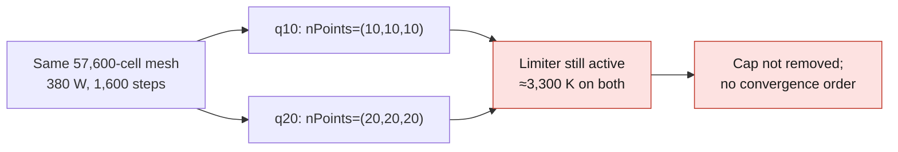

# M64 — two LPBF coupons executed and cross-checked

**Result:** varying the quadrature does not remove the numerical cap
of 3,300 K. Two native thermal computations finished on Kali in **67.140 s**,
cleanup included. No new Vast cost. This coupon is neither the whole
cylinder head nor a simulation of engine operation.

[Public receipt with figures and digests](../../twins/m64-cylinder-head/evidence/quadrature-native-and-mesh-bridge-20260912.json).
The [preparations](M64_JOBS_234_20260912.md) remain a separate history.



## Experiment actually performed

Same 57,600-cell mesh, control-case AlSi10Mg, 380 W laser,
fixed step of 25 ns, 40 µs window, i.e. 1,600 steps per case. The only difference
between the inputs: quadrature `nPoints=(10,10,10)` then `(20,20,20)`.
Common incident energy: 0.0152 J. Neither limiter, nor material, nor pressure,
nor velocity, nor mesh was adjusted to obtain a success.

| Integrated or observed quantity | q10 | q20 |
|---|---:|---:|
| Absorbed laser energy | 8.923918 mJ | 8.929018 mJ |
| Stored sensible energy | 9.526165 mJ | 9.601713 mJ |
| Stored latent energy | 1.045571 mJ | 1.059072 mJ |
| Incoming diffusion at the boundaries | 2.523533 mJ | 2.523533 mJ |
| Energy removed by the limiter | 0.875733 mJ | 0.791783 mJ |
| Limiter / absorbed energy | 9.8133 % | 8.8675 % |
| First reaching of the 3,299 K censoring threshold | 10.500 µs | 10.625 µs |
| Maximum temperature, limited | ≈3,300 K | ≈3,300 K |

Relative deviation from q20: **0.0571155 %** on the absorbed laser energy, but
**10.6026 %** on the artificial sink of the limiter. The maximum difference of the
paired temperatures is 33.9288 K; it concerns censored series.
Two levels are not enough to establish an order of convergence. The small
variation of the total energy does not prove local convergence of the flux.

The verified balance is
`sensible + latent - incoming diffusion - laser + outgoing advection + limiter`.
Advection is zero in this thermal-only experiment. The integrated
residuals are 1.6753×10⁻⁸ J and 1.5973×10⁻⁸ J respectively.
A small bookkeeping residual does not prove the validity of the physical model.

The [40 µs reader](../../twins/m64-cylinder-head/source/compare_f58_quadrature_40us.py)
reparses the six terms in 80-digit Decimal. An independent reread
recomputed the integrals from the two logs and checked their SHAs.
This is a cross-check of the balance, **not a second physical solver**.
The reader keeps its "native outputs not verified" status: it
executes nothing itself. The evidence of native outputs is in the separate
receipt, linked to the same log digests.

## Reproducible execution and limits

Versioned sources: [supervisor](../../twins/m64-cylinder-head/source/f58-quadrature/run_quadrature.py),
[worker](../../twins/m64-cylinder-head/source/f58-quadrature/quadrature_worker.py).
The private packet contains these two scripts, `manifest.json`,
`preparation-report.json`, `q10/` and `q20/`. It must be fresh under
`/var/tmp/m64-f58-quad.<suffix>`. The manifest pins the scripts, six backend
files, 91 regular sources and 67 strictly internal `lnInclude` aliases.
The private dictionaries come from the already versioned preparer.

```sh
python3 /var/tmp/m64-f58-quad.SUFFIX/run_quadrature.py \
  --packet /var/tmp/m64-f58-quad.SUFFIX \
  --manifest-sha256 SHA256_DU_MANIFESTE_REEL --execute
```

(`SHA256_DU_MANIFESTE_REEL` is a placeholder for the SHA-256 of the actual manifest.)

Two CPUs, 4 GiB of memory, no swap, network cut, non-root user,
read-only root filesystem, capabilities dropped. Maximum 600 s including 30 s of
cleanup; 250 s per case. `checkMesh` and both solvers finish with
exit code zero; OOM false; 1,600 ordered balances per case; all inputs
remain identical; exact container verified absent after removal.

The native outputs were in a 1 GiB tmpfs, included in the 4 GiB.
**The temporary fields were deleted with the container**; only their
SHAs, the raw logs and receipts were kept. The fields would require a
new run to be consulted. The result writers are capped
at 260 MiB in total; the host directory is not protected by a kernel disk
quota. No automatic retry.

A first preflight was refused without creating a container: six
`Make/files` and `Make/options` files of sub-libraries were missing from the inventory.
No source had changed. Their inventory was completed before a
new explicit attempt in another directory; the failure is kept.

Software verification: 33 targeted quadrature tests pass, nine of them for the
new supervisor. The full `make check` finishes with exit code zero; the optional
native tests whose runtimes are absent remain reported as skipped.
This repository check does not replace the native evidence set out above.

## Geometry: progress independent of the coupon

A private prototype classified 716,383 tetrahedra among 784,675 cells.
Among the vertices incident to the `lowD` defects, 47 are potentially
movable under the retained constraints, in 129 affected tetrahedra.
The first region of 1,000 tetrahedra contains 305 points, of which 251 fixed,
54 free and three free ones incident to targeted defects. It was rejected
for 18 non-conforming oriented shell edges. These 18 occurrences are
not necessarily 18 distinct geometric edges.

Five synthetic bridge tests pass; no native MFEM import,
reverse polyMesh write, point optimization or qualification of the
cylinder head follows from them. The master and its outline are unchanged.

An additional attempt at closure by adjacent tetrahedra found
three disjoint edge stars, with non-tetrahedral cells at the interface.
No path made only of tetrahedra connected these components.
The region stays at 1,000 cells, with no addition or displacement; no real
MFEM export admitted. The local selection or a mixed adapter must be revisited,
not a GPU rented for this rejected region.

## Next steps and LLM

The LPBF follow-up must separate the error in the spatial distribution of the source,
the imposed thermal conditions and the validity of the material domain at
high temperature. Do not simply raise the cap. A limited coupon
does not constitute a ground-truth set for training PhysicsNeMo.

The [Neural Concept study](M64_NEURAL_CONCEPT_20260912.md) retains active
learning, fixed interfaces and recomputation of the finalists; no training launched.

The existing image `ghcr.io/cluster2600/qwen38-flash-next-vast` at digest
`6b3b1790dd3140c27a5b5f85181dccef06c8d96c02f3003bb3c9b267b8758e34`
is accessible; its `linux/amd64` manifest was rechecked. The model
`orcarouter/Qwen3.8-Flash-Next-Uncensored-NVFP4` remains gated (`auto`) at the
public check, revision `c1209bda15a6bbc4c68b585e93d40c0d85f50306`.
The installed launchers examined on Mac/Kali did not establish an approved
OpenBao path for this Hugging Face access. No secret retrieved, no
image rebuilt and no LLM machine rented. The user budget remains
38 USD; a published image is not an endpoint ready to serve.

**Manufacturing and engine start-up not authorized.** Material/process to be qualified,
M64 interfaces, the complete domain and physical correlation remain necessary.
